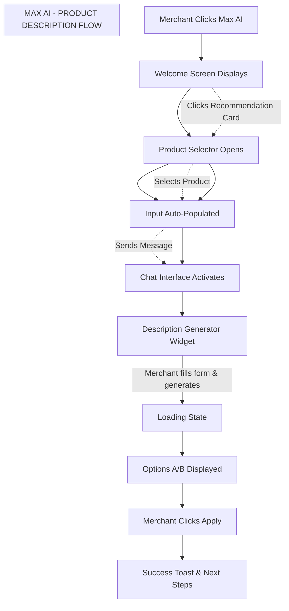
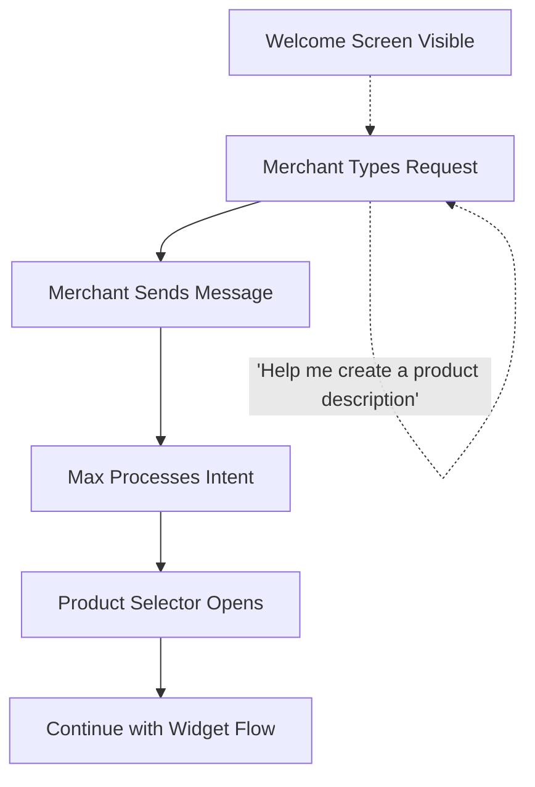
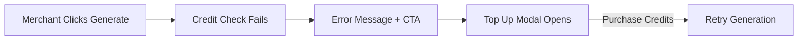
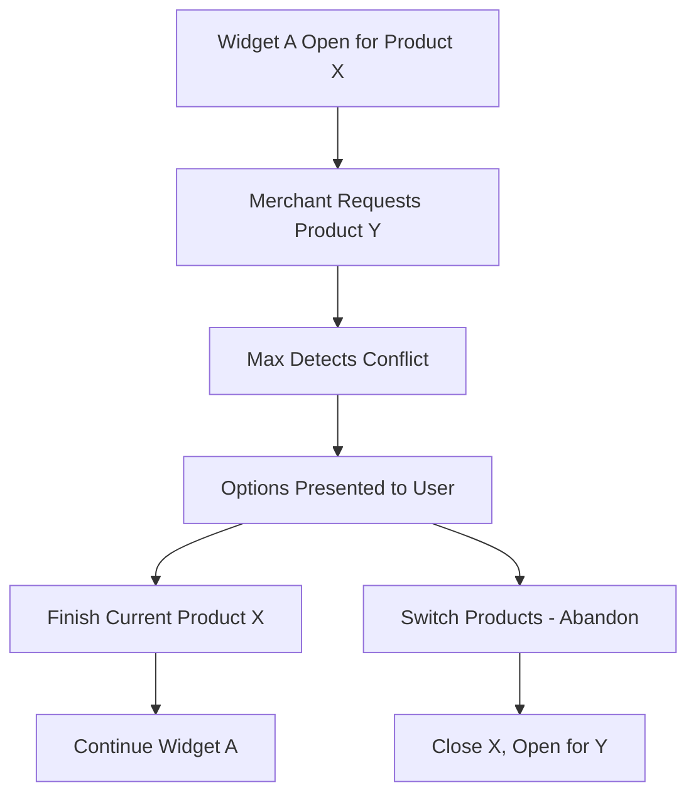
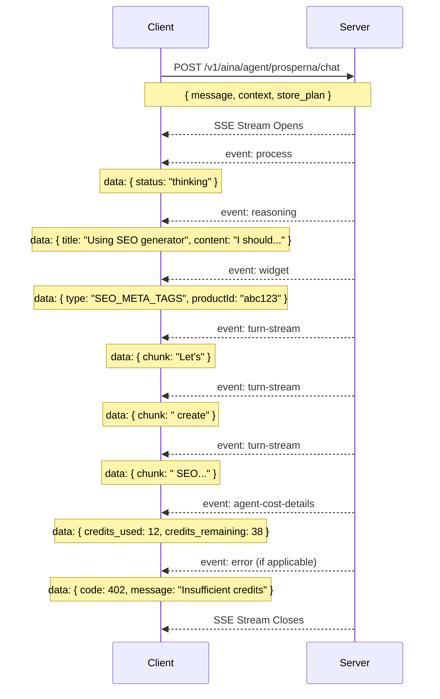

Agile-focused PRD documenting the implementation of AI Centralization (Max AI) for Prosperna's Merchant Dashboard, consolidating existing AI tools (Product Description Generator, SEO Meta Tags Generator) into a unified conversational interface that enables merchants to generate AI-powered content through natural language interactions.

## Document Control

| Item           | Details                    |
| -------------- | -------------------------- |
| Document Title | AI Centralization (Max AI) |
| Version        | 1.0                        |
| Date           | December 28, 2025          |
| Prepared by    | Business Analyst           |
| Reviewed by    | To be assigned             |
| Approved by    | To be assigned             |
| Status         | For Review                 |
| Related BRD    | To be created              |

---

## Revision History

| Version | Date              | Author           | Change Description                           |
| ------- | ----------------- | ---------------- | -------------------------------------------- |
| 1.0     | December 28, 2025 | Business Analyst | Initial draft - Max AI feature specification |

---

## 1. Introduction

### 1.1 Document Purpose

This PRD defines the detailed functional requirements, acceptance criteria (using BDD/Gherkin), and technical specifications for implementing AI Centralization (Max AI) in Prosperna's Merchant Dashboard. The feature consolidates existing standalone AI tools—Product Description Generator and SEO Meta Tags Generator—into a unified conversational interface powered by a Large Language Model (LLM), enabling merchants to generate AI-powered content through natural language interactions with a virtual assistant named "Max."

Max AI serves as a single entry point for all AI-powered features, providing contextual guidance, product selection, content generation, and seamless widget integration within a chat-based experience.

### 1.2 Feature Vision

Transform Prosperna's fragmented AI tools into a cohesive, conversational experience where merchants interact with "Max," an intelligent assistant that understands their needs, guides them through content generation workflows, and provides personalized suggestions. Merchants will no longer need to navigate to separate pages for each AI feature—instead, they can accomplish all AI-powered tasks from a single, intuitive chat interface that adapts to their requests and maintains context throughout the session.

### 1.3 Success Criteria

**User Adoption & Usage:**

- 60% of active merchants engage with Max AI within 30 days of feature launch
- 75% of AI-generated content (descriptions, SEO tags) originates from Max AI interface within 60 days
- 50% reduction in time-to-first-generation for new merchants compared to standalone tools
- 40% of merchants use Max AI for multiple product generations in a single session

**Technical Performance:**

- Chat message response initiation (streaming start) in less than 2 seconds (P95)
- Widget opening after product selection in less than 1 second
- Content generation (description/SEO) completes in less than 10 seconds (P95)
- 99.5% successful generation rate (no errors or timeouts)
- Conversation context maintained accurately across 20+ message exchanges
- Session persistence reliable for 24-hour TTL period

**Business Impact:**

- 35% increase in AI feature utilization across merchant base
- 25% increase in products with AI-generated descriptions
- 20% increase in products with SEO meta tags configured
- 15% reduction in support tickets related to "how to use AI features"
- Merchant satisfaction score of 4.5/5 for Max AI usability

**User Satisfaction:**

- NPS +15 points for merchants using Max AI vs. standalone tools
- Less than 5% support tickets related to Max AI confusion or errors
- 90% task success rate in usability testing for generating product descriptions
- 85% of merchants report Max AI saves time compared to previous workflow
- Less than 3% conversation abandonment rate mid-generation

---

## 2. Background & Context

### 2.1 Problem Statement

**Current Pain Point:**

Prosperna merchants currently access AI-powered content generation features through separate, disconnected interfaces scattered across the Merchant Dashboard. Each AI tool—Product Description Generator, SEO Meta Tags Generator, and Blog Writer—exists as an independent feature with its own navigation path, learning curve, and workflow. This fragmentation creates several critical challenges:

1. **Discovery Problem:** Merchants must know where each AI tool is located in the dashboard navigation
2. **Context Switching:** Moving between AI features requires navigating to different pages, losing workflow momentum
3. **No Unified Experience:** Each tool has slightly different UI patterns, requiring merchants to learn multiple interfaces
4. **Lack of Guidance:** Standalone tools don't provide conversational help or suggestions for optimal use
5. **Missed Cross-Sell Opportunities:** After generating a product description, merchants aren't naturally guided to also create SEO tags
6. **No Contextual Assistance:** Merchants can't ask questions or get help while using the tools

**Current Workflow (Fragmented):**

1. Merchant wants to improve product content
2. Merchant navigates to Products → selects product → finds Description Generator
3. Merchant fills form fields without guidance
4. Merchant generates description, applies it
5. Merchant must separately navigate to SEO tool if they want meta tags
6. Merchant repeats entire navigation flow for each product
7. No conversation history or context between sessions

**Impact of Current Limitations:**

- **Underutilization:** Only 30% of merchants use AI features despite availability
- **Incomplete Optimization:** Merchants who generate descriptions often skip SEO tags (separate workflow)
- **Support Burden:** 15% of support tickets relate to finding/using AI features
- **Time Waste:** Average 5+ minutes to locate and start using each AI tool
- **Abandoned Workflows:** 25% of merchants start but don't complete AI generation due to friction

### 2.2 Current State

**Current AI Tools Distribution:**

1. **Product Description Generator:**

   - Location: Accessed from individual product edit pages
   - Standalone modal/panel interface
   - No conversational guidance
   - Works for one product at a time

2. **SEO Meta Tags Generator:**

   - Location: Separate section in product management
   - Independent form-based interface
   - No connection to description generator
   - Requires separate navigation

3. **Blog Writer:**
   - Location: Blog section of dashboard
   - Completely separate from product tools
   - Multi-step wizard interface
   - No integration with product catalog

**Current Limitations:**

- No unified entry point for AI features
- No conversational interface or natural language interaction
- No contextual guidance or suggestions
- No session persistence across page navigations
- No cross-feature recommendations
- Each tool requires learning separate UI patterns
- No ability to ask questions while using tools

### 2.3 Desired Future State

**AI Centralization with Max AI:**

1. **Unified Entry Point:**

   - Single "Max AI" item in sidebar navigation (first position, prominent)
   - Route: `/dashboard/max-ai`
   - All AI features accessible from one interface
   - Conversational chat as primary interaction model

2. **Welcome Experience:**

   - Friendly avatar persona ("Max") with animated presence
   - Clear greeting: "Hi, I'm Max✨ - Your intelligent assistant for managing your business"
   - Recommendation cards for quick access to popular features
   - Input area with helpful placeholder suggestions

3. **Conversational Interface:**

   - Natural language interaction with streaming responses
   - Context maintained across entire conversation
   - Reasoning display showing Max's thought process
   - Graceful handling of off-topic queries with redirection

4. **Integrated Widget System:**

   - Product Selector Panel slides in when product context needed
   - Product Description Generator widget opens in side panel
   - SEO Meta Tags Generator widget opens in side panel
   - Widgets coexist with chat (split-view layout)

5. **Intelligent Guidance:**

   - Max provides form field suggestions in chat
   - Cross-feature recommendations after task completion
   - Plan-based feature gating with upgrade prompts
   - Error handling with clear recovery actions

6. **Session Management:**
   - 24-hour conversation persistence (Redis-backed)
   - Conversation reset with confirmation
   - Context summarization for long conversations
   - Widget state tracking for conflict resolution

**Benefits After Implementation:**

- **Single Destination:** One place for all AI-powered content generation
- **Conversational UX:** Natural language interaction reduces learning curve
- **Contextual Guidance:** Max helps merchants optimize their inputs
- **Cross-Feature Flow:** Easy transition from description to SEO to blog
- **Time Savings:** 60% reduction in navigation time to AI features
- **Higher Completion:** Guided workflow increases generation completion rates
- **Discoverability:** Prominent sidebar placement increases feature awareness

### 2.4 Target Users

| User Segment               | Description                                  | Use Case                                            | Frequency                          |
| -------------------------- | -------------------------------------------- | --------------------------------------------------- | ---------------------------------- |
| New Merchants              | Recently onboarded, building product catalog | Generate descriptions for initial product listings  | Daily during setup (first 2 weeks) |
| Growing Merchants          | Established stores expanding inventory       | Batch content generation for new products           | Weekly (5-20 products)             |
| SEO-Focused Merchants      | Prioritizing search visibility               | Generate and optimize meta tags for discoverability | Weekly to monthly                  |
| Time-Constrained Merchants | Busy owners wearing multiple hats            | Quick content generation with minimal effort        | As needed, values efficiency       |
| Non-Technical Merchants    | Limited marketing/copywriting experience     | Guided assistance for professional content          | Regular, relies on AI suggestions  |
| Multi-Product Merchants    | Large catalogs (100+ products)               | Efficient workflow for bulk content updates         | Monthly catalog refreshes          |

### 2.5 Project Constraints & Assumptions

**Technical Constraints:**

- Must integrate with existing aina-service backend API infrastructure
- LLM model: OpenAI GPT-5.1 (as currently implemented)
- SSE (Server-Sent Events) required for streaming responses
- Redis session storage with 24-hour TTL
- Must work within existing Merchant Dashboard React application
- Widget components must be compatible with current design system
- Cognito JWT authentication must be maintained

**Business Constraints:**

- FREE plan merchants have limited access (no SEO, 1 description option)
- AI credit system must be respected (12 credits per generation)
- Cannot break existing standalone AI tool functionality during transition
- Must maintain current API rate limits and circuit breaker patterns
- Upgrade prompts must be non-intrusive but visible

**Key Assumptions:**

- Merchants prefer conversational interfaces for AI features
- Single entry point will increase feature discoverability
- Contextual guidance will improve content quality
- Session persistence reduces repeated work
- Recommendation cards accelerate feature adoption
- Plan restrictions are acceptable with clear upgrade paths

**UX Assumptions:**

- Split-view layout (chat + widget) is intuitive
- Streaming responses feel more responsive than loading spinners
- Avatar persona creates engaging, approachable experience
- Off-topic handling maintains merchant goodwill
- Reset confirmation prevents accidental data loss

**Data & Performance Assumptions:**

- Average conversation length: 5-15 messages
- Most sessions complete within 30 minutes
- Widget interactions add minimal latency
- Redis can handle concurrent merchant sessions
- 5000-token summarization threshold is appropriate

---

## 3. Functional Requirements & BDD Scenarios

### Feature F-01: Max AI Welcome Screen & Onboarding

#### 3.1.1 Feature Context

Provide merchants with an intuitive entry point to the Max AI interface, displaying the AI assistant persona, capability overview, and quick-action recommendation cards to guide first-time and returning users toward available AI features.

#### 3.1.2 Business Rules

**BR-01: Welcome Screen Display**

- Welcome screen displays when merchant navigates to `/dashboard/max-ai` route
- Welcome screen shows Max AI avatar (animated persona with purple theme)
- Greeting text: "Hi, I'm Max✨" with sparkle icon
- Subtitle: "Your intelligent assistant for managing your business. How can I help you?"
- Welcome screen is replaced by chat interface once merchant sends first message
- Welcome screen reappears after conversation reset

**BR-02: Input Area on Welcome Screen**

- Input placeholder text: `Try asking: "Help me create a product description" or "Generate SEO for my products."`
- Send button (up arrow icon) is disabled when input is empty
- Send button becomes enabled when input contains text
- Enter key sends message; Shift+Enter creates new line
- Input area has purple border highlight on focus

**BR-03: Recommendation Cards Display**

- Two recommendation cards displayed below input area
- Card 1: "Product Description Generator" - "Generate compelling and detailed product descriptions for your products using AI"
- Card 2: "SEO Generator" - "Generate SEO including titles, descriptions, and keywords for your products"
- Cards are clickable and trigger respective feature flows
- Cards have icon (document icon) and hover state

**BR-04: Navigation & Sidebar**

- Max AI is first item in sidebar navigation (purple icon)
- Route: `/dashboard/max-ai`
- Max AI component is lazy-loaded for performance
- Sidebar icon indicates active state when on Max AI page

#### 3.1.3 Scenarios

##### Scenario 1: Merchant navigates to Max AI for first time

```gherkin
Given a merchant is logged into the Prosperna Merchant Dashboard
And the merchant has not used Max AI in this session
When the merchant clicks on "Max AI" in the sidebar navigation
Then the browser navigates to "/dashboard/max-ai"
And the Max AI welcome screen displays
And the Max AI avatar (animated purple persona) is prominently displayed
And the greeting "Hi, I'm Max✨" displays below the avatar
And the subtitle "Your intelligent assistant for managing your business. How can I help you?" displays
And the input area displays with placeholder text
And two recommendation cards display below the input area
And the send button is disabled (grayed out)
```

##### Scenario 2: Merchant views recommendation cards on welcome screen

```gherkin
Given a merchant is on the Max AI welcome screen
When the merchant views the "Recommendations" section
Then two cards are displayed side by side
And the first card shows:
  | Element     | Value                                                                      |
  | Icon        | Document icon                                                              |
  | Title       | Product Description Generator                                              |
  | Description | Generate compelling and detailed product descriptions for your products using AI |
And the second card shows:
  | Element     | Value                                                                      |
  | Icon        | Document icon                                                              |
  | Title       | SEO Generator                                                              |
  | Description | Generate SEO including titles, descriptions, and keywords for your products |
And both cards have hover state (subtle highlight on mouseover)
```

##### Scenario 3: Merchant clicks Product Description Generator recommendation card

```gherkin
Given a merchant is on the Max AI welcome screen
And the recommendation cards are visible
When the merchant clicks on the "Product Description Generator" card
Then the welcome screen remains visible (does not transition yet)
And the Product Selector Panel slides in from the right side
And the panel title displays "Select a Product"
And the merchant's products are listed with thumbnails, names, and SKUs
And the merchant can search and browse products
And the send button remains disabled until a product is selected
```

##### Scenario 4: Merchant selects product after clicking recommendation card

```gherkin
Given a merchant clicked the "Product Description Generator" recommendation card
And the Product Selector Panel is open on the right side
And the welcome screen is still visible on the left
When the merchant clicks on a product (e.g., "Jumbo Cheeseburger")
Then the Product Selector Panel closes
And the input area is auto-populated with:
  "Help me create a product description for the product Jumbo Cheeseburger (ID: 67078ea57e26cefe3f5f265d)"
And the send button becomes enabled (dark/active state)
And the merchant can review the auto-generated prompt before sending
```

##### Scenario 5: Merchant sends auto-populated prompt for Product Description

```gherkin
Given the input area is auto-populated with a product description request
And the send button is enabled
When the merchant clicks the send button (or presses Enter)
Then the welcome screen transitions to the chat interface
And the merchant's message appears as a dark bubble on the right
And Max responds acknowledging the product selection:
  "Nice pick — that Jumbo Cheeseburger already sounds fire. I'll open the product description generator for that specific product so you can create a solid, high-converting description."
And the Product Description Generator widget opens on the right side
And the widget displays the selected product's info (image, name, SKU)
And the form fields are ready for input
```

##### Scenario 6: Merchant clicks SEO Generator recommendation card

```gherkin
Given a merchant is on the Max AI welcome screen
And the recommendation cards are visible
When the merchant clicks on the "SEO Generator" card
Then the welcome screen remains visible (does not transition yet)
And the Product Selector Panel slides in from the right side
And the panel title displays "Select a Product"
And the merchant's products are listed with thumbnails, names, and SKUs
And the merchant can search and browse products
And the send button remains disabled until a product is selected
```

##### Scenario 7: Merchant selects product after clicking SEO Generator card

```gherkin
Given a merchant clicked the "SEO Generator" recommendation card
And the Product Selector Panel is open on the right side
And the welcome screen is still visible on the left
When the merchant clicks on a product (e.g., "Super Onion Rings")
Then the Product Selector Panel closes
And the input area is auto-populated with:
  "Generate SEO for the product Super Onion Rings (ID: 6413cda29b970ef974ead151)"
And the send button becomes enabled (dark/active state)
And the merchant can review the auto-generated prompt before sending
```

##### Scenario 8: Merchant sends auto-populated prompt for SEO Generation

```gherkin
Given the input area is auto-populated with an SEO generation request
And the send button is enabled
When the merchant clicks the send button (or presses Enter)
Then the welcome screen transitions to the chat interface
And the merchant's message appears as a dark bubble on the right
And Max responds acknowledging the product selection and opens the SEO widget
And the SEO Meta Tags Generator widget opens on the right side
And the widget displays the selected product's info (image, name, SKU)
And the auto-filled fields (Product/Page Name, Brand) are populated
And the form fields are ready for input
```

##### Scenario 9: Merchant types in input area on welcome screen

```gherkin
Given a merchant is on the Max AI welcome screen
And the input area shows placeholder text
And the send button is disabled
When the merchant clicks on the input area
Then the input area receives focus
And a purple border appears around the input area
And the placeholder text remains until merchant types
When the merchant types "Hello Max"
Then the placeholder text disappears
And the typed text "Hello Max" displays in the input area
And the send button becomes enabled (no longer grayed out)
```

##### Scenario 10: Merchant sends first message from welcome screen

```gherkin
Given a merchant is on the Max AI welcome screen
And the merchant has typed "Help me create a product description" in the input
And the send button is enabled
When the merchant clicks the send button
Then the welcome screen transitions to the chat interface
And the merchant's message appears as a chat bubble (dark background, right-aligned)
And a "Thinking..." indicator appears with Max avatar
And Max begins streaming a response
And the welcome screen elements (avatar, greeting, cards) are no longer visible
```

##### Scenario 11: Merchant presses Enter to send message

```gherkin
Given a merchant is on the Max AI welcome screen
And the merchant has typed "Generate SEO for my products" in the input
When the merchant presses the Enter key
Then the message is sent
And the chat interface activates
And Max responds to the query
```

##### Scenario 12: Merchant presses Shift+Enter for new line

```gherkin
Given a merchant is on the Max AI welcome screen
And the merchant has typed "Hello" in the input
When the merchant presses Shift+Enter
Then a new line is created in the input area
And the message is NOT sent
And the merchant can continue typing on the new line
```

---

### Feature F-02: Chat Interface & Message Handling

#### 3.2.1 Feature Context

Provide a conversational chat interface where merchants interact with Max AI through natural language messages, receiving streamed responses with support for markdown rendering, reasoning display, and contextual guidance.

#### 3.2.2 Business Rules

**BR-05: Message Display**

- User messages display in dark bubbles (right-aligned) with user avatar
- Assistant messages display in light bubbles (left-aligned) with Max avatar
- Messages support markdown rendering (bold, lists, links)
- Messages stream in real-time using SSE (Server-Sent Events)
- Chat history is preserved during session (24-hour TTL via Redis)

**BR-06: Streaming Response States**

- "Thinking..." displays during initial processing (process event)
- "Reasoning:" section displays LLM's thought process when available
- "Finalizing response..." displays before final message
- Streaming text appears progressively (turn-stream event)
- Error states display with appropriate CTAs (Top Up/Upgrade)

**BR-07: Input Behavior During Streaming**

- Input area is disabled while Max is responding
- Send button is disabled during streaming
- Restart button is disabled during streaming
- Input re-enables after response completes or errors

**BR-08: Conversation Context**

- Conversation context maintained across messages
- Context summarization occurs at 5000 tokens
- Session stored in Redis with 24-hour TTL
- Conversation can be retrieved via GET endpoint

**BR-09: Message Types**

- Text messages (standard chat)
- Widget trigger messages (open generators)
- Widget closure messages (user cancels/completes widget)
- System messages (success confirmations with product IDs)

#### 3.2.3 Scenarios

##### Scenario 1: Merchant sends message and receives streamed response

```gherkin
Given a merchant is in the Max AI chat interface
And the input area is enabled
When the merchant types "What can you help me with?"
And clicks the send button
Then the merchant's message appears in a dark bubble on the right
And the user avatar appears next to the message
And a "Thinking..." indicator appears with Max avatar
And the input area becomes disabled
And the send button becomes disabled
And Max's response streams in progressively (word by word)
And the response appears in a light bubble on the left
And the input area re-enables after streaming completes
```

##### Scenario 2: Max displays reasoning during complex request

```gherkin
Given a merchant sends "I want to create SEO for super onion rings"
When Max processes the request
Then a "Reasoning:" label appears below the Max avatar
And the reasoning title displays (e.g., "Using SEO generator widget")
And the reasoning content displays Max's thought process
And the reasoning shows tool selection logic (e.g., "I should call the show_product_seo_meta_tags_generator_widget")
And the reasoning section is visually distinct (lighter background)
And the final response follows the reasoning display
```

##### Scenario 3: Max handles off-topic query with redirection

```gherkin
Given a merchant is in the Max AI chat interface
When the merchant sends "Is there always a rainbow after the rain?"
Then Max acknowledges the off-topic nature playfully
And Max responds with factual information briefly
And Max redirects: "By the way, my main lane is helping you with your online store (products, SEO, descriptions, blogs, etc.). If you've got anything you want to fix or level up in your shop, I'm here for that."
And Max lists available capabilities:
  - Checking and viewing your products
  - Generating product descriptions (via the description widget)
  - Creating SEO meta tags for your products (via the SEO widget)
```

##### Scenario 4: Merchant views chat history after page refresh

```gherkin
Given a merchant had a conversation with Max AI
And the conversation included 5 message exchanges
And the session is within 24-hour TTL
When the merchant refreshes the page
And navigates back to Max AI
Then the previous conversation loads automatically
And all 5 message exchanges are displayed in order
And the chat scrolls to the most recent message
And the merchant can continue the conversation
```

##### Scenario 5: Chat displays error with CTA for insufficient AI credits

```gherkin
Given a merchant is in the Max AI chat interface
And the merchant has 0 AI credits remaining
When the merchant attempts to generate a product description
Then Max displays an error message about insufficient credits
And a "Top Up" CTA button appears in the error message
And clicking "Top Up" opens the AI credits purchase modal
And the merchant can purchase credits and retry
```

##### Scenario 6: Chat displays error with CTA for plan upgrade required

```gherkin
Given a merchant is on the FREE plan
And the merchant is in the Max AI chat interface
When the merchant requests "Generate SEO meta tags for my product"
Then Max explains that SEO generation is not available on FREE plan
And an "Upgrade" CTA button appears
And clicking "Upgrade" opens the plan upgrade modal
And the error message is styled appropriately (not harsh)
```

##### Scenario 7: Streaming response handles network interruption gracefully

```gherkin
Given a merchant sends a message to Max AI
And Max begins streaming a response
When a network interruption occurs mid-stream
Then the partial response remains visible
And an error message displays indicating connection issue
And a "Retry" option appears
And clicking "Retry" resends the original request
And the input area re-enables
```

##### Scenario 8: Long conversation triggers context summarization

```gherkin
Given a merchant has an ongoing conversation with Max
And the conversation context approaches 5000 tokens
When the merchant sends another message
Then Max internally summarizes the conversation context
And the summarization happens transparently (no UI indication)
And the response maintains continuity with previous context
And older messages remain visible in the UI
```

---

### Feature F-03: Product Selector Panel

#### 3.3.1 Feature Context

Display a slide-out panel for product selection when AI features require a specific product context, allowing merchants to browse, search, and select products for description generation or SEO optimization.

#### 3.3.2 Business Rules

**BR-10: Panel Display Modes**

- "Select a Product" mode: For selecting a product to work with (clickable items with chevrons)
- "Product List" mode: For viewing products without selection action
- Panel slides in from right side of screen
- Panel can be closed via X button
- Panel coexists with chat interface (split view)

**BR-11: Product List Display**

- Each product shows: thumbnail image, product name, SKU
- Products displayed in scrollable list
- Pagination at bottom: "Page X of Y (Z products)"
- Navigation arrows for page changes (`< >`)
- Products without images show placeholder

**BR-12: Product Search**

- Search input at top: "Search products..."
- Search filters by product name and SKU
- Search is case-insensitive
- Results update in real-time as user types
- Clear search returns to full list

**BR-13: Product Selection Behavior**

- Clicking product row selects it for the active widget
- Selected product info sent to backend via chat message
- Selection triggers widget to open with product context
- User message confirms selection: "Selected product: [Name] (id: [ID]) for [Widget Type]"

**BR-14: Pagination Controls**

- Shows current page and total pages
- Shows total product count
- Previous (`<`) button disabled on first page
- Next (`>`) button disabled on last page
- Clicking arrows fetches next/previous page

#### 3.3.3 Scenarios

##### Scenario 1: Product Selector Panel opens for product description request

```gherkin
Given a merchant sends "Help me create a product description for Jumbo Cheeseburger"
When Max processes the request
Then the Product Selector Panel slides in from the right
And the panel title displays "Select a Product"
And a search input displays with placeholder "Search products..."
And the merchant's products load in a scrollable list
And each product row shows thumbnail, name, and SKU
And each product row has a chevron (`>`) indicating it's selectable
And pagination displays at the bottom (e.g., "Page 1 of 2 (11 products)")
```

##### Scenario 2: Merchant searches for product in selector panel

```gherkin
Given the Product Selector Panel is open
And displays 11 products across 2 pages
When the merchant types "onion" in the search input
Then the product list filters in real-time
And only products matching "onion" display (e.g., "Super Onion Rings")
And the pagination updates to reflect filtered results
When the merchant clears the search input
Then all products display again
And pagination returns to original state
```

##### Scenario 3: Merchant selects product from selector panel

```gherkin
Given the Product Selector Panel is open in "Select a Product" mode
And "Jumbo Cheeseburger" is visible in the list
When the merchant clicks on the "Jumbo Cheeseburger" row
Then a user message appears in chat: "Selected product: Jumbo Cheeseburger (id: 63f3737a306635ba1b0a95ed) for Product Description Generator"
And the Product Selector Panel closes or transitions
And the Product Description Generator widget opens on the right side
And the widget displays "Jumbo Cheeseburger" product info at the top
```

##### Scenario 4: Merchant navigates between pages in product selector

```gherkin
Given the Product Selector Panel is open
And displays "Page 1 of 2 (11 products)"
And the previous (<) button is disabled
And the next (>) button is enabled
When the merchant clicks the next (>) button
Then page 2 products load
And pagination updates to "Page 2 of 2 (11 products)"
And the next (>) button becomes disabled
And the previous (<) button becomes enabled
When the merchant clicks the previous (<) button
Then page 1 products load again
```

##### Scenario 5: Product Selector Panel closes when X is clicked

```gherkin
Given the Product Selector Panel is open
When the merchant clicks the X button in the panel header
Then the panel slides out and closes
And the chat interface expands to full width
And no product is selected
And the merchant can continue chatting with Max
```

---

### Feature F-04: Product Description Generator Widget

#### 3.4.1 Feature Context

Provide a dedicated widget panel for generating AI-powered product descriptions, collecting merchant input about target audience, features, and benefits, then generating multiple description options (Option A/B) for merchant selection.

#### 3.4.2 Business Rules

**BR-15: Widget Panel Display**

- Panel title: "Generate Product Description"
- Product info header: thumbnail, product name, SKU
- Form fields for merchant input
- Generate button with sparkle icon: "✨ Generate Description"
- Cancel button to close without generating

**BR-16: Form Fields - Product Description**

- "Who is the target audience?" - text input (0/50 character limit)
  - Placeholder: "ex: Young affluent adults between the ages of 24 to 35 who reside in San Francisco."
- "What are the key features of your product?" - text input (0/100 character limit)
  - Placeholder: "Use tab or comma to separate features"
- "What are the benefits of your product?" - text input (0/100 character limit)
  - Placeholder: "Use tab or comma to separate benefits"
- All fields show character counter (e.g., "35/50")
- All fields are required (validation on generate)

**BR-17: Generation Results Display**

- Results section title: "Product Description Suggestions"
- Subtitle: "Please select one to proceed."
- Option A card with purple selection border when selected
- Option B card (available for PLUS/PRO/PREMIUM plans)
- Each card shows: Product name, "AI Generated" badge, Short Description, Long Description
- FREE plan shows Option A only; Option B shows skeleton/locked state

**BR-18: Result Actions**

- "Apply" button - saves selected description to product
- "✨ Generate New Description" button - regenerates with same inputs
- "Cancel" button - closes widget without saving
- Apply button disabled until an option is selected
- Regeneration limit: 5 times per product

**BR-19: AI Credits for Product Description**

- Costs 12 AI credits per generation
- Credit check before generation
- Insufficient credits shows error with Top Up CTA

**BR-20: Plan-Based Options**

- FREE plan: 1 option (max_options: 1)
- PLUS/PRO/PREMIUM plans: 2 options (max_options: 2)
- Option B card shows skeleton/upgrade prompt for FREE users

#### 3.4.3 Scenarios

##### Scenario 1: Product Description Generator widget opens with product context

```gherkin
Given a merchant has selected "Jumbo Cheeseburger" from the Product Selector
When the Product Description Generator widget opens
Then the panel title displays "Generate Product Description"
And the product header shows:
  | Element | Value                          |
  | Image   | Jumbo Cheeseburger thumbnail   |
  | Name    | Jumbo Cheeseburger             |
  | SKU     | SKU: 63f3737a306635ba1b0a95ed  |
And the form displays three empty input fields
And character counters show "0/50", "0/100", "0/100"
And the "Generate Description" button is enabled
And the "Cancel" button is visible
```

##### Scenario 2: Merchant fills product description form fields

```gherkin
Given the Product Description Generator widget is open for "Jumbo Cheeseburger"
When the merchant fills in the form:
  | Field            | Value                                  |
  | Target Audience  | gen-z and teenagers, working adults    |
  | Key Features     | sweet and salty, refreshing            |
  | Benefits         | healthy, nutritious, rejuvenating      |
Then the character counters update:
  | Field            | Counter |
  | Target Audience  | 35/50   |
  | Key Features     | 28/100  |
  | Benefits         | 33/100  |
And all fields show entered values
And the "Generate Description" button remains enabled
```

##### Scenario 3: Merchant generates product description successfully

```gherkin
Given the Product Description Generator widget is open
And the merchant has filled all form fields
And the merchant has sufficient AI credits (12+)
When the merchant clicks "✨ Generate Description"
Then a loading state displays in the results area
And Max processes the generation request
And the "Product Description Suggestions" section appears
And "Please select one to proceed." subtitle displays
And Option A card displays with:
  | Element           | Value                                      |
  | Header            | Jumbo Cheeseburger                         |
  | Badge             | "✨ AI Generated" (purple)                  |
  | Short Description | [Generated short description text]         |
  | Long Description  | [Generated long description text]          |
And Option A card has a purple selection border (auto-selected)
And action buttons appear: Cancel, "✨ Generate New Description", Apply
```

##### Scenario 4: PLUS/PRO/PREMIUM merchant sees both Option A and Option B

```gherkin
Given a merchant is on the PLUS plan
And the Product Description Generator has generated results
Then Option A card displays with generated content
And Option B card displays below Option A with:
  | Element           | Value                                      |
  | Header            | Jumbo Cheeseburger                         |
  | Badge             | "✨ AI Generated" (purple)                  |
  | Short Description | [Alternative short description text]       |
  | Long Description  | [Alternative long description text]        |
And the merchant can click either card to select it
And the selected card shows purple border
And the unselected card shows default border
```

##### Scenario 5: FREE plan merchant sees Option B as locked

```gherkin
Given a merchant is on the FREE plan
And the Product Description Generator has generated results
Then Option A card displays with generated content and is selectable
And Option B card displays as a skeleton/locked state
And Option B shows upgrade prompt or is visually disabled
And clicking Option B does not select it
And an upgrade modal or tooltip may appear explaining plan limits
```

##### Scenario 6: Merchant selects Option B and applies description

```gherkin
Given a PLUS plan merchant has generated product descriptions
And both Option A and Option B are displayed
And Option A is currently selected (purple border)
When the merchant clicks on Option B card
Then Option B gains the purple selection border
And Option A loses the selection border
And the "Apply" button remains enabled
When the merchant clicks "Apply"
Then the selected description (Option B) is saved to the product
And a success toast displays: "Description generated successfully!"
And a second toast displays: "Product description saved successfully!"
And a success message appears in chat: "Product description generated successfully for Jumbo Cheeseburger (id: 67078ea57e26cefe3f5f265d)"
And the widget closes
And Max provides next step suggestions in chat
```

##### Scenario 7: Merchant regenerates description

```gherkin
Given a merchant has generated product descriptions
And the results are displayed with Option A and Option B
When the merchant clicks "✨ Generate New Description"
Then the current results are cleared
And a loading state displays
And new descriptions are generated with the same form inputs
And new Option A and Option B cards display
And the regeneration count increments (tracked internally)
```

##### Scenario 8: Merchant exceeds regeneration limit

```gherkin
Given a merchant has regenerated descriptions 5 times for a product
When the merchant clicks "✨ Generate New Description" for the 6th time
Then an error message displays
And the error indicates regeneration limit reached
And the merchant is advised to modify inputs or try again later
And the existing results remain visible
```

##### Scenario 9: Merchant cancels product description generation

```gherkin
Given the Product Description Generator widget is open
And the merchant has entered form data but not generated
When the merchant clicks "Cancel"
Then a confirmation may be requested (if data entered)
And the widget closes
And no description is saved
And a message appears in chat: "I decided not to generate product description"
And Max responds: "I see that you closed the Product Description Generator. Now what would you like to do next?"
```

##### Scenario 10: Generation fails due to insufficient AI credits

```gherkin
Given a merchant has 5 AI credits remaining
And product description generation requires 12 credits
When the merchant clicks "✨ Generate Description"
Then the generation does not proceed
And an error message displays in the widget or chat
And the error explains insufficient AI credits
And a "Top Up" CTA button appears
And clicking "Top Up" opens the AI credits purchase flow
```

##### Scenario 11: Max assists merchant with form field suggestions

```gherkin
Given the Product Description Generator widget is open for "Jumbo Cheeseburger"
And the form fields are empty
Then Max provides guidance in the chat:
  "Aight, we're working on Jumbo Cheeseburger now. No stress, I'll help you fill in the fields so the widget can auto-generate a solid description.

  First thing I wanna understand:
  Tell me a bit more about your Jumbo Cheeseburger:
  - Is it more for dine-in, takeout, or delivery?
  - Who usually orders it the most — students, office workers, families, late-night eaters, etc.?
  - Is it positioned as budget-friendly, premium, or mega-sulit large meal?

  Your answer will help me suggest a clean, ready-to-copy audience line you can drop into the form."
And the merchant can respond in chat to get suggestions
And Max suggests values the merchant can copy into the form
```

---

### Feature F-05: SEO Meta Tags Generator Widget

#### 3.5.1 Feature Context

Provide a dedicated widget panel for generating AI-powered SEO meta tags (title and description) for products, collecting merchant input about target audience, keywords, unique selling points, and tone, then generating optimized meta tag options.

#### 3.5.2 Business Rules

**BR-21: Widget Panel Display**

- Panel title: "Generate SEO Meta Tags"
- Product info header: thumbnail, product name, SKU
- Auto-filled fields: Product/Page Name, Brand (from product details)
- Form fields for merchant input
- Generate button: "✨ Generate Meta Tags"
- Cancel button to close without generating

**BR-22: Form Fields - SEO Meta Tags**

- "Product/Page Name" - auto-filled from product (read-only display)
- "Brand" - auto-filled from product (read-only display)
- "Who is the target audience?" - text input (0/150 character limit)
  - Placeholder: "ex: Young affluent adults between the ages of 24 to 35 who reside in San Francisco."
- "What main keywords should be included?" - text input (0/100 character limit)
  - Placeholder: "Add up to 3 main keywords."
- "What supporting keywords should be included?" - text input (0/100 character limit)
  - Placeholder: "Add between 2 to 5 supporting keywords."
- "What makes your product/page special?" - text input (0/200 character limit)
  - Placeholder: "Add a minimum of 3 value propositions."
- "Select the tone of voice." - dropdown (default: "Professional")
  - Options: Professional, Casual, etc.

**BR-23: Generation Results Display - SEO**

- Results section title: "SEO Meta Tags Suggestions"
- Subtitle: "Please select one to proceed."
- Option A and Option B cards (plan-dependent)
- Each card shows: Product name, "AI Generated" badge, Meta Title, Meta Description
- Selected card has purple border

**BR-24: SEO Result Actions**

- "Apply" button - saves selected meta tags to product
- "✨ Generate New Meta Tags" button - regenerates
- "Cancel" button - closes widget without saving
- Saving shows "Saving meta tags..." loading state

**BR-25: AI Credits for SEO Generation**

- Costs 12 AI credits per generation
- Credit check before generation
- Insufficient credits shows error with Top Up CTA

**BR-26: Plan Restrictions for SEO**

- FREE plan: SEO generation NOT available
- FREE plan users see upgrade modal when attempting SEO
- PLUS/PRO/PREMIUM plans: Full access to SEO generator

#### 3.5.3 Scenarios

##### Scenario 1: SEO Meta Tags Generator widget opens with product context

```gherkin
Given a merchant has selected "Super Onion Rings" for SEO generation
When the SEO Meta Tags Generator widget opens
Then the panel title displays "Generate SEO Meta Tags"
And the product header shows:
  | Element | Value                          |
  | Image   | Super Onion Rings thumbnail    |
  | Name    | Super Onion Rings              |
  | SKU     | SKU: 6413cda29b970ef974ead151  |
And auto-filled fields display:
  | Field             | Value            | Note                       |
  | Product/Page Name | Super Onion Rings | Auto-filled from product details |
  | Brand             | Onioniii         | Auto-filled from product details |
And editable form fields are empty with placeholders
And the "Generate Meta Tags" button is visible
```

##### Scenario 2: Merchant fills SEO form and generates meta tags

```gherkin
Given the SEO Meta Tags Generator widget is open for "Super Onion Rings"
When the merchant fills in the form:
  | Field                | Value                              |
  | Target Audience      | gen-z, teenagers                   |
  | Main Keywords        | onion, onion rings, vegetables     |
  | Supporting Keywords  | healthy, refreshing                |
  | What Makes Special   | healthy, refreshing, rejuvenating  |
  | Tone of Voice        | Casual                             |
And the merchant clicks "✨ Generate Meta Tags"
Then a loading state displays
And a success toast appears: "Meta tags generated successfully!"
And the "SEO Meta Tags Suggestions" section appears
And Option A card displays with:
  | Element          | Value                                           |
  | Header           | Super Onion Rings                               |
  | Badge            | "✨ AI Generated"                                |
  | Meta Title       | [Generated meta title, e.g., "Test Meta Title"] |
  | Meta Description | [Generated meta description text]               |
```

##### Scenario 3: Merchant selects and applies SEO meta tags

```gherkin
Given the SEO Meta Tags Generator has displayed Option A and Option B
And Option A is currently selected
When the merchant clicks on Option B card
Then Option B gains the purple selection border
And Option A loses the selection border
When the merchant clicks "Apply"
Then a loading state displays: "Saving meta tags..."
And the meta tags are saved to the product
And a success toast appears: "Meta tags applied successfully!"
And the widget closes
And a success message appears in chat: "SEO meta tags generated successfully for Super Onion Rings (id: 67078ea57e26cefe3f5f266f)"
And Max provides next step suggestions
```

##### Scenario 4: FREE plan merchant attempts SEO generation

```gherkin
Given a merchant is on the FREE plan
And the merchant is in Max AI chat
When the merchant sends "Generate SEO for my product"
Then Max responds explaining SEO is not available on FREE plan
And Max offers to help with other features (product descriptions)
And an upgrade modal may display
And the modal shows benefits of upgrading to PLUS plan
And buttons: "Upgrade Now" and "No thanks"
```

##### Scenario 5: FREE plan merchant clicks SEO Generator recommendation card

```gherkin
Given a FREE plan merchant is on the Max AI welcome screen
When the merchant clicks the "SEO Generator" recommendation card
Then the upgrade modal displays immediately
And the modal title indicates "Upgrade Required"
And the modal explains SEO generation requires PLUS plan or higher
And the merchant can upgrade or dismiss the modal
```

##### Scenario 6: Merchant regenerates SEO meta tags

```gherkin
Given a merchant has generated SEO meta tags
And the results are displayed
When the merchant clicks "✨ Generate New Meta Tags"
Then the current results are cleared
And new meta tags are generated with the same inputs
And new Option A and Option B display
And the regeneration count increments
```

##### Scenario 7: Merchant cancels SEO generation mid-process

```gherkin
Given the SEO Meta Tags Generator widget is open
And the merchant has entered form data
When the merchant clicks "Cancel"
Then the widget closes
And no meta tags are saved
And a message appears in chat: "I decided not to generate SEO meta tags"
And Max responds: "I see that you closed the SEO Meta Tags Generator. Now what would you like to do next?"
```

---

### Feature F-06: Widget Context Switching & Active Session Management

#### 3.6.1 Feature Context

Manage scenarios where merchants attempt to switch products or widgets while an active widget session is in progress, ensuring data integrity and clear guidance for completing or abandoning current work.

#### 3.6.2 Business Rules

**BR-27: Active Widget Detection**

- System tracks currently active widget (PRODUCT_DESCRIPTION, SEO_META_TAGS)
- System tracks current product context (product ID)
- Only one widget can be active at a time
- Widget state includes: form data, generation results, selected option

**BR-28: Product Switch Attempt with Active Widget**

- When merchant requests different product while widget is open:
  - Max detects active widget state
  - Max informs merchant about current active session
  - Max offers options: finish current product OR switch to new product
  - Switching abandons current progress without saving

**BR-29: Widget Type Switch Attempt**

- When merchant requests different widget type while current widget is open:
  - Max detects active widget
  - Max offers to close current widget and open requested one
  - Merchant confirms before switch
  - Current widget progress is lost if not saved

**BR-30: Modification Request for Same Product**

- If merchant requests to modify SEO/description for same product with widget already open:
  - Max recognizes the widget is already open
  - Max confirms and keeps widget open
  - Merchant can continue with current form/results

#### 3.6.3 Scenarios

##### Scenario 1: Merchant attempts to switch product with active widget

```gherkin
Given the SEO Meta Tags Generator widget is open for "Jumbo Cheeseburger"
And the form has been partially filled
When the merchant sends "I think I should change the SEO of another product, the super onion rings"
Then Max detects the active SEO widget session
And Max responds:
  "Got you, but hold up real quick — you already have the SEO Meta Tags Generator open for:

  Product: Jumbo Cheeseburger (id: 67078ea57e26cefe3f5f265d)

  The system doesn't let us switch to another product's SEO (like Super Onion Rings) while this one is still active.

  Here's what we can do:

  1. Option A: Finish Jumbo Cheeseburger SEO
     I help you quickly complete the SEO fields for Jumbo Cheeseburger, then you can open SEO for Super Onion Rings after.

  2. Option B: Cancel/close current SEO
     You close or cancel the current SEO setup for Jumbo Cheeseburger, then we start fresh with Super Onion Rings.

  Tell me which one you prefer:
  - 'Let's finish Jumbo Cheeseburger'
  - 'Close it, I'll do Super Onion Rings instead'

  and I'll guide you step-by-step."
```

##### Scenario 2: Merchant chooses to finish current product before switching

```gherkin
Given Max has offered options for active widget conflict
When the merchant sends "Let's finish Jumbo Cheeseburger"
Then Max acknowledges the choice
And the SEO widget for Jumbo Cheeseburger remains open
And Max provides guidance to complete the SEO generation
And the merchant continues with current workflow
```

##### Scenario 3: Merchant chooses to switch products (abandon current)

```gherkin
Given Max has offered options for active widget conflict
And the SEO widget is open for "Jumbo Cheeseburger"
When the merchant sends "Close it, I'll do Super Onion Rings instead"
Then the current SEO widget for Jumbo Cheeseburger closes
And unsaved progress is discarded
And the Product Selector Panel opens
And "Super Onion Rings" can be selected
And Max guides merchant to select the product
```

---

### Feature F-07: Conversation Reset & Session Management

#### 3.7.1 Feature Context

Allow merchants to reset the conversation with Max AI, clearing chat history and returning to the welcome screen, with appropriate confirmation to prevent accidental data loss.

#### 3.7.2 Business Rules

**BR-31: Reset Button Display**

- Reset button (circular arrow icon) displayed in input area
- Button always visible in chat interface
- Button disabled during streaming responses
- Button triggers confirmation dialog before reset

**BR-32: Reset Confirmation Dialog**

- Modal displays with warning icon
- Title: "Reset Conversation?"
- Message: "This will clear the current conversation. Are you sure you want to continue?"
- Buttons: "Cancel" (secondary) and "Confirm" (primary)
- Cancel closes modal without action
- Confirm executes reset

**BR-33: Reset Execution**

- Clears all chat messages from UI
- Calls DELETE endpoint to clear session
- Closes any open widgets/panels
- Returns to welcome screen
- Session data cleared from Redis

**BR-34: Reset Button States**

- Enabled: When chat is active and not streaming
- Disabled: During message streaming
- Disabled: On welcome screen (no conversation to reset)

#### 3.7.3 Scenarios

##### Scenario 1: Merchant initiates conversation reset

```gherkin
Given a merchant has an ongoing conversation with Max AI
And multiple messages have been exchanged
And no streaming is in progress
When the merchant clicks the reset button
Then the "Reset Conversation?" modal displays
And the modal shows a warning icon (yellow triangle)
And the modal message reads: "This will clear the current conversation. Are you sure you want to continue?"
And "Cancel" and "Confirm" buttons are visible
```

##### Scenario 2: Merchant confirms conversation reset

```gherkin
Given the reset confirmation modal is displayed
When the merchant clicks the "Confirm" button
Then the modal closes
And all chat messages are cleared from the UI
And any open widget panels close
And the Product Selector Panel closes if open
And the welcome screen displays again
And the Max AI avatar and greeting reappear
And the recommendation cards display
And the session is cleared from backend (Redis)
```

##### Scenario 3: Merchant cancels conversation reset

```gherkin
Given the reset confirmation modal is displayed
When the merchant clicks the "Cancel" button
Then the modal closes
And the conversation remains intact
And all messages are preserved
And any open widgets remain open
And the merchant can continue the conversation
```

##### Scenario 4: Reset button disabled during streaming

```gherkin
Given a merchant sends a message to Max AI
And Max is currently streaming a response
And the "Thinking..." or response text is actively appearing
Then the reset button is visually disabled (grayed out)
And clicking the reset button has no effect
When the streaming completes
Then the reset button becomes enabled again
```

##### Scenario 5: Reset with active widget closes widget

```gherkin
Given the Product Description Generator widget is open
And the merchant has entered form data but not generated
When the merchant clicks reset and confirms
Then the widget closes
And unsaved form data is discarded
And the chat clears
And the welcome screen displays
And no data is saved to the product
```

---

### Feature F-08: AI Credits Management & Validation

#### 3.8.1 Feature Context

Validate and manage AI credit consumption for all generation features, providing clear feedback when credits are insufficient and guiding merchants to top-up or understand credit costs.

#### 3.8.2 Business Rules

**BR-35: Credit Costs by Feature**

- Product Description Generation: 12 AI credits
- SEO Meta Tags Generation: 12 AI credits
- Credit check occurs before generation starts

**BR-36: Insufficient Credits Handling**

- Generation blocked if credits `<` required amount
- Error message explains credit requirement
- "Top Up" CTA provided in error
- Error code: 402 (Payment Required)

**BR-37: Rate Limiting**

- Rate limit error code: 429
- Retry logic with exponential backoff (backend)
- User-facing message on rate limit hit

**BR-38: Credit Display**

- Credits shown in header/account area (not in Max AI directly)
- Credit deduction occurs after successful generation
- Credit balance updates after each operation

#### 3.8.3 Scenarios

##### Scenario 1: Merchant attempts generation with sufficient credits

```gherkin
Given a merchant has 50 AI credits
And the merchant is using the Product Description Generator
And generation costs 12 credits
When the merchant clicks "Generate Description"
Then the credit check passes
And generation proceeds normally
And after successful generation, credit balance becomes 38
```

##### Scenario 2: Merchant attempts generation with insufficient credits

```gherkin
Given a merchant has 8 AI credits
And the merchant is using the Product Description Generator
And generation costs 12 credits
When the merchant clicks "Generate Description"
Then the generation is blocked
And an error message displays:
  "You don't have enough AI credits to generate a description. You need 12 credits, but you only have 8."
And a "Top Up" button appears
And clicking "Top Up" opens the AI credits purchase modal
```

##### Scenario 3: Rate limit exceeded during generation

```gherkin
Given a merchant has sufficient AI credits
And the merchant has made many requests in a short period
When the merchant attempts another generation
And the backend returns a 429 rate limit error
Then an error message displays:
  "You've made too many requests. Please wait a moment and try again."
And the merchant can retry after a short delay
```

##### Scenario 4: Merchant tops up credits and retries

```gherkin
Given a merchant received an insufficient credits error
And the merchant clicked "Top Up"
And the AI credits purchase modal opened
When the merchant purchases AI credits
And the purchase completes successfully
Then the credit balance updates
And the merchant can close the modal
And retry the generation with sufficient credits
```

---

### Feature F-09: Plan-Based Feature Restrictions

#### 3.9.1 Feature Context

Enforce subscription plan-based restrictions on AI features, limiting FREE plan users from certain capabilities while providing clear upgrade paths.

#### 3.9.2 Business Rules

**BR-39: FREE Plan Restrictions**

- Product Description Generator: Available (1 option only)
- SEO Meta Tags Generator: NOT available (upgrade required)
- Max AI chat: Available

**BR-40: PLUS/PRO/PREMIUM Plan Access**

- Product Description Generator: Full access (2 options)
- SEO Meta Tags Generator: Full access (2 options)
- All Max AI features available

**BR-41: Upgrade Modal Triggers**

- FREE user requests SEO generation
- FREE user clicks restricted recommendation card
- Modal shows benefits and upgrade CTA

**BR-42: Upgrade Modal Content**

- Title: Feature name + "Upgrade Required" or similar
- Description: Benefits of upgrading
- Plan comparison (optional)
- Buttons: "Upgrade Now", "No thanks"

**BR-43: Option B Restriction (FREE Plan)**

- Product Description: Option B shows skeleton/locked
- SEO Meta Tags: Feature blocked entirely
- Visual indication that feature requires upgrade

#### 3.9.3 Scenarios

##### Scenario 1: FREE plan merchant requests SEO generation via chat

```gherkin
Given a merchant is on the FREE plan
And the merchant is in the Max AI chat interface
When the merchant sends "Help me generate SEO for my products"
Then Max responds acknowledging the request
And Max explains that SEO generation requires a paid plan
And the response includes an "Upgrade" CTA button
```

##### Scenario 2: FREE plan merchant uses Product Description Generator

```gherkin
Given a merchant is on the FREE plan
And the merchant opens the Product Description Generator
When the merchant generates descriptions
Then only Option A is generated and selectable
And Option B displays as locked/skeleton state
And Option B shows "View" button
And clicking Option B does not select it
And the merchant can apply Option A successfully
```

##### Scenario 3: PLUS plan merchant uses Product Description Generator

```gherkin
Given a merchant is on the PLUS plan
And the merchant opens the Product Description Generator
When the merchant generates descriptions
Then both Option A and Option B are generated
And both options are fully rendered and selectable
And the merchant can choose either option
And the selected option can be applied to the product
```

##### Scenario 4: FREE plan merchant dismisses upgrade modal

```gherkin
Given a FREE plan merchant triggered the upgrade modal
And the modal is displayed
When the merchant clicks "No thanks"
Then the modal closes
And the merchant remains on the current screen
And the restricted feature is still not accessible
And the merchant can continue using available features
```

##### Scenario 5: Merchant upgrades plan mid-session

```gherkin
Given a FREE plan merchant is using Max AI
And the merchant triggered an upgrade modal for SEO
When the merchant clicks "Upgrade Now"
And completes the plan upgrade to PLUS
Then the merchant's plan is updated
And the upgrade modal closes
And the merchant can now access SEO generation
And all PLUS features become available
```

---

### Feature F-10: Error Handling & Recovery

#### 3.10.1 Feature Context

Provide robust error handling for various failure scenarios including network issues, API errors, and validation failures, with clear user feedback and recovery options.

#### 3.10.2 Business Rules

**BR-44: Error Display Patterns**

- Chat errors: Displayed as error message bubbles in chat
- Widget errors: Displayed within widget panel or as toast
- Network errors: Global error with retry option
- Validation errors: Inline below relevant fields

**BR-45: Error Message Format**

- Clear, non-technical language
- Explains what went wrong
- Provides actionable next step (retry, contact support, etc.)
- Includes relevant CTAs when applicable

**BR-46: Retry Behavior**

- Network errors: Automatic retry with exponential backoff (backend)
- User-initiated retry: Button in error message
- Retry preserves original request context
- Max 3 automatic retries before surfacing to user

**BR-47: Circuit Breaker**

- Backend implements circuit breaker for LLM calls
- When circuit open, user sees service unavailable message
- Circuit resets after cooldown period

**BR-48: Validation Errors**

- Required fields: "Required\*" message
- Format errors: Specific format guidance
- Length errors: Character count indicator
- Errors clear when corrected

#### 3.10.3 Scenarios

##### Scenario 1: Network error during chat message send

```gherkin
Given a merchant is in the Max AI chat interface
And the merchant sends a message
When a network error occurs during transmission
Then an error message displays in chat
And the error reads: "Failed to send message. Please check your connection and try again."
And a "Retry" button appears
And clicking "Retry" resends the original message
```

##### Scenario 2: API error during generation

```gherkin
Given a merchant is using the Product Description Generator
And the merchant clicks "Generate Description"
When the backend API returns a 500 error
Then an error message displays
And the error reads: "Something went wrong while generating your description. Please try again."
And the "Generate Description" button re-enables
And the merchant can retry the generation
```

##### Scenario 3: Product validation fails before widget opens

```gherkin
Given a merchant requests description for a product
When Max attempts to open the Product Description Generator
And the product validation fails (e.g., product deleted, inactive)
Then Max responds with an error explanation
And the error indicates the product is not available
And the merchant is guided to select a different product
```

##### Scenario 4: Form validation errors in widget

```gherkin
Given the Product Description Generator widget is open
And the merchant has left required fields empty
When the merchant clicks "Generate Description"
Then inline validation errors appear below empty fields
And each error shows "Required*" in red text
And the field borders turn red
And the generation does not proceed
When the merchant fills in the required fields
Then the validation errors clear
And the merchant can generate successfully
```

##### Scenario 5: Session timeout error

```gherkin
Given a merchant has been inactive for extended period
And the session has expired (24+ hours)
When the merchant attempts to continue the conversation
Then an error indicates session expired
And the merchant is prompted to start a new conversation
```

##### Scenario 6: Service unavailable (circuit breaker open)

```gherkin
Given the LLM service is experiencing issues
And the circuit breaker has tripped
When a merchant attempts to use Max AI
Then a service unavailable message displays
And the message reads: "Max AI is temporarily unavailable. Please try again in a few minutes."
And the merchant cannot send messages until service recovers
```

---

## 4. Non-Functional Requirements

### 4.1 Performance

| Requirement                          | Metric                                     | Measurement Method                |
| ------------------------------------ | ------------------------------------------ | --------------------------------- |
| Chat message streaming start         | Less than 2 seconds (P95)                  | APM monitoring on SSE first byte  |
| Widget panel opening                 | Less than 1 second after product selection | Frontend performance timing       |
| Content generation (description/SEO) | Less than 10 seconds (P95)                 | End-to-end generation timing      |
| Product Selector Panel load          | Less than 1.5 seconds for 100+ products    | API response + render timing      |
| Search filtering in Product Selector | Less than 300ms real-time filtering        | Frontend debounce + filter timing |
| Welcome screen initial load          | Less than 2 seconds (P95)                  | Page load performance metrics     |
| Conversation history retrieval       | Less than 1 second for 50+ messages        | GET endpoint response time        |
| Session persistence write            | Less than 500ms for context save           | Redis write operation timing      |

### 4.2 Scalability

| Requirement                | Target                                                | Validation Method                         |
| -------------------------- | ----------------------------------------------------- | ----------------------------------------- |
| Concurrent Max AI sessions | Support 5,000+ simultaneous merchant sessions         | Load testing with session simulation      |
| Message throughput         | Handle 10,000+ messages per minute platform-wide      | Stress testing message endpoints          |
| Redis session storage      | Support 100,000+ active sessions                      | Redis cluster capacity testing            |
| Product catalog size       | Selector handles merchants with 10,000+ products      | Pagination and search performance testing |
| Conversation length        | Support 100+ messages per session without degradation | Long conversation testing                 |
| LLM request queue          | Handle burst traffic with graceful queuing            | Queue depth monitoring and testing        |

### 4.3 Reliability

| Requirement                     | Target                                      | Monitoring                    |
| ------------------------------- | ------------------------------------------- | ----------------------------- |
| Generation success rate         | 99.5% successful completions                | Generation outcome tracking   |
| Session persistence reliability | 99.9% session retrieval success             | Redis availability monitoring |
| SSE stream stability            | Less than 0.1% dropped connections          | Stream connection monitoring  |
| Widget state consistency        | 100% accurate widget state tracking         | State management validation   |
| Error recovery success          | 95% successful retry after transient errors | Retry outcome tracking        |
| Data integrity                  | Zero content loss during generation         | Content save verification     |

### 4.4 Security

| Requirement        | Implementation                                         | Validation                       |
| ------------------ | ------------------------------------------------------ | -------------------------------- |
| Authentication     | Cognito JWT token validation on all endpoints          | Auth bypass testing              |
| Store isolation    | Store ID extracted from token, enforced on all queries | Multi-tenant isolation testing   |
| Input sanitization | All user inputs sanitized before LLM processing        | Injection testing                |
| Session security   | Session keys scoped to authenticated merchant          | Session hijacking testing        |
| Credit validation  | Server-side credit check before generation             | Credit bypass testing            |
| Rate limiting      | Per-merchant rate limits enforced                      | Rate limit effectiveness testing |

### 4.5 Usability

| Requirement                   | Target                                                          | Measurement                |
| ----------------------------- | --------------------------------------------------------------- | -------------------------- |
| First-time task success       | 90% of new users successfully generate content on first attempt | Usability testing          |
| Time to first generation      | Less than 3 minutes from Max AI entry to generated content      | User journey timing        |
| Error message clarity         | 95% of users understand error messages and recovery actions     | User comprehension testing |
| Feature discoverability       | 85% of users find recommendation cards helpful                  | User survey                |
| Widget interaction ease       | 90% task success rate for form completion                       | Usability testing          |
| Conversation flow naturalness | 4.5/5 average rating for conversation quality                   | User feedback survey       |

### 4.6 Compatibility

| Requirement           | Standard                                                | Validation             |
| --------------------- | ------------------------------------------------------- | ---------------------- |
| Browser support       | Chrome 90+, Firefox 88+, Safari 14+, Edge 90+           | Cross-browser testing  |
| Mobile responsiveness | Fully functional on 768px+ width screens (tablet+)      | Responsive testing     |
| Screen reader support | Chat messages and widgets accessible via screen readers | Accessibility audit    |
| Keyboard navigation   | All interactive elements keyboard accessible            | Keyboard-only testing  |
| Color contrast        | WCAG AA compliance for all text and UI elements         | Contrast ratio testing |
| RTL language support  | Chat and widgets support right-to-left languages        | RTL layout testing     |

### 4.7 Maintainability

| Requirement          | Standard                                                  | Validation               |
| -------------------- | --------------------------------------------------------- | ------------------------ |
| Component modularity | Chat, widgets, and panels as independent React components | Code architecture review |
| State management     | MaxAIContext provides centralized state                   | State flow documentation |
| Error logging        | All errors logged with context for debugging              | Log analysis review      |
| Feature flags        | New capabilities can be toggled without deployment        | Feature flag testing     |
| API versioning       | Endpoints versioned for backward compatibility            | API contract testing     |
| CSS conventions      | All styles use `max-ai-` prefix for isolation             | Style audit              |

---

## 5. User Experience & Design

### 5.1 User Flow Diagrams

**Primary Flow: Product Description Generation via Max AI**



**Alternative Flow: Direct Chat Request**



**Error Flow: Insufficient AI Credits**



**Widget Context Switching Flow**



### 5.2 UI Component Layout

**Max AI Interface Structure:**

```
┌─────────────────────────────────────────────────────────────────────────────┐
│  ┌─────┐                                           ┌──────────────────────┐ │
│  │ Nav │  PROSPERNA MERCHANT DASHBOARD             │  Prosperna Store ▼   │ │
│  │     │                                           └──────────────────────┘ │
├──┼─────┼────────────────────────────────────────────────────────────────────┤
│  │     │                                                                    │
│  │     │  ┌─────────────────────────────┐  ┌─────────────────────────────┐  │
│  │ Max │  │                             │  │      Side Panel             │  │
│  │ AI  │  │      Chat Interface         │  │   (Widget / Selector)       │  │
│  │     │  │                             │  │                             │  │
│  ├─────┤  │  ┌─────────────────────┐    │  │  ┌─────────────────────┐    │  │
│  │     │  │  │   Max Avatar        │    │  │  │  Panel Title        │    │  │
│  │     │  │  │   Hi, I'm Max       │    │  │  │  ─────────────────  │    │  │
│  │     │  │  └─────────────────────┘    │  │  │                     │    │  │
│  │     │  │                             │  │  │  [Product Info]     │    │  │
│  │     │  │  ┌─────────────────────┐    │  │  │                     │    │  │
│  │     │  │  │  Chat Messages      │    │  │  │  [Form Fields]      │    │  │
│  │     │  │  │  ...                │    │  │  │                     │    │  │
│  │     │  │  └─────────────────────┘    │  │  │  [Results/Options]  │    │  │
│  │     │  │                             │  │  │                     │    │  │
│  │     │  │  ┌─────────────────────┐    │  │  │  [Action Buttons]   │    │  │
│  │     │  │  │  Recommendations    │    │  │  └─────────────────────┘    │  │
│  │     │  │  │  [Card] [Card]      │    │  │                             │  │
│  │     │  │  └─────────────────────┘    │  └─────────────────────────────┘  │
│  │     │  │                             │                                   │
│  │     │  │  ┌─────────────────────┐    │                                   │
│  └─────┘  │  │  │ Type message. │  │    │                                   │
│           │  └─────────────────────┘    |                                   │
│           └─────────────────────────────┘                                   │
└─────────────────────────────────────────────────────────────────────────────┘
```

---

## 6. Technical Architecture & System Design

### 6.1 System Architecture Diagram

**Component Overview:**

```
┌─────────────────────────────────────────────────────────────────────────────┐
│                         PROSPERNA FRONTEND (React)                          │
│  ┌───────────────────────────────────────────────────────────────────────┐  │
│  │                    Max AI Page Component                              │  │
│  │  Route: /dashboard/max-ai (Lazy Loaded)                               │  │
│  │  ┌─────────────────────────────────────────────────────────────────┐  │  │
│  │  │                    MaxAIContext Provider                        │  │  │
│  │  │  State: messages, conversationLoaded, showSidePanel,            │  │  │
│  │  │         widgetType, widgetContext, isBusy                       │  │  │
│  │  └─────────────────────────────────────────────────────────────────┘  │  │
│  │                                                                       │  │
│  │  ┌────────────────────────┐    ┌────────────────────────────────────┐ │  │
│  │  │   MessagesContainer    │    │        Side Panel Container        │ │  │
│  │  │  ┌──────────────────┐  │    │  ┌──────────────────────────────┐  │ │  │
│  │  │  │   WelcomeCard    │  │    │  │   ProductSelectorPanel       │  │ │  │
│  │  │  │   (Avatar,       │  │    │  │   - Search input             │  │ │  │
│  │  │  │    Greeting,     │  │    │  │   - Product list             │  │ │  │
│  │  │  │    Input)        │  │    │  │   - Pagination               │  │ │  │
│  │  │  └──────────────────┘  │    │  └──────────────────────────────┘  │ │  │
│  │  │  ┌──────────────────┐  │    │  ┌──────────────────────────────┐  │ │  │
│  │  │  │  Message Bubbles │  │    │  │   ProductGeneratorWidget     │  │ │  │
│  │  │  │  - User (dark)   │  │    │  │   - Product header           │  │ │  │
│  │  │  │  - Max (light)   │  │    │  │   - Form fields              │  │ │  │
│  │  │  │  - Reasoning     │  │    │  │   - Options A/B              │  │ │  │
│  │  │  │  - Typing        │  │    │  │   - Action buttons           │  │ │  │
│  │  │  └──────────────────┘  │    │  └──────────────────────────────┘  │ │  │
│  │  │  ┌──────────────────┐  │    │  ┌──────────────────────────────┐  │ │  │
│  │  │  │ Recommendation   │  │    │  │   SEOMetaTagsWidget          │  │ │  │
│  │  │  │ Cards            │  │    │  │   - Product header           │  │ │  │
│  │  │  └──────────────────┘  │    │  │   - Auto-filled fields       │  │ │  │
│  │  └────────────────────────┘    │  │   - Form fields              │  │ │  │
│  │                                │  │   - Tone dropdown            │  │ │  │
│  │  ┌────────────────────────┐    │  │   - Options A/B              │  │ │  │
│  │  │    InputContainer      │    │  └──────────────────────────────┘  │ │  │
│  │  │  - Textarea            │    └────────────────────────────────────┘ │  │
│  │  │  - Reset button        │                                           │  │
│  │  │  - Send button         │                                           │  │
│  │  └────────────────────────┘                                           │  │
│  │                                                                       │  │
│  │  ┌────────────────────────┐    ┌────────────────────────────────────┐ │  │
│  │  │   useMaxAIChat Hook    │    │         Modal Components           │ │  │
│  │  │  - isStreaming         │    │  - UpgradeModal                    │ │  │
│  │  │  - error               │    │  - TopUpModal                      │ │  │
│  │  │  - processStatus       │    │  - ResetConfirmationModal          │ │  │
│  │  │  - widgetData          │    │  - SEOUpgradeModal                 │ │  │
│  │  │  - streamingMessage    │    └────────────────────────────────────┘ │  │
│  │  │  - reasoningMessage    │                                           │  │
│  │  └────────────────────────┘                                           │  │
│  └───────────────────────────────────────────────────────────────────────┘  │
└─────────────────────────────────────────────────────────────────────────────┘
                                      │
                                      │ SSE / REST
                                      ▼
┌─────────────────────────────────────────────────────────────────────────────┐
│                         API GATEWAY / AINA-SERVICE                          │
│  ┌───────────────────────────────────────────────────────────────────────┐  │
│  │              /v1/aina/agent/prosperna Endpoints                       │  │
│  │  ┌─────────────────┐  ┌─────────────────┐  ┌─────────────────┐        │  │
│  │  │   POST /chat    │  │   GET /chat     │  │  DELETE /chat   │        │  │
│  │  │   (Send msg,    │  │   (Fetch        │  │  (Reset         │        │  │
│  │  │    SSE stream)  │  │    history)     │  │   session)      │        │  │
│  │  └─────────────────┘  └─────────────────┘  └─────────────────┘        │  │
│  └───────────────────────────────────────────────────────────────────────┘  │
│                                                                             │
│  ┌───────────────────────────────────────────────────────────────────────┐  │
│  │                    Prosperna Agent (LLM Integration)                  │  │
│  │  ┌─────────────────────────────────────────────────────────────────┐  │  │
│  │  │                    Tool Registry                                │  │  │
│  │  │  - show_product_description_generator_widget                    │  │  │
│  │  │  - show_product_seo_meta_tags_generator_widget                  │  │  │
│  │  │  - show_product_list_widget                                     │  │  │
│  │  │  - show_plan_upgrade_modal_widget                               │  │  │
│  │  │  - what_i_can_do                                                │  │  │
│  │  └─────────────────────────────────────────────────────────────────┘  │  │
│  │  ┌─────────────────────────────────────────────────────────────────┐  │  │
│  │  │                    Prompt Templates                             │  │  │
│  │  │  - prosperna_agent_instructions.xml                             │  │  │
│  │  │  - product_description_helper.xml                               │  │  │
│  │  │  - seo_meta_tags_helper.xml                                     │  │  │
│  │  └─────────────────────────────────────────────────────────────────┘  │  │
│  └───────────────────────────────────────────────────────────────────────┘  │
│                                                                             │
│  ┌───────────────────────────────────────────────────────────────────────┐  │
│  │                    Feature Services                                   │  │
│  │  ┌─────────────────┐  ┌─────────────────┐  ┌─────────────────┐        │  │
│  │  │ Product         │  │ SEO Meta        │  │ AI Credits      │        │  │
│  │  │ Description     │  │ Tags            │  │ Service         │        │  │
│  │  │ Service         │  │ Service         │  │                 │        │  │
│  │  └─────────────────┘  └─────────────────┘  └─────────────────┘        │  │
│  └───────────────────────────────────────────────────────────────────────┘  │
│                                                                             │
│  ┌───────────────────────────────────────────────────────────────────────┐  │
│  │                    Infrastructure Services                            │  │
│  │  ┌─────────────────┐  ┌─────────────────┐  ┌─────────────────┐        │  │
│  │  │ OpenAI          │  │ Rate            │  │ Circuit         │        │  │
│  │  │ GPT-5.1         │  │ Limiter         │  │ Breaker         │        │  │
│  │  │ Integration     │  │                 │  │                 │        │  │
│  │  └─────────────────┘  └─────────────────┘  └─────────────────┘        │  │
│  └───────────────────────────────────────────────────────────────────────┘  │
└─────────────────────────────────────────────────────────────────────────────┘
                                      │
                                      ▼
┌─────────────────────────────────────────────────────────────────────────────┐
│                            DATA LAYER                                       │
│  ┌─────────────────────────────┐    ┌─────────────────────────────────────┐ │
│  │         Redis               │    │         Prosperna DB                │ │
│  │  - Session storage          │    │  - Products                         │ │
│  │  - 24-hour TTL              │    │  - Merchants                        │ │
│  │  - Conversation context     │    │  - AI Credits                       │ │
│  │  - Context summarization    │    │  - Generated Content                │ │
│  └─────────────────────────────┘    └─────────────────────────────────────┘ │
└─────────────────────────────────────────────────────────────────────────────┘
```

### 6.2 SSE Event Flow

**Streaming Response Event Types:**



### 6.3 Data Flow

**Request/Response Schemas:**

```typescript
// Chat Request
interface ProspernaChatRequest {
  message: string;
  context?: ConversationContext;
  store_plan: "FREE" | "PLUS" | "PRO" | "PREMIUM";
}

// SSE Event Types
type YieldEventType =
  | "process" // Status updates (thinking, finalizing)
  | "turn-stream" // Streaming text chunks
  | "reasoning" // LLM reasoning display
  | "widget" // Widget trigger events
  | "error" // Error notifications
  | "agent-cost-details"; // Credit usage info

// Widget Event Data
interface WidgetEvent {
  type: "PRODUCT_LIST" | "PRODUCT_DESCRIPTION" | "SEO_META_TAGS";
  productId?: string;
  productName?: string;
  context?: Record<string, any>;
}

// Error Response
interface ErrorEvent {
  code: number; // 402 (credits), 429 (rate limit), 500 (server)
  message: string;
  action?: "TOP_UP" | "UPGRADE" | "RETRY";
}
```

---

## 7. Testing Strategy

### 7.1 Test Types & Coverage

| Test Type           | Coverage Target                                     | Responsibility | Tools                         |
| ------------------- | --------------------------------------------------- | -------------- | ----------------------------- |
| Unit Tests          | `>`85% code coverage for React components and hooks | Dev Team       | Jest, React Testing Library   |
| Integration Tests   | API endpoint integration, SSE streaming             | Dev Team       | Jest, Supertest, MSW          |
| BDD Scenario Tests  | All 65+ Gherkin scenarios automated                 | QA Team        | Cucumber, Playwright          |
| E2E Tests           | Critical user journeys (description gen, SEO gen)   | QA Team        | Playwright, Cypress           |
| Visual Regression   | UI component consistency                            | QA Team        | Percy, Chromatic              |
| Performance Tests   | Response times, streaming latency                   | QA Team        | k6, Lighthouse                |
| Accessibility Tests | WCAG AA compliance                                  | QA Team        | axe, WAVE                     |
| Security Tests      | Auth, injection, session security                   | Security Team  | OWASP ZAP, manual pen testing |
| UAT                 | End-to-end merchant workflows                       | Product + QA   | Manual testing                |

### 7.2 BDD Test Automation

**Test Structure:**

```
/tests
  /features
    /max-ai-welcome
      /welcome-screen.feature
      /recommendation-cards.feature
    /chat-interface
      /message-handling.feature
      /streaming-responses.feature
      /off-topic-handling.feature
    /product-selector
      /product-search.feature
      /product-selection.feature
      /pagination.feature
    /description-generator
      /form-validation.feature
      /generation-flow.feature
      /option-selection.feature
    /seo-generator
      /form-fields.feature
      /plan-restrictions.feature
      /generation-flow.feature
    /session-management
      /conversation-reset.feature
      /widget-switching.feature
    /error-handling
      /credit-errors.feature
      /network-errors.feature
  /step-definitions
    /welcome-steps.js
    /chat-steps.js
    /product-selector-steps.js
    /widget-steps.js
    /error-steps.js
  /support
    /hooks.js
    /test-data.js
    /mock-sse.js
```

### 7.3 Critical Test Scenarios

**High Priority (P0 - Blocker):**

1. Welcome screen displays correctly with avatar, greeting, and recommendation cards
2. Recommendation card click opens Product Selector Panel
3. Product selection auto-populates input and enables send
4. Chat message sends and receives streamed response
5. Product Description Generator widget opens with correct product context
6. Form validation prevents generation with empty required fields
7. Generation produces Option A (and Option B for paid plans)
8. Apply button saves description to product
9. SEO Generator blocked for FREE plan with upgrade modal
10. AI credit check blocks generation when insufficient
11. Conversation reset clears messages and returns to welcome screen
12. Widget context switching prevents conflicts

**Medium Priority (P1 - Critical):**

13. Search filtering works in Product Selector Panel
14. Pagination navigates between product pages
15. Reasoning display shows LLM thought process
16. Off-topic queries redirect to store capabilities
17. Regeneration works with same form inputs
18. Cancel button closes widget without saving
19. Success toasts display after apply
20. Top Up CTA opens credit purchase modal
21. Upgrade CTA opens plan upgrade modal
22. Session persists across page refresh (within TTL)

**Lower Priority (P2 - Important):**

23. Streaming handles network interruption gracefully
24. Long conversation triggers context summarization
25. Error messages are clear and actionable
26. Keyboard navigation works for all interactive elements
27. Screen reader announces chat messages correctly
28. Mobile responsive layout renders correctly
29. Rate limit error displays appropriate message
30. Service unavailable message when circuit breaker open

---

## 8. Risks & Mitigations

### 8.1 Technical Risks

| Risk                                               | Probability | Impact | Mitigation Strategy                                                                                                                       | Residual Concern                                                                         |
| -------------------------------------------------- | ----------- | ------ | ----------------------------------------------------------------------------------------------------------------------------------------- | ---------------------------------------------------------------------------------------- |
| LLM response latency exceeds acceptable thresholds | Medium      | High   | Implement streaming to show progress immediately; optimize prompts for faster responses; set timeout thresholds with graceful degradation | Users may still perceive slowness on complex requests; consider caching common responses |
| SSE connection drops during streaming              | Medium      | Medium | Implement reconnection logic with exponential backoff; preserve partial responses; provide retry mechanism                                | Long responses may need to restart; consider chunked persistence                         |
| Redis session storage failures                     | Low         | High   | Implement Redis cluster for high availability; graceful degradation to sessionless mode; regular health checks                            | Session loss forces conversation restart; consider backup persistence layer              |
| OpenAI API rate limits or outages                  | Medium      | High   | Implement circuit breaker pattern; queue requests during high load; have fallback messaging for outages                                   | Extended outages impact all AI features; consider secondary LLM provider                 |

### 8.2 Business Risks

| Risk                                 | Probability | Impact | Mitigation Strategy                                                                                | Residual Concern                                               |
| ------------------------------------ | ----------- | ------ | -------------------------------------------------------------------------------------------------- | -------------------------------------------------------------- |
| Feature adoption lower than expected | Medium      | Medium | Prominent sidebar placement; onboarding tutorials; in-app announcements; merchant success outreach | Adoption depends on merchant engagement; consider gamification |

---

## 9. Future Enhancements

### 9.1 Phase 2 Enhancements

1. **Blog Writer Integration**

   - Full Blog Writer widget within Max AI
   - Multi-step blog generation flow
   - Topic suggestions based on product catalog

2. **Bulk Generation Mode**

   - Generate descriptions for multiple products in sequence
   - Batch SEO optimization
   - Progress tracking for bulk operations

3. **Template System**
   - Save successful prompts as templates
   - Merchant-specific brand voice templates
   - Industry-specific starting points

### 9.2 Phase 3 Enhancements

4. **Voice Input Support**

   - Speech-to-text for chat input
   - Accessibility improvement
   - Hands-free operation

5. **Advanced Analytics**

   - Track content performance (views, conversions)
   - A/B testing for generated content
   - Optimization recommendations based on performance

6. **Multi-Language Generation**
   - Generate content in multiple languages
   - Translation of existing content
   - Localization suggestions

### 9.3 Long-Term Vision

7. **Proactive Recommendations**

   - Max suggests products needing content updates
   - Seasonal content refresh reminders
   - Competitor-inspired suggestions

8. **Store-Wide Optimization**

   - Analyze entire catalog for content gaps
   - Prioritized improvement recommendations
   - Automated content quality scoring

9. **Integration Expansion**
   - Social media post generation
   - Email marketing content
   - Ad copy generation

---

## Approval and Sign-off

| Stakeholder       | Role | Status      | Date Signed       |
| ----------------- | ---- | ----------- | ----------------- |
| Dennis Velasco    | CEO  | ☐ Pending   | ---               |
| Ruel Nopal        | HoE  | ☐ Pending   | ---               |
| Rian Froille Alde | QA   | ☐ Pending   | ---               |
| [Backend Lead]    | BE   | ☐ Pending   | ---               |
| [Frontend Lead]   | FE   | ☐ Pending   | ---               |
| Adrianne Berida   | BA   | ☐ Completed | December 28, 2025 |

## **Approval Date:** YYYY-MM-DD

---

**Document End**

This PRD provides comprehensive specifications for implementing AI Centralization (Max AI) in Prosperna's Merchant Dashboard, enabling merchants to access all AI-powered content generation features through a unified conversational interface that improves discoverability, reduces friction, and increases feature utilization.
