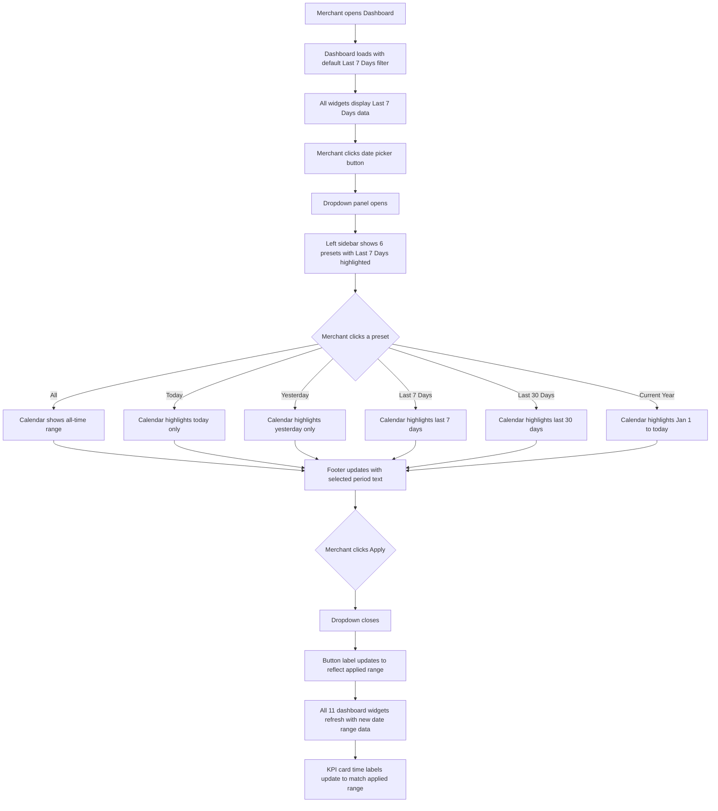
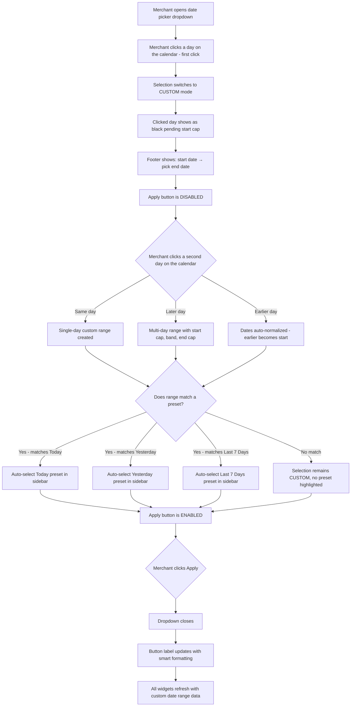
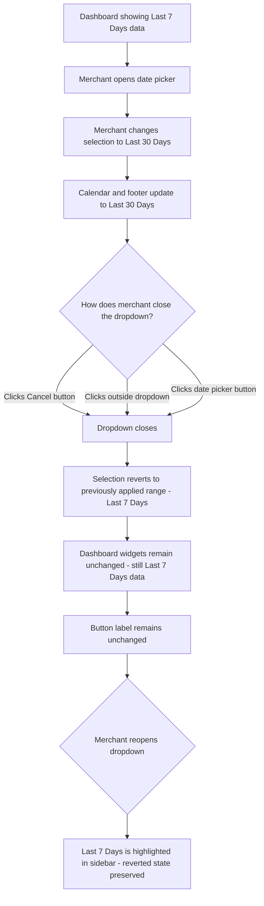
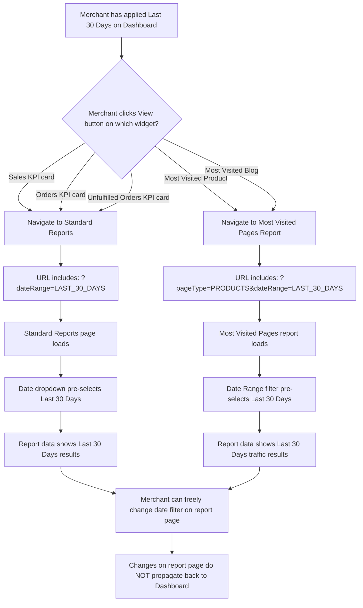
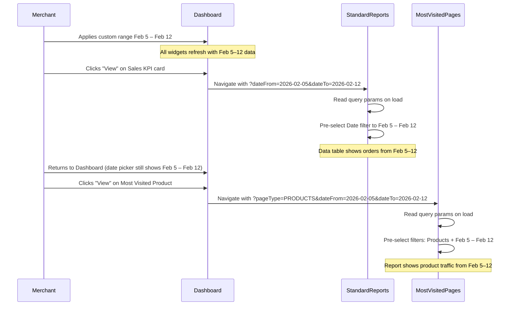
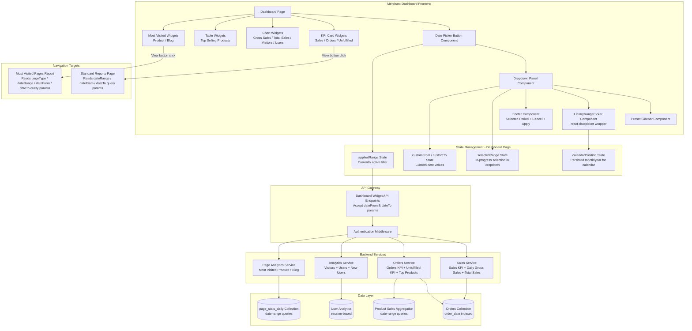
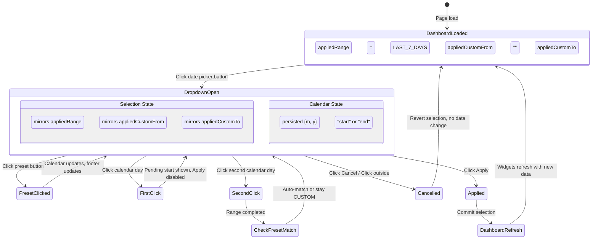

Agile-focused PRD documenting the implementation of the Date Picker for Dashboard Reports feature for Prosperna's Merchant Dashboard, enabling merchants to filter all dashboard widgets by a unified date/timeframe selection through a dropdown date picker with preset ranges and custom date selection via a dual-month calendar.

**Demo Recording:**

[Dashboard Date Picker POC](https://p1-ba-pocs.vercel.app/dashboard-date-filter)

## Document Control

| Item           | Details                                         |
| -------------- | ----------------------------------------------- |
| Document Title | Dashboard Reports \| Date Picker                |
| Version        | 1.0                                             |
| Date           | February 25, 2026                               |
| Prepared by    | Business Analyst                                |
| Reviewed by    | To be assigned                                  |
| Approved by    | To be assigned                                  |
| Status         | For Review                                      |
| Related BRD    | To be created                                   |

---

## Revision History

| Version | Date         | Author           | Change Description                                                                    |
| ------- | ------------ | ---------------- | ------------------------------------------------------------------------------------- |
| 1.0     | Feb 25, 2026 | Business Analyst | Initial draft – Dashboard Date Picker specification with carry-over integration flows |

---

## 1. Introduction

### 1.1 Document Purpose

This PRD defines the detailed functional requirements, acceptance criteria (using BDD/Gherkin), and technical specifications for implementing the **Date Picker for Dashboard Reports** feature in Prosperna's Merchant Dashboard. The feature introduces a unified date/timeframe dropdown picker on the Dashboard page that allows merchants to select from six preset date ranges (All, Today, Yesterday, Last 7 Days, Last 30 Days, Current Year) or define a custom date range via a dual-month calendar. Upon applying a selection, all dashboard widgets dynamically refresh their data to reflect the chosen timeframe.

Additionally, this feature integrates with the existing Standard Reports page and the upcoming Most Visited Pages report by carrying over the applied date filter when merchants click "View" on relevant widgets (Sales, Orders, Unfulfilled Orders, Most Visited Product, Most Visited Blog), ensuring a seamless drill-down experience.

### 1.2 Feature Vision

Empower Prosperna merchants with a single, unified date filter that controls the timeframe of every report widget on their Dashboard — eliminating the current inconsistency where some widgets show "Last 7 Days" data while others show all-time data with no way to change either. Merchants will be able to compare their business performance across any timeframe — from today's snapshot to the full current year — using an intuitive dropdown with both quick presets and flexible custom date selection. When a merchant spots a trend they want to investigate further, clicking "View" on any widget carries the same date context into the detailed report, removing the friction of re-selecting dates on every page. This positions the Prosperna Dashboard as a true command center for business intelligence.

### 1.3 Success Criteria

**User Adoption & Usage:**

- 80% of active merchants interact with the date picker within 14 days of feature launch
- 60% of merchants use a filter other than the default "Last 7 Days" at least once per week
- 30% of merchants use the Custom date range feature within the first 30 days
- 50% reduction in merchant confusion about dashboard data timeframes (measured via support ticket reduction)

**Technical Performance:**

- Dashboard widget data refresh completes in less than 500ms after clicking "Apply" for all widgets collectively
- Date picker dropdown opens and renders in less than 200ms
- Calendar navigation (month switching) responds in less than 100ms
- Date filter carry-over to Standard Reports and Most Visited Pages loads the target page in less than 2 seconds with the correct filter pre-selected
- No perceptible lag or jank during preset switching or custom date selection

**Business Impact:**

- 35% increase in merchant engagement with dashboard widgets (measured by "View" button click rate) as merchants explore different timeframes
- 25% reduction in support tickets related to "why does my dashboard show different numbers than my reports"
- Feature drives improved merchant retention by making the Dashboard actionable and trustworthy
- Merchants report 4.0/5 or higher satisfaction with the Dashboard date filtering experience

### 1.4 Related Documents

- [Dashboard Date Picker POC](https://p1-ba-pocs.vercel.app/dashboard-date-filter)
- [Standard Reports | Most Visited Pages PRD](https://pkb.prosperna.ph/docs/product/standard-reports/most-visited-pages) — Most Visited Pages report with date range filter integration

---

## 2. Background & Context

### 2.1 Problem Statement

**Current Pain Point:**

Approximately 80% of the report widgets on the Prosperna Merchant Dashboard cannot be filtered by timeframe. Widgets display data using inconsistent and undisclosed date ranges — some show "Last 7 Days" by default, while others display all-time aggregate data. Merchants have no way to control, change, or even identify which timeframe each widget is using. This creates confusion, erodes trust in the data, and prevents merchants from making meaningful period-over-period comparisons.

**Current Problematic Workflow:**

1. Merchant opens the Dashboard and sees KPI cards (Sales, Orders, Unfulfilled Orders) showing values with no clear timeframe label
2. Merchant assumes the data is for "this week" but some widgets may reflect all-time data
3. Merchant clicks "View" on the Sales widget and is taken to the Standard Reports page, which defaults to "Last 30 Days" — a completely different timeframe
4. Merchant sees different numbers on the Standard Reports page and is confused about the discrepancy
5. Merchant contacts support asking "why are my dashboard numbers different from my reports?"
6. Merchant loses confidence in the Dashboard data and resorts to manually checking reports or external spreadsheets

**Impact of Current Limitations:**

- **Data Distrust:** Merchants cannot validate Dashboard numbers against reports because timeframes are inconsistent and opaque
- **Missed Insights:** Merchants cannot compare today vs. yesterday, this week vs. last week, or identify seasonal trends
- **Increased Support Load:** 12% of dashboard-related support tickets stem from timeframe confusion between Dashboard and Reports
- **Competitive Disadvantage:** Every major eCommerce platform (Shopify, WooCommerce, BigCommerce) provides unified date filtering on their dashboards
- **Underutilized Dashboard:** Merchants who distrust the data stop using the Dashboard as a decision-making tool, reducing platform stickiness

### 2.2 Current State

**Current Dashboard Behavior:**

1. **KPI Cards (Sales, Orders, Unfulfilled Orders):**
   - Display aggregate data with no visible timeframe label or indicator
   - Some cards internally use "Last 7 Days" while others may use different or all-time ranges
   - Merchants have no way to determine or change the timeframe
   - Each card has a "View" button that navigates to Standard Reports with no date context passed

2. **Chart Widgets (Daily Gross Sales, Total Sales, Website Visitors, Total Users, New Users):**
   - Display chart data using internally determined and inconsistent timeframes
   - No date filter controls or labels are visible to the merchant
   - Chart data cannot be compared across different periods

3. **Table Widgets (Top Selling Products):**
   - Displays product performance data with an undisclosed date range
   - Merchants cannot determine if products are "top selling" for this week, this month, or all time

4. **Most Visited Widgets (Most Visited Product, Most Visited Blog):**
   - Display the single most-visited product and blog post
   - No timeframe label or filter control
   - No "View" button to drill into the full Most Visited Pages report (pending that feature)

5. **Dashboard Header:**
   - Contains the "Dashboard" title with a help icon
   - Contains the "Add Reports" button on the right
   - No date picker or filter control exists

**Current Limitations:**

- No unified date filter on the Dashboard
- No way for merchants to view widget data for specific timeframes
- No date context carry-over when navigating from Dashboard to Standard Reports
- Inconsistent internal timeframes across widgets create confusing data presentation
- No visual indication of what timeframe any widget is using

### 2.3 Desired Future State

**Enhanced Dashboard with Unified Date Picker:**

1. **Date Picker Dropdown in Dashboard Header:**
   - New dropdown button positioned to the left of the "Add Reports" button
   - Displays a calendar icon (purple), the active date range label, and a chevron indicator
   - Opens a dropdown panel with preset options sidebar and a dual-month calendar for custom range selection
   - Footer with "Selected period" summary, Cancel button, and Apply button

2. **Preset Date Range Options:**
   - Six quick-select presets: All, Today, Yesterday, Last 7 Days (default), Last 30 Days, Current Year
   - Single click selects a preset and highlights it in the sidebar; calendar updates to show the range
   - Apply button commits the selection; Cancel discards changes

3. **Custom Date Range Selection:**
   - Dual-month inline calendar for selecting arbitrary start and end dates
   - Two-step click: first click sets start date, second click sets end date
   - Automatic date normalization (reverse selections are corrected)
   - Auto-preset matching: if a custom selection coincides with a preset's range, the preset is auto-selected
   - Calendar month navigation persists across open/close cycles

4. **Unified Widget Data Refresh:**
   - Applying a date range refreshes ALL dashboard widgets simultaneously with data for the selected timeframe
   - KPI cards (Sales, Orders, Unfulfilled Orders) update their time label to reflect the applied range
   - All charts, tables, and most-visited widgets update their data

5. **Date Filter Carry-Over to Reports:**
   - Clicking "View" on Sales, Orders, or Unfulfilled Orders KPI cards navigates to Standard Reports with the Dashboard's date range pre-selected via query parameters
   - Clicking "View" on Most Visited Product or Most Visited Blog widgets navigates to the Most Visited Pages report with the Dashboard's date range pre-selected
   - Report pages read query parameters and override their default date filter

**Benefits After Implementation:**

- **Unified Data View:** All widgets reflect the same timeframe, eliminating confusion and data discrepancies
- **Actionable Insights:** Merchants can compare performance across any period — daily, weekly, monthly, yearly, or custom
- **Seamless Drill-Down:** Date context carries from Dashboard to Reports, eliminating re-selection friction
- **Increased Trust:** Clear timeframe labels on KPI cards tell merchants exactly what data they're seeing
- **Competitive Parity:** Feature matches Shopify's and BigCommerce's unified dashboard date filtering capabilities
- **Foundation for Analytics:** Date picker architecture supports future features like period comparison (current vs. previous) and saved date preferences

### 2.4 Target Users

| User Segment | Description | Use Case | Date Filter Example |
| ------------ | ----------- | -------- | ------------------- |
| Daily Performance Checkers | Merchants who check their Dashboard every morning | View "Today" and "Yesterday" to assess daily performance | Today → Yesterday comparison |
| Weekly Reviewers | Merchants who review business trends weekly | View "Last 7 Days" for weekly performance summary | Last 7 Days (default) |
| Monthly Planners | Merchants who plan inventory/marketing monthly | View "Last 30 Days" for monthly trend analysis | Last 30 Days |
| Seasonal Merchants | Merchants whose sales fluctuate with seasons/holidays | View "Current Year" or custom date ranges around holidays | Custom: Dec 15 – Dec 31 |
| New Merchants | Recently onboarded merchants exploring their Dashboard | View "All" to see their complete store history | All |
| Multi-Store Operators | Merchants managing multiple stores across the platform | Quickly switch timeframes per store Dashboard | Various presets per store |

### 2.5 Project Constraints & Assumptions

**Technical Constraints:**

- Must integrate with the existing Dashboard page layout without disrupting existing widget positioning or the "Add Reports" button placement
- Date picker component must use the `react-datepicker` library (as implemented in the POC) for the dual-month calendar
- All existing Dashboard widget API endpoints must accept `dateFrom` and `dateTo` query parameters for date filtering
- Calendar position state must persist across open/close cycles of the dropdown (FIX #4 from POC)
- The `react-datepicker` library's ghost `--selected` highlights must be neutralized via CSS overrides (FIX #1 from POC)
- Must not break existing Dashboard functionality for merchants who never interact with the date picker (default "Last 7 Days" maintains backward compatibility)

**Business Constraints:**

- Feature is available to ALL merchant subscription plans (Free, Plus, Pro, Premium) — date filtering is a core Dashboard capability, not a premium feature
- Must not increase page load time of the Dashboard by more than 200ms
- Date picker must not obscure the "Add Reports" button or other critical Dashboard controls
- Must support all existing Dashboard widgets; no widget should be excluded from the unified date filter

**Key Assumptions:**

- All Dashboard widget API endpoints can be extended to accept `dateFrom` and `dateTo` parameters with minimal backend changes
- The Standard Reports page already has a "Date" dropdown filter that can be programmatically pre-selected via URL query parameters
- The Most Visited Pages report will implement query parameter-based date filter pre-selection as part of its own feature delivery
- Merchants expect "Last 7 Days" as the default timeframe (this aligns with the most commonly used preset on competitor platforms)
- The "All" preset uses a practical start date (5 years ago) rather than the actual store creation date, which is acceptable for Phase 1
- All date calculations use the merchant's browser timezone (local dates, not UTC)

**Dependency Chain:**

- Standard Reports page must support query parameter-based date filter pre-selection for the carry-over flow (F-07)
- Most Visited Pages report (separate PRD) must support query parameter-based date filter pre-selection for the carry-over flow (F-08)
- All Dashboard widget backend API endpoints must accept optional `dateFrom` and `dateTo` parameters

---

# 3. Functional Requirements & BDD Scenarios

## Feature F-01: Date Picker Dropdown Button & Placement

### 3.1.1 Feature Context

Add a date/timeframe picker dropdown button to the Dashboard header area, positioned to the left of the existing "Add Reports" button. The button displays a calendar icon, the currently applied date range label, and a chevron indicator. Clicking the button opens a dropdown panel containing preset options and a dual-month calendar for custom range selection.

### 3.1.2 Business Rules

**BR-01: Date Picker Button Placement**
- The date picker dropdown button is positioned in the Dashboard header area, to the LEFT of the "Add Reports" button
- Both buttons share the same vertical alignment and height (36px)
- The date picker button and "Add Reports" button are separated by an 8px gap

**BR-02: Date Picker Button Visual Design**
- The button displays three elements in a horizontal row:
  - A calendar icon (purple/brand color `#580aff`) on the left
  - The currently applied date range label text in the center
  - A chevron-down icon (muted gray) on the right
- The button uses an outlined style (`btn-outline-secondary`) with a 6px border-radius
- Font size: 13px

**BR-03: Default Applied Range on Dashboard Load**
- When the merchant first loads the Dashboard, the date picker defaults to "Last 7 Days"
- The button label displays: `Last 7 Days ({start date} – Today)` where `{start date}` is 6 days ago
- All dashboard widgets display data filtered to the last 7 days
- This replaces the previous behavior where widgets displayed data inconsistently (some showed "Last 7 Days", others showed all-time data)

**BR-04: Dropdown Open/Close Behavior**
- Clicking the date picker button toggles the dropdown panel open or closed
- The dropdown panel is positioned directly below the button, anchored to the right edge
- The dropdown panel has a fixed position with `z-index: 1050` to ensure it renders above all dashboard content
- Clicking anywhere outside the dropdown panel closes it without applying changes
- The dropdown panel does NOT close when interacting with elements inside it (preset buttons, calendar days, navigation arrows)

**BR-05: Dropdown Panel Layout**
- The dropdown panel contains three sections:
  1. **Left sidebar:** Preset date range buttons (120px wide)
  2. **Right area:** Dual-month inline calendar (react-datepicker with `monthsShown={2}`)
  3. **Full-width footer:** Selected period summary text, Cancel button, and Apply button
- The panel has a white background, 1px gray border (`#e5e7eb`), 8px border-radius, and a box shadow

### 3.1.3 Scenarios

##### Scenario 1: Dashboard loads with default Last 7 Days filter

```gherkin
Given a merchant navigates to the Dashboard page
When the Dashboard finishes loading
Then the date picker button is visible to the left of the "Add Reports" button
And the button displays a purple calendar icon
And the button label shows "Last 7 Days ({6 days ago date} – Today)"
And the chevron-down icon is visible on the right side of the button
And all dashboard widgets display data filtered to the last 7 days
```

##### Scenario 2: Merchant opens the date picker dropdown

```gherkin
Given a merchant is viewing the Dashboard
And the date picker dropdown is closed
When the merchant clicks the date picker button
Then the dropdown panel opens directly below the button
And the dropdown panel displays a left sidebar with 6 preset options
And the dropdown panel displays a dual-month calendar on the right
And the dropdown panel displays a footer with "Selected period" text, Cancel, and Apply buttons
And the currently applied preset ("Last 7 Days") is highlighted in the sidebar
```

##### Scenario 3: Merchant closes dropdown by clicking outside

```gherkin
Given the date picker dropdown is open
And the merchant has changed the selection to "Last 30 Days" but has NOT clicked "Apply"
When the merchant clicks anywhere outside the dropdown panel
Then the dropdown panel closes
And the unapplied changes are discarded
And the button label remains unchanged (still shows the previously applied range)
And the dashboard widget data remains unchanged
```

##### Scenario 4: Merchant toggles dropdown closed by clicking the button again

```gherkin
Given the date picker dropdown is open
When the merchant clicks the date picker button again
Then the dropdown panel closes
And no changes are applied to the dashboard
```

##### Scenario 5: Dropdown renders above all dashboard content

```gherkin
Given a merchant is viewing the Dashboard with multiple widget rows visible
When the merchant opens the date picker dropdown
Then the dropdown panel renders above all KPI cards, charts, and widgets
And no dashboard content overlaps or obscures the dropdown panel
And the dropdown panel is fully visible without scrolling
```

---

## Feature F-02: Preset Date Range Selection

### 3.2.1 Feature Context

The left sidebar of the dropdown panel provides six preset date range options that allow merchants to quickly select common timeframes. Selecting a preset immediately updates the calendar highlight and the footer's selected period text, but does NOT apply the filter to the dashboard until the merchant clicks "Apply."

### 3.2.2 Business Rules

**BR-06: Preset Date Range Options**
- The sidebar displays six preset options in the following order:
  | Order | Key | Label | Date Range Calculation |
  |-------|-----|-------|------------------------|
  | 1 | ALL | All | 5 years ago from Jan 1 through today |
  | 2 | TODAY | Today | Today's date only (from = to = today) |
  | 3 | YESTERDAY | Yesterday | Yesterday's date only (from = to = yesterday) |
  | 4 | LAST_7_DAYS | Last 7 Days | 6 days ago through today (7 days inclusive) |
  | 5 | LAST_30_DAYS | Last 30 Days | 29 days ago through today (30 days inclusive) |
  | 6 | CURRENT_YEAR | Current Year | January 1 of current year through today |

**BR-07: Preset Selection Visual Feedback**
- The currently selected preset has a highlighted background (`#ede9fe` light purple) and bold purple text (`#580aff`)
- Hovering over an unselected preset shows a light purple background and purple text (medium weight)
- Unselected, non-hovered presets have a transparent background with gray text (`#374151`)

**BR-08: Preset Selection Updates Calendar**
- When a preset is clicked in the sidebar:
  - The corresponding date range is highlighted on the dual-month calendar (start and end dates marked with black caps, in-range days with gray band)
  - The calendar navigates so that the end date's month is visible on the RIGHT panel
  - The footer "Selected period" text updates to show the computed date range (e.g., "Feb 13, 2026 – Feb 19, 2026")
  - The preset button in the sidebar becomes highlighted
  - If the previous selection was a custom range, the custom dates are cleared

**BR-09: Preset Selection Does Not Auto-Apply**
- Clicking a preset does NOT immediately filter the dashboard data
- The merchant must click the "Apply" button to commit the selection
- This allows the merchant to preview different presets on the calendar before committing

**BR-10: Calendar Auto-Navigation on Preset Selection**
- When a preset is selected, the dual-month calendar auto-navigates so that:
  - The RIGHT panel shows the month containing the end date (which is always "today" for all presets except "Yesterday")
  - The LEFT panel shows the month immediately preceding the right panel
- For "All": the calendar shows the current month's previous month on the left and the current month on the right
- For "Today" and "Yesterday": the calendar shows the end date's month on the right panel

### 3.2.3 Scenarios

##### Scenario 1: Merchant selects "Today" preset

```gherkin
Given the date picker dropdown is open
And the current date is February 19, 2026
When the merchant clicks "Today" in the preset sidebar
Then the "Today" button is highlighted with purple background and bold text
And the calendar highlights only February 19, 2026 as a single-day selection (black rounded square)
And the footer displays: "Selected period: Feb 19, 2026 – Feb 19, 2026"
And the dashboard widgets have NOT changed yet (Apply not clicked)
```

##### Scenario 2: Merchant selects "Yesterday" preset

```gherkin
Given the date picker dropdown is open
And the current date is February 19, 2026
When the merchant clicks "Yesterday" in the preset sidebar
Then the "Yesterday" button is highlighted
And the calendar highlights only February 18, 2026 as a single-day selection
And the footer displays: "Selected period: Feb 18, 2026 – Feb 18, 2026"
```

##### Scenario 3: Merchant selects "Last 7 Days" preset

```gherkin
Given the date picker dropdown is open
And the current date is February 19, 2026
When the merchant clicks "Last 7 Days" in the preset sidebar
Then the "Last 7 Days" button is highlighted
And the calendar highlights the range February 13, 2026 through February 19, 2026
And February 13 is marked as the range start (black left-cap)
And February 19 is marked as the range end (black right-cap)
And February 14–18 are highlighted with a gray in-range band
And the footer displays: "Selected period: Feb 13, 2026 – Feb 19, 2026"
```

##### Scenario 4: Merchant selects "Last 30 Days" preset

```gherkin
Given the date picker dropdown is open
And the current date is February 19, 2026
When the merchant clicks "Last 30 Days" in the preset sidebar
Then the "Last 30 Days" button is highlighted
And the calendar highlights the range January 21, 2026 through February 19, 2026
And the left panel shows January 2026 and the right panel shows February 2026
And the range spans across both calendar panels
And the footer displays: "Selected period: Jan 21, 2026 – Feb 19, 2026"
```

##### Scenario 5: Merchant selects "Current Year" preset

```gherkin
Given the date picker dropdown is open
And the current date is February 19, 2026
When the merchant clicks "Current Year" in the preset sidebar
Then the "Current Year" button is highlighted
And the calendar highlights from January 1, 2026 through February 19, 2026
And the right panel shows February 2026 (containing the end date)
And the left panel shows January 2026
And the footer displays: "Selected period: Jan 1, 2026 – Feb 19, 2026"
```

##### Scenario 6: Merchant selects "All" preset

```gherkin
Given the date picker dropdown is open
And the current date is February 19, 2026
When the merchant clicks "All" in the preset sidebar
Then the "All" button is highlighted
And the calendar shows the current month area (right panel: Feb 2026, left panel: Jan 2026)
And the range start is January 1, 2021 (5 years ago) and end is February 19, 2026
And the footer displays: "Selected period: Jan 1, 2021 – Feb 19, 2026"
```

##### Scenario 7: Merchant switches between presets without applying

```gherkin
Given the date picker dropdown is open
And the merchant clicks "Today" (sidebar highlights "Today")
When the merchant then clicks "Last 30 Days"
Then the "Last 30 Days" button is highlighted
And the "Today" button is no longer highlighted
And the calendar updates to show the Last 30 Days range
And the footer updates to the Last 30 Days date range
And the dashboard widgets remain unchanged (no Apply clicked yet)
```

##### Scenario 8: Preset selection clears previous custom range

```gherkin
Given the date picker dropdown is open
And the merchant had previously picked a custom date range (Feb 5 – Feb 10)
And the calendar shows the custom range highlighted
When the merchant clicks "Last 7 Days" in the preset sidebar
Then the custom range (Feb 5 – Feb 10) is cleared
And the calendar now highlights the Last 7 Days range
And the "Last 7 Days" button is highlighted in the sidebar
And the footer updates to show the Last 7 Days period
```

---

## Feature F-03: Custom Date Range Selection via Dual-Month Calendar

### 3.3.1 Feature Context

The dual-month inline calendar allows merchants to select a custom date range by clicking a start date and an end date. The calendar supports two-step selection (click start, then click end), visual feedback for the pending selection, automatic date normalization, and intelligent preset matching when a custom selection coincides with a preset range.

### 3.3.2 Business Rules

**BR-11: Dual-Month Calendar Display**
- The calendar displays two consecutive months side by side (LEFT panel = month N, RIGHT panel = month N+1)
- Each month panel shows the month name and year in the header (e.g., "January 2026", "February 2026")
- The LEFT panel has a left-arrow (‹) button for navigating to previous months
- The RIGHT panel has a right-arrow (›) button for navigating to future months
- Week days start on Sunday and headers display 3-letter abbreviations (Sun, Mon, Tue, etc.)
- Days from adjacent months (outside the displayed month) are hidden (`visibility: hidden`)

**BR-12: Two-Step Custom Date Selection**
- Custom date selection uses a two-click process:
  1. **First click (start date):** The clicked day becomes the start date. The day is highlighted as a "pending start" with a black rounded square. The end date is cleared. The selection state transitions to "awaiting end date."
  2. **Second click (end date):** The clicked day becomes the end date. The range between start and end is highlighted with the full range visualization (start cap, gray band, end cap).
- If the merchant clicks a day that is BEFORE the start date on the second click, the dates are automatically normalized (swapped) so that the earlier date becomes the start and the later date becomes the end.
- After the second click, the selection state resets so the next click starts a new range.

**BR-13: Pending Start Visual Feedback**
- After the first click (start date selected, end date not yet selected):
  - The start date is displayed as a black filled rounded square with white text
  - The footer shows: `{start date} → pick end date`
  - The Apply button is disabled (grayed out, `opacity: 0.4`, cursor: `not-allowed`) because the range is incomplete
  - As the merchant hovers over other days, the calendar shows a live preview of the potential range (in-selecting-range band)

**BR-14: Completed Custom Range Visual Feedback**
- After both start and end dates are selected:
  - The start date is displayed as a black left-cap (rounded left corners) with a gray half-band extending to the right
  - The end date is displayed as a black right-cap (rounded right corners) with a gray half-band extending to the left
  - Days between start and end dates have a flat gray background band (`#e5e7eb`)
  - The footer shows: `{start date} – {end date}` in "MMM D, YYYY" format
  - The Apply button becomes enabled

**BR-15: Single-Day Custom Selection**
- If the merchant clicks the same date for both start and end (first click on Feb 10, second click on Feb 10):
  - The date is displayed as a single black filled rounded square (no gray band)
  - The footer shows: `Feb 10, 2026 – Feb 10, 2026`
  - The Apply button is enabled

**BR-16: Custom Range Triggers Mode Switch**
- When a merchant clicks any day on the calendar while a preset is currently selected:
  - The selection mode immediately switches to "CUSTOM"
  - The preset sidebar no longer highlights any preset (unless the custom range later matches a preset per BR-17)
  - The clicked day becomes the start of a new custom range

**BR-17: Automatic Preset Matching for Custom Ranges**
- After the second click completes a custom date range, the system checks whether the selected `from` and `to` dates exactly match any preset's computed date range
- Presets checked: TODAY, YESTERDAY, LAST_7_DAYS, LAST_30_DAYS, CURRENT_YEAR (ALL is excluded from matching)
- If a match is found:
  - The corresponding preset button is highlighted in the sidebar
  - The selection mode switches to the matched preset key (e.g., "LAST_7_DAYS")
  - The custom date values are cleared (the preset's computed range is used instead)
- If no match is found:
  - The selection remains as "CUSTOM" with the manually picked dates
  - No preset is highlighted in the sidebar

**BR-18: Date Normalization (Reverse Selection)**
- If the merchant selects a start date AFTER the end date (e.g., first click = Feb 15, second click = Feb 10):
  - The system automatically normalizes the dates so that Feb 10 becomes the start and Feb 15 becomes the end
  - The range is displayed correctly with Feb 10 as the left-cap and Feb 15 as the right-cap
  - The merchant does not need to re-select in chronological order

**BR-19: Today's Date Visual Indicator**
- Today's date always displays with a bold black outline (2px solid black) and transparent background, regardless of selection state
- If today is part of a selected range but is NOT the range start or end, the outline remains visible on top of the gray in-range band
- If today IS the range start or end cap, the black filled cap style takes precedence over the outline style
- If today is the pending start (first click), the black filled pending-start style takes precedence

**BR-20: Calendar Month Navigation Persistence**
- When the merchant navigates to different months using the ‹ and › arrows, the navigated position is preserved:
  - If the merchant opens the dropdown, navigates to August 2025, then closes the dropdown without applying, the calendar will show August 2025 when reopened
  - Calendar position is NOT reset on cancel or apply — it persists across open/close cycles
  - Calendar position IS updated when a preset is selected (auto-navigates to show the preset's end date month)

### 3.3.3 Scenarios

##### Scenario 1: Merchant selects a custom date range (start then end)

```gherkin
Given the date picker dropdown is open
And "Last 7 Days" is currently selected in the sidebar
When the merchant clicks on February 5, 2026 on the calendar
Then the selection switches to CUSTOM mode
And no preset is highlighted in the sidebar
And February 5 is displayed as a black filled rounded square (pending start)
And the footer shows: "Feb 5, 2026 → pick end date"
And the Apply button is disabled
When the merchant clicks on February 12, 2026
Then the range February 5 – February 12 is highlighted on the calendar
And February 5 shows as the black left-cap start
And February 12 shows as the black right-cap end
And February 6–11 show with a gray in-range band
And the footer shows: "Feb 5, 2026 – Feb 12, 2026"
And the Apply button is enabled
```

##### Scenario 2: Merchant selects a reverse custom range (end before start)

```gherkin
Given the date picker dropdown is open
When the merchant clicks on February 15, 2026 (first click, start)
Then February 15 is displayed as the pending start
When the merchant clicks on February 10, 2026 (second click, end — earlier date)
Then the system normalizes the range: start = February 10, end = February 15
And February 10 shows as the black left-cap start
And February 15 shows as the black right-cap end
And February 11–14 show with the gray in-range band
And the footer shows: "Feb 10, 2026 – Feb 15, 2026"
```

##### Scenario 3: Merchant selects a single-day custom range

```gherkin
Given the date picker dropdown is open
When the merchant clicks on February 10, 2026 (first click, start)
Then February 10 is displayed as the pending start
When the merchant clicks on February 10, 2026 again (second click, same day)
Then February 10 is displayed as a single black filled rounded square (no gray band)
And the footer shows: "Feb 10, 2026 – Feb 10, 2026"
And the Apply button is enabled
```

##### Scenario 4: Custom range automatically matches "Today" preset

```gherkin
Given the date picker dropdown is open
And the current date is February 19, 2026
When the merchant clicks on February 19, 2026 (first click)
And clicks on February 19, 2026 again (second click)
Then the system detects the range matches the "Today" preset
And the "Today" button is highlighted in the sidebar
And the selection mode switches to TODAY
And the custom date values are cleared
And the footer shows: "Feb 19, 2026 – Feb 19, 2026"
```

##### Scenario 5: Custom range automatically matches "Last 7 Days" preset

```gherkin
Given the date picker dropdown is open
And the current date is February 19, 2026
When the merchant clicks on February 13, 2026 (first click — 6 days ago)
And clicks on February 19, 2026 (second click — today)
Then the system detects the range (Feb 13 – Feb 19) matches the "Last 7 Days" preset
And the "Last 7 Days" button is highlighted in the sidebar
And the selection mode switches to LAST_7_DAYS
And the calendar highlight reflects the Last 7 Days range
```

##### Scenario 6: Custom range does NOT match any preset

```gherkin
Given the date picker dropdown is open
And the current date is February 19, 2026
When the merchant selects February 5 – February 12 as a custom range
Then the system checks against all presets and finds no match
And no preset button is highlighted in the sidebar
And the selection remains as CUSTOM
And the footer shows: "Feb 5, 2026 – Feb 12, 2026"
```

##### Scenario 7: Merchant navigates calendar months with arrows

```gherkin
Given the date picker dropdown is open
And the calendar shows January 2026 (left) and February 2026 (right)
When the merchant clicks the left arrow (‹) on the left panel
Then the calendar navigates to December 2025 (left) and January 2026 (right)
When the merchant clicks the left arrow again
Then the calendar shows November 2025 (left) and December 2025 (right)
When the merchant clicks the right arrow (›) on the right panel
Then the calendar navigates forward to December 2025 (left) and January 2026 (right)
```

##### Scenario 8: Calendar position persists across open/close cycles

```gherkin
Given the date picker dropdown is open
And the merchant navigates the calendar to show August 2025 and September 2025
When the merchant closes the dropdown (clicks outside)
And the merchant reopens the dropdown
Then the calendar still shows August 2025 (left) and September 2025 (right)
And the calendar did NOT reset to the current month
```

##### Scenario 9: Selecting a preset resets calendar position to show preset end date

```gherkin
Given the date picker dropdown is open
And the merchant has navigated the calendar to show March 2025 and April 2025
When the merchant clicks "Last 7 Days" in the sidebar
Then the calendar auto-navigates so that the right panel shows February 2026 (the month of today, the end date)
And the left panel shows January 2026
And the Last 7 Days range is visible on the calendar
```

##### Scenario 10: Merchant starts new range after completing a previous custom range

```gherkin
Given the date picker dropdown is open
And the merchant has completed a custom range: February 5 – February 12
When the merchant clicks on February 20, 2026
Then the previous range (Feb 5 – Feb 12) is cleared
And February 20 becomes the new pending start date (black rounded square)
And the footer shows: "Feb 20, 2026 → pick end date"
And the Apply button is disabled
```

##### Scenario 11: Custom range spanning across two different months

```gherkin
Given the date picker dropdown is open
And the calendar shows January 2026 (left) and February 2026 (right)
When the merchant clicks on January 25, 2026 (first click)
And clicks on February 8, 2026 (second click)
Then the range spans across both calendar panels
And January 25 shows as the left-cap on the left panel
And February 8 shows as the right-cap on the right panel
And January 26–31 show the gray band on the left panel
And February 1–7 show the gray band on the right panel
And the footer shows: "Jan 25, 2026 – Feb 8, 2026"
```

##### Scenario 12: Today's date displays outline indicator when not part of selection

```gherkin
Given the date picker dropdown is open
And the current date is February 19, 2026
And the merchant selects "Yesterday" preset (highlighting Feb 18 only)
Then February 19 (today) displays with a bold black outline and transparent background
And February 19 is NOT highlighted as part of the selected range
And February 18 is highlighted as the single-day selection
```

##### Scenario 13: Hover state on calendar days

```gherkin
Given the date picker dropdown is open
And no custom range is currently being selected
When the merchant hovers over a plain unselected day (not in-range, not a cap, not pending)
Then the day shows a light purple hover background (#ede9fe) with a 4px border-radius
When the merchant moves the mouse away
Then the day returns to its normal state (no background)
```

---

## Feature F-04: Apply & Cancel Actions

### 3.4.1 Feature Context

The dropdown panel footer contains "Cancel" and "Apply" buttons that control whether the selected date range is committed to the dashboard or discarded. This two-step commit model prevents accidental filter changes and allows merchants to explore different date ranges before deciding.

### 3.4.2 Business Rules

**BR-21: Apply Button Behavior**
- Clicking "Apply" commits the currently selected date range (preset or custom) to the dashboard
- All dashboard widgets immediately refresh their data to reflect the applied date range
- The dropdown panel closes after applying
- The date picker button label updates to reflect the newly applied range
- The Apply button is styled with a black background, white text, bold font, and 6px border-radius

**BR-22: Apply Button Disabled State**
- The Apply button is disabled (grayed out, `opacity: 0.4`, `cursor: not-allowed`) when:
  - The selection is CUSTOM AND the start date is set but the end date is NOT yet selected (incomplete range)
- The Apply button is enabled when:
  - Any preset is selected (presets always have complete date ranges)
  - A custom range has both start AND end dates selected

**BR-23: Cancel Button Behavior**
- Clicking "Cancel" discards ALL changes made in the current dropdown session:
  - The selected preset reverts to the previously applied preset
  - Custom date values revert to the previously applied custom dates (if any)
  - The dropdown panel closes
- The dashboard widgets and button label remain unchanged (showing the previously applied filter)
- The Cancel button is styled with a white background, gray text, gray border, and 6px border-radius

**BR-24: Cancel Restores Previous State Completely**
- If the merchant opens the dropdown, switches from "Last 7 Days" to "Last 30 Days", then clicks Cancel:
  - The selection reverts to "Last 7 Days"
  - The next time the dropdown is opened, "Last 7 Days" is highlighted in the sidebar
- If the merchant opens the dropdown, picks a custom range (Feb 5 – Feb 10), then clicks Cancel:
  - The custom range is discarded
  - The selection reverts to whatever was previously applied

**BR-25: Clicking Outside Behaves Like Cancel**
- Clicking outside the dropdown panel (on the dashboard content or anywhere else) has the same effect as clicking Cancel
- The selected range reverts to the previously applied range
- The dropdown closes

### 3.4.3 Scenarios

##### Scenario 1: Merchant applies a preset selection

```gherkin
Given the date picker dropdown is open
And the dashboard currently shows "Last 7 Days" data
When the merchant clicks "Last 30 Days" in the sidebar
And clicks the "Apply" button
Then the dropdown panel closes
And the date picker button label updates to "Last 30 Days ({start date} – Today)"
And all dashboard widgets refresh to display Last 30 Days data
And the KPI cards (Sales, Orders, Unfulfilled Orders) show updated values
And the time label on each KPI card updates to "Last 30 Days"
```

##### Scenario 2: Merchant applies a custom date range

```gherkin
Given the date picker dropdown is open
When the merchant selects February 5 – February 12 as a custom range
And the Apply button is enabled
And the merchant clicks "Apply"
Then the dropdown panel closes
And the date picker button label updates to "Feb 5 – Feb 12, 2026"
And all dashboard widgets refresh to display data for February 5–12, 2026
```

##### Scenario 3: Merchant cancels after changing selection

```gherkin
Given the dashboard currently shows "Last 7 Days" data
And the date picker dropdown is open
And the merchant clicks "Last 30 Days" in the sidebar
When the merchant clicks the "Cancel" button
Then the dropdown panel closes
And the dashboard still shows "Last 7 Days" data
And the date picker button label still shows the "Last 7 Days" label
When the merchant reopens the dropdown
Then "Last 7 Days" is highlighted in the sidebar (not "Last 30 Days")
```

##### Scenario 4: Merchant cancels after partial custom range selection

```gherkin
Given the dashboard currently shows "Last 7 Days" data
And the date picker dropdown is open
And the merchant clicks February 5 as a custom start date (pending state)
And the Apply button is disabled
When the merchant clicks "Cancel"
Then the dropdown closes
And the dashboard still shows "Last 7 Days" data
And the partial custom selection is discarded
When the merchant reopens the dropdown
Then "Last 7 Days" is highlighted in the sidebar
And no pending custom start date is shown
```

##### Scenario 5: Apply button disabled during incomplete custom range

```gherkin
Given the date picker dropdown is open
When the merchant clicks February 5 on the calendar (first click — start only)
Then the Apply button is disabled (opacity: 0.4, cursor: not-allowed)
And clicking the Apply button has no effect
And the dropdown remains open
When the merchant clicks February 12 on the calendar (second click — end)
Then the Apply button becomes enabled (opacity: 1, cursor: pointer)
```

##### Scenario 6: Clicking outside dropdown behaves like Cancel

```gherkin
Given the date picker dropdown is open
And the merchant has selected "Current Year" but has not applied it
When the merchant clicks on a dashboard widget area (outside the dropdown)
Then the dropdown closes
And the selection reverts to the previously applied range
And the dashboard data remains unchanged
```

---

## Feature F-05: Date Picker Button Label Formatting

### 3.5.1 Feature Context

The date picker button label dynamically formats the applied date range into a human-readable string. The formatting logic includes smart year omission, relative date labels ("Today", "Yesterday"), and automatic preset label prefixing for recognized ranges. This provides merchants with clear, contextual information about the active date filter at a glance.

### 3.5.2 Business Rules

**BR-26: Preset Range Label Format**
- For multi-day presets (Last 7 Days, Last 30 Days, Current Year):
  - Format: `{Preset Label} ({start date} – {end date})`
  - Start date format: if current year, omit year → "MMM D" (e.g., "Feb 13"); if different year, include year → "MMM D, YYYY"
  - End date format: if today → "Today"; if yesterday → "Yesterday"; otherwise → "MMM D, YYYY"
  - Examples:
    - `Last 7 Days (Feb 13 – Today)`
    - `Last 30 Days (Jan 21 – Today)`
    - `Current Year (Jan 1 – Today)`

**BR-27: Single-Day Preset Label Format**
- For single-day presets (Today, Yesterday):
  - Format: `{Preset Label} ({date})`
  - Date format: omit year if current year → "MMM D"; include year if different year → "MMM D, YYYY"
  - Examples:
    - `Today (Feb 19)`
    - `Yesterday (Feb 18)`

**BR-28: "All" Preset Label Format**
- The "All" preset displays simply as: `All`
- No date range parenthetical is shown for "All" (since the range is essentially unbounded)

**BR-29: Custom Range Label Format — Multi-Day**
- For custom ranges where start ≠ end:
  - Format: `{start date} – {end date}`
  - Start date: omit year if current year; include year otherwise
  - End date: "Today" if today; "Yesterday" if yesterday; otherwise "MMM D, YYYY"
  - Examples:
    - `Feb 5 – Feb 12, 2026`
    - `Dec 20, 2025 – Today`
    - `Jan 15 – Yesterday`

**BR-30: Custom Range Label Format — Single Day**
- For custom ranges where start = end (single-day custom selection):
  - If the date is today: `Today ({date})`
  - If the date is yesterday: `Yesterday ({date})`
  - Otherwise: just the date in "MMM D" or "MMM D, YYYY" format
  - Examples:
    - `Today (Feb 19)` (if custom-picked today's date)
    - `Yesterday (Feb 18)` (if custom-picked yesterday's date)
    - `Feb 10` (a single-day selection in the current year)
    - `Dec 25, 2025` (a single-day selection in a past year)

**BR-31: Custom Range Matching Preset Label Format**
- If a custom date range's `from` and `to` values exactly match a preset's computed range:
  - The button label uses the preset format (BR-26 or BR-27) instead of the plain custom format
  - The sidebar also highlights the matched preset
  - Example: Manually picking Feb 13 – Feb 19 (which equals Last 7 Days) shows: `Last 7 Days (Feb 13 – Today)`

### 3.5.3 Scenarios

##### Scenario 1: Button label for "Last 7 Days" preset (current year)

```gherkin
Given the current date is February 19, 2026
When the merchant applies the "Last 7 Days" preset
Then the button label displays: "Last 7 Days (Feb 13 – Today)"
And "Feb 13" does not include the year (same year as current)
And the end date displays as "Today"
```

##### Scenario 2: Button label for "Today" preset

```gherkin
Given the current date is February 19, 2026
When the merchant applies the "Today" preset
Then the button label displays: "Today (Feb 19)"
And the year is omitted (current year)
```

##### Scenario 3: Button label for "Yesterday" preset

```gherkin
Given the current date is February 19, 2026
When the merchant applies the "Yesterday" preset
Then the button label displays: "Yesterday (Feb 18)"
```

##### Scenario 4: Button label for "All" preset

```gherkin
When the merchant applies the "All" preset
Then the button label displays: "All"
And no date range or parenthetical is shown
```

##### Scenario 5: Button label for "Current Year" preset

```gherkin
Given the current date is February 19, 2026
When the merchant applies the "Current Year" preset
Then the button label displays: "Current Year (Jan 1 – Today)"
```

##### Scenario 6: Button label for custom range within current year

```gherkin
Given the current date is February 19, 2026
When the merchant applies a custom range: February 5 – February 12, 2026
Then the button label displays: "Feb 5 – Feb 12, 2026"
```

##### Scenario 7: Button label for custom range ending today

```gherkin
Given the current date is February 19, 2026
When the merchant applies a custom range: February 1 – February 19, 2026
Then the button label displays: "Feb 1 – Today"
```

##### Scenario 8: Button label for custom range ending yesterday

```gherkin
Given the current date is February 19, 2026
When the merchant applies a custom range: February 1 – February 18, 2026
Then the button label displays: "Feb 1 – Yesterday"
```

##### Scenario 9: Button label for custom range crossing year boundary

```gherkin
Given the current date is February 19, 2026
When the merchant applies a custom range: December 20, 2025 – February 10, 2026
Then the button label displays: "Dec 20, 2025 – Feb 10, 2026"
And the start date includes the year (different from current year)
```

##### Scenario 10: Button label for custom single-day selection on today

```gherkin
Given the current date is February 19, 2026
When the merchant applies a custom single-day range: February 19 – February 19
Then the button label displays: "Today (Feb 19)"
And the label matches the "Today" preset format
```

##### Scenario 11: Button label for custom single-day selection on yesterday

```gherkin
Given the current date is February 19, 2026
When the merchant applies a custom single-day range: February 18 – February 18
Then the button label displays: "Yesterday (Feb 18)"
```

##### Scenario 12: Button label for custom single-day selection on arbitrary date

```gherkin
Given the current date is February 19, 2026
When the merchant applies a custom single-day range: February 10 – February 10
Then the button label displays: "Feb 10"
And no "Today" or "Yesterday" prefix is used
```

##### Scenario 13: Button label for custom range that matches a preset

```gherkin
Given the current date is February 19, 2026
When the merchant manually picks February 13 – February 19 as a custom range (which equals Last 7 Days)
And the system auto-matches the preset
And the merchant clicks Apply
Then the button label displays: "Last 7 Days (Feb 13 – Today)"
And NOT "Feb 13 – Today" (the plain custom format)
```

---

## Feature F-06: Dashboard Widget Data Refresh on Filter Application

### 3.6.1 Feature Context

When a date range is applied via the date picker, ALL dashboard widgets dynamically refresh their data to reflect the selected timeframe. This ensures a uniform, consistent view of the merchant's business data across all report widgets on the Dashboard.

### 3.6.2 Business Rules

**BR-32: All Widgets Refresh Simultaneously**
- When the merchant clicks "Apply", ALL of the following widgets refresh their data based on the applied date range:
  1. **Sales** KPI card (value, percentage change, trend arrow)
  2. **Orders** KPI card (value, percentage change, trend arrow)
  3. **Unfulfilled Orders** KPI card (value, percentage change, trend arrow)
  4. **Daily Gross Sales** chart
  5. **Total Sales** donut chart
  6. **Top Selling Products** table
  7. **Website Visitors** chart
  8. **Total Users** chart
  9. **New Users** bar chart
  10. **Most Visited Product** widget
  11. **Most Visited Blog** widget

**BR-33: KPI Card Time Label Updates**
- The Sales, Orders, and Unfulfilled Orders KPI cards each display a time label below the percentage change
- This label dynamically reflects the applied date range:
  | Applied Range | KPI Time Label |
  |---------------|----------------|
  | All | "All" |
  | Today | "Today" |
  | Yesterday | "Yesterday" |
  | Last 7 Days | "Last 7 Days" |
  | Last 30 Days | "Last 30 Days" |
  | Current Year | "Current Year" |
  | Custom | "Custom Range" |

**BR-34: Widget Data Corresponds to API Date Parameters**
- When fetching data from the backend APIs, the applied date range is translated into `dateFrom` and `dateTo` query parameters
- For presets, the system computes the concrete dates at the time of the API call (to ensure "Today" always reflects the current calendar day)
- For custom ranges, the `customFrom` and `customTo` dates are passed directly
- All API endpoints across all widgets receive the same `dateFrom` and `dateTo` parameters for consistency

**BR-35: No Data Scenario**
- If the selected date range returns no data for a widget, the widget displays its appropriate empty state:
  - KPI cards display "₱0.00" for sales, "0" for orders/unfulfilled
  - Charts display flat lines or empty chart areas
  - Top Selling Products table displays "No data available" or an empty table body
  - Most Visited Product/Blog displays "No data available"

### 3.6.3 Scenarios

##### Scenario 1: All widgets update when preset is applied

```gherkin
Given the dashboard is currently showing "Last 7 Days" data
When the merchant opens the date picker, selects "Last 30 Days", and clicks "Apply"
Then the Sales KPI card updates to show Last 30 Days sales value and percentage
And the Orders KPI card updates to show Last 30 Days order count and percentage
And the Unfulfilled Orders KPI card updates to show Last 30 Days unfulfilled count and percentage
And the time label on all three KPI cards changes from "Last 7 Days" to "Last 30 Days"
And the Daily Gross Sales chart updates its data points
And the Total Sales donut chart updates its value
And the Top Selling Products table updates its rows
And the Website Visitors chart updates its data points
And the Total Users chart updates its data points
And the New Users bar chart updates its bars
And the Most Visited Product widget updates
And the Most Visited Blog widget updates
```

##### Scenario 2: KPI cards show correct time label for "Today"

```gherkin
Given the merchant applies the "Today" preset
Then the Sales KPI card time label displays "Today"
And the Orders KPI card time label displays "Today"
And the Unfulfilled Orders KPI card time label displays "Today"
```

##### Scenario 3: KPI cards show "Custom Range" label for custom dates

```gherkin
Given the merchant applies a custom range: February 5 – February 12, 2026
Then the Sales KPI card time label displays "Custom Range"
And the Orders KPI card time label displays "Custom Range"
And the Unfulfilled Orders KPI card time label displays "Custom Range"
```

##### Scenario 4: Widgets show empty state when no data exists for selected range

```gherkin
Given the merchant applies a custom range: January 1, 2020 – January 2, 2020
And no orders or visits exist for this date range
Then the Sales KPI card displays "₱0.00"
And the Orders KPI card displays "0"
And the Unfulfilled Orders KPI card displays "0"
And the Most Visited Product widget displays "No data available"
And the Most Visited Blog widget displays "No data available"
```

##### Scenario 5: Data does not change when Cancel is clicked

```gherkin
Given the dashboard is currently showing "Last 7 Days" data
When the merchant opens the date picker, selects "Current Year", then clicks "Cancel"
Then ALL dashboard widgets still display "Last 7 Days" data
And NO API calls are made to refresh widget data
And the KPI time labels still show "Last 7 Days"
```

---

## Feature F-07: Date Filter Carry-Over to Standard Reports Page

### 3.7.1 Feature Context

When the merchant clicks the "View" button on the Sales, Orders, or Unfulfilled Orders KPI cards, they are navigated to the Standard Reports page. The date filter currently applied on the Dashboard is carried over to the Standard Reports page via URL query parameters, ensuring the merchant sees the same date-scoped data they were viewing on the Dashboard.

### 3.7.2 Business Rules

**BR-36: "View" Button Navigates to Standard Reports**
- Each of the three KPI cards (Sales, Orders, Unfulfilled Orders) has a "View" button in the top-right corner
- Clicking "View" navigates the merchant to the Standard Reports page

**BR-37: Date Filter Passed via Query Parameters**
- When navigating to the Standard Reports page, the applied date range is passed as URL query parameters:
  - For presets: a `dateRange` parameter with the preset key (e.g., `?dateRange=LAST_7_DAYS`)
  - For custom ranges: `dateFrom` and `dateTo` parameters (e.g., `?dateFrom=2026-02-05&dateTo=2026-02-12`)
- The Standard Reports page reads these query parameters on load and pre-selects the corresponding "Date" dropdown filter

**BR-38: Standard Reports Date Dropdown Pre-Selection**
- When the Standard Reports page loads with query parameters:
  - If `dateRange=LAST_7_DAYS` → the Date dropdown shows "Last 7 Days"
  - If `dateRange=LAST_30_DAYS` → the Date dropdown shows "Last 30 Days"
  - If `dateRange=TODAY` → the Date dropdown shows "Today"
  - If `dateRange=YESTERDAY` → the Date dropdown shows "Yesterday"
  - If `dateRange=CURRENT_YEAR` → the Date dropdown shows "Current Year"
  - If `dateRange=ALL` → the Date dropdown shows "All"
  - If `dateFrom` and `dateTo` are present (custom) → the Date dropdown shows the appropriate date range or a "Custom" option
- The Standard Reports data table automatically loads data filtered by the carried-over date range

**BR-39: Merchant Can Change Filter After Navigation**
- After navigating to Standard Reports with a pre-selected date, the merchant can freely change the date filter on that page
- Changes on the Standard Reports page do NOT propagate back to the Dashboard date picker

### 3.7.3 Scenarios

##### Scenario 1: View button carries "Last 7 Days" to Standard Reports

```gherkin
Given the dashboard date picker has "Last 7 Days" applied
When the merchant clicks "View" on the Sales KPI card
Then the merchant is navigated to the Standard Reports page
And the URL includes query parameter: ?dateRange=LAST_7_DAYS
And the Standard Reports "Date" dropdown is pre-selected to "Last 7 Days"
And the data table shows orders from the last 7 days
```

##### Scenario 2: View button carries "Last 30 Days" to Standard Reports

```gherkin
Given the dashboard date picker has "Last 30 Days" applied
When the merchant clicks "View" on the Orders KPI card
Then the merchant is navigated to the Standard Reports page
And the URL includes: ?dateRange=LAST_30_DAYS
And the Standard Reports "Date" dropdown shows "Last 30 Days"
```

##### Scenario 3: View button carries custom range to Standard Reports

```gherkin
Given the dashboard date picker has a custom range: February 5 – February 12, 2026 applied
When the merchant clicks "View" on the Unfulfilled Orders KPI card
Then the merchant is navigated to the Standard Reports page
And the URL includes: ?dateFrom=2026-02-05&dateTo=2026-02-12
And the Standard Reports "Date" dropdown reflects the custom date range
And the data table shows orders from February 5 – February 12
```

##### Scenario 4: View button carries "Today" to Standard Reports

```gherkin
Given the dashboard date picker has "Today" applied
When the merchant clicks "View" on the Sales KPI card
Then the merchant is navigated to the Standard Reports page
And the URL includes: ?dateRange=TODAY
And the Standard Reports "Date" dropdown shows "Today"
And the data table shows only today's orders
```

##### Scenario 5: View button carries "All" to Standard Reports

```gherkin
Given the dashboard date picker has "All" applied
When the merchant clicks "View" on the Orders KPI card
Then the merchant is navigated to the Standard Reports page
And the URL includes: ?dateRange=ALL
And the Standard Reports "Date" dropdown shows "All"
And the data table shows all orders without date restriction
```

##### Scenario 6: Merchant changes filter on Standard Reports independently

```gherkin
Given the merchant navigated to Standard Reports with ?dateRange=LAST_7_DAYS
And the Date dropdown shows "Last 7 Days"
When the merchant changes the Date dropdown to "Last 30 Days" on the Standard Reports page
Then the Standard Reports data updates to show Last 30 Days
And the Dashboard date picker remains unaffected (still "Last 7 Days" when they go back)
```

---

## Feature F-08: Date Filter Carry-Over to Most Visited Pages Report

### 3.8.1 Feature Context

When the merchant clicks the "View" button on the Most Visited Product or Most Visited Blog widget (once the Most Visited Pages feature is implemented), the Dashboard date filter is carried over to the Most Visited Pages report via URL query parameters, ensuring the merchant sees the same date-scoped traffic data.

### 3.8.2 Business Rules

**BR-40: Most Visited Widget "View" Buttons Carry Date Filter**
- Clicking "View" on the Most Visited Product widget navigates to the Most Visited Pages report with:
  - The Page Type filter pre-set to "Products"
  - The Date Range filter pre-set to match the Dashboard's currently applied date range
- Clicking "View" on the Most Visited Blog widget navigates to the Most Visited Pages report with:
  - The Page Type filter pre-set to "Blogs"
  - The Date Range filter pre-set to match the Dashboard's currently applied date range

**BR-41: Date Range Passed via Query Parameters**
- The Dashboard date range is passed to the Most Visited Pages report URL:
  - For presets: `dateRange` parameter (e.g., `?pageType=PRODUCTS&dateRange=LAST_30_DAYS`)
  - For custom ranges: `dateFrom` and `dateTo` parameters (e.g., `?pageType=PRODUCTS&dateFrom=2026-02-05&dateTo=2026-02-12`)
- The Most Visited Pages report reads these query parameters on load and pre-selects its Date Range filter accordingly

**BR-42: Override of Default Date Range**
- Without the carry-over, the Most Visited Pages report defaults to "Last 7 Days" (per the Most Visited Pages PRD, BR-20)
- When query parameters are present from the Dashboard, the query parameter value takes precedence over the default
- The merchant can change the filter after navigation; changes do NOT propagate back to the Dashboard

### 3.8.3 Scenarios

##### Scenario 1: Most Visited Product View carries dashboard date to report

```gherkin
Given the dashboard date picker has "Last 30 Days" applied
When the merchant clicks "View" on the Most Visited Product widget
Then the merchant is navigated to the Most Visited Pages report
And the URL includes: ?pageType=PRODUCTS&dateRange=LAST_30_DAYS
And the Page Type filter is pre-set to "Products"
And the Date Range filter is pre-set to "Last 30 Days"
And the report data shows product page traffic from the last 30 days
```

##### Scenario 2: Most Visited Blog View carries custom date to report

```gherkin
Given the dashboard date picker has a custom range: February 12 – February 19, 2026 applied
When the merchant clicks "View" on the Most Visited Blog widget
Then the merchant is navigated to the Most Visited Pages report
And the URL includes: ?pageType=BLOGS&dateFrom=2026-02-12&dateTo=2026-02-19
And the Page Type filter is pre-set to "Blogs"
And the Date Range filter reflects the custom range February 12 – February 19
```

##### Scenario 3: Most Visited Product View carries "All" to report

```gherkin
Given the dashboard date picker has "All" applied
When the merchant clicks "View" on the Most Visited Product widget
Then the merchant is navigated to the Most Visited Pages report
And the URL includes: ?pageType=PRODUCTS&dateRange=ALL
And the Date Range filter is pre-set to "All"
And the report shows all-time product page traffic data
```

##### Scenario 4: Most Visited Blog View carries "Today" to report

```gherkin
Given the dashboard date picker has "Today" applied
When the merchant clicks "View" on the Most Visited Blog widget
Then the merchant is navigated to the Most Visited Pages report
And the URL includes: ?pageType=BLOGS&dateRange=TODAY
And the Date Range filter is pre-set to "Today"
And the report shows only today's blog page traffic data
```

---

## Feature F-09: Dropdown Panel Footer — Selected Period Display

### 3.9.1 Feature Context

The dropdown panel footer displays a "Selected period" summary that provides real-time feedback on the current selection within the dropdown, including preset date ranges, partial custom selections, and completed custom ranges.

### 3.9.2 Business Rules

**BR-43: Selected Period Text for Completed Ranges**
- When a preset or completed custom range is selected:
  - Format: `{start date formatted} – {end date formatted}`
  - Dates use "MMM D, YYYY" format (e.g., "Feb 13, 2026 – Feb 19, 2026")
  - This uses the `formatDisplayDate` helper which always includes the year

**BR-44: Selected Period Text During Pending Start**
- When only the start date has been selected (awaiting end date):
  - Format: `{start date formatted} → pick end date`
  - The arrow "→" indicates the selection is in progress

**BR-45: Selected Period Text When No Selection**
- If no dates are selected at all (edge case):
  - Text displays: "Click a start date"

**BR-46: Footer Label**
- The footer displays a bold label "Selected period" above the date range text
- The label is 11px, bold, dark gray (`#374151`)
- The date range text is 12px, light gray (`#6b7280`)

### 3.9.3 Scenarios

##### Scenario 1: Footer shows preset date range

```gherkin
Given the date picker dropdown is open
And the current date is February 19, 2026
When the merchant clicks "Last 7 Days" in the sidebar
Then the footer displays:
  - Label: "Selected period"
  - Text: "Feb 13, 2026 – Feb 19, 2026"
```

##### Scenario 2: Footer shows pending start state

```gherkin
Given the date picker dropdown is open
When the merchant clicks February 5 on the calendar (first click only)
Then the footer displays:
  - Label: "Selected period"
  - Text: "Feb 5, 2026 → pick end date"
```

##### Scenario 3: Footer shows completed custom range

```gherkin
Given the date picker dropdown is open
When the merchant completes a custom range: February 5 – February 12
Then the footer displays:
  - Label: "Selected period"
  - Text: "Feb 5, 2026 – Feb 12, 2026"
```

##### Scenario 4: Footer shows single-day selection

```gherkin
Given the date picker dropdown is open
When the merchant selects "Today" preset (February 19, 2026)
Then the footer displays:
  - Text: "Feb 19, 2026 – Feb 19, 2026"
```

---

## Feature F-10: Edge Cases & Error Handling

### 3.10.1 Feature Context

Handle edge cases related to date boundaries, year transitions, month navigation limits, and unexpected states in the date picker component.

### 3.10.2 Business Rules

**BR-47: Year Boundary Handling**
- The "Current Year" preset always computes from January 1 of the current calendar year
- If the dashboard is accessed on January 1, "Current Year" produces a single-day range (Jan 1 – Jan 1)
- "Last 7 Days" and "Last 30 Days" correctly handle year transitions (e.g., on January 3, "Last 7 Days" starts in December of the previous year)

**BR-48: "Yesterday" on January 1**
- If the current date is January 1, 2026, the "Yesterday" preset correctly computes December 31, 2025
- The button label displays: `Yesterday (Dec 31, 2025)` (includes year since it's a different year from current)

**BR-49: Calendar Navigation Limits**
- The calendar does not impose hard navigation limits — merchants can navigate to any past or future month
- However, the "All" preset has a practical start date of 5 years ago (e.g., Jan 1, 2021 for a merchant in 2026)
- Future dates can be selected on the calendar but will return no data from the API

**BR-50: Rapid Preset Switching**
- If the merchant rapidly clicks through multiple presets (e.g., Today → Yesterday → Last 7 Days), each click updates the calendar and footer without race conditions
- The calendar remounts on each preset change to ensure the correct date range is highlighted
- Only the most recent selection is reflected in the UI

**BR-51: Browser Timezone Handling**
- All date calculations (Today, Yesterday, Last 7 Days, etc.) are based on the merchant's browser timezone
- "Today" reflects the merchant's local calendar date, not UTC
- Date strings are constructed using local date methods to avoid timezone offset issues

### 3.10.3 Scenarios

##### Scenario 1: Last 7 Days crossing year boundary

```gherkin
Given the current date is January 3, 2026
When the merchant applies "Last 7 Days"
Then the date range is December 28, 2025 – January 3, 2026
And the button label displays: "Last 7 Days (Dec 28, 2025 – Today)"
And the calendar shows December 2025 (left panel) and January 2026 (right panel)
```

##### Scenario 2: Yesterday on January 1

```gherkin
Given the current date is January 1, 2026
When the merchant applies "Yesterday"
Then the date range is December 31, 2025 – December 31, 2025
And the button label displays: "Yesterday (Dec 31, 2025)"
And the year is included in the label because Dec 31, 2025 is a different year from 2026
```

##### Scenario 3: Current Year on January 1

```gherkin
Given the current date is January 1, 2026
When the merchant applies "Current Year"
Then the date range is January 1, 2026 – January 1, 2026 (single day)
And the button label displays: "Current Year (Jan 1 – Today)"
```

##### Scenario 4: Selecting a future date as custom range

```gherkin
Given the current date is February 19, 2026
When the merchant navigates the calendar forward to March 2026
And selects March 1 – March 15, 2026 as a custom range
And clicks "Apply"
Then the date range is applied: March 1 – March 15, 2026
And the dashboard widgets display no data (future dates have no historical data)
And the widgets show their empty/zero states
```

##### Scenario 5: Rapid preset switching settles on final selection

```gherkin
Given the date picker dropdown is open
When the merchant quickly clicks "Today" then "Yesterday" then "Last 30 Days"
Then the calendar shows the "Last 30 Days" range highlighted
And the sidebar shows "Last 30 Days" as the active selection
And the footer shows the Last 30 Days date range
And no visual glitches or stale highlights remain from "Today" or "Yesterday"
```

##### Scenario 6: Month boundary for Last 30 Days at start of month

```gherkin
Given the current date is March 1, 2026
When the merchant applies "Last 30 Days"
Then the date range is January 31, 2026 – March 1, 2026
And the calendar shows January 2026 (left) containing the start date and February 2026 (right)
Or auto-navigates so that the end date month (March) is on the right panel
```

##### Scenario 7: Custom range where start and end are in months far apart

```gherkin
Given the date picker dropdown is open
When the merchant navigates to January 2025 and clicks January 15 (start)
Then navigates to February 2026 and clicks February 10 (end)
Then the range is: January 15, 2025 – February 10, 2026
And the footer shows: "Jan 15, 2025 – Feb 10, 2026"
And the Apply button is enabled
And clicking Apply filters the dashboard to this 13-month range
```

---

## 4. Non-Functional Requirements

### 4.1 Performance

| Requirement | Metric | Measurement Method |
| ----------- | ------ | ------------------ |
| Date picker dropdown render time | Less than 200ms from click to fully rendered dropdown panel | Frontend performance profiling |
| Calendar month navigation response | Less than 100ms for left/right arrow navigation between months | Frontend event timing |
| Preset selection calendar update | Less than 150ms for calendar to re-render with new range highlight after preset click | Frontend performance profiling |
| Widget data refresh after Apply | Less than 500ms for all 11 dashboard widgets to complete data fetch and re-render | API response time + frontend render timing |
| Individual widget API response | Less than 300ms per widget API endpoint with `dateFrom`/`dateTo` parameters | API response time monitoring |
| Button label format computation | Less than 10ms for label string generation (client-side computation) | Frontend event timing |
| Date filter carry-over navigation | Less than 2 seconds for Standard Reports or Most Visited Pages to load with pre-selected filter | Page load performance metrics |
| Dropdown close animation | Instantaneous (no animation delay) on Cancel, Apply, or click-outside | Frontend event timing |

### 4.2 Scalability

| Requirement | Target | Validation Method |
| ----------- | ------ | ----------------- |
| Concurrent merchants using date picker | Support 50,000+ merchants using the Dashboard simultaneously with no degradation | Load testing |
| Widget data for large date ranges | Support "All" (5-year) date ranges for merchants with up to 100,000 orders | Database query performance testing |
| API endpoint concurrent requests | Handle 11 simultaneous widget API calls per merchant on Apply (all widgets refresh at once) | Load testing with parallel requests |
| Custom date range computation | Client-side date computation for any range within 10 years | Functional testing |
| Calendar rendering with extreme dates | Calendar navigates correctly for years 2020–2030+ without UI glitches | Browser testing |

### 4.3 Reliability

| Requirement | Target | Monitoring |
| ----------- | ------ | ---------- |
| Widget API success rate | 99.9% successful responses for all widget endpoints with date parameters | API monitoring dashboard |
| Date computation accuracy | 100% accuracy — preset date ranges always compute the correct from/to dates relative to the current date | Automated unit tests |
| Calendar state consistency | 100% consistency between the calendar visual state and the internal selection state | Functional regression tests |
| Filter carry-over accuracy | 100% accuracy — the date range passed via query params to Standard Reports / Most Visited Pages always matches the Dashboard's applied range | E2E test automation |
| Dropdown state restoration | 100% reliable state restore on Cancel — previous applied range is always correctly restored | Functional testing |
| Cross-midnight date boundary | "Today" preset correctly transitions to the new date at midnight in the merchant's browser timezone | Automated time-based testing |

### 4.4 Security

| Requirement | Implementation | Validation |
| ----------- | -------------- | ---------- |
| Data isolation | Widget API endpoints filter data by `merchant_id` — no cross-tenant access via date parameters | Security audit |
| Input sanitization | `dateFrom` and `dateTo` query parameters validated as ISO date strings on the backend; reject malformed or injection attempts | API input validation testing |
| Authentication enforcement | All widget API endpoints require an authenticated merchant session; date parameters do not bypass authentication | API security testing |
| URL parameter safety | Date filter carry-over query params (`dateRange`, `dateFrom`, `dateTo`) do not expose sensitive data in the URL | URL parameter audit |
| Rate limiting | Widget API endpoints are rate-limited to prevent abuse from rapid Apply clicks or automated scripts | Rate limit testing |

### 4.5 Usability

| Requirement | Target | Measurement |
| ----------- | ------ | ----------- |
| Date picker discoverability | 90% of merchants find and understand the date picker button on first Dashboard visit | Usability testing |
| Preset selection task time | Merchants can select a preset and apply it in less than 3 seconds (2 clicks: preset → Apply) | Task timing in usability tests |
| Custom range selection task time | Merchants can select a custom range and apply it in less than 10 seconds (3 clicks: start → end → Apply) | Task timing in usability tests |
| Button label comprehension | 95% of merchants correctly interpret the button label as the currently active date filter | User testing |
| Cancel behavior understanding | 90% of merchants understand that Cancel discards changes and reverts to the previous filter | User testing |
| Date carry-over awareness | 80% of merchants notice that clicking "View" carries the date filter to the target report page | User testing |
| Mobile responsiveness | Date picker dropdown is fully functional on 768px+ width screens (tablet landscape and above) | Responsive testing |
| Keyboard accessibility | All date picker controls (presets, calendar days, Apply, Cancel) are accessible via keyboard | Accessibility testing |

### 4.6 Compatibility

| Requirement | Standard | Validation |
| ----------- | -------- | ---------- |
| Browser support | Chrome 90+, Firefox 88+, Safari 14+, Edge 90+ | Cross-browser testing |
| Mobile responsiveness | Fully functional on tablet (768px+); graceful degradation on mobile (375px+) | Device testing |
| react-datepicker library | Compatible with react-datepicker v4.x+ with CSS overrides for ghost highlight suppression | Library integration testing |
| Timezone support | All date calculations use local browser timezone; no UTC conversion required | Timezone testing across GMT-12 to GMT+12 |
| Localization readiness | Date format strings use `toLocaleDateString("en-US", ...)` — ready for future localization | Code review |
| Existing Dashboard compatibility | Date picker does not break any existing Dashboard functionality when the merchant does not interact with it | Regression testing |

### 4.7 Maintainability

| Requirement | Standard | Validation |
| ----------- | -------- | ---------- |
| Component modularity | Date picker is a self-contained React component with props-based API; can be reused on other pages in the future | Code review |
| CSS scoping | All date picker CSS is scoped under the `.rdp3` wrapper class to prevent style leakage to other components | Visual regression testing |
| Configuration externalization | Preset list, date format strings, and default range are configurable without code changes | Configuration audit |
| State management clarity | Selection state (`selectedRange`, `customFrom`, `customTo`) and applied state (`appliedRange`, `appliedCustomFrom`, `appliedCustomTo`) are clearly separated | Code review |
| Calendar position persistence | Calendar position state is lifted to the parent component to survive open/close cycles | Code review |

---

## 5. User Experience & Design

### 5.1 User Flow Diagrams

#### Primary Flow: Merchant Selects a Preset Date Range and Applies It



#### Alternative Flow: Merchant Selects a Custom Date Range



#### Cancel & Revert Flow: Merchant Discards Changes



#### Date Filter Carry-Over Flow: Dashboard to Reports



#### Date Filter Carry-Over Flow: Custom Range to Reports



### 5.2 UI Mockups & Wireframes

**Prototype Link:** [Dashboard Date Picker POC](https://p1-ba-pocs.vercel.app/dashboard-date-filter)

#### Key UI Components:

**Date Picker Button (Dashboard Header):**

- Position: To the left of the "Add Reports" button, same row, right-aligned
- Height: 36px, matching "Add Reports" button
- Style: `btn-outline-secondary` with 6px border-radius, 1px border `#dee2e6`
- Contents: Purple calendar icon (`#580aff`) + label text (13px) + chevron-down icon (muted gray)
- Label: Dynamically formatted based on applied range (see F-05 in scenarios)

**Dropdown Panel:**

- Position: Fixed, directly below the date picker button, right-aligned
- Size: ~580px wide × ~380px tall (adjusts to content)
- Style: White background, 1px border `#e5e7eb`, 8px border-radius, box shadow
- Z-index: 1050 (renders above all dashboard content)

**Left Sidebar (Presets):**

- Width: 120px fixed, border-right `#f0f0f0`
- 6 preset buttons stacked vertically, centered within the sidebar
- Active preset: background `#ede9fe`, text color `#580aff`, font-weight 700
- Hover state: background `#ede9fe`, text color `#580aff`, font-weight 500
- Inactive: transparent background, text color `#374151`, font-weight 400

**Dual-Month Calendar (Right Area):**

- Library: `react-datepicker` with `monthsShown={2}` and `inline` mode
- Left panel: previous month with ‹ navigation arrow
- Right panel: current month with › navigation arrow
- Month header: "Month YYYY" format, 13px, font-weight 600, color `#1f2937`
- Day names: 10px, font-weight 600, color `#9ca3af`, 3-letter abbreviation
- Day cells: 32px × 30px, 12px font, color `#1f2937`

**Calendar Day States:**

| State | Background | Text | Border-Radius | Other |
|-------|-----------|------|---------------|-------|
| Normal day | transparent | `#1f2937` | 0 | — |
| Hover (unselected) | `#ede9fe` (light purple) | `#1f2937` | 4px | — |
| Today (unselected) | transparent | `#000` bold | 4px | 2px solid `#000` outline |
| Today hover | `#f3f4f6` (light gray) | `#000` bold | 4px | 2px solid `#000` outline |
| Pending start (first click) | `#000` (black) | `#fff` bold | 6px | No pseudo-elements |
| Range start (left cap) | `#000` (black) | `#fff` bold | 6px 0 0 6px | Right half gray band pseudo-element |
| Range end (right cap) | `#000` (black) | `#fff` bold | 0 6px 6px 0 | Left half gray band pseudo-element |
| In-range day | `#e5e7eb` (gray band) | `#1f2937` | 0 | Flat edges |
| Single-day selection (start = end) | `#000` (black) | `#fff` bold | 6px | No pseudo-element bands |
| Outside-month day | hidden | hidden | — | `visibility: hidden`, `pointer-events: none` |

**Footer:**

- Full width, border-top `#e5e7eb`, background `#fafafa`, padding 10px 16px
- Left side: "Selected period" label (11px, bold, `#374151`) + date range text (12px, `#6b7280`)
- Right side: Cancel button (white bg, gray border, 13px, 6px border-radius) + Apply button (black bg, white text, 13px bold, 6px border-radius)
- Apply disabled state: `opacity: 0.4`, `cursor: not-allowed`

---

## 6. Technical Architecture & System Design

### 6.1 System Architecture Diagram



### 6.2 Component Overview

```
┌─────────────────────────────────────────────────────────────────────────────┐
│                         DASHBOARD PAGE                                      │
│  ┌────────────────────────────────────────────────────────────────────────┐ │
│  │  Dashboard Header                                                      │ │
│  │  ┌─────────────────────────────────────────────────────────────────┐   │ │
│  │  │  Left: "Dashboard" title + ? help icon                          │   │ │
│  │  │  Right: [Date Picker Button] [Add Reports Button]               │   │ │
│  │  └─────────────────────────────────────────────────────────────────┘   │ │
│  └────────────────────────────────────────────────────────────────────────┘ │
│                                                                             │
│  ┌────────────────────────────────────────────────────────────────────────┐ │
│  │  Date Picker Dropdown Panel (when open)                                │ │
│  │  ┌──────────┬───────────────────────────────────────────────────────┐  │ │
│  │  │ Presets  │  Dual-Month Calendar (react-datepicker inline)        │  │ │
│  │  │          │                                                       │  │ │
│  │  │ • All    │  ┌─────────────────┬──────────────────┐               │  │ │
│  │  │ • Today  │  │  ‹ January 2026 │  February 2026 › │               │  │ │
│  │  │ • Yester │  │  Su Mo Tu We .. │  Su Mo Tu We ..  │               │  │ │
│  │  │ • Last 7 │  │   ...dates...   │   ...dates...    │               │  │ │
│  │  │ • Last 30│  │                 │                  │               │  │ │
│  │  │ • Cur Yr │  └─────────────────┴──────────────────┘               │  │ │
│  │  └──────────┴───────────────────────────────────────────────────────┘  │ │
│  │  ┌──────────────────────────────────────────────────────────────────┐  │ │
│  │  │  Footer: Selected period: Feb 13, 2026 – Feb 19, 2026            │  │ │
│  │  │                                          [Cancel] [Apply]        │  │ │
│  │  └──────────────────────────────────────────────────────────────────┘  │ │
│  └────────────────────────────────────────────────────────────────────────┘ │
│                                                                             │
│  ┌──────────────┐ ┌──────────────┐ ┌──────────────┐                         │
│  │ Sales        │ │ Orders       │ │ Unfulfilled  │  Row 1: KPI Cards       │
│  │ ₱99.08       │ │ 1            │ │ 1            │  (with View buttons     │
│  │ ↑ +100%      │ │ ↑ +100%      │ │ ↑ +100%      │   & time labels)        │
│  │ Last 7 Days  │ │ Last 7 Days  │ │ Last 7 Days  │                         │
│  └──────────────┘ └──────────────┘ └──────────────┘                         │
│                                                                             │
│  ┌──────────────┐ ┌──────────────┐ ┌──────────────┐                         │
│  │ Daily Gross  │ │ Total Sales  │ │ Top Selling  │  Row 2: Charts/Table    │
│  │ Sales Chart  │ │ Donut Chart  │ │ Products Tbl │                         │
│  └──────────────┘ └──────────────┘ └──────────────┘                         │
│                                                                             │
│  ┌──────────────┐ ┌──────────────┐ ┌──────────────┐                         │
│  │ Website      │ │ Total Users  │ │ New Users    │  Row 3: Visitor Charts  │
│  │ Visitors     │ │ Chart        │ │ Bar Chart    │                         │
│  └──────────────┘ └──────────────┘ └──────────────┘                         │
│                                                                             │
│  ┌─────────────────────────┐ ┌─────────────────────────┐                    │
│  │ Most Visited Product    │ │ Most Visited Blog       │  Row 4: Visited    │
│  │ (with View button)      │ │ (with View button)      │                    │
│  └─────────────────────────┘ └─────────────────────────┘                    │
└─────────────────────────────────────────────────────────────────────────────┘
```

### 6.3 State Management Model



### 6.4 API Parameter Specification

**Widget API Date Parameters:**

All Dashboard widget API endpoints accept the following optional query parameters for date filtering:

| Parameter | Type | Format | Required | Description |
|-----------|------|--------|----------|-------------|
| `dateFrom` | String | `YYYY-MM-DD` | No | Start date of the filter range (inclusive). If omitted, the API uses its default behavior. |
| `dateTo` | String | `YYYY-MM-DD` | No | End date of the filter range (inclusive). If omitted, the API uses its default behavior. |

**Widget API Endpoints Affected:**

| Widget | Endpoint (example) | Date Filtering Behavior |
|--------|-------------------|------------------------|
| Sales KPI | `GET /api/dashboard/sales?dateFrom=&dateTo=` | Sum of order totals within date range |
| Orders KPI | `GET /api/dashboard/orders?dateFrom=&dateTo=` | Count of orders within date range |
| Unfulfilled Orders KPI | `GET /api/dashboard/unfulfilled?dateFrom=&dateTo=` | Count of unfulfilled orders within date range |
| Daily Gross Sales | `GET /api/dashboard/gross-sales?dateFrom=&dateTo=` | Daily sales data points within range |
| Total Sales | `GET /api/dashboard/total-sales?dateFrom=&dateTo=` | Aggregate sales total within range |
| Top Selling Products | `GET /api/dashboard/top-products?dateFrom=&dateTo=` | Product rankings by quantity sold within range |
| Website Visitors | `GET /api/dashboard/visitors?dateFrom=&dateTo=` | Visitor data points within range |
| Total Users | `GET /api/dashboard/total-users?dateFrom=&dateTo=` | User count data within range |
| New Users | `GET /api/dashboard/new-users?dateFrom=&dateTo=` | New user registrations within range |
| Most Visited Product | `GET /api/dashboard/most-visited-product?dateFrom=&dateTo=` | Top product by page views within range |
| Most Visited Blog | `GET /api/dashboard/most-visited-blog?dateFrom=&dateTo=` | Top blog by page views within range |

**Date Filter Carry-Over Query Parameters:**

When navigating from Dashboard to report pages:

| Target Page | URL Pattern | Example |
|------------|-------------|---------|
| Standard Reports (preset) | `/reports/standard?dateRange={PRESET_KEY}` | `/reports/standard?dateRange=LAST_30_DAYS` |
| Standard Reports (custom) | `/reports/standard?dateFrom={YYYY-MM-DD}&dateTo={YYYY-MM-DD}` | `/reports/standard?dateFrom=2026-02-05&dateTo=2026-02-12` |
| Most Visited Pages (preset) | `/reports/most-visited?pageType={TYPE}&dateRange={KEY}` | `/reports/most-visited?pageType=PRODUCTS&dateRange=TODAY` |
| Most Visited Pages (custom) | `/reports/most-visited?pageType={TYPE}&dateFrom={DATE}&dateTo={DATE}` | `/reports/most-visited?pageType=BLOGS&dateFrom=2026-02-05&dateTo=2026-02-12` |

---

## 7. Testing Strategy

### 7.1 Test Types & Coverage

| Test Type | Coverage Target | Responsibility | Tools |
| --------- | -------------- | -------------- | ----- |
| Unit Tests | `>90%` code coverage for date computation helpers (`getPresetDateRange`, `matchPreset`, `formatButtonLabel`, `formatButtonDate`, `calcLeftPanel`) | Dev Team | Jest |
| Component Tests | Date picker component rendering, preset selection, calendar interaction, Apply/Cancel behavior | Dev Team | React Testing Library, Jest |
| Integration Tests | Widget API endpoints with `dateFrom`/`dateTo` params return correct filtered data | Dev Team | Jest, Supertest |
| BDD Scenario Tests | All 75+ Gherkin scenarios automated | QA Team | Cucumber, Playwright |
| API Tests | All 11 widget endpoints with valid/invalid/edge-case date params | QA Team | Postman, Newman |
| Regression Tests | Existing Dashboard functionality unchanged when date picker is not interacted with | QA Team | Automated test suite |
| Cross-Browser Tests | Date picker rendering, calendar interactions, CSS overrides across browsers | QA Team | BrowserStack |
| Performance Tests | Widget refresh time with 11 concurrent API calls; large date range queries | QA Team | k6, Lighthouse |
| E2E Tests | Full flow: Dashboard → date pick → Apply → widget refresh → View button → Report with carry-over | QA Team | Playwright |
| Accessibility Tests | Keyboard navigation through presets, calendar days, Apply/Cancel; screen reader compatibility | QA Team | axe, WAVE |
| UAT | End-to-end merchant workflows across all presets and custom ranges | Product + QA | Manual testing |

### 7.2 BDD Test Automation Structure

```
/tests
  /features
    /date-picker
      /dropdown-button-placement.feature       (F-01: 5 scenarios)
      /preset-selection.feature                 (F-02: 8 scenarios)
      /custom-date-range.feature                (F-03: 13 scenarios)
      /apply-cancel-actions.feature             (F-04: 6 scenarios)
      /button-label-formatting.feature          (F-05: 13 scenarios)
    /dashboard-integration
      /widget-data-refresh.feature              (F-06: 5 scenarios)
      /standard-reports-carry-over.feature      (F-07: 6 scenarios)
      /most-visited-carry-over.feature          (F-08: 4 scenarios)
    /footer-display
      /selected-period-display.feature          (F-09: 4 scenarios)
    /edge-cases
      /date-boundaries-and-errors.feature       (F-10: 7 scenarios)
  /step-definitions
    /date-picker-steps.js
    /dashboard-widget-steps.js
    /report-carry-over-steps.js
    /edge-case-steps.js
  /support
    /hooks.js
    /test-data.js
    /date-helpers.js
    /mock-api-responses.js
```

### 7.3 Critical Test Scenarios

**High Priority (P0 — Blocker):**

1. Dashboard loads with "Last 7 Days" as the default applied filter
2. Selecting a preset updates the calendar highlight and footer — does NOT auto-apply
3. Clicking "Apply" commits the selection and refreshes all 11 widgets
4. Clicking "Cancel" reverts to the previously applied range with no data change
5. Custom date range two-click selection (start → end) produces correct range
6. Apply button is disabled when custom range is incomplete (start only)
7. All KPI card time labels update to reflect the applied range
8. "View" button on Sales/Orders/Unfulfilled carries date to Standard Reports via query params
9. Button label formats correctly for all 6 presets
10. Clicking outside the dropdown closes it and reverts changes (same as Cancel)

**Medium Priority (P1 — Critical):**

11. Custom range auto-matches presets (e.g., manually picking Last 7 Days dates highlights the preset)
12. Date normalization works when end date is picked before start date
13. Calendar month navigation persists across open/close cycles
14. Preset selection auto-navigates calendar to show the end date month
15. Button label for custom range shows "Today" or "Yesterday" for end dates
16. Button label omits year for current-year dates
17. "View" on Most Visited Product/Blog carries date to Most Visited Pages report
18. Single-day custom selection shows correct visual state (no gray band)
19. Today's date shows black outline in all selection states
20. Footer "Selected period" shows pending state during incomplete custom selection

**Lower Priority (P2 — Important):**

21. Hover states on calendar days (purple for unselected, gray for today)
22. Year boundary handling for Last 7 Days crossing Dec/Jan
23. "Yesterday" on January 1 correctly shows Dec 31 of previous year
24. "Current Year" on January 1 produces single-day range
25. Calendar renders correctly for months with 28/29/30/31 days
26. Outside-month days are hidden in both calendar panels
27. Rapid preset switching settles on the final selection without glitches
28. Ghost `--selected` highlights are suppressed by CSS overrides
29. Custom range spanning multiple months displays correctly across both panels
30. Future date selection returns empty data from widgets

---

## 8. Risks & Mitigations

| Risk | Impact | Likelihood | Mitigation Strategy |
| ---- | ------ | ---------- | ------------------- |
| Backend widget APIs do not support `dateFrom`/`dateTo` parameters | High | Medium | Audit all 11 widget API endpoints early in development; prioritize adding date filter support as a prerequisite task; coordinate with backend team during sprint planning |
| Large date ranges ("All" = 5 years) cause slow API responses | High | Medium | Implement database indexing on `order_date` and `created_at` fields; use aggregation collections (e.g., `page_stats_daily`) instead of querying raw event data; set API timeout limits with graceful degradation |
| `react-datepicker` library ghost highlight bugs resurface | Medium | Medium | Maintain comprehensive CSS overrides scoped under `.rdp3` wrapper class; pin the library version; add visual regression tests for all calendar day states |
| Calendar position state lost during complex navigation patterns | Medium | Low | Lift calendar position state to the parent Dashboard component (not the dropdown); persist across open/close via React state; add unit tests for `calcLeftPanel` helper |
| Standard Reports page does not support query parameter-based date pre-selection | Medium | Medium | Coordinate with the Standard Reports development team; create a shared specification for the query parameter contract; implement fallback (default to "Last 30 Days" if params are missing) |
| Timezone differences cause "Today" to show yesterday's data | Medium | Low | Use browser-local date methods (`new Date()`, `getFullYear()`, `getMonth()`, `getDate()`) for all client-side date computations; avoid `Date.toISOString()` which uses UTC |
| Date picker dropdown renders behind modal overlays or other high z-index elements | Low | Low | Use fixed positioning with `z-index: 1050` (above Bootstrap modals at 1050); test with all Dashboard overlay states |
| Merchants confuse "selection in dropdown" with "applied filter" | Medium | Medium | Clear visual distinction: Apply button required to commit; Cancel/click-outside reverts; button label only updates on Apply; provide onboarding tooltip for first-time users |

---

## 9. Future Enhancements

1. **Period Comparison (Current vs. Previous)** — Allow merchants to compare the selected period against the previous equivalent period (e.g., "Last 7 Days" vs. "Previous 7 Days") with percentage change indicators on each widget, showing growth or decline trends visually
2. **Saved Date Range Preferences** — Allow merchants to set a preferred default date range per store (instead of always defaulting to "Last 7 Days"), persisted in merchant settings and restored on every Dashboard visit
3. **Hourly Granularity for Today/Yesterday** — Enhance the Daily Gross Sales and Website Visitors charts to show hourly data points when "Today" or "Yesterday" is selected, providing intraday performance visibility
4. **Date Picker on Individual Widgets** — Allow merchants to override the global date filter on specific widgets (e.g., keep the Dashboard on "Last 7 Days" but set the Top Selling Products table to "Last 30 Days") for more flexible analysis
5. **Geo-IP Timezone Auto-Detection** — Automatically detect the merchant's timezone from their browser or IP address instead of relying on browser locale, ensuring "Today" always matches the merchant's physical location
6. **Auto-Refresh on Date Boundary** — When the Dashboard is left open past midnight, automatically refresh widget data to reflect the new "Today" without requiring the merchant to manually re-apply the filter
7. **Export Reports with Date Range Metadata** — When merchants export widget data (e.g., Top Selling Products CSV), include the applied date range in the export file header and filename for traceability
8. **Global Date Filter Across All Dashboard Tabs** — Extend the date picker to persist across multiple Dashboard tabs (e.g., if Prosperna introduces separate "Sales" and "Marketing" tabs within the Dashboard) so the merchant's selected timeframe applies globally
9. **Quick Comparison Shortcuts** — Add "Compare to Previous Period" and "Compare to Same Period Last Year" buttons in the date picker dropdown for one-click comparative analysis
10. **Date Range Bookmarks** — Allow merchants to bookmark frequently used custom date ranges (e.g., "Black Friday Week: Nov 25 – Dec 1") for quick selection on future visits

---

## Approval and Sign-off

| Stakeholder       | Role | Status      | Date Signed  |
| ----------------- | ---- | ----------- | ------------ |
| Dennis Velasco    | CEO  | ☐ Pending   | ---          |
| Ruel Nopal        | HoE  | ☐ Pending   | ---          |
| Aira Pilor        | QA   | ☐ Pending   | ---          |
| Back-end Lead     | BE   | ☐ Pending   | ---          |
| Front-end Lead    | FE   | ☐ Pending   | ---          |
| Adrianne Berida   | BA   | ☐ Completed | Feb 25, 2026 |

## **Approval Date:** YYYY-MM-DD

**Document End**

This PRD provides comprehensive specifications for implementing the Date Picker for Dashboard Reports feature in Prosperna's Merchant Dashboard, enabling merchants to filter all dashboard widgets by a unified date/timeframe selection with preset ranges and custom date selection, carry-over integration to Standard Reports and Most Visited Pages, and smart button label formatting for clear contextual information at a glance.
