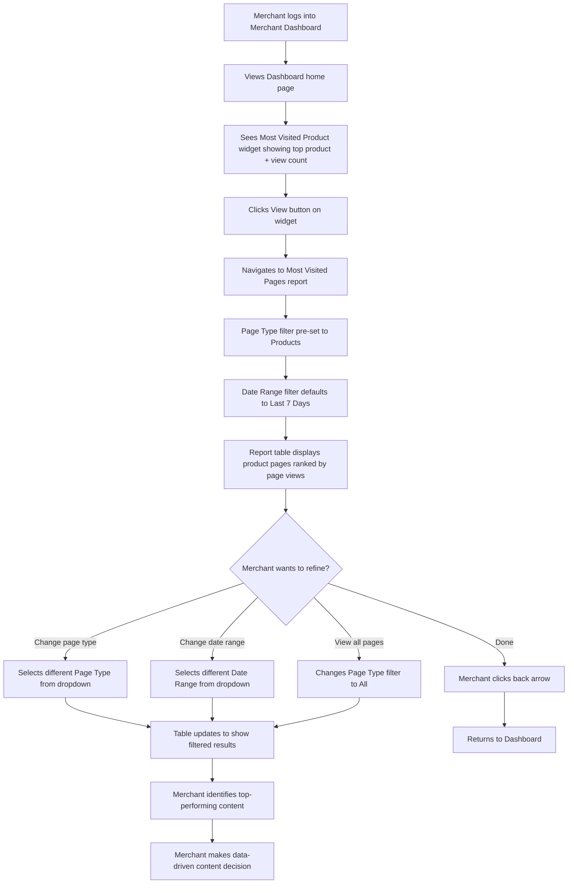
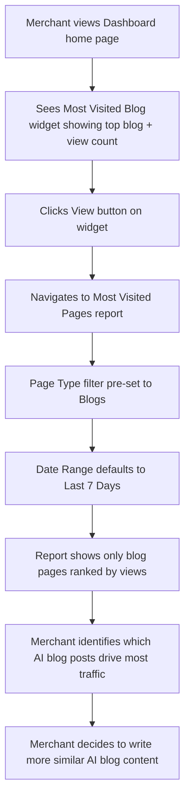
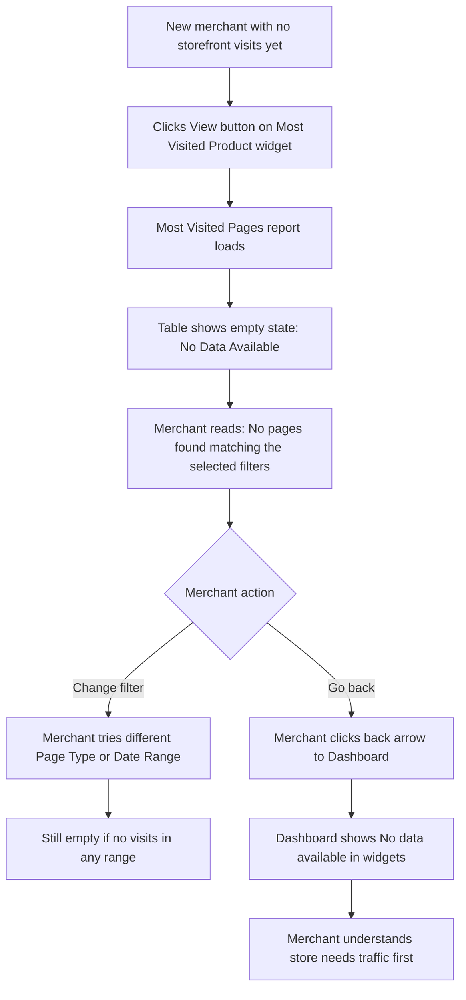
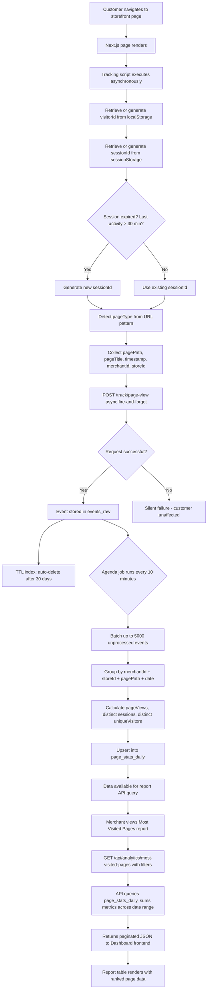
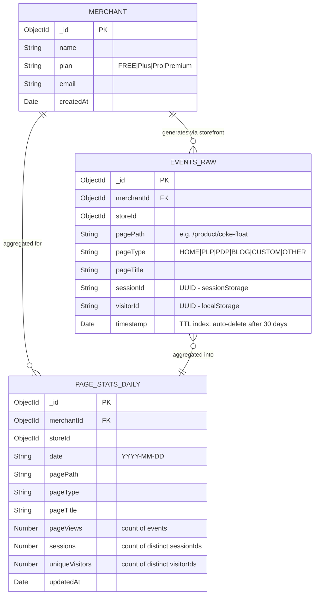
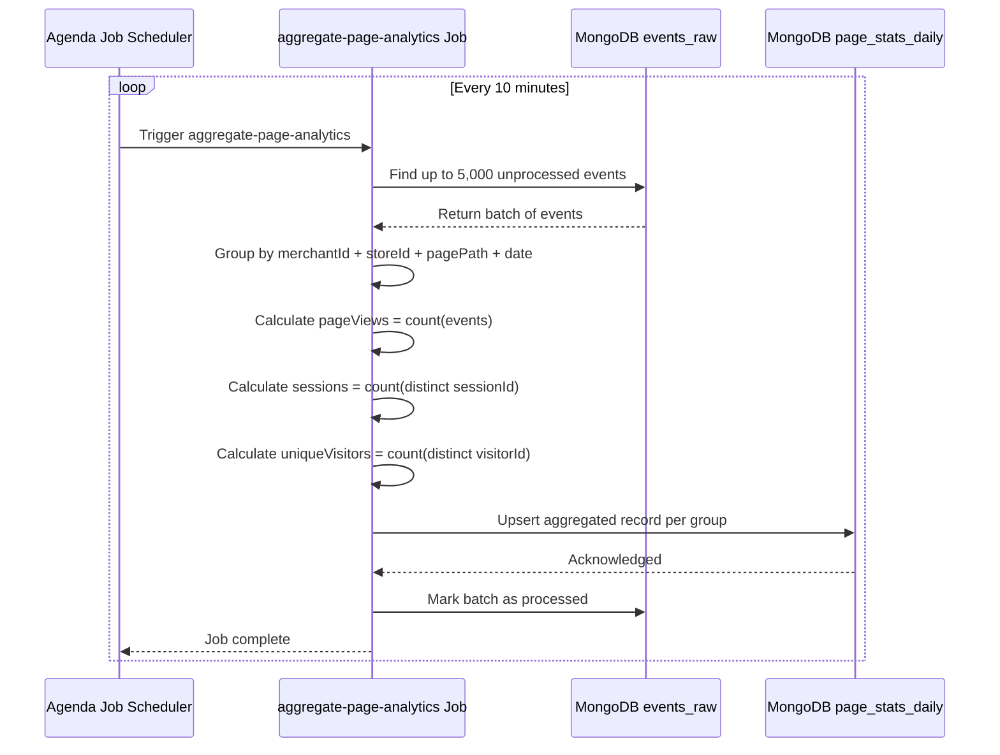
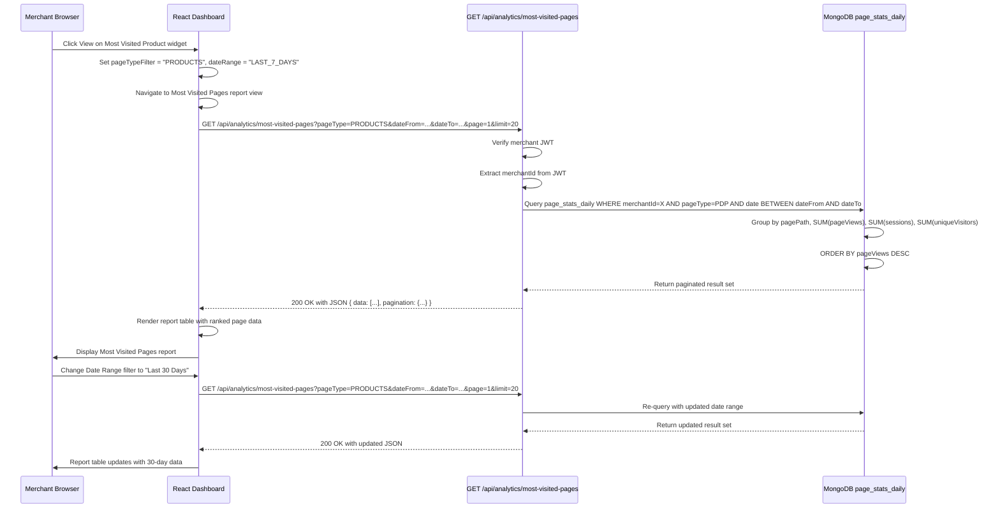

Agile-focused PRD documenting the implementation of the Standard Reports | Most Visited Pages feature for Prosperna's Merchant Dashboard, enabling merchants to identify which storefront pages attract the most visitors and correlate traffic performance with AI-generated content tools.

**Demo Recording:**
[Most Visited Pages POC Demo](https://p1-ba-pocs.vercel.app/most-visited-pages)

## Document Control

| Item           | Details                                   |
| -------------- | ----------------------------------------- |
| Document Title | Standard Reports \| Most Visited Pages    |
| Version        | 1.0                                       |
| Date           | February 19, 2026                         |
| Prepared by    | Business Analyst                          |
| Reviewed by    | To be assigned                            |
| Approved by    | To be assigned                            |
| Status         | For Review                                |
| Related BRD    | To be created                             |

---

## Revision History

| Version | Date         | Author           | Change Description                                                                 |
| ------- | ------------ | ---------------- | ---------------------------------------------------------------------------------- |
| 1.0     | Feb 19, 2026 | Business Analyst | Initial draft – Most Visited Pages report specification with full tracking system  |

---

## 1. Introduction

### 1.1 Document Purpose

This PRD defines the detailed functional requirements, acceptance criteria (using BDD/Gherkin), and technical specifications for implementing the **Standard Reports | Most Visited Pages** feature in Prosperna's Merchant Dashboard and Online Store Website (storefront). The feature introduces a client-side page view tracking script on the storefront, a backend data pipeline for processing and aggregating traffic events, and a report UI in the Merchant Dashboard that surfaces ranked page traffic data across three key metrics: Page Views, Sessions, and Unique Visitors.

The feature also enhances the existing Dashboard "Most Visited Product" and "Most Visited Blog" widgets with view counts and "View" buttons that serve as the primary entry points to the full Most Visited Pages report.

### 1.2 Feature Vision

Empower Prosperna merchants to measure and validate the real-world effectiveness of their AI-powered content tools — the AI Blog Writer, Product Description Generator, and SEO Meta Tags Generator — by providing concrete, data-driven visibility into which storefront pages attract the most customer traffic. Merchants will be able to see exactly which AI-generated blog posts, product pages, and custom content are driving organic visitors to their stores, enabling them to make informed decisions about where to invest further AI-assisted content creation effort. This foundational analytics capability positions Prosperna as a platform that not only generates content but proves the business value of that content.

### 1.3 Success Criteria

**User Adoption & Usage:**
- 60% of active merchants view the Most Visited Pages report at least once within 30 days of feature launch
- Merchants who use the AI Blog Writer access the report 2× more frequently than merchants who do not
- Average of at least 2 report sessions per merchant per week among adopting merchants
- 80% of merchants who access the report also interact with the Page Type or Date Range filter at least once

**Technical Performance:**
- Report page (Most Visited Pages) loads and renders in less than 2 seconds with 1,000+ tracked pages in the database
- Tracking script fires a page view event within 300ms of page load without blocking page render
- `POST /track/page-view` endpoint responds in less than 50ms at p95
- `GET /api/analytics/most-visited-pages` endpoint responds in less than 200ms at p95
- Aggregation job completes within 30 seconds for a merchant with up to 10,000 daily events
- Tracking script bundle size is less than 5KB gzipped

**Business Impact:**
- 20% increase in AI tool usage (AI Blog Writer, Product Description Generator) within 60 days of feature launch, attributable to merchants seeing traffic data correlated with AI content
- Reduction in "is my AI content working?" support inquiries from merchants
- Feature serves as a key differentiator in Prosperna's AI-powered content value proposition during merchant acquisition

### 1.4 Related Documents

- [Most Visited Pages POC (ReactJS)](https://p1-ba-pocs.vercel.app/most-visited-pages)

---

## 2. Background & Context

### 2.1 Problem Statement

**Current Pain Point:**

Prosperna currently offers merchants a suite of AI-powered content tools designed to drive organic traffic to their online stores:

1. **AI Blog Writer** — Generates SEO-optimized blog posts to attract search engine visitors
2. **Product Description Generator** — Creates compelling product descriptions with SEO-friendly keywords
3. **SEO Meta Tags Generator** — Produces page titles and meta descriptions to improve search ranking

While merchants can use these tools to generate content, there is currently no mechanism for them to measure whether these tools are actually working. The current state of analytics in the Merchant Dashboard is limited to:

- A Dashboard widget showing a "Most Visited Product" with no view count
- A Dashboard widget showing a "Most Visited Blog" with a URL overflow bug (the blog URL overflows its container and breaks the widget layout)
- No page-level traffic breakdown, no session data, no unique visitor counts
- No way to correlate AI content creation activity with traffic improvements

This creates a critical credibility gap: merchants are encouraged to invest time using AI tools, but receive no feedback on the return from that investment. Without traffic data, merchants cannot answer basic questions such as which blog post brought the most visitors, whether AI-generated product pages outperform manual ones, or whether their content strategy is working at all.

**Impact of Current Limitations:**
- **AI Tool Adoption Stagnation:** Merchants who cannot see results from AI tools are unlikely to continue using them, reducing engagement with a core Prosperna value proposition
- **Merchant Churn Risk:** Merchants who perceive AI tools as unproven are more likely to seek alternative platforms that provide analytics validation
- **Layout Bug:** The URL overflow issue in the "Most Visited Blog" widget creates a visually broken dashboard experience that reduces merchant trust in the platform
- **Missed Upsell Opportunity:** Merchants who see clear evidence that AI content drives traffic are more likely to upgrade subscription tiers for access to more AI-generated content

### 2.2 Current State

**Current Dashboard Widget Behavior:**

1. **Most Visited Product Widget:**
   - Displays the product name and a product image placeholder
   - No view count or traffic metric is shown
   - No "View" button or way to drill down for more detail
   - Data source and time range are unknown to the merchant

2. **Most Visited Blog Widget:**
   - Displays the blog post title and URL
   - The blog URL text overflows its container on long URLs, breaking the widget layout (confirmed bug)
   - No view count or traffic metric is shown
   - No "View" button for further exploration

3. **Dashboard Analytics Overview:**
   - Existing KPI cards for Sales, Orders, and Unfulfilled Orders
   - Charts for Daily Gross Sales, Total Sales, Top Selling Products, Website Visitors, Total Users, New Users
   - No page-level granularity — existing "Website Visitors" chart shows aggregate storefront traffic only

**Current Limitations:**
- No page view tracking system exists on the storefront
- No `events_raw` or `page_stats_daily` collections exist
- No analytics API endpoint for page-level data
- No way to filter traffic by page type or date range at the page level
- URL overflow bug in Most Visited Blog widget remains unresolved

### 2.3 Desired Future State

**Most Visited Pages Report with Full Tracking Pipeline:**

1. **Storefront Tracking Script:**
   - Lightweight JavaScript tracking script injected on every storefront page
   - Captures page path, page type, page title, session ID, and visitor ID on every page load
   - Sends event data asynchronously to the backend without blocking customer experience

2. **Backend Data Pipeline:**
   - `POST /track/page-view` endpoint ingests raw events into the `events_raw` collection (MongoDB)
   - 30-day TTL on raw events for automatic data hygiene
   - Agenda background job aggregates raw events into `page_stats_daily` every 10 minutes
   - Aggregation calculates page views, distinct sessions, and distinct unique visitors per page per day

3. **Enhanced Dashboard Widgets:**
   - Most Visited Product widget displays the top product page with view count and date context (e.g., "832 views (Last 7 days)")
   - Most Visited Blog widget displays the top blog page with view count, and the URL overflow bug is fixed via `text-truncate`
   - Both widgets gain a "View" button in their header that navigates to the Most Visited Pages report pre-filtered by page type

4. **Most Visited Pages Report:**
   - Full-page report view accessible exclusively via widget "View" buttons (no sidebar navigation item)
   - Data table with 6 columns: Rank, Page Title, Page Path, Page Views, Sessions, Unique Visitors
   - Page Type filter: All, Products, Blogs, Custom Pages, Store Pages
   - Date Range filter: All, Today, Yesterday, Last 7 Days (default), Last 30 Days, Current Year, Custom date picker
   - Pagination at 20 rows per page
   - Tooltips on Sessions and Unique Visitors column headers with plain-language definitions
   - Empty state with helpful messaging when no data exists

**Benefits After Implementation:**
- **AI Validation:** Merchants can see exactly which AI-generated blog posts and product pages are driving traffic, closing the feedback loop on AI tool effectiveness
- **Actionable Insights:** Traffic data ranked by page views enables merchants to identify top performers and replicate their success with other content
- **Bug Fix:** The URL overflow issue in the Most Visited Blog widget is resolved
- **Data-Driven Content Strategy:** Merchants can use date range filtering to measure the impact of content campaigns and seasonal promotions on traffic
- **Foundation for Future Analytics:** The `page_stats_daily` collection and API architecture support future analytics additions (charts, bounce rate, session duration, etc.) without schema changes

### 2.4 Target Users

| User Segment | Description | Use Case | Frequency |
| ------------ | ----------- | -------- | --------- |
| AI Content Creators | Merchants who actively use the AI Blog Writer and Product Description Generator | Validate that AI-generated content drives organic traffic; identify which posts/pages perform best | Weekly |
| SEO-Focused Merchants | Merchants using SEO Meta Tags Generator who want to track search visibility | Monitor organic traffic growth to SEO-optimized pages over time | Weekly to bi-weekly |
| General Merchants | Merchants who want basic store analytics without deep technical knowledge | Understand which products and pages customers visit most; inform restocking and content decisions | Weekly |
| New Merchants | Recently onboarded merchants with growing stores | Discover which pages are attracting first visitors; understand customer interest patterns | Multiple times per week initially |
| Multi-Location Merchants | Merchants operating more than one store location | Track traffic across all store locations (aggregated) | Weekly |

### 2.5 Project Constraints & Assumptions

**Technical Constraints:**
- The tracking script must not block storefront page rendering (asynchronous, fire-and-forget)
- The tracking script bundle size must be less than 5KB gzipped to minimize performance impact
- Data is collected at the `storeId` level to support future per-location filtering
- The `events_raw` collection uses a 30-day TTL to manage MongoDB storage costs
- Aggregation queries must complete within 30 seconds even for high-volume merchants (10,000+ daily events)
- Multi-tenant isolation must be enforced at every layer: tracking, API, and database query
- The report must be responsive and functional on screens as narrow as 375px

**Business Constraints:**
- The report is accessed exclusively via Dashboard widget "View" buttons — no sidebar navigation item is added in this phase
- Charts, visualizations, and advanced metrics (bounce rate, avg. time on page, exit rate) are deferred to future phases
- No CSV or PDF export functionality in this phase
- No per-location traffic filtering in this phase (data is aggregated across all store locations)
- No AI content correlation badge or side-by-side AI vs. manual content comparison in this phase

**Key Assumptions:**
- Merchants understand basic web analytics terminology (page views, sessions) and can be supported by the tooltip definitions for less familiar terms (unique visitors)
- All storefront pages can be instrumented via client-side JavaScript in the Next.js framework
- A 30-day raw event retention window is sufficient for the aggregation job to process all events before they expire
- The 10-minute aggregation lag is acceptable for a reporting use case (near-real-time, not real-time)
- Merchant storefront customers are aware their browsing data is tracked as anonymous analytics (no PII is collected)
- The `visitorId` and `sessionId` stored in localStorage and sessionStorage are anonymous UUIDs; no user account or personal data is associated

---

# 3. Functional Requirements & BDD Scenarios

## Feature F-01: Dashboard Widget Enhancements (Most Visited Product & Most Visited Blog)

### 3.1.1 Feature Context

Enhance the existing Dashboard widgets "Most Visited Product" and "Most Visited Blog" to display page view counts and provide a "View" button that navigates merchants to the Most Visited Pages report pre-filtered by the relevant page type. This is the primary (and only) entry point to the report.

### 3.1.2 Business Rules

**BR-01: Widget Data Source**
- Most Visited Product widget displays the product page (pageType = "PDP") with the highest page views within the active date context (default: Last 7 Days)
- Most Visited Blog widget displays the blog page (pageType = "BLOG") with the highest page views within the active date context (default: Last 7 Days)
- Data is retrieved from the `page_stats_daily` aggregated collection, summing `pageViews` across the relevant date range
- If multiple pages are tied for the highest page views, the system displays the first one returned by the query (sorted by pageViews descending, then by pagePath ascending as tiebreaker)

**BR-02: Widget Content Display**
- Each widget displays:
  - Widget title ("MOST VISITED PRODUCT" or "MOST VISITED BLOG")
  - Product/Blog image or placeholder icon (80×80px area)
  - Page title (the product name or blog post title)
  - Page view count with date context label (e.g., "832 views (Last 7 days)")
  - Page path URL (truncated with ellipsis if it exceeds the available display width, full path shown on hover via tooltip)
  - "View" button in the widget header area
- The two widgets are displayed side by side in a 50/50 layout on the Dashboard

**BR-03: Widget "View" Button Behavior**
- Clicking "View" on the Most Visited Product widget navigates to the Most Visited Pages report with the Page Type filter pre-set to "Products"
- Clicking "View" on the Most Visited Blog widget navigates to the Most Visited Pages report with the Page Type filter pre-set to "Blogs"
- The Date Range filter on the report defaults to "Last 7 Days" upon navigation from either widget

**BR-04: Widget Empty State**
- If no product pages have been visited, the Most Visited Product widget displays "No data available" in place of the product details
- If no blog pages have been visited, the Most Visited Blog widget displays "No data available" in place of the blog details
- The "View" button remains visible and functional even when the widget shows the empty state; clicking it navigates to the report (which will also show an empty state if no data exists for that page type)

**BR-05: Widget Page Path Overflow Handling**
- Page path text is truncated with CSS `text-truncate` (ellipsis) when it exceeds the maximum display width (250px)
- The full page path is available via native browser tooltip on hover (using the `title` attribute)
- This prevents long URLs from breaking the widget layout

### 3.1.3 Scenarios

##### Scenario 1: Most Visited Product widget displays top product page

```gherkin
Given the merchant's store has the following product page visits in the last 7 days:
  | Page Title                 | Page Path                              | Page Views |
  | Jumbo Double Cheeseburger  | /product/jumbo-double-cheeseburger     | 832        |
  | Super Onion Rings          | /product/super-onion-rings             | 445        |
  | The Milk Shake             | /product/the-milk-shake                | 287        |
When the merchant views the Dashboard
Then the "Most Visited Product" widget displays "Jumbo Double Cheeseburger" as the page title
And displays "832 views (Last 7 days)" as the view count
And displays "/product/jumbo-double-cheeseburger" as the page path
And the "View" button is visible in the widget header
```

##### Scenario 2: View button on Most Visited Product navigates to pre-filtered report

```gherkin
Given the merchant is viewing the Dashboard
And the "Most Visited Product" widget is displayed
When the merchant clicks the "View" button on the Most Visited Product widget
Then the merchant is navigated to the Most Visited Pages report view
And the Page Type filter is pre-set to "Products"
And the Date Range filter is set to "Last 7 Days"
And the report table displays only product pages (pageType = PDP)
```

##### Scenario 3: View button on Most Visited Blog navigates to pre-filtered report

```gherkin
Given the merchant is viewing the Dashboard
And the "Most Visited Blog" widget is displayed
When the merchant clicks the "View" button on the Most Visited Blog widget
Then the merchant is navigated to the Most Visited Pages report view
And the Page Type filter is pre-set to "Blogs"
And the Date Range filter is set to "Last 7 Days"
And the report table displays only blog pages (pageType = BLOG)
```

##### Scenario 4: Widget shows empty state when no data exists

```gherkin
Given the merchant's store has no product page visits recorded
When the merchant views the Dashboard
Then the "Most Visited Product" widget displays "No data available" in the content area
And no page title, view count, or page path is displayed
And the "View" button remains visible and enabled
When the merchant clicks the "View" button
Then the merchant is navigated to the Most Visited Pages report
And the Page Type filter is pre-set to "Products"
And the report table displays the empty state: "No Data Available" with message "No pages found matching the selected filters."
```

##### Scenario 5: Widget page path truncation on long URLs

```gherkin
Given the top visited product page has:
  | Page Title             | Page Path                                                            |
  | Premium Wireless Headphones | /product/premium-wireless-noise-cancelling-bluetooth-headphones  |
When the merchant views the Dashboard
Then the page path text in the widget is truncated with ellipsis when it exceeds the display width
And hovering over the truncated text reveals the full page path via tooltip
```

---

## Feature F-02: Most Visited Pages Report - Access & Navigation

### 3.2.1 Feature Context

Provide merchants access to the Most Visited Pages report exclusively through the Dashboard widget "View" buttons. The report is a separate view (not a sidebar navigation item) with its own header, back navigation, and an informational tooltip describing its purpose.

### 3.2.2 Business Rules

**BR-06: Report Access - No Sidebar Navigation**
- The Most Visited Pages report is NOT accessible from the sidebar navigation menu
- The only way to access the report is via the "View" buttons on the Most Visited Product or Most Visited Blog dashboard widgets
- Direct URL access to the report is technically possible but no sidebar link or menu item points to it

**BR-07: Report Header & Back Navigation**
- The report view displays a header with:
  - A back arrow button (←) that returns the merchant to the Dashboard view
  - The title "Most Visited Pages"
  - An informational tooltip icon (?) next to the title
- Clicking the back arrow resets all report filters to their defaults (Page Type = "ALL", Date Range = "Last 7 Days") and returns to the Dashboard view

**BR-08: Report Informational Tooltip**
- Hovering over the (?) icon next to the report title displays a tooltip with the text: "See which pages attract the most visitors to your store. Use this data to identify your best-performing content."
- The tooltip appears on mouse enter and disappears on mouse leave

### 3.2.3 Scenarios

##### Scenario 1: Merchant navigates back to Dashboard from report

```gherkin
Given the merchant is viewing the Most Visited Pages report
And the Page Type filter is currently set to "Products"
And the Date Range filter is set to "Last 30 Days"
When the merchant clicks the back arrow (←) button
Then the merchant is returned to the Dashboard view
And the report filters are reset (Page Type returns to "ALL", Date Range returns to "Last 7 Days")
And the Dashboard widgets are displayed normally
```

##### Scenario 2: Report is not accessible from sidebar navigation

```gherkin
Given the merchant is logged into the Merchant Dashboard
When the merchant views the sidebar navigation menu
Then there is no "Most Visited Pages" or "Analytics" navigation item in the sidebar
And the report can only be reached via the Dashboard widget "View" buttons
```

---

## Feature F-03: Most Visited Pages Report - Data Table

### 3.3.1 Feature Context

Display a tabular report of all tracked storefront pages ranked by page views in descending order, showing key traffic metrics (Page Views, Sessions, Unique Visitors) to help merchants identify their best-performing content.

### 3.3.2 Business Rules

**BR-09: Report Table Columns**
- The report table displays the following columns:
  | Column          | Width | Alignment | Description                                                        |
  |-----------------|-------|-----------|--------------------------------------------------------------------|
  | # (Rank)        | 60px  | Center    | Sequential rank based on current page position in pagination       |
  | Page Title      | 25%   | Left      | The title of the storefront page (truncated with ellipsis at 250px max-width, full title on hover) |
  | Page Path       | 30%   | Left      | The URL path of the page displayed as `code` format (truncated with ellipsis at 300px max-width, full path on hover) |
  | Page Views      | 15%   | Right     | Total number of page view events within the selected date range    |
  | Sessions        | 15%   | Right     | Total number of distinct sessions that viewed this page within the date range |
  | Unique Visitors | 15%   | Right     | Total number of distinct visitors (by browser/device) that viewed this page within the date range |

**BR-10: Default Sort Order**
- The report is sorted by Page Views in descending order (highest views first)
- The rank (#) column reflects the position after sorting and respects pagination (e.g., page 2 starts at rank 21)
- No user-initiated re-sorting is available in this phase

**BR-11: Metric Definitions**
- **Page Views:** The total count of page view events. Each time a page is loaded, it counts as one page view. A single visitor viewing the same page 5 times generates 5 page views.
- **Sessions:** The number of distinct browsing sessions during which this page was viewed. A session is defined as a period of continuous activity that ends after 30 minutes of inactivity. If a visitor views a page in 2 different sessions, it counts as 2 sessions for that page.
- **Unique Visitors:** The number of different browsers/devices that viewed this page. A visitor is considered unique per browser/device combination. If the same person visits from both their phone and laptop, that counts as 2 unique visitors.

**BR-12: Metric Tooltips**
- The "Sessions" column header includes an info icon (ⓘ) that on hover displays: "A session is a visit to your site. It ends after 30 minutes of inactivity."
- The "Unique Visitors" column header includes an info icon (ⓘ) that on hover displays: "The number of different browsers that visited this page. A visitor is considered unique when they connect from a different browser or device."

**BR-13: Number Formatting**
- All numeric metrics (Page Views, Sessions, Unique Visitors) are formatted with locale-specific thousand separators (e.g., "1,245" instead of "1245")

**BR-14: Empty State**
- When no pages match the selected filters (or no data exists at all), the table body displays a centered empty state with:
  - A chart emoji icon (📊)
  - Title: "No Data Available"
  - Description: "No pages found matching the selected filters."
- The table header row remains visible above the empty state

### 3.3.3 Scenarios

##### Scenario 1: Report displays pages ranked by page views descending

```gherkin
Given the merchant's store has the following page visit data for the selected date range:
  | Page Title                 | Page Path                          | Page Views | Sessions | Unique Visitors |
  | Home Page                  | /                                  | 1,245      | 487      | 362             |
  | Jumbo Double Cheeseburger  | /product/jumbo-double-cheeseburger | 832        | 412      | 298             |
  | 10 Tips for Selling Online | /blog/10-tips-for-selling-online   | 687        | 289      | 234             |
When the merchant views the Most Visited Pages report with Page Type = "All" and Date Range = "Last 7 Days"
Then the table displays 3 rows
And the rows are ordered by Page Views descending:
  | # | Page Title                 | Page Views |
  | 1 | Home Page                  | 1,245      |
  | 2 | Jumbo Double Cheeseburger  | 832        |
  | 3 | 10 Tips for Selling Online | 687        |
And each row displays the corresponding Sessions and Unique Visitors values
```

##### Scenario 2: Report displays empty state when no data matches filters

```gherkin
Given the merchant's store has no blog pages that have been visited
When the merchant views the Most Visited Pages report with Page Type filter set to "Blogs"
Then the table header row is displayed with all column headers
And the table body displays the empty state:
  | Element     | Content                                       |
  | Icon        | 📊                                             |
  | Title       | No Data Available                              |
  | Description | No pages found matching the selected filters.  |
And the empty state spans across all 6 columns
```

##### Scenario 3: Rank numbering respects pagination

```gherkin
Given the merchant's store has 25 tracked pages
And the report is showing 20 rows per page
When the merchant is on page 1 of the report
Then the rank column shows numbers 1 through 20
When the merchant navigates to page 2
Then the rank column shows numbers 21 through 25
And the ranking is continuous across pages
```

##### Scenario 4: Numeric values formatted with thousand separators

```gherkin
Given a page has 1245 page views, 487 sessions, and 362 unique visitors
When the merchant views this page in the report
Then the Page Views column displays "1,245"
And the Sessions column displays "487"
And the Unique Visitors column displays "362"
```

---

## Feature F-04: Page Type Filter

### 3.4.1 Feature Context

Allow merchants to filter the Most Visited Pages report by page type to focus on specific categories of storefront content (products, blogs, custom pages, or standard store pages).

### 3.4.2 Business Rules

**BR-15: Page Type Filter Options**
- The Page Type filter is a dropdown (`<select>`) with the following options:
  | Option        | Mapped Page Types         | Description                                          |
  |---------------|---------------------------|------------------------------------------------------|
  | All           | All types                 | Shows all tracked pages regardless of type (default) |
  | Products      | PDP                       | Product Detail Pages                                 |
  | Blogs         | BLOG                      | Blog post pages                                      |
  | Custom Pages  | CUSTOM                    | Pages created via Page Builder (e.g., About Us, FAQs, Contact Us) |
  | Store Pages   | HOME, PLP                 | Standard ecommerce pages (Home Page, Product Listing Page) |

**BR-16: Page Type Classification Rules**
- Pages are classified by their `pageType` value, which is determined by the frontend tracking script based on the URL path pattern:
  | URL Path Pattern              | pageType | Filter Category |
  |-------------------------------|----------|-----------------|
  | `/`                           | HOME     | Store Pages     |
  | `/products`                   | PLP      | Store Pages     |
  | `/product/{slug}`             | PDP      | Products        |
  | `/blog/{slug}`                | BLOG     | Blogs           |
  | `/pages/{slug}`               | CUSTOM   | Custom Pages    |

**BR-17: Filter Interaction with Pagination**
- Changing the Page Type filter resets the pagination to page 1
- The filtered result set determines the total page count for pagination
- The "Showing X-Y of Z pages" indicator updates to reflect the filtered count

**BR-18: Pre-Filtering from Dashboard Widgets**
- When navigating from the Most Visited Product widget "View" button, the Page Type filter is pre-set to "Products"
- When navigating from the Most Visited Blog widget "View" button, the Page Type filter is pre-set to "Blogs"
- The merchant can change the filter after navigation

### 3.4.3 Scenarios

##### Scenario 1: Merchant filters by Products

```gherkin
Given the merchant is viewing the Most Visited Pages report with Page Type = "All"
And the report shows pages of all types (HOME, PDP, BLOG, CUSTOM, PLP)
When the merchant changes the Page Type filter to "Products"
Then the report table displays only pages with pageType = "PDP"
And pages with pageType HOME, BLOG, CUSTOM, PLP are hidden
And the pagination resets to page 1
And the "Showing X-Y of Z pages" indicator reflects only product pages
```

##### Scenario 2: Merchant filters by Store Pages

```gherkin
Given the merchant is viewing the Most Visited Pages report
When the merchant changes the Page Type filter to "Store Pages"
Then the report table displays only pages with pageType = "HOME" or "PLP"
And product, blog, and custom pages are hidden
```

##### Scenario 3: Merchant changes filter from pre-set value

```gherkin
Given the merchant navigated from the Most Visited Product widget
And the Page Type filter is pre-set to "Products"
And the report is showing only product pages
When the merchant changes the Page Type filter to "All"
Then the report table displays pages of all types
And the pagination resets to page 1
```

##### Scenario 4: Filter change resets pagination to page 1

```gherkin
Given the merchant is on page 2 of the report with Page Type = "All"
When the merchant changes the Page Type filter to "Blogs"
Then the pagination resets to page 1
And the report displays the first page of blog results
```

##### Scenario 5: Filter returns empty result set

```gherkin
Given the merchant's store has no custom pages that have been visited
When the merchant sets the Page Type filter to "Custom Pages"
Then the report displays the empty state
And the "Showing" indicator is not displayed (or shows 0 results)
```

---

## Feature F-05: Date Range Filter

### 3.5.1 Feature Context

Allow merchants to filter the Most Visited Pages report by date range to analyze traffic patterns over different time periods. The date filter options match Prosperna's Standard Reports pattern for consistency and component reuse.

### 3.5.2 Business Rules

**BR-19: Date Range Filter Options**
- The Date Range filter is a dropdown (`<select>`) with the following options:
  | Option       | Behavior                                                                 |
  |--------------|--------------------------------------------------------------------------|
  | All          | Shows all-time data (no date restriction)                                |
  | Today        | Shows data for the current calendar day only                             |
  | Yesterday    | Shows data for the previous calendar day only                            |
  | Last 7 Days  | Shows data for the past 7 days including today (DEFAULT on report load)  |
  | Last 30 Days | Shows data for the past 30 days including today                          |
  | Current Year | Shows data from January 1 of the current year through today              |
  | Custom       | Shows FROM and TO date picker fields for a custom date range             |

**BR-20: Default Date Range**
- When the report is loaded (via widget "View" button), the Date Range filter defaults to "Last 7 Days"
- This default applies regardless of which widget was used to navigate to the report

**BR-21: Custom Date Range Behavior**
- When the merchant selects "Custom" from the Date Range dropdown:
  - Two date input fields appear: "FROM" and "TO"
  - Both fields use the native HTML date picker (`<input type="date">`)
  - The FROM date must be earlier than or equal to the TO date
  - Both fields are required when Custom is selected
  - Selecting a different date range option hides the custom date fields

**BR-22: Date Range Filter Interaction with Pagination**
- Changing the Date Range filter resets pagination to page 1
- The date-filtered result set determines the total page count

**BR-23: Date Range and Page Type Filter Independence**
- Both filters operate independently and can be combined
- The report displays data matching BOTH the selected Page Type AND the selected Date Range
- Example: Page Type = "Blogs" + Date Range = "Last 30 Days" shows only blog pages visited in the last 30 days

**BR-24: Date Range Query Mechanism**
- The `page_stats_daily` collection stores pre-aggregated metrics per page per day
- Date range queries sum metrics (`pageViews`, `sessions`, `uniqueVisitors`) across all matching daily records within the selected range
- For "All" option, the query has no date restriction and sums across all available daily records

### 3.5.3 Scenarios

##### Scenario 1: Report loads with Last 7 Days as default

```gherkin
Given the merchant clicked "View" on the Most Visited Product widget
When the Most Visited Pages report loads
Then the Date Range filter displays "Last 7 Days" as the selected option
And the report data reflects page views from the past 7 days including today
```

##### Scenario 2: Merchant changes date range to Last 30 Days

```gherkin
Given the merchant is viewing the report with Date Range = "Last 7 Days"
When the merchant changes the Date Range filter to "Last 30 Days"
Then the report data updates to reflect page views from the past 30 days
And the page view, session, and unique visitor counts may increase (larger window)
And the pagination resets to page 1
```

##### Scenario 3: Merchant selects Custom date range

```gherkin
Given the merchant is viewing the report with Date Range = "Last 7 Days"
When the merchant changes the Date Range filter to "Custom"
Then two date input fields appear below the filter dropdowns: "FROM" and "TO"
And both fields are empty and ready for input
And the report data does not change until the merchant selects dates
```

##### Scenario 4: Merchant enters valid custom date range

```gherkin
Given the merchant has selected "Custom" from the Date Range dropdown
And the FROM and TO date fields are displayed
When the merchant selects "2026-01-01" as the FROM date
And selects "2026-01-31" as the TO date
Then the report data updates to show page views from January 1 to January 31, 2026
And the pagination resets to page 1
```

##### Scenario 5: Custom date fields hidden when switching to preset range

```gherkin
Given the merchant has "Custom" selected with FROM and TO date fields visible
And has entered dates in both fields
When the merchant changes the Date Range filter to "Today"
Then the custom date fields (FROM and TO) are hidden
And the report data updates to show only today's page views
```

##### Scenario 6: Combining Page Type and Date Range filters

```gherkin
Given the merchant sets the Page Type filter to "Blogs"
And sets the Date Range filter to "Last 30 Days"
Then the report displays only blog pages (pageType = BLOG) with data from the last 30 days
And pages of other types are excluded
And the metrics reflect only the last 30 days of activity for those blog pages
```

##### Scenario 7: Date Range "All" shows all-time data

```gherkin
Given the merchant's store has been tracking page views for 60 days
When the merchant sets the Date Range filter to "All"
Then the report displays page view data aggregated across all 60 days
And the metrics are the sum of all daily records without a date cutoff
```

---

## Feature F-06: Pagination

### 3.6.1 Feature Context

Paginate the Most Visited Pages report at 20 rows per page to maintain performance and readability, with navigation controls and a result count indicator.

### 3.6.2 Business Rules

**BR-25: Rows Per Page**
- The report displays a maximum of 20 rows per page
- This value is fixed and not configurable by the merchant in this phase

**BR-26: Pagination Controls**
- Pagination controls are displayed below the table when there are results
- Controls include:
  - Previous page button (← chevron) — disabled on first page
  - Page number buttons (1, 2, 3, etc.) — active page is highlighted
  - Next page button (→ chevron) — disabled on last page

**BR-27: Result Count Indicator**
- A text indicator displays: "Showing `{start}`-`{end}` of `{total}` pages"
- Example: "Showing 1-20 of 45 pages" on page 1, "Showing 21-40 of 45 pages" on page 2
- The indicator is positioned to the left of the pagination controls

**BR-28: Pagination Visibility**
- Pagination controls and the result count indicator are displayed only when there are results (filteredPages.length `>` 0)
- When the empty state is shown, no pagination controls appear

**BR-29: Filter Reset on Pagination**
- Changing the Page Type or Date Range filter resets pagination to page 1
- The merchant's current page is not preserved when filters change

### 3.6.3 Scenarios

##### Scenario 1: Report with fewer than 20 results shows single page

```gherkin
Given the filtered report results contain 15 pages
When the merchant views the report
Then all 15 rows are displayed on page 1
And the result count shows "Showing 1-15 of 15 pages"
And the pagination controls show only page 1
And both the previous and next buttons are disabled
```

##### Scenario 2: Merchant navigates to next page

```gherkin
Given the filtered report results contain 35 pages
And the merchant is on page 1 showing rows 1-20
When the merchant clicks the next page button (→)
Then the report displays rows 21-35
And the result count updates to "Showing 21-35 of 35 pages"
And page 2 is highlighted in the pagination controls
And the rank column starts at 21
```

##### Scenario 3: Previous page button disabled on first page

```gherkin
Given the merchant is on page 1 of the report
Then the previous page button (←) is disabled
And clicking it has no effect
And the next page button (→) is enabled (if more than 1 page exists)
```

##### Scenario 4: Next page button disabled on last page

```gherkin
Given the filtered report results contain 35 pages (2 pages total)
And the merchant is on page 2 (the last page)
Then the next page button (→) is disabled
And clicking it has no effect
And the previous page button (←) is enabled
```

##### Scenario 5: Pagination hidden when empty state is shown

```gherkin
Given the filtered report results contain 0 pages (empty state displayed)
Then no pagination controls are displayed
And no result count indicator is displayed
```

---

## Feature F-07: Frontend Page View Tracking Script

### 3.7.1 Feature Context

Implement a lightweight client-side tracking script on the Next.js storefront that captures page view events for every page load, recording the page path, page type, page title, session identifier, and visitor identifier. This data feeds the Most Visited Pages report and dashboard widgets.

### 3.7.2 Business Rules

**BR-30: Tracking Script Deployment**
- The tracking script runs on every page of the merchant's Next.js storefront (Online Store Website)
- The script is injected globally (e.g., via `_app.js` or a layout component) so it executes on every page navigation including client-side route transitions
- The script must be lightweight and non-blocking to avoid impacting storefront performance

**BR-31: Data Captured Per Page View**
- Each page view event records the following fields:
  | Field       | Source                                    | Description                                             |
  |-------------|-------------------------------------------|---------------------------------------------------------|
  | merchantId  | Store context (from storefront config)    | The ID of the merchant who owns the store               |
  | storeId     | Store context (from storefront config)    | The ID of the specific store location (for multi-store) |
  | pagePath    | `window.location.pathname`                | The URL path of the viewed page (e.g., "/product/milk-shake") |
  | pageType    | Derived from URL path pattern             | The classification of the page (HOME, PDP, PLP, BLOG, CUSTOM) |
  | pageTitle   | `document.title` or page component data   | The human-readable title of the page                    |
  | sessionId   | Generated/retrieved from sessionStorage   | Unique identifier for the browsing session              |
  | visitorId   | Generated/retrieved from localStorage     | Unique identifier for the browser/device                |
  | timestamp   | `new Date().toISOString()`                | The ISO 8601 timestamp of the page view                 |

**BR-32: Page Type Detection Logic**
- The tracking script determines `pageType` based on the URL path:
  | URL Path Pattern              | pageType |
  |-------------------------------|----------|
  | Exactly `/`                   | HOME     |
  | Exactly `/products`           | PLP      |
  | Starts with `/product/`       | PDP      |
  | Starts with `/blog/`          | BLOG     |
  | Starts with `/pages/`         | CUSTOM   |
  | Any other path                | OTHER    |
- Pages classified as "OTHER" are tracked but may not appear prominently in filters (Store Pages covers HOME and PLP only)

**BR-33: Session ID Management**
- A `sessionId` is a UUID generated and stored in `sessionStorage`
- If no `sessionId` exists in `sessionStorage`, a new one is generated on the first page view
- `sessionStorage` naturally clears when the browser tab/window is closed, creating a new session on the next visit
- Additionally, sessions expire after 30 minutes of inactivity:
  - The script stores a `lastActivity` timestamp in `sessionStorage`
  - On each page view, the script checks if more than 30 minutes have passed since `lastActivity`
  - If 30+ minutes have elapsed, a new `sessionId` is generated
  - `lastActivity` is updated on every page view

**BR-34: Visitor ID Management**
- A `visitorId` is a UUID generated and stored in `localStorage`
- If no `visitorId` exists in `localStorage`, a new one is generated on the first page view
- `localStorage` persists across sessions and browser restarts for the same browser/device
- A visitor who clears their browser data or uses a different browser/device will be assigned a new `visitorId` (counted as a new unique visitor)
- No cross-device tracking or user account-based identification is used

**BR-35: Event Submission**
- The tracking script sends a `POST` request to the backend endpoint `POST /track/page-view` with the event data
- The request is fire-and-forget (asynchronous, non-blocking): it does not wait for a response or retry on failure
- Failed tracking requests are silently dropped and do not affect the customer experience
- The script does not batch events; each page view is sent individually

**BR-36: Multi-Store Location Scoping**
- The `storeId` field scopes tracking data to a specific store location
- All queries for the Most Visited Pages report filter by both `merchantId` and `storeId`
- If the merchant has multiple store locations, each store's analytics are tracked independently

### 3.7.3 Scenarios

##### Scenario 1: Page view tracked on storefront page load

```gherkin
Given a customer navigates to the product page "/product/jumbo-double-cheeseburger" on the merchant's storefront
And the page title is "Jumbo Double Cheeseburger"
And the customer has an existing visitorId in localStorage
And the customer has a valid (non-expired) sessionId in sessionStorage
When the page finishes loading
Then the tracking script sends a POST request to /track/page-view with:
  | Field      | Value                               |
  | pagePath   | /product/jumbo-double-cheeseburger  |
  | pageType   | PDP                                 |
  | pageTitle  | Jumbo Double Cheeseburger           |
  | sessionId  | (existing sessionId from storage)   |
  | visitorId  | (existing visitorId from storage)   |
And the request is sent asynchronously without blocking page rendering
```

##### Scenario 2: New session created on first visit

```gherkin
Given a customer visits the merchant's storefront for the first time in this browser tab
And no sessionId exists in sessionStorage
And no visitorId exists in localStorage
When the customer loads any page
Then the tracking script generates a new UUID as sessionId and stores it in sessionStorage
And generates a new UUID as visitorId and stores it in localStorage
And sets the lastActivity timestamp in sessionStorage to the current time
And sends the page view event with the newly generated sessionId and visitorId
```

##### Scenario 3: Session expires after 30 minutes of inactivity

```gherkin
Given a customer visited the storefront and has an existing sessionId
And the lastActivity timestamp in sessionStorage is 35 minutes ago
When the customer navigates to a new page on the storefront
Then the tracking script detects that lastActivity is more than 30 minutes ago
And generates a new sessionId (new session)
And updates lastActivity to the current time
And sends the page view event with the new sessionId
And the visitorId remains unchanged (same browser/device)
```

##### Scenario 4: Same visitor in same session viewing multiple pages

```gherkin
Given a customer is browsing the storefront with an active session
And the customer has visited the Home Page, then "/products", then "/product/super-onion-rings"
And less than 30 minutes have passed between each page view
Then 3 page view events are sent, each with the same sessionId and visitorId
And the page events have different pagePath and pageType values:
  | pagePath                     | pageType |
  | /                            | HOME     |
  | /products                    | PLP      |
  | /product/super-onion-rings   | PDP      |
```

##### Scenario 5: Visitor returns in a new browser tab (new session, same visitor)

```gherkin
Given a customer previously visited the storefront and has a visitorId in localStorage
And the customer closed the previous browser tab (sessionStorage cleared)
When the customer opens a new browser tab and navigates to the storefront
Then a new sessionId is generated (new session)
And the existing visitorId is retrieved from localStorage (same visitor)
And the page view event is sent with the new sessionId and existing visitorId
```

##### Scenario 6: Tracking failure does not affect customer experience

```gherkin
Given a customer navigates to a page on the storefront
And the POST /track/page-view endpoint is unreachable (network error or server down)
When the tracking script attempts to send the page view event
Then the request fails silently
And no error message is displayed to the customer
And the page continues to function normally
And the page view data for this visit is lost (not retried)
```

##### Scenario 7: Page type detection for custom pages

```gherkin
Given the merchant has created a custom page "About Us" via Page Builder
And the page is accessible at "/pages/about-us"
When a customer navigates to "/pages/about-us"
Then the tracking script determines pageType = "CUSTOM"
And the page view event is sent with pageType = "CUSTOM" and pageTitle = "About Us"
And this page will appear in the report when Page Type filter is set to "Custom Pages"
```

---

## Feature F-08: Backend Data Processing (Raw Events & Daily Aggregation)

### 3.8.1 Feature Context

Process raw page view events into aggregated daily statistics using a scheduled background job. Raw events are stored temporarily for processing, while aggregated data is retained long-term for reporting. This two-layer approach balances real-time data collection with efficient query performance for the report.

### 3.8.2 Business Rules

**BR-37: Raw Events Collection (`events_raw`)**
- Each page view event from the tracking script is stored as a document in the `events_raw` MongoDB collection
- Document structure:
  | Field       | Type      | Description                              |
  |-------------|-----------|------------------------------------------|
  | merchantId  | ObjectId  | The merchant's ID                        |
  | storeId     | ObjectId  | The store location's ID                  |
  | pagePath    | String    | URL path of the viewed page              |
  | pageType    | String    | Page classification (HOME, PDP, etc.)    |
  | pageTitle   | String    | Human-readable page title                |
  | sessionId   | String    | UUID of the browsing session             |
  | visitorId   | String    | UUID of the visitor (browser/device)     |
  | timestamp   | Date      | When the page view occurred              |
- A TTL (Time-To-Live) index is set on the `timestamp` field with a 30-day expiration
- Raw events are automatically deleted after 30 days by MongoDB's TTL mechanism

**BR-38: Daily Aggregated Collection (`page_stats_daily`)**
- The `page_stats_daily` collection stores pre-aggregated metrics per page per day per merchant
- Document structure:
  | Field          | Type     | Description                                                      |
  |----------------|----------|------------------------------------------------------------------|
  | merchantId     | ObjectId | The merchant's ID                                                |
  | storeId        | ObjectId | The store location's ID                                          |
  | date           | Date     | The calendar date of the aggregation (midnight UTC)              |
  | pagePath       | String   | URL path of the page                                             |
  | pageType       | String   | Page classification                                              |
  | pageTitle      | String   | Page title (from the most recent event for that page on that day)|
  | pageViews      | Number   | Total count of page view events for this page on this day        |
  | sessions       | Number   | Count of distinct sessionIds for this page on this day           |
  | uniqueVisitors | Number   | Count of distinct visitorIds for this page on this day           |
- No TTL on `page_stats_daily` — this data is retained indefinitely for historical reporting

**BR-39: Aggregation Job Schedule & Batch Processing**
- An Agenda job (or equivalent scheduler) runs every 10 minutes
- Each run processes a batch of up to 5,000 raw events from `events_raw`
- The job groups events by `{merchantId, storeId, pagePath, date}` and calculates:
  - `pageViews` = count of events in the group
  - `sessions` = count of distinct `sessionId` values in the group
  - `uniqueVisitors` = count of distinct `visitorId` values in the group
- Results are upserted into `page_stats_daily` (insert if new, update/increment if existing)
- Processed events are marked as processed or deleted from the batch queue

**BR-40: Data Freshness & Latency**
- Due to the 10-minute aggregation cycle, the report data may be up to 10 minutes behind real-time
- This latency is acceptable for the reporting use case and not surfaced to the merchant
- No "last updated" timestamp is displayed in this phase

**BR-41: Database Indexes**
- Primary compound index on `page_stats_daily`: `{ merchantId: 1, pageType: 1, date: 1, pageViews: -1 }`
- This index supports efficient queries for:
  - Filtering by merchantId (required for multi-tenant isolation)
  - Filtering by pageType (Page Type filter)
  - Filtering by date range (Date Range filter)
  - Sorting by pageViews descending (default sort order)
- Index on `events_raw`: `{ timestamp: 1 }` (for TTL expiration) and `{ merchantId: 1, timestamp: 1 }` (for batch processing queries)

### 3.8.3 Scenarios

##### Scenario 1: Raw event stored on page view

```gherkin
Given the backend receives a POST /track/page-view request with:
  | Field      | Value                              |
  | merchantId | 64a1b2c3d4e5f6a7b8c9d0e1          |
  | storeId    | 64a1b2c3d4e5f6a7b8c9d0e2          |
  | pagePath   | /product/jumbo-double-cheeseburger |
  | pageType   | PDP                                |
  | pageTitle  | Jumbo Double Cheeseburger          |
  | sessionId  | uuid-session-123                   |
  | visitorId  | uuid-visitor-456                   |
  | timestamp  | 2026-02-18T10:30:00.000Z           |
When the event is processed
Then a new document is inserted into the `events_raw` collection with all the above fields
And the TTL index on timestamp will auto-delete this document after 30 days
```

##### Scenario 2: Aggregation job processes raw events into daily stats

```gherkin
Given the `events_raw` collection contains the following events for today:
  | pagePath                         | sessionId | visitorId |
  | /product/jumbo-double-cheeseburger | session-1 | visitor-1 |
  | /product/jumbo-double-cheeseburger | session-1 | visitor-1 |
  | /product/jumbo-double-cheeseburger | session-2 | visitor-2 |
  | /product/jumbo-double-cheeseburger | session-3 | visitor-1 |
And all events are for the same merchantId and storeId
When the aggregation job runs
Then a document is upserted into `page_stats_daily` for this page and today's date with:
  | Field          | Value |
  | pageViews      | 4     |
  | sessions       | 3     |
  | uniqueVisitors | 2     |
And pageViews = 4 (total events)
And sessions = 3 (distinct sessionIds: session-1, session-2, session-3)
And uniqueVisitors = 2 (distinct visitorIds: visitor-1, visitor-2)
```

##### Scenario 3: Aggregation job batches up to 5000 events

```gherkin
Given the `events_raw` collection contains 12,000 unprocessed events
When the aggregation job runs
Then it processes the first 5,000 events in this execution
And the remaining 7,000 events are left for the next execution (in 10 minutes)
And the next execution processes another 5,000 events
And the third execution processes the final 2,000 events
```

##### Scenario 4: Raw events auto-expire after 30 days

```gherkin
Given a raw event was inserted with timestamp = "2026-01-15T10:00:00.000Z"
And today's date is "2026-02-15"
When 30 days have passed since the event's timestamp
Then MongoDB's TTL mechanism automatically deletes the expired event from `events_raw`
And the corresponding aggregated data in `page_stats_daily` remains intact (no TTL)
And the report continues to show the data for January 15 from the daily aggregation
```

##### Scenario 5: Multi-tenant data isolation in aggregation

```gherkin
Given events exist in `events_raw` for Merchant A and Merchant B:
  | merchantId  | pagePath | pageViews |
  | merchant-a  | /        | 500       |
  | merchant-b  | /        | 300       |
When the aggregation job processes these events
Then separate `page_stats_daily` records are created for each merchant
And Merchant A's Home Page shows 500 page views
And Merchant B's Home Page shows 300 page views
And querying the report for Merchant A never returns Merchant B's data
```

---

## Feature F-09: API Endpoints (Tracking & Report Query)

### 3.9.1 Feature Context

Provide two API endpoints: one for receiving page view tracking events from the storefront (public, high-throughput), and one for querying the aggregated report data from the Merchant Dashboard (authenticated, with filtering and pagination).

### 3.9.2 Business Rules

**BR-42: POST /track/page-view (Tracking Endpoint)**
- **Purpose:** Receives individual page view events from the storefront tracking script
- **Authentication:** No merchant dashboard authentication required (public endpoint, called from customer-facing storefront)
- **Security:** Validated by `merchantId` and `storeId` matching a valid store; rate limiting applied per store to prevent abuse
- **Request Body:**
  ```json
  {
    "merchantId": "string (required)",
    "storeId": "string (required)",
    "pagePath": "string (required)",
    "pageType": "string (required, enum: HOME|PDP|PLP|BLOG|CUSTOM|OTHER)",
    "pageTitle": "string (required)",
    "sessionId": "string (required, UUID)",
    "visitorId": "string (required, UUID)",
    "timestamp": "string (required, ISO 8601)"
  }
  ```
- **Response:** `202 Accepted` on success (acknowledges receipt, async processing)
- **Error Handling:** Returns `400 Bad Request` for missing/invalid fields; `429 Too Many Requests` if rate limit exceeded
- **Performance Target:** `<` 50ms response time (lightweight insert)

**BR-43: GET /api/analytics/most-visited-pages (Report Query Endpoint)**
- **Purpose:** Returns paginated, filtered, sorted page traffic data for the Merchant Dashboard report
- **Authentication:** Requires authenticated merchant session; data scoped to the logged-in merchant's `merchantId` and `storeId`
- **Query Parameters:**
  | Parameter  | Type    | Required | Default     | Description                                    |
  |------------|---------|----------|-------------|------------------------------------------------|
  | pageType   | String  | No       | "ALL"       | Filter by page type (ALL, PRODUCTS, BLOGS, CUSTOM, STORE) |
  | dateFrom   | String  | No       | 7 days ago  | Start date (ISO 8601 date, inclusive)          |
  | dateTo     | String  | No       | Today       | End date (ISO 8601 date, inclusive)            |
  | page       | Number  | No       | 1           | Page number for pagination                     |
  | limit      | Number  | No       | 20          | Rows per page                                  |
- **Response Body:**
  ```json
  {
    "data": [
      {
        "pagePath": "/product/jumbo-double-cheeseburger",
        "pageType": "PDP",
        "pageTitle": "Jumbo Double Cheeseburger",
        "pageViews": 832,
        "sessions": 412,
        "uniqueVisitors": 298
      }
    ],
    "pagination": {
      "currentPage": 1,
      "totalPages": 3,
      "totalItems": 45,
      "itemsPerPage": 20
    }
  }
  ```
- **Sort:** Results sorted by `pageViews` descending (fixed, not configurable in this phase)
- **Aggregation Logic:** The API queries `page_stats_daily`, groups by `pagePath`, and sums `pageViews`, `sessions`, and `uniqueVisitors` across the matching date range
- **Performance Target:** `<` 200ms response time with proper indexes

**BR-44: Page Type Query Mapping**
- The `pageType` query parameter maps to database pageType values:
  | API Parameter Value | Database pageType Values |
  |---------------------|--------------------------|
  | ALL                 | No filter (all types)    |
  | PRODUCTS            | PDP                      |
  | BLOGS               | BLOG                     |
  | CUSTOM              | CUSTOM                   |
  | STORE               | HOME, PLP                |

**BR-45: Date Range for Widget API Calls**
- Dashboard widget queries use the same report endpoint with `pageType` filter and date range
- Most Visited Product widget: `pageType=PRODUCTS&limit=1`
- Most Visited Blog widget: `pageType=BLOGS&limit=1`
- Both default to Last 7 Days date range
- When a global dashboard date filter is added in the future, the widgets will pass the selected `dateFrom` and `dateTo` parameters — no architectural changes needed (see BR-46)

**BR-46: Future-Ready Date Range Architecture for Widgets**
- The `page_stats_daily` collection design inherently supports date range queries via its `date` field
- The API endpoints accept `dateFrom` and `dateTo` parameters
- When the Dashboard adds a global date filter in the future:
  - Widget API calls will include the global date filter's `dateFrom`/`dateTo`
  - The backend aggregation query will sum `page_stats_daily` records within the date range
  - No schema changes, no new collections, and no new endpoints are required
  - Performance remains `<100ms` with the existing compound index `{ merchantId: 1, pageType: 1, date: 1, pageViews: -1 }`
  - Optional: Redis caching with 5-minute TTL can be added for common date ranges to reduce database load

### 3.9.3 Scenarios

##### Scenario 1: Tracking endpoint receives valid page view event

```gherkin
Given the storefront tracking script sends a POST request to /track/page-view with all required fields
And the merchantId and storeId match a valid store in the database
When the backend processes the request
Then the event is inserted into the `events_raw` collection
And the endpoint returns HTTP 202 Accepted
And the response time is less than 50ms
```

##### Scenario 2: Tracking endpoint rejects invalid request

```gherkin
Given the storefront tracking script sends a POST request to /track/page-view
And the request body is missing the required "pagePath" field
When the backend processes the request
Then the endpoint returns HTTP 400 Bad Request
And the response body includes an error message indicating the missing field
And no event is stored in `events_raw`
```

##### Scenario 3: Report endpoint returns filtered and paginated data

```gherkin
Given Merchant A has 45 tracked pages with data in the last 7 days
And 12 of those pages are product pages (PDP)
When the Merchant Dashboard calls GET /api/analytics/most-visited-pages?pageType=PRODUCTS&page=1&limit=20
Then the response contains 12 data items (all fitting in one page)
And each item has pageType = "PDP"
And items are sorted by pageViews descending
And the pagination object shows:
  | Field        | Value |
  | currentPage  | 1     |
  | totalPages   | 1     |
  | totalItems   | 12    |
  | itemsPerPage | 20    |
```

##### Scenario 4: Report endpoint respects date range

```gherkin
Given Merchant A has page view data spanning 60 days
And the Home Page had 500 views in the last 7 days and 2000 views total
When the Dashboard calls GET /api/analytics/most-visited-pages?dateFrom=2026-02-11&dateTo=2026-02-18
Then the Home Page entry shows pageViews = 500 (only data within the date range)
And not 2000 (the all-time total)
```

##### Scenario 5: Report endpoint data isolation between merchants

```gherkin
Given Merchant A and Merchant B both have storefront data
And Merchant A is authenticated and requesting the report
When the Dashboard calls GET /api/analytics/most-visited-pages
Then the response contains ONLY Merchant A's page data
And no data from Merchant B is included
And the query filters by the authenticated merchant's merchantId and storeId
```

##### Scenario 6: Widget API call returns top 1 result

```gherkin
Given Merchant A has product pages with the following views in the last 7 days:
  | pageTitle                 | pageViews |
  | Jumbo Double Cheeseburger | 832       |
  | Super Onion Rings         | 445       |
  | The Milk Shake            | 287       |
When the Dashboard widget calls GET /api/analytics/most-visited-pages?pageType=PRODUCTS&limit=1
Then the response contains exactly 1 data item: "Jumbo Double Cheeseburger" with pageViews = 832
```

##### Scenario 7: Rate limiting on tracking endpoint prevents abuse

```gherkin
Given the tracking endpoint has a rate limit of N requests per minute per storeId
And a store has exceeded the rate limit
When the next POST /track/page-view request arrives for that store
Then the endpoint returns HTTP 429 Too Many Requests
And the event is not stored
And the rate limit resets after the configured window
```

---

## 4. Non-Functional Requirements

### 4.1 Performance

| Requirement | Metric | Measurement Method |
| ----------- | ------ | ------------------ |
| Most Visited Pages report page load | Less than 2 seconds end-to-end with 1,000+ tracked pages | Lighthouse performance audit + real user monitoring |
| Tracking script execution | Fires within 300ms of page load; does not block page render | Browser DevTools performance profiling |
| `POST /track/page-view` response time | Less than 50ms at p95 | API response time logging |
| `GET /api/analytics/most-visited-pages` response time | Less than 200ms at p95 with proper database indexes | API response time logging |
| Aggregation job execution | Completes within 30 seconds for 10,000 daily events per merchant | Agenda job execution logs |
| Tracking script bundle size | Less than 5KB gzipped | Webpack bundle analysis |
| Dashboard widget data load | Less than 500ms for widget data fetch | Network tab + API monitoring |

### 4.2 Scalability

| Requirement | Target | Validation Method |
| ----------- | ------ | ----------------- |
| Concurrent merchants tracked | Support 10,000+ merchants with active storefronts simultaneously | Load testing with simulated traffic |
| Events per merchant per day | Support up to 50,000 raw events per merchant per day without performance degradation | Performance testing with synthetic data |
| `events_raw` collection size | Manageable via 30-day TTL; does not grow unboundedly | Storage monitoring |
| `page_stats_daily` query performance | Maintains `<` 200ms response time with 1 year of aggregated data per merchant | Index effectiveness testing |
| Aggregation job concurrency | Processes multiple merchants in parallel without data collision | Job queue concurrency testing |

### 4.3 Reliability

| Requirement | Target | Monitoring |
| ----------- | ------ | ---------- |
| Tracking event capture rate | At most 0.1% event loss due to network or server failures (fire-and-forget design accepts some loss) | Dropped event sampling |
| Aggregation job success rate | Greater than 99% successful job runs | Agenda job success/failure logging |
| API endpoint uptime | 99.9% availability for both tracking and report endpoints | Uptime monitoring |
| Data consistency between raw events and daily stats | 100% accuracy: aggregated metrics correctly reflect raw event counts | Reconciliation testing |
| Tracking failure isolation | Storefront customer experience is never affected by tracking failures | Error boundary and silent failure testing |

### 4.4 Security

| Requirement | Implementation | Validation |
| ----------- | -------------- | ---------- |
| Multi-tenant data isolation | All database queries filter by authenticated `merchantId`; `merchantId` extracted from JWT, never from request params | Integration tests verifying cross-merchant data cannot be accessed |
| Report API authentication | `GET /api/analytics/most-visited-pages` requires valid merchant JWT session | Unauthenticated request returns 401 |
| Tracking endpoint abuse prevention | Rate limiting on `POST /track/page-view` per `storeId` (N requests/minute); returns 429 on excess | Rate limit penetration testing |
| No PII collection | Visitor and session IDs are anonymous UUIDs; no email, name, IP address, or account data is stored | Data audit |
| Input validation on tracking endpoint | All required fields validated; malformed requests return 400 Bad Request without storing data | Input fuzzing tests |
| XSS prevention | Tracking script does not inject or execute untrusted content | Security code review |

### 4.5 Usability

| Requirement | Target | Measurement |
| ----------- | ------ | ----------- |
| Report discoverability | Merchant locates and opens the Most Visited Pages report within 60 seconds of being told it exists | Usability testing (moderated) |
| Filter usability | 90% of test users successfully apply both a Page Type and Date Range filter without assistance | Task completion rate in usability testing |
| Analytics terminology comprehension | Fewer than 10% of test users are unable to explain the difference between "Sessions" and "Unique Visitors" after reading the tooltip | Comprehension questionnaire post-testing |
| Mobile usability | All critical interactions (view report, change filter, paginate) achievable on a 375px-wide screen | Device testing on iPhone SE and Android equivalents |
| Empty state guidance | 80% of merchants who see the empty state understand what action to take next | Usability testing observation |

### 4.6 Compatibility

| Requirement | Standard | Validation |
| ----------- | -------- | ---------- |
| Desktop browser support | Chrome 90+, Firefox 88+, Safari 14+, Edge 90+ | Cross-browser automated testing |
| Mobile browser support | Chrome Mobile, Safari Mobile (iOS 14+), Samsung Internet | Device and browser testing |
| Storefront tracking compatibility | Script functions on Next.js client-side routing (SPA navigation events) | Integration testing with storefront navigation |
| Responsive breakpoints | Dashboard report: ≥ 1024px desktop layout; 768–1023px tablet; `<` 768px card-based mobile layout | Responsive design testing at all breakpoints |
| localStorage / sessionStorage availability | Graceful degradation if storage is unavailable (tracking skipped, no error thrown) | Testing in private/incognito mode and restricted environments |

---

## 5. User Experience & Design

### 5.1 User Flow Diagrams

**Primary Flow: Merchant Accesses Report via Most Visited Product Widget**



**Secondary Flow: Merchant Accesses Report via Most Visited Blog Widget**



**Error/Edge Case Flow: New Merchant with No Traffic Data**



**Background Flow: Page View Tracking & Aggregation Pipeline**



### 5.2 System Architecture Diagram

```
┌──────────────────────────────────────────────────────────────────────────────┐
│                     ONLINE STORE WEBSITE (Next.js Storefront)                │
│                                                                              │
│  ┌──────────────────────────────────────────────────────────────────────┐   │
│  │  Tracking Script (tracking.js — injected globally via _app.js)       │   │
│  │  • Reads / generates visitorId from localStorage                     │   │
│  │  • Reads / generates sessionId from sessionStorage                   │   │
│  │  • Detects pageType from window.location.pathname                    │   │
│  │  • Collects pagePath, pageTitle, merchantId, storeId, timestamp      │   │
│  │  • Fires POST /track/page-view asynchronously (fire-and-forget)      │   │
│  └──────────────────────────────────────────────────────────────────────┘   │
└──────────────────────────────────────────────────────────────────────────────┘
         │ POST /track/page-view (async)
         ▼
┌──────────────────────────────────────────────────────────────────────────────┐
│                      BACKEND API (Node.js + Express)                         │
│                                                                              │
│  ┌──────────────────────────────────────────────────────────────────────┐   │
│  │  Tracking Controller                                                 │   │
│  │  POST /track/page-view                                               │   │
│  │  • Validates required fields and merchantId/storeId                  │   │
│  │  • Applies rate limiting per storeId                                 │   │
│  │  • Inserts event into events_raw collection                          │   │
│  │  • Returns 202 Accepted                                              │   │
│  └──────────────────────────────────────────────────────────────────────┘   │
│                                                                              │
│  ┌──────────────────────────────────────────────────────────────────────┐   │
│  │  Analytics Controller                                                │   │
│  │  GET /api/analytics/most-visited-pages                               │   │
│  │  • Requires authenticated merchant JWT                               │   │
│  │  • Accepts: pageType, dateFrom, dateTo, page, limit                  │   │
│  │  • Queries page_stats_daily with compound index                      │   │
│  │  • Sums metrics across date range, groups by pagePath                │   │
│  │  • Returns paginated, sorted JSON response                           │   │
│  └──────────────────────────────────────────────────────────────────────┘   │
│                                                                              │
│  ┌──────────────────────────────────────────────────────────────────────┐   │
│  │  Agenda Background Job — aggregate-page-analytics                    │   │
│  │  • Runs every 10 minutes                                             │   │
│  │  • Processes up to 5,000 unprocessed raw events per run             │   │
│  │  • Groups by: merchantId, storeId, pagePath, date                   │   │
│  │  • Calculates: pageViews (count), sessions (distinct sessionId),    │   │
│  │    uniqueVisitors (distinct visitorId)                               │   │
│  │  • Upserts results into page_stats_daily                             │   │
│  │  • Marks processed events or removes from queue                      │   │
│  └──────────────────────────────────────────────────────────────────────┘   │
└──────────────────────────────────────────────────────────────────────────────┘
         │                           │
         ▼                           ▼
┌──────────────────────┐   ┌──────────────────────────────────────────────┐
│  MongoDB Collection  │   │  MongoDB Collection                          │
│  events_raw          │   │  page_stats_daily                            │
│                      │   │                                              │
│  • merchantId        │   │  • merchantId                                │
│  • storeId           │   │  • storeId                                   │
│  • pagePath          │   │  • date (YYYY-MM-DD)                         │
│  • pageType          │   │  • pagePath                                  │
│  • pageTitle         │   │  • pageType                                  │
│  • sessionId         │   │  • pageTitle                                 │
│  • visitorId         │   │  • pageViews (Number)                        │
│  • timestamp         │   │  • sessions (Number)                         │
│  [TTL: 30 days]      │   │  • uniqueVisitors (Number)                   │
└──────────────────────┘   │  [No TTL — retained indefinitely]            │
                           └──────────────────────────────────────────────┘
                                             │
                                             │ Queried by Analytics Controller
                                             ▼
┌──────────────────────────────────────────────────────────────────────────────┐
│                    MERCHANT DASHBOARD (React SPA)                            │
│                                                                              │
│  ┌──────────────────────────────────────────────────────────────────────┐   │
│  │  Dashboard View                                                      │   │
│  │  ┌─────────────────────────────┐  ┌──────────────────────────────┐  │   │
│  │  │ Most Visited Product Widget │  │ Most Visited Blog Widget     │  │   │
│  │  │ • Product image/icon        │  │ • Blog icon                  │  │   │
│  │  │ • Product title             │  │ • Blog post title            │  │   │
│  │  │ • "832 views (Last 7 days)" │  │ • "687 views (Last 7 days)"  │  │   │
│  │  │ • Truncated page path       │  │ • Truncated page path (FIXED)│  │   │
│  │  │ • [View] button ──────────────────────────────────────────────┼──┼──▶│
│  │  └─────────────────────────────┘  └──────────────────────────────┘  │   │
│  └──────────────────────────────────────────────────────────────────────┘   │
│                                                                              │
│  ┌──────────────────────────────────────────────────────────────────────┐   │
│  │  Most Visited Pages Report View                                      │   │
│  │  ← Back  |  Most Visited Pages  (?)                                 │   │
│  │  ─────────────────────────────────────────────────────────────────  │   │
│  │  [Page Type: All ▼]        [Date: Last 7 Days ▼]                   │   │
│  │  ─────────────────────────────────────────────────────────────────  │   │
│  │  # │ Page Title    │ Page Path   │ Views │ Sessions │ Unique Visitors│   │
│  │  1 │ Home Page     │ /           │ 1,245 │ 487      │ 362           │   │
│  │  2 │ Jumbo Double..│ /product/.. │   832 │ 412      │ 298           │   │
│  │  3 │ 10 Tips for.. │ /blog/10-.. │   687 │ 289      │ 234           │   │
│  │  ─────────────────────────────────────────────────────────────────  │   │
│  │  Showing 1-20 of 45 pages              [← 1  2  3 →]               │   │
│  └──────────────────────────────────────────────────────────────────────┘   │
└──────────────────────────────────────────────────────────────────────────────┘
```

### 5.3 Database Schema Diagram



### 5.4 Sequence Diagrams

**Sequence: Customer Visits Storefront Page → Event Tracked**

```mermaid
sequenceDiagram
    participant Customer as Customer Browser
    participant Storefront as Next.js Storefront
    participant Script as Tracking Script
    participant Storage as localStorage / sessionStorage
    participant API as POST /track/page-view
    participant DB as MongoDB events_raw

    Customer->>Storefront: Navigate to /product/jumbo-double-cheeseburger
    Storefront->>Customer: Render page HTML + inject tracking script
    Customer->>Script: Script executes (non-blocking)
    Script->>Storage: Read visitorId from localStorage
    alt No visitorId exists
        Storage-->>Script: null
        Script->>Storage: Generate + store new UUID as visitorId
    else visitorId exists
        Storage-->>Script: existing UUID
    end
    Script->>Storage: Read sessionId + lastActivity from sessionStorage
    alt No session or session expired (>30 min)
        Script->>Storage: Generate + store new sessionId; update lastActivity
    else Valid session
        Script->>Storage: Update lastActivity timestamp
    end
    Script->>Script: Detect pageType = "PDP" from URL pattern
    Script->>Script: Collect pagePath, pageTitle, merchantId, storeId, timestamp
    Script->>API: POST /track/page-view (async, fire-and-forget)
    Note over Script,API: Non-blocking — page render continues independently
    API->>API: Validate payload fields
    API->>API: Validate merchantId + storeId match valid store
    API->>DB: Insert event document
    DB-->>API: Acknowledged
    API-->>Script: 202 Accepted
    Note over Script: Response handling is optional; failure is silent
```

**Sequence: Aggregation Job Processes Events**



**Sequence: Merchant Views Most Visited Pages Report**



### 5.5 Information Architecture

```
Merchant Dashboard
├── Dashboard (existing)
│   ├── KPI Cards: Sales, Orders, Unfulfilled Orders
│   ├── Charts: Daily Gross Sales, Total Sales, Top Selling Products,
│   │           Website Visitors, Total Users, New Users
│   ├── [Most Visited Product Widget] ──── View ──▶ Most Visited Pages Report (pre-filtered: Products)
│   └── [Most Visited Blog Widget] ──────── View ──▶ Most Visited Pages Report (pre-filtered: Blogs)
├── Leads (existing)
├── Orders (existing)
├── Products (existing)
├── Marketing (existing)
├── Finances (existing)
├── Page Builder (existing)
├── Media Library (existing)
├── Marketplace (existing)
└── Settings (existing)

Most Visited Pages Report (accessed via widget View buttons only)
URL: /dashboard/analytics/most-visited-pages
Query params: ?pageType={ALL|PRODUCTS|BLOGS|CUSTOM|STORE}&dateFrom={YYYY-MM-DD}&dateTo={YYYY-MM-DD}
├── Header: ← Back | "Most Visited Pages" | (?) tooltip
├── Filters: [Page Type dropdown] [Date Range dropdown]
│            └── Custom: [FROM date picker] [TO date picker]
├── Data Table: # | Page Title | Page Path | Page Views | Sessions | Unique Visitors
│   ├── Row 1 (rank 1)
│   ├── Row 2 (rank 2)
│   └── ... up to 20 rows per page
└── Pagination: "Showing X-Y of Z pages"  [← 1 2 3 →]
```

### 5.6 UI Component Specifications

**Report Page Header:**
- Back arrow button (←) using `ArrowLeft` icon from lucide-react
- Title: "Most Visited Pages" — font 20px, font-weight bold (fw-bold)
- Info tooltip icon: Circular dark badge (20×20px) with white "?" character
  - On hover: displays tooltip text "See which pages attract the most visitors to your store. Use this data to identify your best-performing content."
  - Tooltip positioned below-left of icon

**Filters Bar:**
- Positioned to the right (`justify-content-end`) of the card body
- Two dropdowns side by side, each 200px wide with `form-select` Bootstrap class
- Labels above each dropdown ("Page Type", "Date")
- Custom date picker: two `<input type="date">` fields with labels "FROM" and "TO" appear below filters when "Custom" is selected

**Data Table:**
- Bootstrap `table table-hover` class
- Header row with `bg-light` background
- Sessions column header: "Sessions" + `<Info size={14}>` icon from lucide-react with hover tooltip
- Unique Visitors column header: "Unique Visitors" + `<Info size={14}>` icon from lucide-react with hover tooltip
- Page Path cells use `<code>` tag with `text-muted small text-truncate` classes and `title` attribute for hover tooltip
- Page Views column: `fw-semibold` text, right-aligned
- Sessions and Unique Visitors columns: regular weight, right-aligned
- All numeric values formatted with `toLocaleString()` for thousand separators

**Pagination:**
- Bootstrap `pagination pagination-sm` class
- `<ChevronLeft>` and `<ChevronRight>` icons for previous/next buttons
- Active page highlighted with Bootstrap `active` class
- Result indicator: "Showing {start}-{end} of {total} pages" — left-aligned, `text-muted small`

**Dashboard Widgets (Enhanced):**
- Widget title in `text-uppercase small` style
- "View" button: `btn btn-sm btn-outline-dark` aligned to right in widget header
- Product/blog icon area: 80×80px `bg-light rounded` container with `d-flex align-items-center justify-content-center`
- View count: `text-muted small` — format: "{N} views (Last 7 days)"
- Page path: `text-muted small text-truncate` with `maxWidth: "250px"` and `title` attribute for tooltip

---

## 6. Technical Architecture & System Design

### 6.1 Frontend (Merchant Dashboard — React)

**New Components:**
| Component | File | Purpose |
| --------- | ---- | ------- |
| MostVisitedPagesReport | `MostVisitedPagesReport.jsx` | Parent report view with header, filters, table, and pagination |
| PageVisitsTable | `PageVisitsTable.jsx` | Data table component with all 6 columns and tooltip handling |
| PageTypeFilter | `PageTypeFilter.jsx` | Dropdown filter for page type selection |
| DateRangeFilter | `DateRangeFilter.jsx` | Dropdown date range filter with custom picker sub-components |
| CustomDatePicker | `CustomDatePicker.jsx` | FROM/TO date picker fields for custom ranges |
| EmptyStateAnalytics | `EmptyStateAnalytics.jsx` | Empty state component for no-data scenarios |
| DashboardWidgetEnhanced | Updated existing widget components | Adds "View" button and view count to existing widgets |

**Routing:**
- Add route: `/dashboard/analytics/most-visited-pages`
- Support query params: `?pageType={ALL|PRODUCTS|BLOGS|CUSTOM|STORE}&dateFrom={YYYY-MM-DD}&dateTo={YYYY-MM-DD}`

**State Management:**
| State Variable | Type | Default | Description |
| -------------- | ---- | ------- | ----------- |
| `pageTypeFilter` | String | "ALL" | Currently selected page type filter value |
| `dateRangeFilter` | String | "LAST_7_DAYS" | Currently selected date preset |
| `customDateFrom` | String | "" | FROM date for custom range (YYYY-MM-DD) |
| `customDateTo` | String | "" | TO date for custom range (YYYY-MM-DD) |
| `currentPage` | Number | 1 | Current pagination page |
| `showCustomDatePicker` | Boolean | false | Controls visibility of custom date inputs |
| `tooltipVisible` | String\|null | null | Tracks which tooltip is currently shown |
| `reportData` | Array | [] | Fetched page stats data from API |
| `isLoading` | Boolean | false | Loading state for data fetch |
| `error` | String\|null | null | Error state for failed data fetch |

### 6.2 Frontend (Storefront — Next.js)

**Tracking Script Integration:**
- File: `tracking.js` (or inline in `_app.js` / layout component)
- Injected globally so it runs on every page, including client-side route changes
- Debounce: 300ms to prevent duplicate events on fast navigation
- Uses `navigator.sendBeacon` or `fetch` with `keepalive: true` for reliable fire-and-forget delivery

**Session and Visitor Management:**
```javascript
// Session ID — sessionStorage with 30-minute inactivity expiry
function getOrCreateSessionId() {
  const lastActivity = sessionStorage.getItem('prosperna_last_activity');
  const now = Date.now();
  const SESSION_TIMEOUT_MS = 30 * 60 * 1000; // 30 minutes

  if (lastActivity && (now - parseInt(lastActivity)) < SESSION_TIMEOUT_MS) {
    sessionStorage.setItem('prosperna_last_activity', now);
    return sessionStorage.getItem('prosperna_session_id');
  }

  const sessionId = generateUUID();
  sessionStorage.setItem('prosperna_session_id', sessionId);
  sessionStorage.setItem('prosperna_last_activity', now);
  return sessionId;
}

// Visitor ID — localStorage, persistent across sessions
function getOrCreateVisitorId() {
  let visitorId = localStorage.getItem('prosperna_visitor_id');
  if (!visitorId) {
    visitorId = generateUUID();
    localStorage.setItem('prosperna_visitor_id', visitorId);
  }
  return visitorId;
}
```

**Page Type Detection:**
```javascript
function detectPageType(pathname) {
  if (pathname === '/') return 'HOME';
  if (pathname === '/products') return 'PLP';
  if (pathname.startsWith('/product/')) return 'PDP';
  if (pathname.startsWith('/blog/')) return 'BLOG';
  if (pathname.startsWith('/pages/')) return 'CUSTOM';
  return 'OTHER';
}
```

### 6.3 Backend (Node.js + Express)

**New API Endpoints:**

**1. POST /track/page-view**
```
Purpose:    Receive individual page view events from the storefront tracking script
Auth:       Public (no JWT required; validated by merchantId + storeId)
Rate Limit: N requests per minute per storeId (returns 429 if exceeded)
Request:    { merchantId, storeId, pagePath, pageType, pageTitle, sessionId, visitorId, timestamp }
Response:   202 Accepted (success) | 400 Bad Request (validation error) | 429 Too Many Requests
Latency:    < 50ms p95
```

**2. GET /api/analytics/most-visited-pages**
```
Purpose:    Return paginated, filtered page traffic data for the Merchant Dashboard
Auth:       Merchant JWT required; merchantId extracted from JWT
Params:     pageType (ALL|PRODUCTS|BLOGS|CUSTOM|STORE), dateFrom, dateTo, page, limit
Response:   { data: [...], pagination: { currentPage, totalPages, totalItems, itemsPerPage } }
Latency:    < 200ms p95
```

**Page Type → Database Mapping:**
```
PRODUCTS → { pageType: "PDP" }
BLOGS    → { pageType: "BLOG" }
CUSTOM   → { pageType: "CUSTOM" }
STORE    → { pageType: { $in: ["HOME", "PLP"] } }
ALL      → (no filter)
```

### 6.4 Database (MongoDB)

**Collection: `events_raw`**
```javascript
{
  _id: ObjectId,
  merchantId: ObjectId,
  storeId: ObjectId,
  pagePath: String,
  pageType: String,   // "HOME" | "PLP" | "PDP" | "BLOG" | "CUSTOM" | "OTHER"
  pageTitle: String,
  sessionId: String,  // UUID
  visitorId: String,  // UUID
  timestamp: Date,    // TTL index — auto-delete after 30 days (2,592,000 seconds)
}

Indexes:
- { timestamp: 1 }  → TTL index, expireAfterSeconds: 2592000
- { merchantId: 1, timestamp: 1 }  → Batch processing queries
```

**Collection: `page_stats_daily`**
```javascript
{
  _id: ObjectId,
  merchantId: ObjectId,
  storeId: ObjectId,
  date: String,         // "YYYY-MM-DD"
  pagePath: String,
  pageType: String,
  pageTitle: String,
  pageViews: Number,
  sessions: Number,       // count of distinct sessionIds
  uniqueVisitors: Number, // count of distinct visitorIds
  updatedAt: Date,
}

Indexes:
- { merchantId: 1, pageType: 1, date: 1, pageViews: -1 }  → PRIMARY — report queries + sorting
- { merchantId: 1, pagePath: 1, date: 1 }                  → Aggregation upserts
```

### 6.5 Background Job (Agenda)

**Job: `aggregate-page-analytics`**
```
Schedule:    Every 10 minutes (cron: */10 * * * *)
Concurrency: 1 instance per job name
Lock Lifetime: 5 minutes
Batch Size:  5,000 events per run

Pipeline:
1. SELECT top 5,000 events from events_raw WHERE processed = false
2. GROUP BY { merchantId, storeId, pagePath, date(timestamp), pageType }
3. CALCULATE:
   - pageViews = COUNT(*)
   - sessions = COUNT(DISTINCT sessionId)
   - uniqueVisitors = COUNT(DISTINCT visitorId)
4. UPSERT into page_stats_daily (increment counts for existing records)
5. MARK events as processed = true (or delete from batch)
```

**MongoDB Aggregation Pipeline (Step 2–3):**
```javascript
[
  { $match: { processed: false, timestamp: { $lt: new Date(Date.now() - 60000) } } },
  { $limit: 5000 },
  {
    $group: {
      _id: {
        merchantId: "$merchantId",
        storeId: "$storeId",
        pagePath: "$pagePath",
        pageType: "$pageType",
        date: { $dateToString: { format: "%Y-%m-%d", date: "$timestamp" } }
      },
      pageViews: { $sum: 1 },
      sessionIds: { $addToSet: "$sessionId" },
      visitorIds: { $addToSet: "$visitorId" },
      pageTitle: { $last: "$pageTitle" }
    }
  },
  {
    $project: {
      pageViews: 1,
      sessions: { $size: "$sessionIds" },
      uniqueVisitors: { $size: "$visitorIds" },
      pageTitle: 1
    }
  }
]
```

---

## 7. Testing Strategy

### 7.1 Test Types & Coverage

| Test Type | Coverage Target | Responsibility | Tools |
| --------- | --------------- | -------------- | ----- |
| Unit Tests | `>` 85% code coverage for tracking script logic, aggregation calculations, and filter logic | Dev Team | Jest, React Testing Library |
| Integration Tests | API endpoints (tracking + report query) with valid and invalid inputs | Dev Team | Jest, Supertest |
| BDD Scenario Tests | All Gherkin scenarios from F-01 through F-09 automated | QA Team | Cucumber, Playwright |
| Database Tests | Aggregation job correctness, TTL behavior, index performance | Dev Team | MongoDB test suite |
| Regression Tests | Existing Dashboard widgets and functionality unchanged | QA Team | Automated test suite |
| Performance Tests | Report load time `<` 2s, tracking API `<` 50ms, aggregation `<` 30s | QA Team | k6, Lighthouse |
| Multi-Tenant Isolation Tests | Verify zero data leakage between merchants | QA Team + Dev Team | Custom integration tests |
| Mobile Responsiveness Tests | Report functional on 375px+ screens | QA Team | BrowserStack, manual device testing |
| Accessibility Tests | Table, filters, tooltips accessible via keyboard; WCAG 2.1 AA | QA Team | axe, WAVE, manual testing |
| UAT | End-to-end merchant workflows from widget click to report analysis | Product + QA | Manual testing with real merchant accounts |

### 7.2 BDD Test Automation Structure

```
/tests
  /features
    /most-visited-pages
      /dashboard-widgets.feature       ← F-01
      /report-access-navigation.feature ← F-02
      /report-data-table.feature        ← F-03
      /page-type-filter.feature         ← F-04
      /date-range-filter.feature        ← F-05
      /pagination.feature               ← F-06
    /tracking
      /tracking-script.feature          ← F-07
      /data-aggregation.feature         ← F-08
    /api
      /tracking-endpoint.feature        ← F-09 (tracking)
      /report-endpoint.feature          ← F-09 (report query)
  /step-definitions
    /widget-steps.js
    /report-steps.js
    /filter-steps.js
    /pagination-steps.js
    /tracking-steps.js
    /aggregation-steps.js
    /api-steps.js
  /support
    /hooks.js
    /test-data.js
    /mock-tracking-server.js
    /db-helpers.js
```

### 7.3 Critical Test Scenarios

**High Priority (P0 — Blocker):**
1. Widget "View" button navigates to report pre-filtered by correct page type
2. Report data table displays pages ranked by page views descending
3. Page Type filter correctly includes/excludes pages by type
4. Date Range filter correctly restricts data to selected period
5. Custom date range picker shows/hides correctly and filters data
6. Pagination renders correctly and rank numbers are continuous across pages
7. Tracking script fires page view event on every storefront page load
8. Tracking event stored correctly in `events_raw` with all required fields
9. Aggregation job correctly calculates pageViews, sessions, and uniqueVisitors
10. Report API returns only data belonging to the authenticated merchant (tenant isolation)

**Medium Priority (P1 — Critical):**
11. Session expires and new sessionId generated after 30 minutes of inactivity
12. Same browser returns same visitorId across multiple sessions
13. New browser/device generates a new visitorId
14. Tracking script failure does not impact customer storefront experience
15. Raw events auto-expire from `events_raw` after 30 days (TTL)
16. `page_stats_daily` data is retained after raw events expire
17. Tooltips display correct definitions for Sessions and Unique Visitors
18. Long page paths truncated with ellipsis in both widget and report table
19. Empty state renders when no data matches selected filters
20. Pagination controls (previous/next) correctly disabled at first/last page

**Lower Priority (P2 — Important):**
21. Widget shows "No data available" when no product/blog data exists
22. "View" button remains functional in widget empty state
23. Filter combination (Page Type + Date Range) applies both simultaneously
24. Rate limiting on tracking endpoint returns 429 on excess requests
25. Report URL query params reflect selected filters (bookmarkable state)
26. Back arrow returns to Dashboard and resets filters to defaults
27. Mobile card-based layout renders correctly at 375px width

---

## 8. Risks & Mitigations

| Risk | Impact | Likelihood | Mitigation Strategy |
| ---- | ------ | ---------- | ------------------- |
| High MongoDB write volume from tracking events increasing storage costs significantly | Medium | Medium | 30-day TTL on `events_raw` auto-deletes raw data; aggregated `page_stats_daily` is compact (one document per page per day per merchant); monitor storage costs weekly during rollout |
| Tracking script degrading storefront page load performance | High | Low | Script is loaded asynchronously and executes fire-and-forget; debounced 300ms; enforced `<` 5KB gzip budget; Lighthouse audit required before launch |
| Aggregation job lagging behind during traffic spikes | Medium | Medium | Batch size capped at 5,000 events per run; 10-minute schedule provides near-real-time data; monitor job backlog; scale job workers horizontally if needed |
| Merchants misinterpreting "Sessions" vs. "Unique Visitors" and making incorrect decisions | Medium | Medium | Tooltip definitions with plain-language explanations on both column headers; onboarding knowledge base article for the report; iterative UX improvements based on support ticket analysis |
| Multi-tenant data leakage (Merchant A sees Merchant B's data) | High | Low | `merchantId` always extracted from authenticated JWT (never from request body); all database queries filter by `merchantId`; integration test suite specifically validates cross-tenant isolation |
| `visitorId` / `sessionId` cleared when customer uses private/incognito mode | Low | High | Expected behavior — incognito mode users will always appear as new visitors; this inflates unique visitor counts slightly but is industry-standard behavior; documented in analytics glossary |
| Tracking endpoint becoming a DDoS vector (public, unauthenticated) | High | Low | Rate limiting per `storeId`; validate `merchantId` and `storeId` on each request; consider IP-based rate limiting as secondary layer; monitor for anomalous traffic patterns |
| Data freshness perception issue (10-minute lag not obvious to merchants) | Low | Low | No "last updated" timestamp shown in this phase (lag is acceptable for reporting use case); deferred to Phase 2 if merchants raise concern |

---

## 9. Future Enhancements

1. **Phase 2 — Advanced Metrics** — Add session duration per page, bounce rate, exit rate, average time on page, and pages per session to the report table
2. **Phase 3 — Traffic Visualizations** — Horizontal bar charts for Top 10 pages above the data table (Recharts or Chart.js), trend lines for traffic over time, and mini-sparkline charts within table rows
3. **Phase 4 — AI Effectiveness Dashboard** — Badge or indicator on pages that use AI-generated content (AI Blog Writer, Product Description Generator); side-by-side comparison of AI content vs. manually created content performance; AI effectiveness score and recommendation engine
4. **Phase 5 — Global Dashboard Date Filter** — Add a date range selector to the main Dashboard view that filters all widgets (Sales, Orders, Most Visited Product, Most Visited Blog) simultaneously; the `page_stats_daily` architecture and API date parameters are already designed to support this with no schema changes
5. **Phase 6 — Advanced Filtering** — Search by page name/path, multi-select page type, "Split by" options (traffic source, device type, browser), filter by date page was created, and saved filter views
6. **Phase 7 — Export & Sharing** — CSV export of report data, PDF export with charts, scheduled email reports, and shareable report links
7. **Phase 8 — Per-Location Traffic Breakdown** — Filter report by specific store location; requires updating widget API calls and report API to support `storeId` parameter
8. **Phase 9 — Period Comparison** — Compare current period traffic to previous period (e.g., last 7 days vs. prior 7 days) with percentage change indicators; year-over-year comparison
9. **Phase 10 — Funnel & Flow Analysis** — Navigation flow visualization (which pages customers visit in sequence), conversion funnel from PLP → PDP → Cart → Checkout, and exit page analysis

---

## Approval and Sign-off

| Stakeholder | Role | Status | Date Signed |
| ----------- | ---- | ------ | ----------- |
| Dennis Velasco | CEO | ☐ Pending | --- |
| Ruel Nopal | HoE | ☐ Pending | --- |
| Aira Pilor | QA | ☐ Pending | --- |
| [Backend Lead] | BE | ☐ Pending | --- |
| [Frontend Lead] | FE | ☐ Pending | --- |
| Adrianne Berida | BA | ☐ Completed | Feb 19, 2026 |

## **Approval Date:** YYYY-MM-DD

---

**Document End**

This PRD provides comprehensive specifications for the Standard Reports | Most Visited Pages feature in Prosperna's Merchant Dashboard, covering the full data pipeline from client-side storefront tracking through backend aggregation to the merchant-facing report UI, enabling merchants to measure and validate the traffic impact of their AI-generated content tools.
