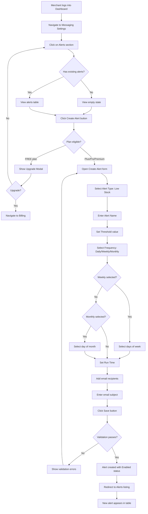
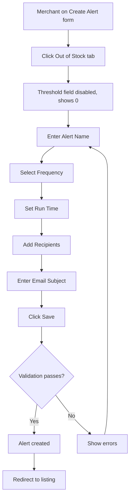
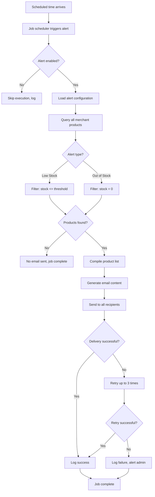
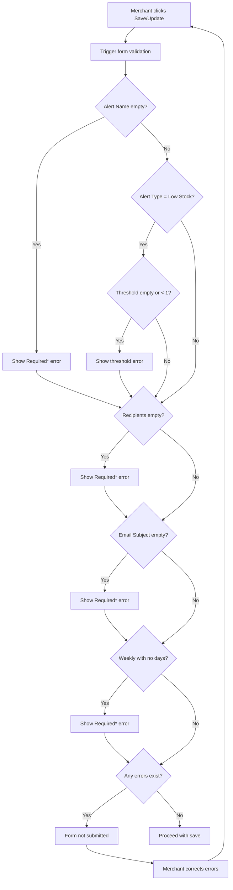
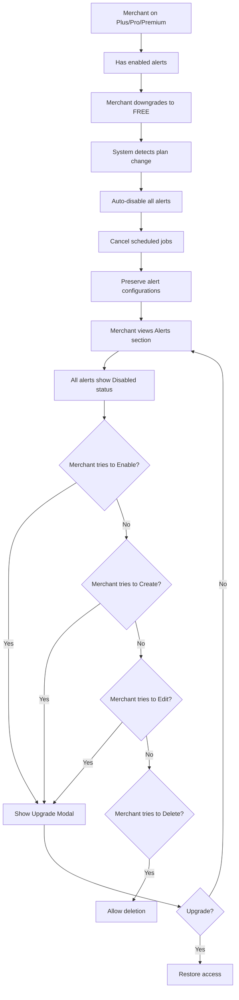
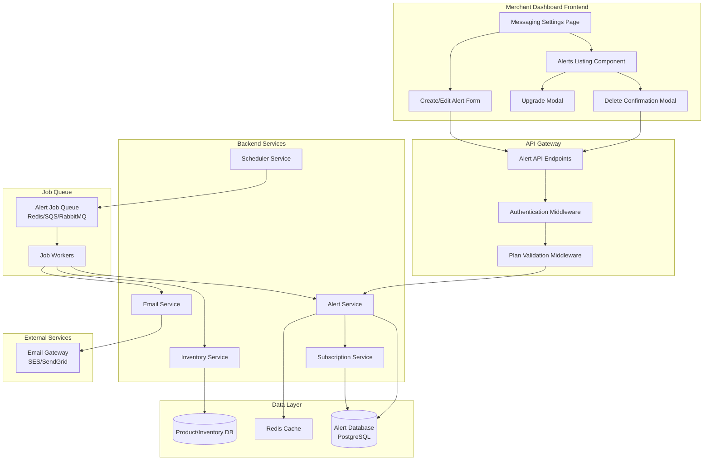
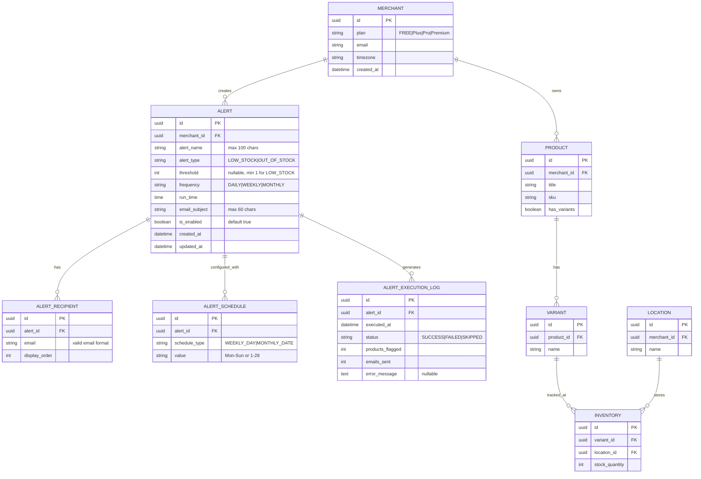

Agile-focused PRD documenting the implementation of the Low Stock Alerts feature for Prosperna's Merchant Dashboard, enabling merchants to create scheduled inventory alerts that monitor stock levels across all products and send email notifications to configured recipients when thresholds are met.

**Demo Recording:**

[Low Stock Alerts Demo Recording - To follow]()

## Document Control

| Item           | Details                            |
| -------------- | ---------------------------------- |
| Document Title | Low Stock Alerts                   |
| Version        | 2.0                                |
| Date           | January 13, 2026                   |
| Prepared by    | Business Analyst                   |
| Reviewed by    | To be assigned                     |
| Approved by    | To be assigned                     |
| Status         | For Review                         |
| Related BRD    | Low Stock Notifications BRD (v1.0) |

---

## Revision History

| Version | Date         | Author           | Change Description                                                                                     |
| ------- | ------------ | ---------------- | ------------------------------------------------------------------------------------------------------ |
| 1.0     | Oct 16, 2025 | Business Analyst | Initial BRD - Real-time low stock notifications with WebSocket and email batching                      |
| 2.0     | Jan 13, 2026 | Business Analyst | Complete redesign - Scheduled alerts with configurable frequency, multiple recipients, CRUD operations |

---

## 1. Introduction

### 1.1 Document Purpose

This PRD defines the detailed functional requirements, acceptance criteria (using BDD/Gherkin), and technical specifications for implementing the **Low Stock Alerts** feature in Prosperna's Merchant Dashboard. The feature enables merchants to create customizable inventory alerts that run on scheduled intervals (daily, weekly, or monthly) and send email notifications to up to 5 recipients when products fall below specified stock thresholds.

This document supersedes the original Low Stock Notifications BRD (v1.0) which proposed real-time event-driven notifications. Based on stakeholder feedback, the feature has been redesigned to use scheduled batch processing with enhanced configurability.

### 1.2 Feature Vision

Empower Prosperna merchants to proactively manage their inventory by creating flexible, scheduled alerts that monitor all products across all store locations. Merchants can configure multiple alerts with different thresholds, schedules, and recipient lists to match their operational workflows—whether they need daily out-of-stock checks for urgent restocking or weekly low-stock reports for inventory planning. This foundational alerting system positions Prosperna for future expansion into other customizable system alerts while providing immediate value as an all-in-one platform capability.

### 1.3 Success Criteria

**User Adoption & Usage:**

- 60% of eligible merchants (Plus, Pro, Premium) create at least one alert within 60 days of feature launch
- Average of 2.5 alerts created per adopting merchant
- 80% of created alerts remain enabled after 30 days
- 70% reduction in support tickets related to unexpected stockouts

**Technical Performance:**

- Scheduled alert job execution completes within 30 seconds for merchants with up to 10,000 products
- Email delivery success rate of 99.5% or higher
- Alert configuration save operation completes in less than 2 seconds
- System supports concurrent execution of 1,000+ merchant alert jobs per minute

**Business Impact:**

- 40% reduction in lost sales due to unmonitored stock depletion
- 25% improvement in inventory turnover for merchants using alerts
- Feature drives 15% increase in Plus/Pro plan upgrades from FREE tier
- Merchant satisfaction score of 4.5/5 for alert feature usability

### 1.4 Related Documents

- [Low Stock Notifications BRD v1.0](https://app.clickup.com/7537039/docs/760cf-68478/760cf-31818) - Original specification (superseded)
- [Competitor Research - Inventory Alerts](https://app.clickup.com/7537039/docs/760cf-68478/760cf-31818)
- [Low Stock Alerts Wireframe](https://p1-ba-pocs.vercel.app/low-stock-notifications)

---

## 2. Background & Context

### 2.1 Problem Statement

**Current Pain Point:**

Prosperna merchants frequently lose potential sales due to delayed awareness of low or depleted stock levels. Without automated monitoring, merchants must manually check inventory across all products, variants, and locations—a time-consuming process that often results in stockouts going unnoticed until customers attempt to purchase unavailable items.

**Original Solution Approach (BRD v1.0):**

The initial specification proposed real-time, event-driven notifications that would trigger immediately after customer checkouts reduced stock below thresholds. This approach included:

- WebSocket-based in-app notifications (per-product, near real-time)
- Email batching with 1-minute windows
- 24-hour cooldown periods per variant-location
- Restriction to Pro and Premium plans only

**Stakeholder Feedback & Pivot:**

Based on stakeholder review, the approach was redesigned with the following key changes:

1. **Location Change:** Feature moved to Messaging Settings > Alerts (below SMS) to establish a foundation for future alert types
2. **Plan Eligibility:** Extended to Plus plan (in addition to Pro/Premium) to increase adoption
3. **Scheduling Model:** Shifted from real-time to scheduled batch processing (Daily/Weekly/Monthly) for more predictable operations
4. **Recipient Flexibility:** Allow up to 5 custom email recipients instead of only the main merchant account
5. **Configuration Model:** Multiple independent alerts with individual CRUD operations instead of a single global toggle

**Impact of Current Limitations (Without This Feature):**

- **Lost Sales:** Merchants report 15-20% of stockouts are discovered only when customers complain
- **Manual Overhead:** Average merchant spends 2-3 hours weekly manually checking stock levels
- **Reactive Operations:** Merchants restock after stockouts rather than proactively
- **Competitive Disadvantage:** 8/10 competitor platforms offer automated inventory alerts
- **Support Burden:** 12% of support tickets relate to inventory visibility issues

### 2.2 Current State

**Current Inventory Management Behavior:**

1. **Merchant Dashboard - Product Management:**

   - Merchants can view and edit stock quantities per product/variant/location
   - No automated monitoring or alerting exists
   - Stock changes are recorded but not evaluated against thresholds

2. **Order Processing:**

   - Customer orders deduct stock quantities automatically
   - No notification is generated when stock falls below any threshold
   - Merchants discover low stock only through manual review

3. **Messaging Settings:**
   - SMS Notifications section exists with order-related templates
   - No Alerts section or inventory notification capability
   - Email notifications limited to order confirmations

**Current Workarounds:**

- Merchants manually export inventory reports and review in spreadsheets
- Some merchants set calendar reminders to check specific high-turnover products
- Third-party inventory management tools used by some merchants (additional cost)
- Staff assigned to daily stock checks (labor-intensive)

### 2.3 Desired Future State

**Enhanced Messaging Settings with Alerts:**

1. **Alerts Section in Messaging Settings:**

   - New "Alerts" navigation item below SMS in Messaging Settings
   - Dedicated section for creating and managing inventory alerts
   - Extensible foundation for future alert types (order alerts, customer alerts, etc.)

2. **Alert Configuration Capabilities:**

   - Create multiple independent alerts with unique configurations
   - Choose between "Low Stock" (configurable threshold) and "Out of Stock" (zero threshold) alert types
   - Set schedule frequency: Daily, Weekly (select days), or Monthly (select date)
   - Configure run time for alert execution
   - Add up to 5 email recipients per alert
   - Customize email subject line

3. **Alert Management:**

   - View all alerts in a table with name, type badge, and status
   - Enable/disable alerts without deleting configuration
   - Edit existing alerts to modify any configuration
   - Delete alerts with confirmation

4. **Scheduled Execution:**

   - System executes alert jobs at configured times
   - Evaluates ALL products, variants, and locations against threshold
   - Sends email to all recipients if any products meet criteria
   - No cooldown—same products can appear in consecutive notifications

5. **Email Notifications:**
   - Merchant-configured subject line
   - Product list with names, variants, stock quantities, and locations
   - Link to merchant dashboard for taking action

**Benefits After Implementation:**

- **Proactive Inventory Management:** Merchants receive scheduled reports before stockouts occur
- **Operational Flexibility:** Configure alerts to match business workflows (daily checks, weekly reports)
- **Team Collaboration:** Multiple recipients ensure the right people are notified
- **Reduced Manual Work:** Automated monitoring replaces manual stock checks
- **Foundation for Growth:** Alert system extensible to other notification types
- **Competitive Parity:** Feature matches or exceeds competitor offerings

### 2.4 Target Users

| User Segment                | Description                                | Use Case                                        | Alert Configuration Example                   |
| --------------------------- | ------------------------------------------ | ----------------------------------------------- | --------------------------------------------- |
| Small Retail Merchants      | Single store, owner-operated               | Daily out-of-stock alerts to prevent lost sales | Daily OOS alert at 8 AM to owner email        |
| Multi-Location Retailers    | Multiple stores with central management    | Weekly inventory reports across all locations   | Weekly low stock (≤10) on Mondays to team     |
| High-Volume Sellers         | Fast-moving inventory, frequent restocking | Daily low stock alerts with higher thresholds   | Daily low stock (≤50) at 6 AM to operations   |
| Wholesale/B2B Merchants     | Bulk inventory, longer restock cycles      | Monthly inventory audits                        | Monthly low stock (≤100) on 1st to purchasing |
| Dropship/POD Merchants      | Third-party fulfillment                    | Out of stock alerts to pause marketing          | Daily OOS alert to marketing team             |
| Seasonal Business Merchants | Inventory fluctuates by season             | Adjustable thresholds for different periods     | Multiple alerts with varying thresholds       |

### 2.5 Project Constraints & Assumptions

**Technical Constraints:**

- Must integrate with existing Messaging Settings page structure
- Alert scheduling must use existing job queue infrastructure (or approved additions)
- Email delivery must use existing email gateway (SES/SendGrid)
- Database schema changes must be backward compatible
- Must support merchants with up to 50,000 products without performance degradation

**Business Constraints:**

- Feature restricted to Plus, Pro, and Premium plans (FREE excluded)
- Must not increase email sending costs beyond approved budget
- Alert execution must not impact storefront performance
- Must comply with email deliverability best practices (SPF, DKIM, DMARC)

**Key Assumptions:**

- Merchants will configure meaningful thresholds based on their restock cycles
- Daily/Weekly/Monthly frequencies are sufficient for initial release (no hourly option)
- 5 recipients per alert is sufficient for most merchant team structures
- Global product monitoring (all products) is acceptable; per-product alerts not required initially
- Merchants understand the difference between Low Stock and Out of Stock alert types
- Time zone handling uses merchant's configured timezone or system default

**Regulatory Assumptions:**

- Email notifications comply with CAN-SPAM, GDPR, and Philippine data privacy regulations
- Recipients are assumed to have consented to receive operational notifications
- No personally identifiable customer information is included in alert emails

---

# 3. Functional Requirements & BDD Scenarios

---

## Feature F-01: Alerts Listing & Management

### 3.1.1 Feature Context

Provide merchants with a centralized interface to view, manage, and interact with all created alerts within the Messaging Settings > Alerts section. This includes displaying alerts in a table format with status indicators, action controls, and the ability to create new alerts.

### 3.1.2 Business Rules

**BR-01: Alerts Section Location & Access**

- The Alerts feature is located under **Messaging Settings > Alerts** in the Merchant Dashboard
- The Alerts section appears below the SMS Notifications section on the Messaging Settings page
- All merchants can view the Alerts section regardless of subscription plan
- Feature functionality (creating/enabling alerts) is restricted based on subscription plan (see BR-02)

**BR-02: Plan-Based Feature Eligibility**

- **FREE plan:** Alerts feature is NOT available; "Create Alert" button triggers upgrade modal
- **Plus plan:** Alerts feature is AVAILABLE
- **Pro plan:** Alerts feature is AVAILABLE
- **Premium plan:** Alerts feature is AVAILABLE
- Plan eligibility is validated at the time of alert creation and alert enabling

**BR-03: Alerts Table Display**

- Alerts are displayed in a table with columns: Alert Name, Status, Actions
- Alert Name column displays the merchant-defined alert name followed by a badge indicating alert type
- Alert type badge displays "Low Stock Alert" or "Out of Stock Alert" with dark background (#313A46) and white text
- Status column displays either "Enabled" (green badge) or "Disabled" (gray badge)
- Actions column contains a three-dot menu (kebab menu) for each alert

**BR-04: Empty State Display**

- When no alerts exist, display an empty state with:
  - Circular icon placeholder
  - Title: "No Alerts Created"
  - Description: "Alerts notify you when important inventory or other events occur, helping you take action before issues affect your business."
- "Create Alert" button remains visible above the empty state area

**BR-05: Actions Menu Options**

- Each alert row has a three-dot menu with the following options:
  - **Edit:** Opens the edit alert form with pre-populated data
  - **Enable/Disable:** Toggles the alert status (label changes based on current state)
  - **Delete:** Opens delete confirmation modal
- Menu closes when clicking outside or after selecting an action

### 3.1.3 Scenarios

##### Scenario 1: Merchant navigates to Alerts section

```gherkin
Given a merchant is logged into the Merchant Dashboard
And the merchant has an active subscription (Plus, Pro, or Premium plan)
When the merchant navigates to Messaging Settings
Then the sidebar displays "Messaging Settings" as the section title
When the merchant clicks on "Alerts"
Then the Alerts section is displayed as the active view
And the "Alerts" navigation item is highlighted
And the page displays the SMS Notifications section above
And the Alerts section appears below with the "Create Alert" button
```

##### Scenario 2: Merchant views alerts listing with existing alerts

```gherkin
Given a merchant has created the following alerts:
  | Alert Name           | Alert Type    | Status   |
  | Weekly Restock Check | Low Stock     | Enabled  |
  | Emergency OOS Alert  | Out of Stock  | Disabled |
  | Daily Inventory Scan | Low Stock     | Enabled  |
When the merchant views the Alerts section
Then the alerts table displays 3 rows
And each row shows the alert name with the corresponding type badge
And "Weekly Restock Check" shows badge "Low Stock Alert" and green "Enabled" status
And "Emergency OOS Alert" shows badge "Out of Stock Alert" and gray "Disabled" status
And "Daily Inventory Scan" shows badge "Low Stock Alert" and green "Enabled" status
And each row has a three-dot actions menu button
```

##### Scenario 3: Merchant views empty alerts state

```gherkin
Given a merchant has not created any alerts
When the merchant views the Alerts section
Then the alerts table area displays the empty state
And the empty state shows a circular icon placeholder
And the title displays "No Alerts Created"
And the description displays "Alerts notify you when important inventory or other events occur, helping you take action before issues affect your business."
And the "Create Alert" button is visible above the empty state
```

##### Scenario 4: Merchant opens actions menu for an alert

```gherkin
Given a merchant is viewing the Alerts listing
And an alert named "Weekly Restock Check" exists with status "Enabled"
When the merchant clicks the three-dot menu button for "Weekly Restock Check"
Then a dropdown menu appears with the following options:
  | Option   |
  | Edit     |
  | Disable  |
  | Delete   |
And the menu is positioned below the three-dot button
And clicking outside the menu closes it
```

##### Scenario 5: Merchant opens actions menu for disabled alert

```gherkin
Given a merchant is viewing the Alerts listing
And an alert named "Emergency OOS Alert" exists with status "Disabled"
When the merchant clicks the three-dot menu button for "Emergency OOS Alert"
Then a dropdown menu appears with the following options:
  | Option   |
  | Edit     |
  | Enable   |
  | Delete   |
And the "Enable" option replaces "Disable" since the alert is currently disabled
```

##### Scenario 6: FREE plan merchant attempts to access Alerts feature

```gherkin
Given a merchant is on the FREE plan
When the merchant navigates to Messaging Settings > Alerts
Then the Alerts section is visible
And the "Create Alert" button is visible
When the merchant clicks the "Create Alert" button
Then an "Upgrade Now" modal appears
And the modal explains that this feature is available on Plus, Pro, or Premium plans
And the modal provides options to upgrade or cancel
And no alert creation form is displayed
```

##### Scenario 7: Merchant closes actions menu by clicking outside

```gherkin
Given a merchant has opened the actions menu for an alert
And the dropdown menu is visible
When the merchant clicks anywhere outside the dropdown menu
Then the dropdown menu closes
And no action is performed on the alert
```

---

## Feature F-02: Create New Alert

### 3.2.1 Feature Context

Enable merchants to create new inventory alerts by configuring alert type, threshold, schedule frequency, run time, and email notification settings. The create alert form is a full-page view that guides merchants through the configuration process.

### 3.2.2 Business Rules

**BR-06: Create Alert Page Layout**

- Clicking "Create Alert" button navigates to a full-page form view
- Page header shows a back arrow and title "Create Alert"
- Form is organized into three sections: Alert Configuration, Alert Frequency, and Email Settings
- A sticky footer contains "Cancel" and "Save" buttons
- The footer remains fixed at the bottom of the viewport

**BR-07: Alert Type Selection**

- Alert type is selected via two tab-style buttons: "Low Stock" and "Out of Stock"
- Default selection is "Low Stock" when creating a new alert
- Only one alert type can be selected at a time
- Selected tab has dark background (#111827) with white text
- Unselected tab has white background with gray border and dark text

**BR-08: Alert Name Configuration**

- Alert Name is a required field
- Maximum character limit: 100 characters
- Character counter displays below the field showing "{current}/100"
- Empty field on save attempt displays "Required\*" error with red border
- Field placeholder is empty (no placeholder text)

**BR-09: Threshold Configuration**

- For "Low Stock" alert type:
  - Threshold field is enabled and editable
  - Minimum value: 1 unit
  - No maximum limit
  - Field displays "units" suffix
  - Empty field on save attempt displays "Required\*" error
- For "Out of Stock" alert type:
  - Threshold field is disabled (grayed out)
  - Field displays fixed value of "0"
  - No validation required for threshold (auto-set to 0)

**BR-10: Schedule Frequency Options**

- Three mutually exclusive frequency options via radio buttons:
  - **Daily:** Alert runs every day at the specified run time
  - **Weekly:** Alert runs on selected days at the specified run time
  - **Monthly:** Alert runs on a selected date each month at the specified run time
- Default selection is "Daily" when creating a new alert
- Frequency selection displays in vertical radio button layout

**BR-11: Weekly Schedule Configuration**

- When "Weekly" frequency is selected, day selection checkboxes appear
- Days available: Monday, Tuesday, Wednesday, Thursday, Friday, Saturday, Sunday
- At least one day must be selected when frequency is "Weekly"
- Multiple days can be selected simultaneously
- Default: "Monday" is pre-selected when switching to Weekly
- Empty day selection on save attempt displays "Required\*" error

**BR-12: Monthly Schedule Configuration**

- When "Monthly" frequency is selected, a date dropdown appears
- Dropdown label: "Day of month"
- Available options: 1 through 28 (to accommodate all months)
- Default selection is "1" (first day of month)
- Single date selection only

**BR-13: Run Time Configuration**

- Run time field uses native HTML time input (24-hour or 12-hour based on browser/OS)
- Field accepts time in HH:MM format
- No default value (empty until merchant sets)
- Run time determines when the scheduled alert job executes
- Time is based on merchant's configured timezone (or system default)

**BR-14: Recipients Configuration**

- Recipients field allows adding up to 5 email addresses
- Email input uses chip-based interface:
  - Typing email and pressing Enter or Space adds the email as a chip
  - Each chip displays email with an "×" remove button
  - Chip appears inside the input container
- Recipient counter displays "{count}/5" next to the label
- At least one recipient is required
- Email validation: must be valid email format (name@domain.com)
- Duplicate emails are not allowed
- Error messages:
  - Empty input on add attempt: "Please enter an email address"
  - Invalid format: "Please enter a valid email address (e.g., name@domain.com)"
  - Duplicate email: "This email has already been added"
  - Max recipients reached: "Maximum 5 recipients allowed"
- Empty recipients list on save attempt displays "Required\*" error

**BR-15: Email Subject Configuration**

- Email Subject is a required field
- Maximum character limit: 60 characters
- Character counter displays below the field showing "{current}/60"
- Empty field on save attempt displays "Required\*" error with red border
- No placeholder text

**BR-16: Form Footer Actions**

- "Cancel" button: Returns to Alerts listing without saving, discards all input
- "Save" button: Validates all fields and creates the alert if valid
- Footer is sticky/fixed at bottom of viewport
- Both buttons are always visible regardless of scroll position

**BR-17: Global Monitoring Scope Note**

- A note displays below the Email Settings section
- Note text: "Note: This alert monitors all products, variants, and categories across all your store locations."
- Note is italicized and uses muted text color

**BR-18: Successful Alert Creation**

- Upon successful save:
  - Alert record is created with status "Enabled" by default
  - Merchant is redirected to Alerts listing
  - New alert appears in the alerts table
  - Success toast notification displays (optional based on implementation)

### 3.2.3 Scenarios

##### Scenario 1: Merchant initiates alert creation

```gherkin
Given a merchant is on the Alerts listing page
And the merchant is subscribed to Plus, Pro, or Premium plan
When the merchant clicks the "Create Alert" button
Then the page navigates to the Create Alert form
And the sidebar navigation is hidden
And the page header displays a back arrow and title "Create Alert"
And the form displays three sections: "Alert Configuration", "Alert Frequency", "Email Settings"
And the "Low Stock" tab is selected by default
And the threshold field is enabled and empty
And the "Daily" radio button is selected by default
And the run time field is empty
And the recipients list is empty
And the email subject field is empty
And a sticky footer displays "Cancel" and "Save" buttons
```

##### Scenario 2: Merchant selects Low Stock alert type

```gherkin
Given a merchant is on the Create Alert form
And the "Low Stock" tab is currently selected
Then the "Low Stock" tab has dark background with white text
And the "Out of Stock" tab has white background with gray border
And the threshold input field is enabled
And the threshold field label displays "Threshold*"
And the threshold field shows "units" suffix
And the field is ready to accept numeric input
```

##### Scenario 3: Merchant selects Out of Stock alert type

```gherkin
Given a merchant is on the Create Alert form
And the "Low Stock" tab is currently selected
When the merchant clicks the "Out of Stock" tab
Then the "Out of Stock" tab becomes active with dark background and white text
And the "Low Stock" tab becomes inactive with white background and gray border
And the threshold input field becomes disabled (grayed out)
And the threshold field displays "0" as the fixed value
And the "units" suffix remains visible
And the merchant cannot edit the threshold value
```

##### Scenario 4: Merchant switches from Out of Stock back to Low Stock

```gherkin
Given a merchant is on the Create Alert form
And the "Out of Stock" tab is selected
And the threshold field shows "0" and is disabled
When the merchant clicks the "Low Stock" tab
Then the "Low Stock" tab becomes active
And the threshold field becomes enabled
And the threshold field is cleared (empty, ready for input)
And the merchant can enter a custom threshold value
```

##### Scenario 5: Merchant enters valid alert name

```gherkin
Given a merchant is on the Create Alert form
When the merchant clicks the Alert Name field
And types "Weekly Inventory Check"
Then the field displays "Weekly Inventory Check"
And the character counter displays "22/100"
And no validation error is shown
And the field border remains normal (not red)
```

##### Scenario 6: Merchant reaches alert name character limit

```gherkin
Given a merchant is on the Create Alert form
When the merchant types 100 characters into the Alert Name field
Then the character counter displays "100/100"
And the merchant cannot type additional characters
And no error is displayed (limit enforced silently)
```

##### Scenario 7: Merchant enters valid threshold for Low Stock alert

```gherkin
Given a merchant is on the Create Alert form
And the "Low Stock" tab is selected
When the merchant enters "10" in the threshold field
Then the field displays "10" with "units" suffix
And no validation error is shown
And the merchant can proceed with other fields
```

##### Scenario 8: Merchant enters threshold below minimum (0 or negative)

```gherkin
Given a merchant is on the Create Alert form
And the "Low Stock" tab is selected
When the merchant enters "0" in the threshold field
And clicks outside the field (blur event)
Then a validation error appears: "Minimum value is 1"
And the input field border turns red
When the merchant changes the value to "1"
And clicks outside the field
Then the validation error disappears
And the input field border returns to normal
```

##### Scenario 9: Merchant selects Daily frequency

```gherkin
Given a merchant is on the Create Alert form
And the "Daily" radio button is selected by default
Then no additional day or date selection fields are displayed
And only the "Run time" field is shown below the frequency options
When the merchant sets a run time of "09:00"
Then the alert will be configured to run every day at 09:00
```

##### Scenario 10: Merchant selects Weekly frequency

```gherkin
Given a merchant is on the Create Alert form
And the "Daily" radio button is selected
When the merchant selects the "Weekly" radio button
Then the day selection checkboxes appear below the frequency options
And the days displayed are: Monday, Tuesday, Wednesday, Thursday, Friday, Saturday, Sunday
And "Monday" is pre-checked by default
And the merchant can select multiple days
And the "Run time" field remains visible
```

##### Scenario 11: Merchant selects multiple days for Weekly frequency

```gherkin
Given a merchant is on the Create Alert form
And the "Weekly" frequency is selected
And "Monday" is currently checked
When the merchant checks "Wednesday" and "Friday"
Then Monday, Wednesday, and Friday are all selected
And the alert will be configured to run on those three days
When the merchant unchecks "Monday"
Then only Wednesday and Friday remain selected
```

##### Scenario 12: Merchant attempts to save Weekly alert with no days selected

```gherkin
Given a merchant is on the Create Alert form
And the "Weekly" frequency is selected
And the merchant has unchecked all day checkboxes (no days selected)
And all other required fields are filled
When the merchant clicks "Save"
Then the form is not submitted
And a validation error "Required*" appears below the day selection area
And the merchant must select at least one day to proceed
```

##### Scenario 13: Merchant selects Monthly frequency

```gherkin
Given a merchant is on the Create Alert form
And the "Daily" radio button is selected
When the merchant selects the "Monthly" radio button
Then a "Day of month" dropdown appears below the frequency options
And the dropdown shows "1" as the default selection
And available options range from 1 to 28
And the "Run time" field remains visible
And the weekly day checkboxes are not displayed
```

##### Scenario 14: Merchant selects day of month for Monthly frequency

```gherkin
Given a merchant is on the Create Alert form
And the "Monthly" frequency is selected
When the merchant clicks the "Day of month" dropdown
And selects "15"
Then the dropdown displays "15" as the selected value
And the alert will be configured to run on the 15th of each month
```

##### Scenario 15: Merchant sets run time

```gherkin
Given a merchant is on the Create Alert form
When the merchant clicks the "Run time" field
And selects "14:30" (2:30 PM)
Then the field displays the selected time
And the alert will be scheduled to run at 14:30 on the configured schedule
```

##### Scenario 16: Merchant adds first email recipient

```gherkin
Given a merchant is on the Create Alert form
And the recipients list is empty
And the recipient counter shows "0/5"
When the merchant clicks the recipients input field
And types "john@example.com"
And presses Enter
Then a chip appears with "john@example.com" and an "×" button
And the input field is cleared
And the recipient counter updates to "1/5"
And no validation error is shown
```

##### Scenario 17: Merchant adds recipient by pressing Space

```gherkin
Given a merchant is on the Create Alert form
And the recipients list has 1 email
When the merchant types "jane@example.com" in the recipients input
And presses Space
Then a new chip appears with "jane@example.com"
And the input field is cleared
And the recipient counter updates to "2/5"
```

##### Scenario 18: Merchant attempts to add invalid email format

```gherkin
Given a merchant is on the Create Alert form
When the merchant types "invalid-email" in the recipients input
And presses Enter
Then an error message appears: "Please enter a valid email address"
And no chip is created
And the invalid text remains in the input field
And the recipient counter does not change
```

##### Scenario 19: Merchant attempts to add duplicate email

```gherkin
Given a merchant is on the Create Alert form
And "john@example.com" is already added as a recipient
When the merchant types "john@example.com" in the recipients input
And presses Enter
Then an error message appears: "This email has already been added"
And no duplicate chip is created
And the recipient counter remains unchanged
```

##### Scenario 20: Merchant attempts to add more than 5 recipients

```gherkin
Given a merchant is on the Create Alert form
And 5 email recipients are already added
And the recipient counter shows "5/5"
When the merchant attempts to type in the recipients input
Then the input field is disabled
And no additional emails can be added
```

##### Scenario 21: Merchant removes an email recipient

```gherkin
Given a merchant is on the Create Alert form
And the recipients list contains "john@example.com" and "jane@example.com"
And the recipient counter shows "2/5"
When the merchant clicks the "×" button on the "john@example.com" chip
Then the "john@example.com" chip is removed
And only "jane@example.com" remains
And the recipient counter updates to "1/5"
And the input field becomes enabled if it was disabled
```

##### Scenario 22: Merchant enters email subject

```gherkin
Given a merchant is on the Create Alert form
When the merchant clicks the Email Subject field
And types "Low Stock Alert - Action Required"
Then the field displays "Low Stock Alert - Action Required"
And the character counter displays "32/60"
And no validation error is shown
```

##### Scenario 23: Merchant reaches email subject character limit

```gherkin
Given a merchant is on the Create Alert form
When the merchant types 60 characters into the Email Subject field
Then the character counter displays "60/60"
And the merchant cannot type additional characters
And no error is displayed
```

##### Scenario 24: Merchant successfully creates a Low Stock alert

```gherkin
Given a merchant is on the Create Alert form
And the merchant has entered:
  | Field         | Value                          |
  | Alert Type    | Low Stock                      |
  | Alert Name    | Weekly Restock Reminder        |
  | Threshold     | 10                             |
  | Frequency     | Weekly                         |
  | Days          | Monday, Wednesday, Friday      |
  | Run Time      | 09:00                          |
  | Recipients    | manager@store.com              |
  | Email Subject | Low Stock Alert - Please Review|
And no validation errors exist
When the merchant clicks the "Save" button
Then the alert is created successfully
And the alert status is set to "Enabled" by default
And the merchant is redirected to the Alerts listing page
And the new alert "Weekly Restock Reminder" appears in the table
And the alert shows badge "Low Stock Alert" and status "Enabled"
```

##### Scenario 25: Merchant successfully creates an Out of Stock alert

```gherkin
Given a merchant is on the Create Alert form
And the merchant has entered:
  | Field         | Value                          |
  | Alert Type    | Out of Stock                   |
  | Alert Name    | Emergency OOS Notification     |
  | Threshold     | 0 (auto-set, disabled field)   |
  | Frequency     | Daily                          |
  | Run Time      | 08:00                          |
  | Recipients    | owner@store.com, team@store.com|
  | Email Subject | URGENT: Products Out of Stock  |
And no validation errors exist
When the merchant clicks the "Save" button
Then the alert is created successfully
And the alert status is set to "Enabled" by default
And the merchant is redirected to the Alerts listing page
And the new alert "Emergency OOS Notification" appears in the table
And the alert shows badge "Out of Stock Alert" and status "Enabled"
```

##### Scenario 26: Merchant attempts to save with missing required fields

```gherkin
Given a merchant is on the Create Alert form
And the Alert Name field is empty
And the Threshold field is empty (for Low Stock type)
And the Recipients list is empty
And the Email Subject field is empty
When the merchant clicks the "Save" button
Then the form is not submitted
And the Alert Name field shows red border with error "Required*"
And the Threshold field shows red border with error "Required*"
And the Recipients field shows red border with error "Required*"
And the Email Subject field shows red border with error "Required*"
And the merchant remains on the Create Alert form
```

##### Scenario 27: Merchant cancels alert creation

```gherkin
Given a merchant is on the Create Alert form
And the merchant has entered some data in the form fields
When the merchant clicks the "Cancel" button
Then all entered data is discarded
And the merchant is redirected to the Alerts listing page
And no new alert is created
```

##### Scenario 28: Merchant navigates back using header back arrow

```gherkin
Given a merchant is on the Create Alert form
And the merchant has entered some data in the form fields
When the merchant clicks the back arrow in the page header
Then the merchant is redirected to the Alerts listing page
And all entered data is discarded
And no new alert is created
```

---

## Feature F-03: Edit Existing Alert

### 3.3.1 Feature Context

Allow merchants to modify existing alert configurations including alert type, name, threshold, schedule settings, and email notification details. The edit form pre-populates with the current alert configuration and follows the same validation rules as alert creation.

### 3.3.2 Business Rules

**BR-19: Edit Alert Page Layout**

- Selecting "Edit" from the actions menu navigates to the edit alert form
- Page header displays "Edit Alert" instead of "Create Alert"
- Form layout is identical to the Create Alert form
- All fields are pre-populated with the existing alert configuration
- Footer buttons are "Cancel" and "Update" (instead of "Save")

**BR-20: Pre-population of Alert Data**

- Alert Type tabs reflect the saved alert type (Low Stock or Out of Stock selected)
- Alert Name field contains the existing name with character count
- Threshold field contains the saved threshold value (or 0/disabled for Out of Stock)
- Frequency radio button reflects the saved frequency
- For Weekly: previously selected days are checked
- For Monthly: previously selected date is shown in dropdown
- Run Time field shows the saved time
- Recipients shows existing emails as chips
- Email Subject field contains the saved subject with character count

**BR-21: Alert Type Change During Edit**

- Merchant can change alert type from Low Stock to Out of Stock or vice versa
- Changing to Out of Stock: threshold becomes 0 and disabled
- Changing to Low Stock: threshold field enables and clears (merchant must enter new value)
- All other field values are preserved when changing alert type

**BR-22: Successful Alert Update**

- Upon successful update:
  - Alert record is updated with new configuration
  - Alert status (Enabled/Disabled) is preserved (not changed by edit)
  - Merchant is redirected to Alerts listing
  - Updated alert reflects new configuration in the table
  - Success toast notification displays

**BR-23: Validation on Edit**

- All validation rules from Create Alert apply to Edit Alert
- Pre-populated data is considered valid unless modified to invalid state
- Validation errors display identically to Create Alert form

### 3.3.3 Scenarios

##### Scenario 1: Merchant opens edit form for existing alert

```gherkin
Given a merchant has an alert with the following configuration:
  | Field         | Value                     |
  | Alert Name    | Weekly Restock Check      |
  | Alert Type    | Low Stock                 |
  | Threshold     | 15                        |
  | Frequency     | Weekly                    |
  | Days          | Monday, Friday            |
  | Run Time      | 10:00                     |
  | Recipients    | manager@store.com         |
  | Email Subject | Low Stock Weekly Report   |
  | Status        | Enabled                   |
When the merchant clicks the three-dot menu for this alert
And selects "Edit"
Then the Edit Alert form opens
And the page header displays "Edit Alert"
And the "Low Stock" tab is selected
And the Alert Name field shows "Weekly Restock Check" with counter "20/100"
And the Threshold field shows "15"
And the "Weekly" radio button is selected
And Monday and Friday checkboxes are checked
And the Run Time field shows "10:00"
And the Recipients field shows chip "manager@store.com" with counter "1/5"
And the Email Subject field shows "Low Stock Weekly Report" with counter "23/60"
And the footer displays "Cancel" and "Update" buttons
```

##### Scenario 2: Merchant updates alert name

```gherkin
Given a merchant is on the Edit Alert form
And the Alert Name field shows "Weekly Restock Check"
When the merchant clears the field
And types "Daily Inventory Alert"
Then the field displays "Daily Inventory Alert"
And the character counter updates to "21/100"
And no validation error is shown
```

##### Scenario 3: Merchant changes alert type from Low Stock to Out of Stock

```gherkin
Given a merchant is on the Edit Alert form for a Low Stock alert
And the "Low Stock" tab is selected
And the Threshold field shows "15" and is enabled
When the merchant clicks the "Out of Stock" tab
Then the "Out of Stock" tab becomes active
And the Threshold field becomes disabled
And the Threshold field value changes to "0"
And all other field values remain unchanged
And the merchant can proceed to save the changes
```

##### Scenario 4: Merchant changes alert type from Out of Stock to Low Stock

```gherkin
Given a merchant is on the Edit Alert form for an Out of Stock alert
And the "Out of Stock" tab is selected
And the Threshold field shows "0" and is disabled
When the merchant clicks the "Low Stock" tab
Then the "Low Stock" tab becomes active
And the Threshold field becomes enabled
And the Threshold field is cleared (empty)
And the merchant must enter a new threshold value
And all other field values remain unchanged
```

##### Scenario 5: Merchant changes frequency from Daily to Weekly

```gherkin
Given a merchant is on the Edit Alert form
And the "Daily" frequency is selected
When the merchant selects the "Weekly" radio button
Then the day selection checkboxes appear
And "Monday" is pre-checked by default
And the Run Time field value is preserved
And the merchant can select additional days
```

##### Scenario 6: Merchant changes frequency from Weekly to Monthly

```gherkin
Given a merchant is on the Edit Alert form
And the "Weekly" frequency is selected
And Monday and Wednesday are checked
When the merchant selects the "Monthly" radio button
Then the day selection checkboxes disappear
And the "Day of month" dropdown appears
And the dropdown shows "1" as the default selection
And the Run Time field value is preserved
```

##### Scenario 7: Merchant adds additional recipient during edit

```gherkin
Given a merchant is on the Edit Alert form
And the Recipients field shows chip "manager@store.com" (1/5)
When the merchant types "assistant@store.com" in the input
And presses Enter
Then a new chip "assistant@store.com" appears
And the recipient counter updates to "2/5"
And both emails will receive the alert notifications
```

##### Scenario 8: Merchant removes existing recipient during edit

```gherkin
Given a merchant is on the Edit Alert form
And the Recipients field shows chips "manager@store.com" and "assistant@store.com" (2/5)
When the merchant clicks the "×" on "manager@store.com"
Then the "manager@store.com" chip is removed
And only "assistant@store.com" remains
And the recipient counter updates to "1/5"
```

##### Scenario 9: Merchant successfully updates alert

```gherkin
Given a merchant is on the Edit Alert form
And has modified the following:
  | Field         | Original Value          | New Value               |
  | Alert Name    | Weekly Restock Check    | Daily Restock Alert     |
  | Frequency     | Weekly                  | Daily                   |
  | Run Time      | 10:00                   | 08:30                   |
And all fields pass validation
When the merchant clicks the "Update" button
Then the alert is updated successfully
And the merchant is redirected to the Alerts listing
And the alert shows the new name "Daily Restock Alert"
And the alert status remains unchanged (e.g., still "Enabled")
```

##### Scenario 10: Merchant attempts to save edit with empty required field

```gherkin
Given a merchant is on the Edit Alert form
And the Alert Name field originally contained "Weekly Restock Check"
When the merchant clears the Alert Name field (leaves it empty)
And clicks the "Update" button
Then the form is not submitted
And the Alert Name field shows red border with error "Required*"
And the merchant remains on the Edit Alert form
```

##### Scenario 11: Merchant cancels edit without saving changes

```gherkin
Given a merchant is on the Edit Alert form
And has modified the Alert Name from "Weekly Restock Check" to "New Alert Name"
When the merchant clicks the "Cancel" button
Then the changes are discarded
And the merchant is redirected to the Alerts listing
And the alert still shows the original name "Weekly Restock Check"
```

##### Scenario 12: Merchant edits alert while preserving status

```gherkin
Given a merchant has an alert "Low Stock Alert" with status "Disabled"
When the merchant opens the Edit form for this alert
And modifies the Alert Name to "Updated Low Stock Alert"
And clicks "Update"
Then the alert is updated with the new name
And the alert status remains "Disabled"
And the alert is not automatically enabled by editing
```

---

## Feature F-04: Enable/Disable Alert

### 3.4.1 Feature Context

Allow merchants to toggle the active status of alerts without deleting them. Disabled alerts retain their configuration but do not trigger scheduled notifications until re-enabled.

### 3.4.2 Business Rules

**BR-24: Toggle Alert Status**

- Clicking "Enable" or "Disable" from the actions menu immediately toggles the alert status
- No confirmation modal is required for enable/disable action
- Status change is reflected immediately in the alerts table
- Status badge updates from "Enabled" (green) to "Disabled" (gray) or vice versa

**BR-25: Disabled Alert Behavior**

- Disabled alerts do NOT trigger scheduled notification jobs
- Alert configuration is preserved when disabled
- Disabled alerts can be edited (opens Edit form with current config)
- Disabled alerts can be deleted
- Disabled alerts remain in the alerts listing table

**BR-26: Enabled Alert Behavior**

- Enabled alerts trigger scheduled notification jobs according to their frequency settings
- Alert job runs at the configured run time on the configured schedule
- Job evaluates all products against the alert's threshold
- If products meet the alert criteria, email notification is sent to recipients

**BR-27: Plan Downgrade Impact**

- If a merchant downgrades from Plus/Pro/Premium to FREE:
  - All alerts are automatically disabled
  - Alerts are preserved but cannot be re-enabled until plan upgrade
  - Attempting to enable alerts on FREE plan triggers upgrade modal

### 3.4.3 Scenarios

##### Scenario 1: Merchant disables an enabled alert

```gherkin
Given a merchant is viewing the Alerts listing
And an alert "Weekly Restock Check" has status "Enabled" (green badge)
When the merchant clicks the three-dot menu for this alert
And selects "Disable"
Then the alert status immediately changes to "Disabled"
And the status badge changes to gray "Disabled"
And no confirmation modal appears
And the actions menu closes
And the alert remains in the listing table
```

##### Scenario 2: Merchant enables a disabled alert

```gherkin
Given a merchant is viewing the Alerts listing
And an alert "Emergency OOS Alert" has status "Disabled" (gray badge)
When the merchant clicks the three-dot menu for this alert
And selects "Enable"
Then the alert status immediately changes to "Enabled"
And the status badge changes to green "Enabled"
And no confirmation modal appears
And the actions menu closes
And the alert will now trigger at its scheduled time
```

##### Scenario 3: Actions menu label reflects current status

```gherkin
Given a merchant is viewing the Alerts listing
When the merchant opens the actions menu for an "Enabled" alert
Then the menu shows option "Disable"
When the merchant closes the menu
And opens the actions menu for a "Disabled" alert
Then the menu shows option "Enable"
```

##### Scenario 4: Disabled alert does not trigger notifications

```gherkin
Given a merchant has an alert configured as:
  | Field      | Value      |
  | Status     | Disabled   |
  | Frequency  | Daily      |
  | Run Time   | 09:00      |
When the scheduled time 09:00 arrives
Then the system checks the alert status
And finds the alert is "Disabled"
And no notification job is executed
And no emails are sent to recipients
```

##### Scenario 5: Re-enabled alert resumes scheduled notifications

```gherkin
Given a merchant has a disabled alert configured for Daily at 09:00
When the merchant enables the alert at 08:45
And the scheduled time 09:00 arrives
Then the system checks the alert status
And finds the alert is "Enabled"
And executes the notification job
And sends emails to configured recipients if products meet threshold criteria
```

##### Scenario 6: FREE plan merchant attempts to enable alert

```gherkin
Given a merchant has downgraded to the FREE plan
And has an existing disabled alert "Weekly Restock Check"
When the merchant clicks the three-dot menu for this alert
And selects "Enable"
Then an "Upgrade Now" modal appears
And the modal explains that alerts require Plus, Pro, or Premium plan
And the alert status remains "Disabled"
And the alert is not enabled
```

##### Scenario 7: Alerts auto-disabled on plan downgrade

```gherkin
Given a merchant is subscribed to the Plus plan
And has 3 enabled alerts
When the merchant downgrades to the FREE plan
Then all 3 alerts are automatically set to "Disabled" status
And the alerts remain in the listing table
And the status badges all show gray "Disabled"
And no scheduled notifications will run for these alerts
```

##### Scenario 8: Merchant can edit disabled alert

```gherkin
Given a merchant has a disabled alert "Emergency OOS Alert"
When the merchant clicks the three-dot menu for this alert
And selects "Edit"
Then the Edit Alert form opens
And all fields are pre-populated with the alert's configuration
And the merchant can modify and save changes
And the alert remains "Disabled" after saving (status preserved)
```

---

## Feature F-05: Delete Alert

### 3.5.1 Feature Context

Allow merchants to permanently delete alerts they no longer need. Deletion requires confirmation to prevent accidental removal and cannot be undone.

### 3.5.2 Business Rules

**BR-28: Delete Confirmation Modal**

- Clicking "Delete" from the actions menu opens a confirmation modal
- Modal title: "Delete Alert"
- Modal message: "Are you sure you want to delete this alert? This alert will be permanently deleted and all scheduled notifications will be canceled."
- Modal has two buttons: "Cancel" and "Delete"
- "Cancel" closes the modal without deleting
- "Delete" confirms deletion and removes the alert

**BR-29: Permanent Deletion**

- Deleted alerts are permanently removed from the database
- Deletion cannot be undone
- Any scheduled jobs for the deleted alert are canceled
- Deleted alert is immediately removed from the alerts listing table

**BR-30: Post-Deletion State**

- After deletion, the alerts table updates to reflect remaining alerts
- If no alerts remain, the empty state is displayed

### 3.5.3 Scenarios

##### Scenario 1: Merchant initiates alert deletion

```gherkin
Given a merchant is viewing the Alerts listing
And an alert "Old Inventory Alert" exists in the table
When the merchant clicks the three-dot menu for this alert
And selects "Delete"
Then a confirmation modal appears
And the modal title displays "Delete Alert"
And the modal message displays "Are you sure you want to delete this alert? This alert will be permanently deleted and all scheduled notifications will be canceled."
And the modal has "Cancel" and "Delete" buttons
```

##### Scenario 2: Merchant confirms alert deletion

```gherkin
Given a merchant has opened the delete confirmation modal for "Old Inventory Alert"
And the modal is displayed with "Cancel" and "Delete" buttons
When the merchant clicks the "Delete" button
Then the modal closes
And the alert "Old Inventory Alert" is permanently deleted
And the alert is removed from the alerts listing table
And any scheduled notification jobs for this alert are canceled
```

##### Scenario 3: Merchant cancels alert deletion

```gherkin
Given a merchant has opened the delete confirmation modal for "Old Inventory Alert"
And the modal is displayed
When the merchant clicks the "Cancel" button
Then the modal closes
And the alert "Old Inventory Alert" is NOT deleted
And the alert remains in the alerts listing table
And the alert configuration is unchanged
```

##### Scenario 4: Merchant closes modal by clicking outside

```gherkin
Given a merchant has opened the delete confirmation modal
And the modal overlay is visible
When the merchant clicks on the overlay area outside the modal content
Then the modal closes
And the alert is NOT deleted
And the alert remains in the alerts listing table
```

##### Scenario 5: Deleting last alert shows empty state

```gherkin
Given a merchant has only one alert "Single Alert" in the listing
When the merchant deletes "Single Alert" via the confirmation modal
Then the alert is removed
And the alerts table is empty
And the empty state is displayed with:
  | Element      | Content                                                                                              |
  | Icon         | Circular placeholder icon                                                                            |
  | Title        | No Alerts Created                                                                                    |
  | Description  | Alerts notify you when important inventory or other events occur, helping you take action before issues affect your business. |
```

##### Scenario 6: Deleting enabled alert cancels scheduled jobs

```gherkin
Given a merchant has an enabled alert configured to run daily at 09:00
And it is currently 08:55 (5 minutes before scheduled run)
When the merchant deletes this alert
Then the alert is permanently removed
And the scheduled job for 09:00 is canceled
And no notification email is sent at 09:00
```

##### Scenario 7: Deleting disabled alert

```gherkin
Given a merchant has a disabled alert "Inactive Alert"
When the merchant opens the delete confirmation modal for this alert
And clicks "Delete"
Then the alert is permanently deleted
And the alert is removed from the listing
And no errors occur (disabled alerts can be deleted normally)
```

---

## Feature F-06: Scheduled Alert Execution & Email Notification

### 3.6.1 Feature Context

Execute scheduled alert jobs according to configured frequency and run time, evaluate product inventory against alert thresholds, and send email notifications to configured recipients when products meet the alert criteria.

### 3.6.2 Business Rules

**BR-31: Alert Job Scheduling**

- Alert jobs are scheduled based on frequency and run time configuration:
  - **Daily:** Job runs every day at the configured run time
  - **Weekly:** Job runs on selected days at the configured run time
  - **Monthly:** Job runs on the selected date each month at the configured run time
- Jobs only execute for alerts with status "Enabled"
- Run time is based on merchant's configured timezone

**BR-32: Inventory Evaluation Scope**

- Alert evaluates ALL products, ALL variants, and ALL categories across ALL merchant locations
- This is a global evaluation, not per-product configuration
- Stock quantity is checked at the variant level (if variants exist) or product level (single products)
- Each location's stock is evaluated independently

**BR-33: Low Stock Alert Criteria**

- For "Low Stock" alerts: products are flagged when stock quantity ≤ configured threshold
- Products with stock quantity > threshold are NOT included in the notification
- Products with stock quantity = 0 are also included (0 ≤ threshold for any threshold ≥ 1)

**BR-34: Out of Stock Alert Criteria**

- For "Out of Stock" alerts: products are flagged when stock quantity = 0 (exactly zero)
- Products with stock quantity > 0 are NOT included in the notification
- Products with stock quantity < 0 (if possible) are also included

**BR-35: Email Notification Trigger**

- If one or more products meet the alert criteria, an email is sent
- If no products meet the criteria, no email is sent (silent pass)
- Email is sent to all configured recipients (up to 5)
- Each recipient receives the same email content

**BR-36: Email Content Structure**

- Email subject: merchant-configured subject from alert settings
- Email body contains:
  - Summary of alert (Low Stock or Out of Stock)
  - List of products that triggered the alert with:
    - Product name
    - Variant name (if applicable)
    - Current stock quantity
    - Location (if multi-location)
  - Link to merchant dashboard for action

**BR-37: No Cooldown Between Runs**

- Unlike the original BRD's 24-hour cooldown, scheduled alerts run every scheduled cycle
- If the same product remains below threshold, it will be included in each notification
- This ensures merchants stay informed until action is taken

**BR-38: Manual Stock Changes Are Included**

- Unlike the original BRD, scheduled alerts evaluate current stock regardless of how it changed
- Both order-based deductions and manual merchant edits are considered
- The alert captures a "point-in-time" snapshot at the scheduled run time

### 3.6.3 Scenarios

##### Scenario 1: Daily Low Stock alert executes at scheduled time

```gherkin
Given a merchant has an enabled alert configured as:
  | Field      | Value                    |
  | Alert Type | Low Stock                |
  | Threshold  | 10                       |
  | Frequency  | Daily                    |
  | Run Time   | 09:00                    |
  | Recipients | manager@store.com        |
  | Status     | Enabled                  |
And the merchant has the following products:
  | Product Name   | Variant      | Stock Qty | Location   |
  | Widget A       | Red          | 5         | Main Store |
  | Widget A       | Blue         | 15        | Main Store |
  | Gadget B       | -            | 8         | Main Store |
  | Component C    | Small        | 0         | Warehouse  |
When the scheduled time 09:00 arrives
Then the system executes the Low Stock alert job
And evaluates all products against threshold 10
And identifies products with stock ≤ 10:
  | Product Name   | Variant | Stock Qty |
  | Widget A       | Red     | 5         |
  | Gadget B       | -       | 8         |
  | Component C    | Small   | 0         |
And sends an email to "manager@store.com"
And the email lists the 3 products meeting the criteria
And "Widget A - Blue" (stock 15) is NOT included in the email
```

##### Scenario 2: Weekly alert runs only on configured days

```gherkin
Given a merchant has an enabled alert configured as:
  | Field      | Value                      |
  | Frequency  | Weekly                     |
  | Days       | Monday, Wednesday, Friday  |
  | Run Time   | 08:00                      |
  | Status     | Enabled                    |
When Tuesday at 08:00 arrives
Then the system checks the alert schedule
And determines Tuesday is NOT a configured day
And does NOT execute the alert job
When Wednesday at 08:00 arrives
Then the system checks the alert schedule
And determines Wednesday IS a configured day
And executes the alert job
And evaluates products and sends notification if criteria are met
```

##### Scenario 3: Monthly alert runs on configured date

```gherkin
Given a merchant has an enabled alert configured as:
  | Field        | Value  |
  | Frequency    | Monthly|
  | Day of Month | 15     |
  | Run Time     | 10:00  |
  | Status       | Enabled|
When the 14th day of the month at 10:00 arrives
Then the system checks the alert schedule
And determines today is NOT the 15th
And does NOT execute the alert job
When the 15th day of the month at 10:00 arrives
Then the system executes the alert job
And sends notification if products meet criteria
```

##### Scenario 4: Out of Stock alert only captures zero-stock products

```gherkin
Given a merchant has an enabled "Out of Stock" alert
And the merchant has the following products:
  | Product Name | Stock Qty |
  | Item A       | 0         |
  | Item B       | 5         |
  | Item C       | 0         |
  | Item D       | 1         |
When the alert job executes
Then the system evaluates all products for stock = 0
And identifies:
  | Product Name | Stock Qty |
  | Item A       | 0         |
  | Item C       | 0         |
And sends an email listing only "Item A" and "Item C"
And "Item B" and "Item D" are NOT included
```

##### Scenario 5: No products meet alert criteria - no email sent

```gherkin
Given a merchant has an enabled Low Stock alert with threshold 10
And all products have stock quantity > 10
When the alert job executes at the scheduled time
Then the system evaluates all products
And finds no products with stock ≤ 10
And does NOT send any email notification
And the job completes silently (no error)
```

##### Scenario 6: Alert sends to multiple recipients

```gherkin
Given a merchant has an enabled alert with recipients:
  | Recipient            |
  | owner@store.com      |
  | manager@store.com    |
  | assistant@store.com  |
And products exist that meet the alert criteria
When the alert job executes
Then the system sends the email to all 3 recipients
And each recipient receives the same email content
And email delivery is logged for each recipient
```

##### Scenario 7: Disabled alert does not execute

```gherkin
Given a merchant has an alert configured for Daily at 09:00
And the alert status is "Disabled"
When the scheduled time 09:00 arrives
Then the system checks the alert status
And finds status = "Disabled"
And does NOT execute the alert job
And no products are evaluated
And no emails are sent
```

##### Scenario 8: Same product appears in consecutive daily alerts

```gherkin
Given a merchant has an enabled Daily Low Stock alert with threshold 10
And product "Widget A" has stock quantity of 5
When the alert executes on Monday at 09:00
Then "Widget A" is included in the notification email
And when the alert executes on Tuesday at 09:00
And "Widget A" still has stock quantity of 5
Then "Widget A" is again included in the notification email
And the merchant receives repeated notifications until stock is replenished
```

##### Scenario 9: Alert captures manually reduced stock

```gherkin
Given a merchant has an enabled Low Stock alert with threshold 10
And product "Gadget B" has stock quantity of 20
When the merchant manually edits "Gadget B" stock to 5 via the dashboard
And the alert job executes at its scheduled time
Then the system evaluates current stock (5)
And includes "Gadget B" in the notification
And the source of stock change (manual edit) does not affect alert evaluation
```

##### Scenario 10: Multi-location inventory evaluation

```gherkin
Given a merchant has multiple store locations
And product "Widget A" exists at both locations:
  | Location       | Stock Qty |
  | Main Store     | 15        |
  | Warehouse      | 3         |
And the merchant has a Low Stock alert with threshold 10
When the alert job executes
Then the system evaluates each location independently
And identifies "Widget A" at "Warehouse" (stock 3 ≤ 10)
And does NOT flag "Widget A" at "Main Store" (stock 15 > 10)
And the email specifies the location for each flagged item
```

##### Scenario 11: Product with variants - variant-level evaluation

```gherkin
Given a merchant has product "T-Shirt" with variants:
  | Variant | Stock Qty |
  | Small   | 20        |
  | Medium  | 8         |
  | Large   | 0         |
And the merchant has a Low Stock alert with threshold 10
When the alert job executes
Then the system evaluates each variant independently
And identifies:
  | Product | Variant | Stock Qty |
  | T-Shirt | Medium  | 8         |
  | T-Shirt | Large   | 0         |
And "T-Shirt - Small" is NOT flagged (stock 20 > 10)
And the email lists each flagged variant separately
```

---

## Feature F-07: Form Validation & Error Handling

### 3.7.1 Feature Context

Comprehensive validation rules and error handling across the Create and Edit Alert forms to ensure data quality, provide clear guidance to merchants, and prevent invalid configurations from being saved.

### 3.7.2 Business Rules

**BR-39: Required Field Validation**

- Required fields: Alert Name, Threshold (for Low Stock), Recipients, Email Subject
- For Weekly frequency: at least one day must be selected
- Empty required fields display "Required\*" error text in red
- Empty required fields have red border applied to input

**BR-40: Validation Timing**

- Alert Name: validates on blur and on save attempt
- Threshold: validates on blur and on save attempt
- Recipients: validates on add attempt (Enter/Space) and on save attempt
- Email Subject: validates on blur and on save attempt
- Weekly days: validates on save attempt only

**BR-41: Field-Specific Validation Rules**

- Alert Name: max 100 characters (enforced silently at input)
- Threshold: minimum value 1 (error shown for 0 or negative)
- Email: valid format required (shows format error for invalid)
- Email Subject: max 60 characters (enforced silently at input)

**BR-42: Error Display Format**

- Inline errors appear below the relevant field
- Error text is red (#EF4444)
- Error text shows "Required\*" for empty required fields
- Specific error messages for format/value violations
- Red border (#EF4444) applied to invalid input fields

**BR-43: Error Clearing**

- Errors clear immediately when valid input is provided
- Border returns to normal when field becomes valid
- Clearing a field re-triggers "Required\*" error (for required fields)

**BR-44: Save/Update Button Behavior**

- Clicking Save/Update triggers validation of all required fields
- If validation fails: form is not submitted, errors are displayed
- If validation passes: form submits and redirects to listing
- Button is always clickable (not disabled based on validation state)

**BR-45: Character Counter Behavior**

- Counter shows "{current}/{max}" format
- Counter updates in real-time as user types
- Counter does not turn red when approaching limit
- Input is blocked when max is reached (cannot type more)

### 3.7.3 Scenarios

##### Scenario 1: Empty Alert Name validation on blur

```gherkin
Given a merchant is on the Create Alert form
When the merchant clicks the Alert Name field
And then clicks outside the field without entering text (blur)
Then a validation error appears below the field
And the error message displays "Required*"
And the input field border turns red
```

##### Scenario 2: Empty Alert Name validation on save

```gherkin
Given a merchant is on the Create Alert form
And the Alert Name field is empty
And other required fields are filled
When the merchant clicks the "Save" button
Then the form is not submitted
And the Alert Name field shows error "Required*"
And the Alert Name field border turns red
And the merchant remains on the form
```

##### Scenario 3: Alert Name error clears when valid input provided

```gherkin
Given a merchant is on the Create Alert form
And the Alert Name field shows error "Required*" with red border
When the merchant types "New Alert Name"
Then the error message "Required*" disappears
And the input field border returns to normal
And the character counter shows "14/100"
```

##### Scenario 4: Threshold below minimum validation

```gherkin
Given a merchant is on the Create Alert form
And the "Low Stock" alert type is selected
When the merchant enters "0" in the Threshold field
And clicks outside the field (blur)
Then a validation error appears below the field
And the error message displays "Minimum value is 1"
And the input field border turns red
```

##### Scenario 5: Threshold accepts minimum valid value

```gherkin
Given a merchant is on the Create Alert form
And the "Low Stock" alert type is selected
And the Threshold field shows error "Minimum value is 1"
When the merchant changes the value to "1"
And clicks outside the field (blur)
Then the validation error disappears
And the input field border returns to normal
And the value "1" is accepted as valid
```

##### Scenario 6: Empty Threshold validation on save

```gherkin
Given a merchant is on the Create Alert form
And the "Low Stock" alert type is selected
And the Threshold field is empty
When the merchant clicks the "Save" button
Then the form is not submitted
And the Threshold field shows error "Required*"
And the Threshold field border turns red
```

##### Scenario 7: Invalid email format validation

```gherkin
Given a merchant is on the Create Alert form
When the merchant types "invalid-email-format" in the Recipients input
And presses Enter
Then a validation error appears below the field
And the error message displays "Please enter a valid email address"
And no chip is created
And the invalid text remains in the input field for correction
```

##### Scenario 8: Empty Recipients validation on save

```gherkin
Given a merchant is on the Create Alert form
And the Recipients list is empty (no chips)
And other required fields are filled
When the merchant clicks the "Save" button
Then the form is not submitted
And the Recipients field shows error "Required*"
And the Recipients input container border turns red
```

##### Scenario 9: Empty Email Subject validation on blur

```gherkin
Given a merchant is on the Create Alert form
When the merchant clicks the Email Subject field
And then clicks outside without entering text (blur)
Then a validation error appears below the field
And the error message displays "Required*"
And the input field border turns red
```

##### Scenario 10: Weekly frequency with no days selected validation

```gherkin
Given a merchant is on the Create Alert form
And the "Weekly" frequency is selected
And no day checkboxes are checked (all unchecked)
And other required fields are filled
When the merchant clicks the "Save" button
Then the form is not submitted
And an error "Required*" appears below the day checkboxes
And the merchant must select at least one day
```

##### Scenario 11: Multiple validation errors on save

```gherkin
Given a merchant is on the Create Alert form
And the following fields are invalid:
  | Field         | State                    |
  | Alert Name    | Empty                    |
  | Threshold     | Empty (Low Stock type)   |
  | Recipients    | Empty (no chips)         |
  | Email Subject | Empty                    |
When the merchant clicks the "Save" button
Then the form is not submitted
And all four fields show "Required*" error
And all four fields have red borders
And the merchant can correct each field individually
```

##### Scenario 12: Correcting validation errors one by one

```gherkin
Given a merchant is on the Create Alert form
And multiple validation errors are displayed
When the merchant enters a valid Alert Name
Then the Alert Name error clears immediately
And other errors remain displayed
When the merchant enters a valid Threshold
Then the Threshold error clears immediately
And remaining errors persist
When the merchant adds a valid email to Recipients
Then the Recipients error clears
When the merchant enters a valid Email Subject
Then all errors are cleared
And the merchant can successfully save the alert
```

##### Scenario 13: Character counter updates in real-time

```gherkin
Given a merchant is on the Create Alert form
And the Alert Name field is empty
And the character counter shows "0/100"
When the merchant types "Daily"
Then the counter updates to "5/100"
When the merchant continues typing " Inventory Check"
Then the counter updates to "21/100"
When the merchant deletes "Check"
Then the counter updates to "16/100"
```

##### Scenario 14: Character limit prevents additional input

```gherkin
Given a merchant is on the Create Alert form
And the Alert Name field contains exactly 100 characters
And the character counter shows "100/100"
When the merchant attempts to type additional characters
Then no additional characters are added to the field
And the counter remains at "100/100"
And no error is displayed (silent enforcement)
```

##### Scenario 15: Validation on Edit form with pre-populated data

```gherkin
Given a merchant is on the Edit Alert form
And all fields are pre-populated with valid data
When the merchant clears the Alert Name field
And clicks outside the field (blur)
Then the error "Required*" appears for Alert Name
And the merchant must fix the error before saving
When the merchant clicks the "Update" button
Then the form is not submitted due to validation error
```

---

## Feature F-08: Plan-Based Access Control

### 3.8.1 Feature Context

Enforce subscription plan restrictions for the Low Stock Alerts feature, ensuring only merchants on eligible plans (Plus, Pro, Premium) can create and enable alerts, while FREE plan merchants are prompted to upgrade.

### 3.8.2 Business Rules

**BR-46: Plan Eligibility Matrix**
| Plan | View Alerts Section | Create Alert | Enable Alert | Edit Alert | Delete Alert |
|---------|---------------------|--------------|--------------|------------|--------------|
| FREE | ✓ | ✗ (Modal) | ✗ (Modal) | ✗ (Modal) | ✓ |
| Plus | ✓ | ✓ | ✓ | ✓ | ✓ |
| Pro | ✓ | ✓ | ✓ | ✓ | ✓ |
| Premium | ✓ | ✓ | ✓ | ✓ | ✓ |

**BR-47: Upgrade Modal Trigger**

- Modal appears when FREE plan merchant attempts to:
  - Click "Create Alert" button
  - Select "Enable" from actions menu for a disabled alert
  - Select "Edit" from actions menu
- Modal does NOT appear for Delete action (FREE can delete existing alerts)

**BR-48: Plan Downgrade Handling**

- When merchant downgrades from Plus/Pro/Premium to FREE:
  - All existing alerts are automatically set to "Disabled"
  - Alert configurations are preserved (not deleted)
  - Merchant can view alerts but cannot enable or create new ones
  - Merchant can delete alerts they no longer need

**BR-49: Plan Upgrade Restoration**

- When merchant upgrades from FREE to Plus/Pro/Premium:
  - Access to create/enable alerts is restored
  - Previously disabled alerts become auto-enabled

### 3.8.3 Scenarios

##### Scenario 1: FREE plan merchant clicks Create Alert

```gherkin
Given a merchant is on the FREE plan
And the merchant is viewing the Alerts section
When the merchant clicks the "Create Alert" button
Then an "Upgrade Now" modal appears
And the Create Alert form is NOT displayed
```

##### Scenario 2: FREE plan merchant clicks Upgrade Now

```gherkin
Given a FREE plan merchant has triggered the upgrade modal
When the merchant clicks the "Upgrade Now" button
Then the modal closes
And the merchant is navigated to the billing/subscription page
And the merchant can select and purchase an upgraded plan
```

##### Scenario 3: FREE plan merchant cancels upgrade modal

```gherkin
Given a FREE plan merchant has triggered the upgrade modal
When the merchant clicks the "Cancel" button
Then the modal closes
And the merchant remains on the Alerts listing page
And no navigation occurs
```

##### Scenario 4: FREE plan merchant attempts to enable alert

```gherkin
Given a merchant has downgraded to the FREE plan
And has an existing disabled alert "Weekly Check"
When the merchant opens the actions menu for "Weekly Check"
And selects "Enable"
Then the upgrade modal appears
And the alert status remains "Disabled"
And the alert is not enabled
```

##### Scenario 5: FREE plan merchant attempts to edit alert

```gherkin
Given a merchant has downgraded to the FREE plan
And has an existing alert "Weekly Check"
When the merchant opens the actions menu for "Weekly Check"
And selects "Edit"
Then the upgrade modal appears
And the Edit Alert form is NOT displayed
And the alert configuration remains unchanged
```

##### Scenario 6: FREE plan merchant can delete alert

```gherkin
Given a merchant has downgraded to the FREE plan
And has an existing alert "Weekly Check"
When the merchant opens the actions menu for "Weekly Check"
And selects "Delete"
Then the delete confirmation modal appears (NOT the upgrade modal)
And the merchant can proceed to delete the alert
When the merchant clicks "Delete" in the confirmation modal
Then the alert is permanently deleted
And the alert is removed from the listing
```

##### Scenario 7: Alerts auto-disabled on downgrade to FREE

```gherkin
Given a merchant is subscribed to the Pro plan
And has 3 alerts with statuses:
  | Alert Name    | Status   |
  | Daily Check   | Enabled  |
  | Weekly Report | Disabled |
  | Monthly Audit | Enabled  |
When the merchant downgrades to the FREE plan
Then all alerts are set to "Disabled" status
And the alerts listing shows:
  | Alert Name    | Status   |
  | Daily Check   | Disabled |
  | Weekly Report | Disabled |
  | Monthly Audit | Disabled |
And alert configurations are preserved
And scheduled jobs are canceled
```

##### Scenario 8: Alerts auto-enabled on upgrade

```gherkin
Given a merchant was on FREE plan with disabled alerts:
  | Alert Name    | Status   |
  | Daily Check   | Disabled |
  | Weekly Report | Disabled |
When the merchant upgrades to the Plus plan
Then the alerts return to their previous state before downgrade:
  | Alert Name    | Status   |
  | Daily Check   | Enabled |
  | Weekly Report | Disabled |
And the merchant can now manually enable alerts
And the merchant can create new alerts
```

##### Scenario 9: Plus plan merchant has full access

```gherkin
Given a merchant is subscribed to the Plus plan
When the merchant views the Alerts section
Then the "Create Alert" button functions normally
And clicking it opens the Create Alert form (no upgrade modal)
When the merchant creates an alert
Then the alert is saved successfully
When the merchant enables/disables an alert
Then the status changes immediately (no upgrade modal)
When the merchant edits an alert
Then the Edit Alert form opens (no upgrade modal)
```

##### Scenario 10: Pro/Premium plan merchant has full access

```gherkin
Given a merchant is subscribed to Pro or Premium plan
When the merchant interacts with the Alerts feature
Then all functionality is available:
  | Action       | Result                          |
  | Create Alert | Opens Create Alert form         |
  | Edit Alert   | Opens Edit Alert form           |
  | Enable       | Immediately enables alert       |
  | Disable      | Immediately disables alert      |
  | Delete       | Opens delete confirmation modal |
And no upgrade modals appear for any action
```

---

## 4. Non-Functional Requirements

### 4.1 Performance

| Requirement                   | Metric                                                   | Measurement Method                  |
| ----------------------------- | -------------------------------------------------------- | ----------------------------------- |
| Alert configuration save time | Less than 2 seconds from click to success confirmation   | Frontend timing + API response time |
| Alert listing page load       | Less than 1.5 seconds for merchants with up to 50 alerts | Page load performance metrics       |
| Scheduled job execution time  | Less than 30 seconds for up to 10,000 products           | Job execution logging               |
| Email delivery latency        | Less than 60 seconds from job completion to delivery     | Email gateway metrics               |
| Form validation response      | Less than 100ms for inline validation feedback           | Frontend event timing               |
| Database query performance    | Less than 200ms for alert CRUD operations                | Database query monitoring           |
| Concurrent job handling       | Support 1,000+ alert jobs executing within same minute   | Load testing                        |

### 4.2 Scalability

| Requirement                  | Target                                             | Validation Method              |
| ---------------------------- | -------------------------------------------------- | ------------------------------ |
| Merchants with alerts        | Support 50,000+ merchants with active alerts       | Database scalability testing   |
| Alerts per merchant          | Support up to 50 alerts per merchant               | Functional testing             |
| Products evaluated per alert | Support up to 50,000 products per merchant         | Performance testing            |
| Concurrent alert executions  | Handle 10,000+ alerts scheduled for same time slot | Load testing                   |
| Email volume                 | Send up to 100,000 alert emails per hour           | Email gateway capacity testing |
| Database growth              | Alert history retention for 90 days minimum        | Storage capacity planning      |

### 4.3 Reliability

| Requirement                      | Target                                                   | Monitoring                   |
| -------------------------------- | -------------------------------------------------------- | ---------------------------- |
| Alert job execution success rate | 99.9% successful execution                               | Job monitoring dashboard     |
| Email delivery success rate      | 99.5% successful delivery                                | Email gateway metrics        |
| Data consistency                 | Zero data loss on alert configuration changes            | Database transaction logging |
| Job scheduler uptime             | 99.95% availability                                      | Infrastructure monitoring    |
| Failover handling                | Retry failed jobs up to 3 times with exponential backoff | Job queue monitoring         |
| Alert state accuracy             | 100% accuracy between UI state and database              | Automated consistency checks |

### 4.4 Security

| Requirement                  | Implementation                                         | Validation               |
| ---------------------------- | ------------------------------------------------------ | ------------------------ |
| Alert data isolation         | Alerts scoped to merchant_id, no cross-tenant access   | Security audit           |
| Email recipient validation   | Validate email format, no injection vulnerabilities    | Input validation testing |
| API authentication           | All alert APIs require authenticated merchant session  | API security testing     |
| Plan eligibility enforcement | Server-side validation of plan before alert operations | Authorization testing    |
| Email content security       | No sensitive customer data in alert emails             | Content audit            |
| Rate limiting                | Limit alert creation to prevent abuse                  | Rate limit testing       |

### 4.5 Usability

| Requirement                 | Target                                                    | Measurement           |
| --------------------------- | --------------------------------------------------------- | --------------------- |
| Alert creation task success | 95% of merchants complete first alert within 3 minutes    | Usability testing     |
| Form field clarity          | 90% of merchants understand all fields without help       | User testing          |
| Error message comprehension | 95% of merchants understand validation error messages     | User testing          |
| Alert status visibility     | 100% of merchants can identify enabled vs disabled alerts | Visual testing        |
| Mobile responsiveness       | Full functionality on 375px+ width screens                | Responsive testing    |
| Keyboard accessibility      | All form controls accessible via keyboard                 | Accessibility testing |

### 4.6 Compatibility

| Requirement                | Standard                                       | Validation              |
| -------------------------- | ---------------------------------------------- | ----------------------- |
| Browser support            | Chrome 90+, Firefox 88+, Safari 14+, Edge 90+  | Cross-browser testing   |
| Mobile responsiveness      | Fully functional on tablet and mobile devices  | Device testing          |
| Email client compatibility | Gmail, Outlook, Apple Mail, Yahoo Mail         | Email rendering testing |
| Time zone support          | All IANA time zones supported                  | Time zone testing       |
| Localization readiness     | UI strings externalized for future translation | Code review             |

### 4.7 Maintainability

| Requirement                   | Standard                                                    | Validation            |
| ----------------------------- | ----------------------------------------------------------- | --------------------- |
| Code modularity               | Alert components isolated and reusable                      | Code review           |
| Configuration externalization | Schedule intervals, limits configurable without code change | Configuration audit   |
| Logging coverage              | All alert operations logged with correlation IDs            | Log analysis          |
| Error tracking                | Errors captured in monitoring system with context           | Error tracking review |
| Documentation                 | API endpoints documented in OpenAPI format                  | Documentation review  |

---

## 5. User Experience & Design

### 5.1 User Flow Diagrams

#### Primary Flow: Merchant Creates Low Stock Alert



#### Alternative Flow: Merchant Creates Out of Stock Alert



#### Alert Execution Flow: Scheduled Job Processing



#### Error Flow: Validation Failures on Create/Edit



#### Plan Downgrade Flow: Alerts Auto-Disabled



### 5.2 UI Mockups & Wireframes

**Wireframe Link:** [Low Stock Alerts Wireframe](https://p1-ba-pocs.vercel.app/low-stock-notifications) <br />
**Final Design Link:** [Low Stock Alerts UI](https://www.figma.com/design/Jwq5Rokf2Ui4dUzFmszD0J/Notification-on-Low-Stock?node-id=66-262&p=f&t=D3LG0vL6oGaqTwbl-0) <br />
**Prototype Link:** [Low Stock Alerts Prototype](https://www.figma.com/proto/Jwq5Rokf2Ui4dUzFmszD0J/Notification-on-Low-Stock?page-id=66%3A262&node-id=66-362&t=D3LG0vL6oGaqTwbl-0&scaling=min-zoom&content-scaling=fixed&starting-point-node-id=66%3A362) <br />

#### Key UI Components:

**Alerts Listing Page:**

- Location: Messaging Settings > Alerts
- SMS Notifications section displayed above
- Alerts table with columns: Alert Name (with type badge), Status, Actions
- "Create Alert" button in section header
- Empty state when no alerts exist

**Create/Edit Alert Form:**

- Full-page form view (sidebar hidden)
- Header with back arrow and title
- Three sections: Alert Configuration, Alert Frequency, Email Settings
- Sticky footer with Cancel and Save/Update buttons

**Alert Type Selection:**

- Two tab-style buttons: "Low Stock" (default) and "Out of Stock"
- Active tab: dark background (#111827), white text
- Inactive tab: white background, gray border

**Form Fields:**

- Alert Name: text input with 100 char limit and counter
- Threshold: number input with "units" suffix (disabled for Out of Stock)
- Frequency: vertical radio buttons (Daily/Weekly/Monthly)
- Weekly days: checkbox group (Mon-Sun)
- Monthly date: dropdown (1-28)
- Run Time: native time input
- Recipients: chip-based email input with 5 max
- Email Subject: text input with 60 char limit and counter

**Status Badges:**

- Enabled: green background (#D1FAE5), green text (#059669)
- Disabled: gray background (#F3F4F6), gray text (#6B7280)

**Alert Type Badges:**

- Dark background (#313A46), white text
- Text: "Low Stock Alert" or "Out of Stock Alert"

---

## 6. Technical Architecture & System Design

### 6.1 System Architecture Diagram



### 6.2 Component Overview

```
┌─────────────────────────────────────────────────────────────────────────┐
│                         MERCHANT DASHBOARD                              │
│  ┌────────────────────────────────────────────────────────────────────┐ │
│  │                    Messaging Settings Page                         │ │
│  │  ┌──────────────────────────────────────────────────────────────┐  │ │
│  │  │  SMS Notifications Section                                   │  │ │
│  │  │  • Order Confirmation, Cancellation, Completion templates    │  │ │
│  │  └──────────────────────────────────────────────────────────────┘  │ │
│  │  ┌──────────────────────────────────────────────────────────────┐  │ │
│  │  │  Alerts Section                                              │  │ │
│  │  │  • Create Alert button (plan-gated)                          │  │ │
│  │  │  • Alerts table (name + type badge, status, actions)         │  │ │
│  │  │  • Empty state when no alerts                                │  │ │
│  │  │  • Actions: Edit, Enable/Disable, Delete                     │  │ │
│  │  └──────────────────────────────────────────────────────────────┘  │ │
│  └────────────────────────────────────────────────────────────────────┘ │
│  ┌────────────────────────────────────────────────────────────────────┐ │
│  │                    Create/Edit Alert Form                          │ │
│  │  ┌──────────────────────────────────────────────────────────────┐  │ │
│  │  │  Alert Configuration Section                                 │  │ │
│  │  │  • Alert Type tabs (Low Stock / Out of Stock)                │  │ │
│  │  │  • Alert Name (100 char, required)                           │  │ │
│  │  │  • Threshold (min 1, disabled for OOS)                       │  │ │
│  │  └──────────────────────────────────────────────────────────────┘  │ │
│  │  ┌──────────────────────────────────────────────────────────────┐  │ │
│  │  │  Alert Frequency Section                                     │  │ │
│  │  │  • Schedule radio (Daily/Weekly/Monthly)                     │  │ │
│  │  │  • Weekly: Day checkboxes (Mon-Sun)                          │  │ │
│  │  │  • Monthly: Day dropdown (1-28)                              │  │ │
│  │  │  • Run time picker                                           │  │ │
│  │  └──────────────────────────────────────────────────────────────┘  │ │
│  │  ┌──────────────────────────────────────────────────────────────┐  │ │
│  │  │  Email Settings Section                                      │  │ │
│  │  │  • Recipients (chip input, max 5, required)                  │  │ │
│  │  │  • Email Subject (60 char, required)                         │  │ │
│  │  └──────────────────────────────────────────────────────────────┘  │ │
│  │  ┌──────────────────────────────────────────────────────────────┐  │ │
│  │  │  Sticky Footer                                               │  │ │
│  │  │  • Cancel button | Save/Update button                        │  │ │
│  │  └──────────────────────────────────────────────────────────────┘  │ │
│  └────────────────────────────────────────────────────────────────────┘ │
└─────────────────────────────────────────────────────────────────────────┘
                                    │
                                    ▼
┌─────────────────────────────────────────────────────────────────────────┐
│                           BACKEND SERVICES                              │
│  ┌─────────────────────────────────────────────────────────────────────┐│
│  │  Alert Service                                                      ││
│  │  • CRUD operations for alerts                                       ││
│  │  • Plan eligibility validation                                      ││
│  │  • Alert status management                                          ││
│  │  • Coordinates with Scheduler Service                               ││
│  └─────────────────────────────────────────────────────────────────────┘│
│  ┌─────────────────────────────────────────────────────────────────────┐│
│  │  Scheduler Service                                                  ││
│  │  • Manages cron jobs for alert execution                            ││
│  │  • Evaluates schedule (daily/weekly/monthly)                        ││
│  │  • Triggers alert jobs at configured times                          ││
│  │  • Handles timezone conversions                                     ││
│  └─────────────────────────────────────────────────────────────────────┘│
│  ┌─────────────────────────────────────────────────────────────────────┐│
│  │  Alert Execution Worker                                             ││
│  │  • Processes alert jobs from queue                                  ││
│  │  • Queries inventory for all merchant products                      ││
│  │  • Applies threshold logic (≤ threshold or = 0)                     ││
│  │  • Compiles product list for notification                           ││
│  │  • Triggers email service                                           ││
│  └─────────────────────────────────────────────────────────────────────┘│
│  ┌─────────────────────────────────────────────────────────────────────┐│
│  │  Email Service                                                      ││
│  │  • Generates email content from template                            ││
│  │  • Sends to all configured recipients                               ││
│  │  • Handles delivery tracking                                        ││
│  │  • Retry logic for failed deliveries                                ││
│  └─────────────────────────────────────────────────────────────────────┘│
└─────────────────────────────────────────────────────────────────────────┘
```

### 6.3 Data Model (ER Diagram)



---

## 7. Testing Strategy

### 7.1 Test Types & Coverage

| Test Type            | Coverage Target                                           | Responsibility | Tools                       |
| -------------------- | --------------------------------------------------------- | -------------- | --------------------------- |
| Unit Tests           | >85% code coverage for alert service and validation logic | Dev Team       | Jest, React Testing Library |
| Integration Tests    | Alert CRUD operations, scheduler integration              | Dev Team       | Jest, Supertest             |
| BDD Scenario Tests   | All 98 Gherkin scenarios automated                        | QA Team        | Cucumber, Playwright        |
| API Tests            | All alert endpoints with valid/invalid inputs             | QA Team        | Postman, Newman             |
| Regression Tests     | Existing Messaging Settings functionality unchanged       | QA Team        | Automated test suite        |
| Performance Tests    | Alert job execution with 10K+ products                    | QA Team        | k6, JMeter                  |
| Email Delivery Tests | Email rendering across clients                            | QA Team        | Litmus, Email on Acid       |
| Accessibility Tests  | WCAG 2.1 AA compliance for form                           | QA Team        | axe, WAVE                   |
| Security Tests       | Plan bypass attempts, data isolation                      | Security Team  | OWASP ZAP, manual testing   |
| UAT                  | End-to-end merchant workflows                             | Product + QA   | Manual testing              |

### 7.2 BDD Test Automation Structure

```
/tests
  /features
    /alerts-management
      /listing.feature
      /create-alert.feature
      /edit-alert.feature
      /enable-disable.feature
      /delete-alert.feature
    /alert-execution
      /scheduled-jobs.feature
      /email-notifications.feature
    /validation
      /form-validation.feature
      /plan-access-control.feature
  /step-definitions
    /alert-management-steps.js
    /alert-execution-steps.js
    /validation-steps.js
    /plan-control-steps.js
  /support
    /hooks.js
    /test-data.js
    /email-helpers.js
    /mock-scheduler.js
```

### 7.3 Critical Test Scenarios

**High Priority (P0 - Blocker):**

1. Create Low Stock alert with all valid fields
2. Create Out of Stock alert with threshold auto-set to 0
3. Edit existing alert and verify changes persist
4. Enable/Disable toggle immediately updates status
5. Delete alert removes from listing and cancels jobs
6. Scheduled job executes at configured time
7. Email sent to all recipients when products meet criteria
8. FREE plan blocked from create/enable/edit with upgrade modal
9. Plan downgrade auto-disables all alerts
10. Form validation prevents save with missing required fields

**Medium Priority (P1 - Critical):**

11. Weekly frequency with multiple days selected
12. Monthly frequency with specific date
13. Recipient chip add/remove functionality
14. Character limits enforced on name and subject
15. Threshold minimum value validation
16. Alert type switch clears/sets threshold appropriately
17. Pre-populated data on edit form matches saved values
18. No email sent when no products meet criteria
19. Multi-location inventory evaluated correctly
20. Variant-level stock evaluation

**Lower Priority (P2 - Important):**

21. Empty state displays when no alerts exist
22. Actions menu shows correct enable/disable option
23. Cancel button discards form changes
24. Back arrow navigates to listing
25. Character counters update in real-time
26. Same product in consecutive alerts (no cooldown)
27. Manual stock changes captured in alert

---

## 8. Risks & Mitigations

| Risk                                              | Impact | Likelihood | Mitigation Strategy                                                                                     |
| ------------------------------------------------- | ------ | ---------- | ------------------------------------------------------------------------------------------------------- |
| Email delivery failures causing missed alerts     | High   | Medium     | Implement retry logic (3 attempts), delivery monitoring, fallback notification in dashboard             |
| Scheduler service downtime missing alert windows  | High   | Low        | Use managed scheduler service (AWS EventBridge/CloudWatch), implement catch-up logic for missed jobs    |
| Large product catalogs causing slow job execution | Medium | Medium     | Optimize inventory queries with pagination, caching, and database indexing; set execution time limits   |
| Merchants creating excessive alerts causing load  | Medium | Low        | Implement per-merchant alert limit (50 max), rate limiting on alert creation                            |
| Email spam filters blocking alert notifications   | Medium | Medium     | Use authenticated email domain (SPF/DKIM/DMARC), monitor deliverability, provide whitelist instructions |

---

## 9. Future Enhancements

1. **Per-Product Alert Configuration** - Allow merchants to set different thresholds for individual products or categories
2. **SMS Notification Channel** - Add SMS as an alternative or additional notification channel
3. **In-App Notifications** - Real-time dashboard notifications in addition to scheduled emails
4. **Alert Analytics Dashboard** - Historical view of alert executions, products flagged, trends
5. **Digest Mode** - Option to receive consolidated weekly digest instead of per-schedule emails
6. **Custom Email Templates** - Allow merchants to customize the full email body content
7. **Webhook Integration** - Trigger webhooks for integration with external inventory systems
8. **Inventory Prediction** - AI-based stock level prediction and proactive alerts
9. **Order Alert Type** - Extend alerts system to notify on order events (high value, fraud risk)
10. **Customer Alert Type** - Alerts for customer events (new signup, abandoned cart)
11. **Slack/Teams Integration** - Send alerts to team collaboration platforms
12. **Alert Scheduling Enhancements** - Hourly frequency, custom cron expressions

---

## Approval and Sign-off

| Stakeholder       | Role | Status      | Date Signed  |
| ----------------- | ---- | ----------- | ------------ |
| Dennis Velasco    | CEO  | ☐ Pending   | ---          |
| Ruel Nopal        | HoE  | ☐ Pending   | ---          |
| Rian Froille Alde | QA   | ☐ Pending   | ---          |
| Back-end Lead     | BE   | ☐ Pending   | ---          |
| Front-end Lead    | FE   | ☐ Pending   | ---          |
| Adrianne Berida   | BA   | ☐ Completed | Jan 13, 2026 |

## **Approval Date:** YYYY-MM-DD

**Document End**

This PRD provides comprehensive specifications for implementing the Low Stock Alerts feature in Prosperna's Merchant Dashboard, enabling merchants to create scheduled inventory alerts with configurable thresholds, frequencies, and recipients to proactively manage stock levels across all products and locations.
