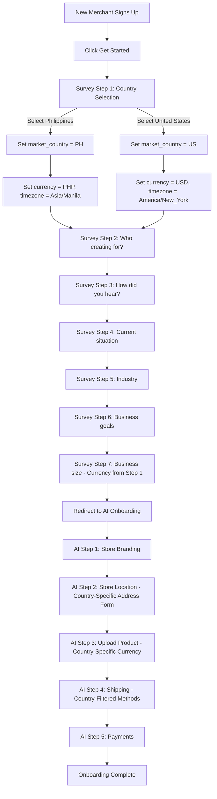
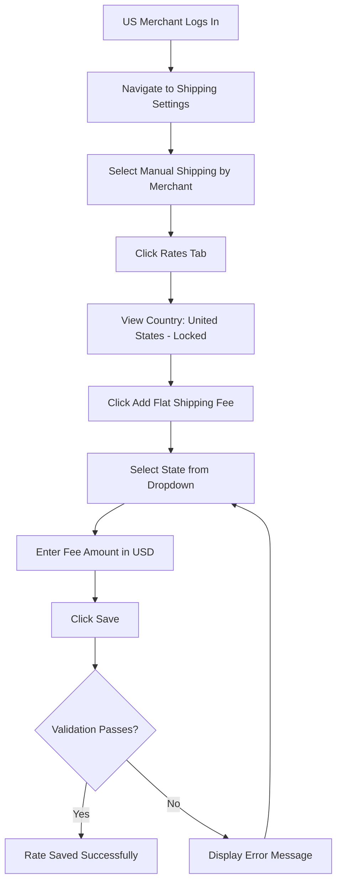
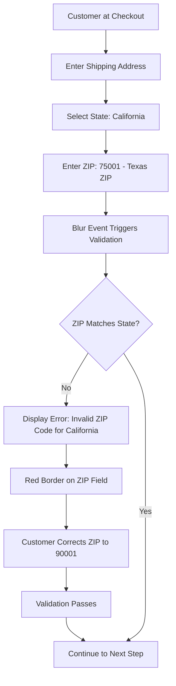
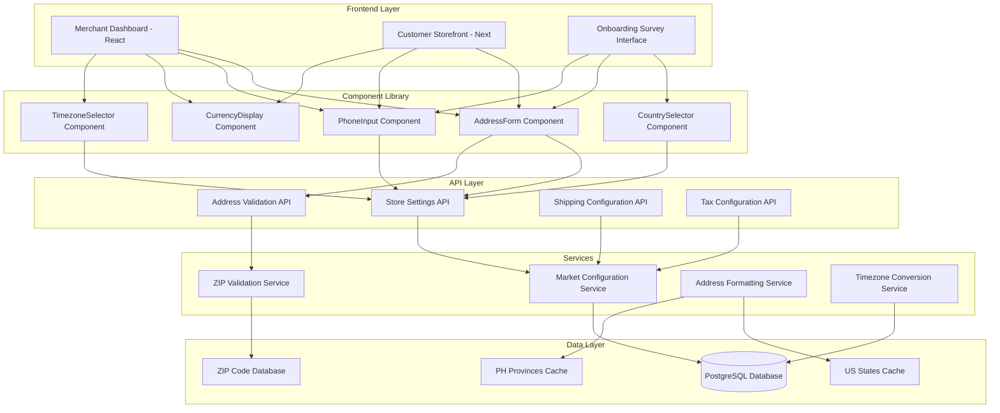
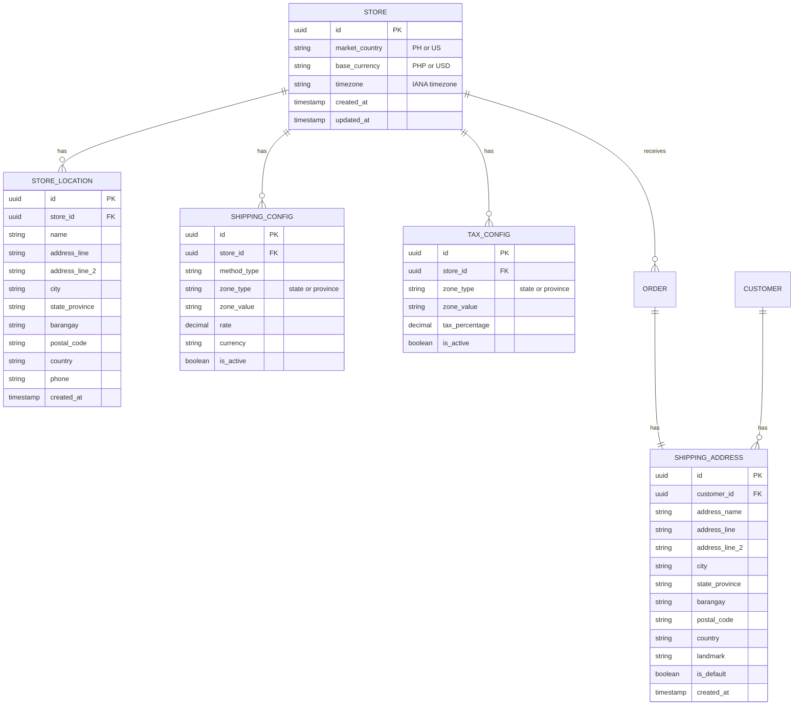

Agile-focused PRD documenting the Phase 1-A Single-Market MVP internationalization feature for Prosperna's eCommerce platform, enabling country-specific configurations for address fields, timezone, currency, and shipping methods.

## Document Control

| Item           | Details                                                     |
| -------------- | ----------------------------------------------------------- |
| Document Title | Phase 1-A Single-Market MVP                                 |
| Version        | 1.0                                                         |
| Date           | January 20, 2026                                            |
| Prepared by    | Business Analyst                                            |
| Reviewed by    | To be assigned                                              |
| Approved by    | To be assigned                                              |
| Status         | For Review                                                  |
| Related BRD    | P1 - Address Fields Enhancement - Allow Other Countries BRD |

---

## Revision History

| Version | Date       | Author           | Change Description                                        |
| ------- | ---------- | ---------------- | --------------------------------------------------------- |
| 1.0     | 2026-01-20 | Business Analyst | Initial draft - Phase 1-A Single-Market MVP specification |

---

## 1. Introduction

### 1.1 Document Purpose

This PRD defines the detailed functional requirements, acceptance criteria (using BDD/Gherkin), and technical specifications for **Phase 1-A Single-Market MVP** of Prosperna's internationalization initiative. This phase establishes the foundational "configuration-based" approach that will eventually evolve into a full Shopify Markets-like architecture.

Phase 1-A enables merchants to operate in either the **Philippines (PH)** or **United States (US)** market with appropriate address fields, currency symbols, timezone settings, shipping methods, and tax/shipping zone configurations. Each merchant is locked to a single market selected during the onboarding survey (Step 1 of 7 questions) before entering the AI-powered store setup.

### 1.2 Feature Vision

Prosperna will support merchants operating in multiple countries with localized experiences. Phase 1-A lays the groundwork by:

- Allowing new merchants to select their business country (PH or US) as the first step of the onboarding survey
- Displaying country-appropriate address fields throughout the platform
- Auto-configuring currency, timezone, and shipping methods based on country
- Providing zone-based shipping rates and taxes using country-specific states/provinces
- Ensuring existing Philippine merchants continue operating without disruption

This phase prioritizes **minimal disruption** to existing merchants while enabling **new US-based merchants** to onboard with a localized experience.

**Onboarding Flow Overview:**

1. New merchant signs up and enters the 7-question onboarding survey
2. **Step 1 (NEW):** Country selection (Philippines or United States)
3. Steps 2-7: Existing survey questions (who creating for, current situation, how heard about us, industry, goals, business size)
4. After survey completion, merchant enters AI-powered onboarding for store setup
5. All AI onboarding forms and options are pre-configured based on country selected in Step 1

### 1.3 Success Criteria

**User Adoption & Usage:**

- 100% of new merchants complete country selection during onboarding
- 95% of US merchants successfully configure at least one shipping method within 7 days
- Zero support tickets related to address field confusion for US merchants
- Existing PH merchants experience no workflow changes or errors

**Technical Performance:**

- Address form rendering completes in `<` 500ms
- ZIP-to-State validation responds in `<` 200ms
- Country selection during onboarding adds `<` 1 second to flow
- Database migration completes in `<` 5 minutes for 10,000 merchants

**Business Impact:**

- Enable onboarding of first 100 US-based merchants within 30 days of launch
- Reduce address-related checkout abandonment by 15%
- Establish foundation for Phase 1-B (Payment Gateways) and Phase 2 (Multi-Market)

**User Satisfaction:**

- 90%+ task success rate in usability testing for address entry
- `<` 3% error rate on ZIP code validation
- Positive feedback from beta US merchants on address form UX

### 1.4 Related Documents

- [P1 | Address Fields Enhancement | Allow Other Countries BRD](https://app.clickup.com/7537039/docs/760cf-59218)

---

## 2. Background & Context

### 2.1 Problem Statement

**Current Pain Point:**

Prosperna's platform is currently hardcoded for Philippine merchants only:

1. Address forms display Philippine-specific fields (Province, City, Barangay)
2. Currency is fixed to PHP (₱) with no alternative
3. Shipping carriers are Philippine-only (JNT, Lalamove)
4. Timezone defaults to Asia/Manila with limited options
5. Tax and shipping zones only support Philippine provinces

**Impact of Current Limitations:**

- **Market Restriction:** Cannot onboard merchants outside the Philippines
- **Lost Revenue:** Missing potential US market opportunity
- **Competitive Disadvantage:** Competitors offer multi-country support
- **Poor UX for International Customers:** No way to enter US addresses on PH stores

**Business Context:**

- Growing demand from Filipino-American merchants wanting US-based stores
- Strategic goal to expand into US market by Q2 2026
- Need for incremental approach to avoid disrupting 10,000+ existing PH merchants

### 2.2 Current State

**Current Address Field Behavior:**

1. **Store Location Form:**
   - Fixed Philippine fields: Address Line, Province (dropdown), City (cascading), Barangay (cascading), Postal Code
   - No country selection
   - Phone defaults to +63

2. **Customer Checkout:**
   - Same Philippine fields for all customers
   - No ability to enter US-style addresses
   - Cascading dropdowns required for Province → City → Barangay

3. **Shipping Configuration:**
   - Only Philippine carriers (JNT, Lalamove) available
   - Zone selection limited to Philippine provinces
   - Manual Shipping uses PHP currency only

4. **Tax Configuration:**
   - Zones limited to Philippine provinces
   - No US state tax support

**Current Limitations:**

- No `market_country` field in database
- Currency symbol hardcoded to ₱
- Address validation assumes Philippine format
- No ZIP-to-State validation capability

### 2.3 Desired Future State

**Enhanced Internationalization with Single-Market Configuration:**

1. **Country Selection at Onboarding:**
   - New merchants select PH or US during signup
   - Selection locks all downstream configurations
   - Cannot be changed post-onboarding (contact support required)

2. **Dynamic Address Forms:**
   - PH merchants see: Province → City → Barangay (cascading)
   - US merchants see: State (dropdown), City (text), ZIP Code
   - Appropriate validation for each country

3. **Currency & Timezone:**
   - PH: PHP (₱), Asia/Manila (single timezone)
   - US: USD ($), 7 US timezone options

4. **Shipping & Tax Zones:**
   - PH: 81 provinces for zone selection
   - US: 50 states + DC for zone selection

**Benefits After Implementation:**

- **Market Expansion:** Ability to onboard US-based merchants
- **Localized UX:** Country-appropriate forms and validation
- **Foundation for Growth:** Architecture supports future Phase 2 (Multi-Market)
- **Zero Disruption:** Existing PH merchants unaffected

### 2.4 Target Users

| User Segment          | Description                                     | Use Case                                                                              | Frequency                           |
| --------------------- | ----------------------------------------------- | ------------------------------------------------------------------------------------- | ----------------------------------- |
| New US Merchants      | First-time merchants based in the United States | Complete onboarding with US country selection, configure store with US address fields | One-time setup, daily dashboard use |
| New PH Merchants      | First-time merchants based in the Philippines   | Complete onboarding with PH country selection (default), continue existing flow       | One-time setup, daily dashboard use |
| Existing PH Merchants | Current Prosperna merchants (pre-migration)     | Continue using platform normally after migration assigns them to PH market            | Daily dashboard use                 |
| US Store Customers    | Customers shopping on US merchant storefronts   | Enter US shipping addresses, see USD prices                                           | Per-order basis                     |
| PH Store Customers    | Customers shopping on PH merchant storefronts   | Enter PH shipping addresses, see PHP prices                                           | Per-order basis                     |

### 2.5 Project Constraints & Assumptions

**Technical Constraints:**

- Must maintain backward compatibility with existing PH merchant data
- Cannot modify existing address data during migration
- Must use existing address component architecture (extend, not replace)
- ZIP-to-State validation requires external data source or API
- US address character limits (35 chars) based on carrier requirements

**Business Constraints:**

- Phase 1-A excludes payment gateway configuration (deferred to Phase 1-B)
- No cross-border shipping in Phase 1 (merchant and customer must be same country)
- Country selection is immutable post-onboarding (support intervention required)
- Limited to 2 countries (PH, US) for Phase 1

**Key Assumptions:**

- Existing merchants are all Philippines-based (migration assigns PH)
- US merchants will primarily use Manual Shipping initially (no US carrier integrations)
- Most US merchants will be in continental US (timezone focus on main 7 zones)
- Address validation rules align with USPS and PhilPost standards

---

# 3. Functional Requirements & BDD Scenarios

---

## Feature F-01: Merchant Onboarding Survey - Country Selection (Step 1 of 7)

### 3.1.1 Feature Context

Enable new merchants to select their business country (Philippines or United States) as the **first step of the 7-question onboarding survey**, before entering the AI-powered store setup. This selection determines the merchant's `market_country` and locks all subsequent configurations including address field formats, currency, timezone options, available shipping methods, and dynamically affects later survey questions (e.g., Step 7 business size displays currency in ₱ or $ based on this selection).

### 3.1.2 Business Rules

**BR-01: Country Selection Requirement**

- Country selection is **Step 1 of 7** in the onboarding survey (displayed immediately after clicking "Get Started")
- Two options available as selection cards: "Philippines" and "United States"
- Each card displays: Country flag, country name, and currency indicator (PHP (₱) or USD ($))
- No default pre-selection; merchant must explicitly select one country
- "Next" button proceeds to Step 2 of the survey
- Selection determines the `market_country` value stored in the database

**BR-02: Country Selection Immutability**

- Once a merchant completes the onboarding survey and AI-powered store setup, the `market_country` cannot be changed via the dashboard
- Changing country requires contacting support (manual intervention)
- All downstream configurations are locked to the selected country
- Warning message displayed during Step 1: "Note: This cannot be changed after setup. Please select carefully."

**BR-02A: Survey Step 7 Dynamic Currency Display**

- Step 7 "What size is your business?" displays revenue thresholds in the currency selected in Step 1
- If Philippines selected: Shows "₱250,000", "₱250K to ₱1M", "₱1M+"
- If United States selected: Shows appropriate USD thresholds (e.g., "$10,000", "$10K to $50K", "$50K+")

**BR-03: Auto-Configuration Based on Country**

- **Philippines Selection:**
  - `base_currency` set to "PHP"
  - `timezone` defaults to "Asia/Manila"
  - Address fields: Address Line, Province, City, Barangay, Postal Code (4-digit)
  - Phone country code defaults to "+63"
  - Shipping methods: All PH carriers available (JNT, Lalamove, etc.)
- **United States Selection:**
  - `base_currency` set to "USD"
  - `timezone` defaults to "America/New_York"
  - Address fields: Address Line, Apt/Suite, City, State (dropdown), ZIP Code (5-digit)
  - Phone country code defaults to "+1"
  - Shipping methods: Manual Shipping and Store Pickup only (no PH carriers)

### 3.1.3 Scenarios

##### Scenario 1: Country selection displays as Step 1 of onboarding survey

```gherkin
Given a new merchant has clicked "Get Started" on the welcome page
When the onboarding survey begins
Then the survey displays "STEP 1 OF 7" progress indicator
And the question displays: "Where is your business located?"
And two country selection cards are displayed side by side:
  | Country       | Flag | Currency Indicator |
  | United States | 🇺🇸  | USD ($)            |
  | Philippines   | 🇵🇭  | PHP (₱)            |
And neither card is pre-selected (no default)
And an informational message displays below the cards: "Note: This cannot be changed after setup. Please select carefully."
And a "Next" button is displayed in the bottom-right corner
And the "Next" button is disabled until a country is selected
```

##### Scenario 2: Merchant selects Philippines and proceeds to Step 2

```gherkin
Given the merchant is on Step 1 of the onboarding survey
And no country is currently selected
When the merchant clicks on the "Philippines" card
Then the "Philippines" card becomes selected (highlighted with dark background)
And the "United States" card remains unselected (white background)
And the "Next" button becomes enabled
When the merchant clicks the "Next" button
Then the system sets `market_country` to "PH"
And the system sets `base_currency` to "PHP"
And the system sets `timezone` to "Asia/Manila"
And the merchant proceeds to Step 2 of 7: "Who are you creating a website for?"
```

##### Scenario 3: Merchant selects United States and proceeds to Step 2

```gherkin
Given the merchant is on Step 1 of the onboarding survey
And no country is currently selected
When the merchant clicks on the "United States" card
Then the "United States" card becomes selected (highlighted with dark background)
And the "Philippines" card remains unselected (white background)
And the "Next" button becomes enabled
When the merchant clicks the "Next" button
Then the system sets `market_country` to "US"
And the system sets `base_currency` to "USD"
And the system sets `timezone` to "America/New_York"
And the merchant proceeds to Step 2 of 7: "Who are you creating a website for?"
```

##### Scenario 4: Merchant changes country selection before proceeding

```gherkin
Given the merchant is on Step 1 of the onboarding survey
And the merchant has selected "Philippines"
And the "Philippines" card is highlighted
When the merchant clicks on the "United States" card
Then the "United States" card becomes selected (highlighted)
And the "Philippines" card becomes deselected (white background)
And only one country can be selected at a time
When the merchant clicks "Next"
Then the system sets `market_country` to "US" (the final selection)
```

##### Scenario 5: Country selection affects Step 7 business size currency display

```gherkin
Given the merchant selected "Philippines" in Step 1 of the survey
And the merchant has completed Steps 2 through 6
When the merchant reaches Step 7: "What size is your business?"
Then the business size options display with PHP currency:
  | Option                                 |
  | Small (less than ₱250,000 per month)   |
  | Medium (₱250K to ₱1M per month)        |
  | Large (more than ₱1M+ per month)       |
And the currency symbol is ₱ (Philippine Peso)
```

##### Scenario 6: US merchant sees USD in Step 7 business size options

```gherkin
Given the merchant selected "United States" in Step 1 of the survey
And the merchant has completed Steps 2 through 6
When the merchant reaches Step 7: "What size is your business?"
Then the business size options display with USD currency:
  | Option                                 |
  | Small (less than $10,000 per month)    |
  | Medium ($10K to $50K per month)        |
  | Large (more than $50K+ per month)      |
And the currency symbol is $ (US Dollar)
```

##### Scenario 7: Country selection affects AI onboarding address form (Step 2 of AI setup)

```gherkin
Given the merchant selected "United States" in the onboarding survey Step 1
And the merchant has completed all 7 survey questions
And the merchant has been redirected to the AI-powered store setup
And the merchant has completed AI onboarding Step 1: Store Branding
When the AI starts Step 2: Update Store Location
Then the address form displays US-specific fields
And the "Country" field displays "United States 🔒" (locked, read-only)
```

##### Scenario 8: Phone country code auto-populates based on selected country (Step 2 - Contact Numbers)

```gherkin
Given the merchant selected "United States" in the onboarding survey Step 1
And the merchant has completed Step 1: Store Branding
And the AI has asked for store address and merchant has submitted the address
When the AI displays: "Address updated successfully. What is the contact number for your store?"
And the contact number form is displayed
Then the "Primary Store Number" field shows "+1" with US flag icon as the pre-selected country code
And the "Alternate Store Number" field shows "+1" with US flag icon as the pre-selected country code
And the phone input expects 10-digit format
```

##### Scenario 9: Phone country code auto-populates for Philippine merchant (Step 2 - Contact Numbers)

```gherkin
Given the merchant selected "Philippines" in the onboarding survey Step 1
And the merchant has completed Step 1: Store Branding
And the AI has asked for store address and merchant has submitted the address
When the AI displays: "Address updated successfully. What is the contact number for your store?"
And the contact number form is displayed
Then the "Primary Store Number" field shows "+63" with Philippine flag icon as the pre-selected country code
And the "Alternate Store Number" field shows "+63" with Philippine flag icon as the pre-selected country code
And the phone input expects 10-digit format
```

##### Scenario 10: US merchant sees only 3 shipping method cards (Step 4)

```gherkin
Given the merchant selected "United States" in the onboarding survey Step 1
And the merchant has completed Steps 1, 2, and 3
And the AI has started Step 4: Set Up Shipping
When the merchant clicks "Yes, set up shipping"
Then the AI displays: "Great! Please choose your preferred shipping method:"
And only three shipping method cards are displayed:
  | Card                         | Button   | State   |
  | Manual Shipping by Customer  | Set Up   | Enabled |
  | Manual Shipping by Merchant  | Set Up   | Enabled |
  | Store Pickup                 | Set Up   | Enabled |
And the following cards are NOT displayed:
  | Hidden Card        |
  | Standard Delivery  |
  | Same Day Delivery  |
And no message indicates methods are hidden (clean UI)
```

##### Scenario 11: Philippine merchant sees all 5 shipping method cards (Step 4)

```gherkin
Given the merchant selected "Philippines" in the onboarding survey Step 1
And the merchant has completed Steps 1, 2, and 3
And the AI has started Step 4: Set Up Shipping
When the merchant clicks "Yes, set up shipping"
Then the AI displays: "Great! Please choose your preferred shipping method:"
And five shipping method cards are displayed:
  | Card                         | Badge    | Button   | State    |
  | Manual Shipping by Customer  | None     | Set Up   | Enabled  |
  | Manual Shipping by Merchant  | None     | Set Up   | Enabled  |
  | Store Pickup                 | None     | Set Up   | Enabled  |
  | Standard Delivery            | J&T      | Activate | Disabled |
  | Same Day Delivery            | Lalamove | Activate | Disabled |
```

##### Scenario 12: Phone verification uses correct country code (Step 5 - Payments)

```gherkin
Given the merchant selected "United States" in the onboarding survey Step 1
And the merchant has completed Steps 1-4
And the AI has started Step 5: Set Up Payments
When the merchant clicks "Yes, set up online payments"
And the AI displays: "Great! To set up online payments, we need to verify your phone number first."
Then the phone number input field is displayed with:
  | Element       | Value              |
  | Country Code  | +1                 |
  | Flag Icon     | 🇺🇸 (US flag)       |
  | Placeholder   | 10-digit number    |
```

##### Scenario 13: Phone verification uses Philippine country code for PH merchant (Step 5)

```gherkin
Given the merchant selected "Philippines" in the onboarding survey Step 1
And the merchant has completed Steps 1-4
And the AI has started Step 5: Set Up Payments
When the merchant clicks "Yes, set up online payments"
And the AI displays: "Great! To set up online payments, we need to verify your phone number first."
Then the phone number input field is displayed with:
  | Element       | Value              |
  | Country Code  | +63                |
  | Flag Icon     | 🇵🇭 (PH flag)       |
  | Placeholder   | 10-digit number    |
```

##### Scenario 14: US merchant address form validates ZIP code format (Step 2)

```gherkin
Given the merchant selected "United States" in the onboarding survey Step 1
And the AI has asked for store address
And the US address form is displayed
When the merchant enters "1234" in the ZIP Code field (only 4 digits)
And clicks outside the field (blur event)
Then the ZIP Code field shows a red border
And an error message displays: "ZIP code must be 5 digits"
When the merchant enters "12345" (5 digits)
Then the error message disappears
And the field border returns to normal
```

##### Scenario 15: US merchant address form validates ZIP-to-State match (Step 2)

```gherkin
Given the merchant selected "United States" in the onboarding survey Step 1
And the AI has asked for store address
And the US address form is displayed
When the merchant selects "Texas" from the State dropdown
And enters "90210" in the ZIP Code field (California ZIP)
And clicks outside the field (blur event)
Then the ZIP Code field shows a red border
And an error message displays: "Invalid ZIP Code for Texas."
When the merchant changes ZIP to "78701" (valid Texas ZIP)
Then the error message disappears
And the field border returns to normal
```

##### Scenario 16: Philippine merchant address form validates postal code format (Step 2)

```gherkin
Given the merchant selected "Philippines" in the onboarding survey Step 1
And the AI has asked for store address
And the Philippine address form is displayed
When the merchant enters "123" in the Postal Code field (only 3 digits)
And clicks outside the field (blur event)
Then the Postal Code field shows a red border
And an error message displays: "Postal code must be 4 digits"
When the merchant enters "6015" (4 digits)
Then the error message disappears
And the field border returns to normal
```

##### Scenario 17: Store Preview displays correct currency symbol based on country

```gherkin
Given the merchant selected "United States" in the onboarding survey Step 1
And the merchant has completed all 7 survey questions and entered AI onboarding
When the merchant proceeds through Step 1: Store Branding
Then the Store Preview displays prices with "$" currency symbol
When the merchant proceeds to Step 3: Upload a Product
And enters a regular price of "1500"
Then the Product Preview displays the price as "$1,500.00"
And NOT as "₱1,500.00"
```

##### Scenario 18: Store Preview displays PHP currency for Philippine merchant

```gherkin
Given the merchant selected "Philippines" in the onboarding survey Step 1
And the merchant has completed all 7 survey questions and entered AI onboarding
When the merchant proceeds through Step 1: Store Branding
Then the Store Preview displays prices with "₱" currency symbol
When the merchant proceeds to Step 3: Upload a Product
And enters a regular price of "1500"
Then the Product Preview displays the price as "₱1,500.00"
```

##### Scenario 19: US merchant can manually change phone country code if needed (Step 2)

```gherkin
Given the merchant selected "United States" in the onboarding survey Step 1
And the contact number form is displayed with "+1" pre-selected
When the merchant clicks the country code dropdown
Then a list of available country codes appears:
  | Flag | Code |
  | 🇺🇸  | +1   |
  | 🇵🇭  | +63  |
  | 🇨🇦  | +1   |
  | 🇦🇺  | +61  |
  | 🇬🇧  | +44  |
When the merchant selects "+63" (Philippines)
Then the country code updates to "+63" with Philippine flag
And the merchant can enter a Philippine phone number for international contact purposes
```

##### Scenario 20: Confirmation summary shows country-locked fields (AI onboarding Step 1)

```gherkin
Given the merchant selected "United States" in the onboarding survey Step 1
And the merchant has completed all 7 survey questions and entered AI onboarding
And the merchant has completed all Step 1 inputs
When the AI displays the Store Branding confirmation summary
Then the summary includes:
  """
  Store Details
  • Store Country: 🇺🇸 United States (locked)
  • Store Name: [entered name]
  • Store Slogan: [entered slogan]
  • Industry: [selected industry]
  • Store Currency: USD ($) - auto-set
  • Store Subdomain: [entered subdomain]
  • Logo: Uploaded ✅
  """
And the Store Country shows a lock icon indicating it cannot be changed
```

##### Scenario 21: Freestyle edit cannot change country-related locked fields

```gherkin
Given the merchant selected "Philippines" in the onboarding survey Step 1
And the merchant is at the Store Branding confirmation point
When the merchant clicks "No, I'd like to make changes"
And types "Change currency to USD"
And clicks Send
Then the AI responds: "Your store currency (PHP) is automatically determined by your store country (Philippines) and cannot be changed independently. If you need a different currency, you would need to start over with a different country selection. Would you like to make any other changes?"
And the base_currency remains "PHP"
And the AI re-displays the confirmation summary
```

##### Scenario 22: Address form country field displays as read-only with lock (Step 2)

```gherkin
Given the merchant selected "United States" in the onboarding survey Step 1
And the merchant has completed all 7 survey questions and entered AI onboarding
And the AI has started Step 2: Update Store Location
When the address form is displayed
Then the "Country" field displays "United States" with a lock icon (🔒)
And the "Country" field has a gray/muted background
And clicking on the "Country" field does nothing (non-interactive)
And the cursor shows "not-allowed" icon on hover over the Country field
```

##### Scenario 23: Merchant attempts to proceed without selecting a country

```gherkin
Given a new merchant is on Step 1 of the onboarding survey
And no country card is selected
When the merchant attempts to click the "Next" button
Then the "Next" button is disabled (cannot be clicked)
And the merchant must select a country to enable the "Next" button
When the merchant selects "Philippines"
Then the "Next" button becomes enabled
And the merchant can proceed to Step 2
```

##### Scenario 24: Existing Philippine merchants auto-assigned to Philippines market

```gherkin
Given the internationalization feature is deployed to production
And there are existing merchants in the database without `market_country` value
When the database migration script runs
Then all existing merchants are assigned `market_country` = "PH"
And all existing merchants are assigned `base_currency` = "PHP"
And all existing merchants retain their current timezone or default to "Asia/Manila"
And no changes are made to existing merchant data or configurations
And existing merchants continue to see Philippine address fields
```

---

## Feature F-02: Regional Settings Section in Store Settings

### 3.2.1 Feature Context

Add a new "Regional Settings" section to the Store Settings page that displays the merchant's locked country, auto-determined currency, and configurable timezone. This section appears between "Business Operations" and "Store Locations" sections.

### 3.2.2 Business Rules

**BR-04: Regional Settings Section Location**

- Section appears in Store Settings page
- Position: Below "Business Operations" section, above "Store Locations" section
- Section header: "Regional Settings" with info icon (ⓘ)
- Section description: "Configure your store's regional settings including country, currency, and timezone."

**BR-05: Store Country Field (Read-Only)**

- Field label: "Store Country"
- Display format: Flag emoji + Country name (e.g., "🇵🇭 Philippines" or "🇺🇸 United States")
- Field is read-only with lock icon (🔒) indicator
- Field has gray/muted background to indicate non-editable state
- Helper text below field: "Your store country was set during account creation and cannot be changed. Contact support if you need to update this."

**BR-06: Store Currency Field (Read-Only)**

- Field label: "Store Currency"
- Display format: Currency code + symbol + name
  - Philippines: "PHP (₱) - Philippine Peso"
  - United States: "USD ($) - US Dollar"
- Field is read-only with lock icon (🔒) indicator
- Field has gray/muted background to indicate non-editable state
- Helper text below field: "Currency is determined by your store country."

**BR-07: Store Timezone Field (Editable)**

- Field label: "Store Timezone"
- Field type: Dropdown/Select
- Required field (asterisk indicator)
- Options filtered based on `market_country`
- Helper text below field: "This timezone will be used for order timestamps, reports, and scheduled operations."

**BR-08: Timezone Options by Country**

- **Philippines (`market_country` `=` 'PH'):**
  - Single option: "Asia/Manila (GMT+8)"
  - Displayed as read-only since only one option exists
- **United States (`market_country` `=` 'US'):**
  | Value | Display Label |
  |-------|---------------|
  | America/New_York | Eastern Time (ET) - New York |
  | America/Chicago | Central Time (CT) - Chicago |
  | America/Denver | Mountain Time (MT) - Denver |
  | America/Phoenix | Mountain Time (MT) - Phoenix (No DST) |
  | America/Los_Angeles | Pacific Time (PT) - Los Angeles |
  | America/Anchorage | Alaska Time (AKT) - Anchorage |
  | America/Honolulu | Hawaii Time (HT) - Honolulu |

**BR-09: Regional Settings Save Behavior**

- "Save" button at bottom of section
- Only timezone field is saveable (country and currency are read-only)
- Success toast on save: "Regional settings saved successfully."
- Error toast on failure: "Failed to save regional settings. Please try again."

### 3.2.3 Scenarios

##### Scenario 1: Philippine merchant views Regional Settings section

```gherkin
Given a merchant with `market_country` = "PH" is logged into the dashboard
When the merchant navigates to Store Settings
Then the "Regional Settings" section is displayed
And the section appears between "Business Operations" and "Store Locations"
And the section header shows "Regional Settings" with an info icon
And the section description displays "Configure your store's regional settings including country, currency, and timezone."
And the "Store Country" field displays "🇵🇭 Philippines" with a lock icon
And the "Store Country" field has a gray background (read-only)
And the "Store Currency" field displays "PHP (₱) - Philippine Peso" with a lock icon
And the "Store Currency" field has a gray background (read-only)
And the "Store Timezone" field displays "Asia/Manila (GMT+8)"
And the "Store Timezone" field appears as read-only (single option for PH)
And a "Save" button is displayed at the bottom of the section
```

##### Scenario 2: US merchant views Regional Settings section

```gherkin
Given a merchant with `market_country` = "US" is logged into the dashboard
When the merchant navigates to Store Settings
Then the "Regional Settings" section is displayed
And the "Store Country" field displays "🇺🇸 United States" with a lock icon
And the "Store Country" field has a gray background (read-only)
And the "Store Currency" field displays "USD ($) - US Dollar" with a lock icon
And the "Store Currency" field has a gray background (read-only)
And the "Store Timezone" field is an editable dropdown
And the dropdown shows "Eastern Time (ET) - New York" as the default selection
And clicking the dropdown reveals 7 US timezone options
```

##### Scenario 3: US merchant changes timezone

```gherkin
Given a US merchant is viewing the Regional Settings section
And the "Store Timezone" dropdown shows "Eastern Time (ET) - New York"
When the merchant clicks the timezone dropdown
Then the dropdown expands showing all 7 US timezone options
When the merchant selects "Pacific Time (PT) - Los Angeles"
Then the dropdown closes
And the field now displays "Pacific Time (PT) - Los Angeles"
When the merchant clicks the "Save" button
Then the timezone is saved to the database
And a success toast displays: "Regional settings saved successfully."
And the page remains on Store Settings
```

##### Scenario 4: US merchant views all timezone options

```gherkin
Given a US merchant is on the Regional Settings section
When the merchant clicks the "Store Timezone" dropdown
Then the following options are displayed in order:
  | Option |
  | Eastern Time (ET) - New York |
  | Central Time (CT) - Chicago |
  | Mountain Time (MT) - Denver |
  | Mountain Time (MT) - Phoenix (No DST) |
  | Pacific Time (PT) - Los Angeles |
  | Alaska Time (AKT) - Anchorage |
  | Hawaii Time (HT) - Honolulu |
And each option is selectable
And only one option can be selected at a time
```

##### Scenario 5: Merchant attempts to click locked country field

```gherkin
Given a merchant is viewing the Regional Settings section
And the "Store Country" field displays with a lock icon
When the merchant clicks on the "Store Country" field
Then nothing happens (field is non-interactive)
And no dropdown or editor appears
And the cursor shows "not-allowed" icon on hover
And the helper text remains visible: "Your store country was set during account creation and cannot be changed. Contact support if you need to update this."
```

##### Scenario 6: Merchant attempts to click locked currency field

```gherkin
Given a merchant is viewing the Regional Settings section
And the "Store Currency" field displays with a lock icon
When the merchant clicks on the "Store Currency" field
Then nothing happens (field is non-interactive)
And no dropdown or editor appears
And the cursor shows "not-allowed" icon on hover
And the helper text remains visible: "Currency is determined by your store country."
```

##### Scenario 7: Regional Settings save failure handling

```gherkin
Given a US merchant has changed the timezone to "Pacific Time (PT) - Los Angeles"
And there is a network connectivity issue
When the merchant clicks the "Save" button
Then a loading indicator appears on the Save button
And after timeout, an error toast displays: "Failed to save regional settings. Please try again."
And the timezone selection reverts to the previously saved value
And the merchant remains on the Store Settings page
```

---

## Feature F-03: Store Location Address Fields (Merchant Dashboard)

### 3.3.1 Feature Context

Display country-appropriate address fields in the Store Location form based on the merchant's `market_country`. This affects the Add/Edit Store Location modal in Location Settings.

### 3.3.2 Business Rules

**BR-10: Philippine Address Fields (Store Location)**

- Fields displayed in order:
  1. **Store Name\*** - Text input, required
  2. **Address Line\*** - Text input, required, placeholder: "Enter street address"
  3. **State/Province\*** - Dropdown, required, options: Philippine provinces (cascading)
  4. **City/Town\*** - Dropdown, required, options: Cities based on selected province
  5. **Territory/Barangay\*** - Dropdown, required, options: Barangays based on selected city
  6. **Postal Code\*** - Text input, required, 4-digit validation (`/^\d{4}$/`)
  7. **Country** - Read-only display showing "Philippines" with lock icon
  8. **Contact Number\*** - Phone input with +63 country code pre-selected

**BR-11: United States Address Fields (Store Location)**

- Fields displayed in order:
  1. **Store Name\*** - Text input, required
  2. **Address Line\*** - Text input, required, max 35 characters, placeholder: "Enter street address"
  3. **Apartment, Suite, etc.** - Text input, optional, max 35 characters, placeholder: "Apt, suite, unit, building, floor, etc."
  4. **City** - Text input, optional, max 35 characters, placeholder: "Enter city"
  5. **State\*** - Dropdown, required, options: 50 US States + DC (see US States Table)
  6. **ZIP Code\*** - Text input, required, 5-digit validation (`/^\d{5}$/`)
  7. **Country** - Read-only display showing "United States" with lock icon
  8. **Contact Number\*** - Phone input with +1 country code pre-selected

**BR-12: US Address Validation Rules**

- Address Line: Required, max 35 characters, should contain a number (warning if not)
- State: Required, must be from the 50 states + DC list
- ZIP Code: Required, must be exactly 5 digits
- ZIP Code cross-validation with State (validate ZIP belongs to selected State)
- Invalid ZIP shows error: "Invalid ZIP Code for `{State}`."

**BR-13: Philippine Address Validation Rules**

- All dropdown fields (Province, City, Barangay) use cascading selection
- Postal Code: Required, must be exactly 4 digits
- Province → City → Barangay hierarchy must be maintained
- Empty cascading field shows "Please select `{previous field}` first"

**BR-14: Incomplete Address Warning (US Only)**

- If US Address Line does not contain a number when saving:
  - Display warning modal with title: "Incomplete Address"
  - Modal body: "You are about to save an incomplete address. You can either proceed or add a building/street number if you have one."
  - Modal question: "Would you like to proceed?"
  - Buttons: "Cancel" (returns to form) and "Confirm" (saves address)

**BR-15: Phone Country Code Auto-Population**

- When country is displayed, phone country code auto-populates:
  - Philippines: +63
  - United States: +1
- Merchant can manually change country code if needed (for international contacts)
- If country field changes (n/a in single-market), country code updates automatically

### 3.3.3 Scenarios

##### Scenario 1: Philippine merchant opens Add Store Location modal

```gherkin
Given a merchant with `market_country` = "PH" is on Location Settings
When the merchant clicks "Add Store Location" button
Then the Add Store Location modal opens
And the form displays the following fields in order:
  | Field | Type | Required |
  | Store Name | Text input | Yes |
  | Address Line | Text input | Yes |
  | State/Province | Dropdown | Yes |
  | City/Town | Dropdown | Yes |
  | Territory/Barangay | Dropdown | Yes |
  | Postal Code | Text input | Yes |
  | Country | Read-only | N/A |
  | Contact Number | Phone input | Yes |
And the "Country" field displays "Philippines" with a lock icon
And the "Contact Number" field shows "+63" as the pre-selected country code
And the "State/Province" dropdown is enabled and shows "Select Province"
And "City/Town" and "Territory/Barangay" dropdowns are disabled initially
```

##### Scenario 2: Philippine merchant selects Province, City, and Barangay (cascading)

```gherkin
Given a Philippine merchant has the Add Store Location modal open
And the "State/Province" dropdown shows "Select Province"
When the merchant selects "Cebu" from the Province dropdown
Then the "City/Town" dropdown becomes enabled
And the "City/Town" dropdown shows "Select City"
And the "City/Town" options are cities within Cebu province
When the merchant selects "Cebu City" from the City dropdown
Then the "Territory/Barangay" dropdown becomes enabled
And the "Territory/Barangay" dropdown shows "Select Barangay"
And the "Territory/Barangay" options are barangays within Cebu City
When the merchant selects "Lahug" from the Barangay dropdown
Then all three cascading dropdowns are filled
And no validation errors are displayed
```

##### Scenario 3: US merchant opens Add Store Location modal

```gherkin
Given a merchant with `market_country` = "US" is on Location Settings
When the merchant clicks "Add Store Location" button
Then the Add Store Location modal opens
And the form displays the following fields in order:
  | Field | Type | Required |
  | Store Name | Text input | Yes |
  | Address Line | Text input | Yes |
  | Apartment, Suite, etc. | Text input | No |
  | City | Text input | No |
  | State | Dropdown | Yes |
  | ZIP Code | Text input | Yes |
  | Country | Read-only | N/A |
  | Contact Number | Phone input | Yes |
And the "Country" field displays "United States" with a lock icon
And the "Contact Number" field shows "+1" as the pre-selected country code
And the "State" dropdown shows "Select State" with all 50 states + DC available
And the Philippine-specific fields (Province, City/Town, Barangay) are NOT displayed
```

##### Scenario 4: US merchant enters valid store location

```gherkin
Given a US merchant has the Add Store Location modal open
When the merchant enters the following information:
  | Field | Value |
  | Store Name | Austin Main Store |
  | Address Line | 123 Congress Avenue |
  | Apartment, Suite, etc. | Suite 500 |
  | City | Austin |
  | State | Texas |
  | ZIP Code | 78701 |
  | Contact Number | 5125551234 |
And all fields pass validation (no red borders)
When the merchant clicks the "Save" button
Then the store location is saved successfully
And a success toast displays: "Successfully added store location."
And the modal closes
And the new store location appears in the Location Settings list
```

##### Scenario 5: US merchant enters ZIP Code that doesn't match State

```gherkin
Given a US merchant has the Add Store Location modal open
And the merchant has selected "Texas" as the State
When the merchant enters "90210" in the ZIP Code field
And clicks outside the field (blur event)
Then the ZIP Code field shows a red border
And an error message displays below the field: "Invalid ZIP Code for Texas."
And the "Save" button remains clickable but will fail validation on click
```

##### Scenario 6: US merchant enters address without street number

```gherkin
Given a US merchant has filled all required fields:
  | Field | Value |
  | Store Name | Downtown Store |
  | Address Line | Main Street |
  | State | California |
  | ZIP Code | 90001 |
And the Address Line "Main Street" does not contain a number
When the merchant clicks the "Save" button
Then an "Incomplete Address" warning modal appears
And the modal title displays "Incomplete Address"
And the modal body displays "You are about to save an incomplete address. You can either proceed or add a building/street number if you have one."
And the modal shows "Would you like to proceed?"
And two buttons are displayed: "Cancel" and "Confirm"
```

##### Scenario 7: US merchant confirms incomplete address warning

```gherkin
Given the "Incomplete Address" warning modal is displayed
When the merchant clicks the "Confirm" button
Then the modal closes
And the store location is saved with the address "Main Street"
And a success toast displays: "Successfully added store location."
And the store location appears in the list
```

##### Scenario 8: US merchant cancels incomplete address warning

```gherkin
Given the "Incomplete Address" warning modal is displayed
When the merchant clicks the "Cancel" button
Then the modal closes
And the merchant returns to the Add Store Location form
And all previously entered data is preserved
And the Address Line field is focused for editing
And no data is saved
```

##### Scenario 9: US merchant exceeds Address Line character limit

```gherkin
Given a US merchant is entering data in the Add Store Location modal
When the merchant types more than 35 characters in the "Address Line" field
Then typing stops at 35 characters (input blocked)
And a character counter displays "35/35" below the field
And no error message is shown (limit enforced silently)
```

##### Scenario 10: Philippine merchant enters invalid postal code

```gherkin
Given a Philippine merchant has filled the Add Store Location form
And enters "123" in the Postal Code field (only 3 digits)
When the merchant clicks outside the field (blur event)
Then the Postal Code field shows a red border
And an error message displays below the field: "Postal code must be 4 digits"
When the merchant changes the value to "6000"
Then the error message disappears
And the field border returns to normal
```

##### Scenario 11: US merchant views all 50 states + DC in dropdown

```gherkin
Given a US merchant has the Add Store Location modal open
When the merchant clicks the "State" dropdown
Then a scrollable list appears with 51 options (50 states + DC)
And the options are displayed in alphabetical order:
  | First options shown |
  | Alabama |
  | Alaska |
  | Arizona |
  | Arkansas |
  | California |
  | ... |
And "District of Columbia" appears between Delaware and Florida
And Wyoming is the last option
And each option displays the full state name (not abbreviations)
```

##### Scenario 12: Merchant edits existing store location

```gherkin
Given a US merchant has an existing store location:
  | Field | Value |
  | Store Name | Austin Main Store |
  | Address Line | 123 Congress Avenue |
  | State | Texas |
  | ZIP Code | 78701 |
When the merchant clicks the "Edit" button for this store location
Then the Edit Store Location modal opens
And all fields are pre-populated with the existing values
And the "Country" field displays "United States" (read-only, locked)
When the merchant changes the Address Line to "456 Lamar Boulevard"
And clicks "Save"
Then the store location is updated successfully
And a success toast displays: "Successfully updated store location."
```

---

## Feature F-04: Business Pickup Address Fields (Shipping Settings)

### 3.4.1 Feature Context

Display country-appropriate address fields in the Business Pickup Address form within Shipping Settings. This follows the same field structure as Store Location but is used for configuring pickup addresses for shipping carriers.

### 3.4.2 Business Rules

**BR-16: Philippine Pickup Address Fields**

- Fields displayed in order:
  1. **Save Address as\*** - Text input, required (address nickname)
  2. **Business Address\*** - Text input, required, placeholder: "Enter street address"
  3. **State/Province\*** - Dropdown, required
  4. **City\*** - Dropdown, required (cascading from Province)
  5. **Barangay\*** - Dropdown, required (cascading from City)
  6. **Contact Person\*** - Text input, required
  7. **Contact Number\*** - Phone input with +63 pre-selected

**BR-17: United States Pickup Address Fields**

- Fields displayed in order:
  1. **Save Address as\*** - Text input, required (address nickname)
  2. **Business Address\*** - Text input, required, max 35 characters
  3. **Apartment, Suite, etc.** - Text input, optional, max 35 characters
  4. **City** - Text input, optional, max 35 characters
  5. **State\*** - Dropdown, required (50 states + DC)
  6. **ZIP Code\*** - Text input, required, 5-digit validation
  7. **Contact Person\*** - Text input, required
  8. **Contact Number\*** - Phone input with +1 pre-selected

**BR-18: Pickup Address Validation**

- All validation rules from Store Location (BR-12, BR-13, BR-14) apply
- Address nickname (Save Address as) must be unique within merchant account
- Duplicate nickname error: "This address name already exists. Please use a different name."

### 3.4.3 Scenarios

##### Scenario 1: Philippine merchant adds business pickup address

```gherkin
Given a Philippine merchant is on Shipping Settings
When the merchant clicks "Add Pickup Address" button
Then the Add Pickup Address modal opens
And the form displays Philippine address fields:
  | Field | Type |
  | Save Address as | Text input |
  | Business Address | Text input |
  | State/Province | Dropdown |
  | City | Dropdown (cascading) |
  | Barangay | Dropdown (cascading) |
  | Contact Person | Text input |
  | Contact Number | Phone input (+63) |
And the "Country" field is NOT displayed (inferred from market_country)
And no Postal Code field is displayed (different from Store Location)
```

##### Scenario 2: US merchant adds business pickup address

```gherkin
Given a US merchant is on Shipping Settings
When the merchant clicks "Add Pickup Address" button
Then the Add Pickup Address modal opens
And the form displays US address fields:
  | Field | Type |
  | Save Address as | Text input |
  | Business Address | Text input |
  | Apartment, Suite, etc. | Text input |
  | City | Text input |
  | State | Dropdown |
  | ZIP Code | Text input |
  | Contact Person | Text input |
  | Contact Number | Phone input (+1) |
And the Philippine-specific fields (Province, City dropdown, Barangay) are NOT displayed
```

##### Scenario 3: US merchant saves valid pickup address

```gherkin
Given a US merchant has the Add Pickup Address modal open
When the merchant enters:
  | Field | Value |
  | Save Address as | Main Warehouse |
  | Business Address | 500 Industrial Blvd |
  | Apartment, Suite, etc. | Building C |
  | City | Houston |
  | State | Texas |
  | ZIP Code | 77001 |
  | Contact Person | John Smith |
  | Contact Number | 7135551234 |
And clicks the "Save" button
Then the pickup address is saved successfully
And a success toast displays: "Successfully added pickup address."
And the new address appears in the Pickup Addresses list
And the address can be selected for shipping configuration
```

##### Scenario 4: Merchant enters duplicate address nickname

```gherkin
Given a US merchant has an existing pickup address named "Main Warehouse"
When the merchant adds a new pickup address
And enters "Main Warehouse" in the "Save Address as" field
And fills all other required fields
And clicks "Save"
Then the form is not submitted
And an error appears below the "Save Address as" field: "This address name already exists. Please use a different name."
And the field border turns red
```

---

## Feature F-05: Shipping Methods Visibility by Market Country

### 3.5.1 Feature Context

Control the visibility of shipping methods in Shipping Settings based on the merchant's `market_country`. Philippine carriers (JNT, Lalamove, Same Day Delivery) are hidden for US merchants, while universal methods (Manual Shipping, Store Pickup) remain available for all markets.

### 3.5.2 Business Rules

**BR-19: Shipping Methods for Philippine Merchants**

- All shipping methods are available:
  - Standard Delivery (JNT, etc.)
  - Same Day Delivery (Lalamove)
  - Scheduled Delivery - Lalamove
  - Manual Shipping by Merchant
  - Manual Shipping by Customer
  - Store Pickup

**BR-20: Shipping Methods for US Merchants**

- Available shipping methods:
  - Manual Shipping by Merchant
  - Manual Shipping by Customer
  - Store Pickup
- Hidden shipping methods (not displayed):
  - Standard Delivery (JNT, etc.)
  - Same Day Delivery (Lalamove)
  - Scheduled Delivery - Lalamove
- No message indicating hidden methods (clean UI)

**BR-21: Shipping Method Selection at Checkout**

- Only enabled shipping methods appear at customer checkout
- US merchant stores show only: Manual Shipping, Store Pickup
- PH merchant stores show all enabled shipping methods
- Shipping method availability determined by `store.market_country`

### 3.5.3 Scenarios

##### Scenario 1: Philippine merchant views Shipping Settings

```gherkin
Given a Philippine merchant is logged into the dashboard
When the merchant navigates to Shipping Settings
Then all shipping method sections are displayed:
  | Shipping Method |
  | Standard Delivery |
  | Same Day Delivery |
  | Scheduled Delivery - Lalamove |
  | Manual Shipping by Merchant |
  | Manual Shipping by Customer |
  | Store Pickup |
And each method has a toggle to enable/disable
And each method has configuration options
```

##### Scenario 2: US merchant views Shipping Settings

```gherkin
Given a US merchant is logged into the dashboard
When the merchant navigates to Shipping Settings
Then only the following shipping methods are displayed:
  | Shipping Method |
  | Manual Shipping by Merchant |
  | Manual Shipping by Customer |
  | Store Pickup |
And the following methods are NOT displayed (hidden):
  | Hidden Method |
  | Standard Delivery |
  | Same Day Delivery |
  | Scheduled Delivery - Lalamove |
And no message indicates methods are hidden
And the page layout adjusts cleanly with only 3 methods
```

##### Scenario 3: US merchant enables Manual Shipping

```gherkin
Given a US merchant is on Shipping Settings
And "Manual Shipping by Merchant" toggle is currently OFF
When the merchant clicks the toggle for "Manual Shipping by Merchant"
Then the toggle switches to ON (enabled)
And configuration options for Manual Shipping expand
And the merchant can set shipping rates and zones
When the merchant saves the configuration
Then Manual Shipping by Merchant is enabled for checkout
And customers can select this option during checkout
```

##### Scenario 4: US merchant customer views shipping options at checkout

```gherkin
Given a US merchant has enabled:
  | Shipping Method | Status |
  | Manual Shipping by Merchant | Enabled |
  | Store Pickup | Enabled |
  | Manual Shipping by Customer | Disabled |
And a customer is checking out on this merchant's storefront
When the customer reaches the Shipping Method selection step
Then only the following options are displayed:
  | Shipping Option |
  | Manual Shipping by Merchant |
  | Store Pickup |
And "Manual Shipping by Customer" is NOT displayed (disabled by merchant)
And no PH-specific carriers (JNT, Lalamove) are displayed
```

---

## Feature F-06: Customer Checkout - Shipping Address Fields (Storefront)

### 3.6.1 Feature Context

Display country-appropriate shipping address fields on the customer checkout page based on the merchant's `market_country`. Customers shopping at US merchant stores see US address fields; customers at PH merchant stores see Philippine address fields. No country selector is presented to customers—the form is locked to the merchant's market.

### 3.6.2 Business Rules

**BR-22: Philippine Checkout Address Fields**

- Fields displayed in order:
  1. **Address Name\*** - Text input, required (e.g., "Home", "Office")
  2. **Address Line\*** - Text input, required, placeholder: "Enter your address"
  3. **State/Province\*** - Dropdown, required
  4. **City/Town\*** - Dropdown, required (cascading from Province)
  5. **Barangay\*** - Dropdown, required (cascading from City)
  6. **Zip/Postal Code\*** - Text input, required, 4-digit validation
  7. **Landmark** - Text input, optional, placeholder: "Enter landmark"

**BR-23: United States Checkout Address Fields**

- Fields displayed in order:
  1. **Address Name\*** - Text input, required (e.g., "Home", "Office")
  2. **Address Line\*** - Text input, required, max 35 characters, placeholder: "Enter your address"
  3. **Apartment, Suite, etc.** - Text input, optional, max 35 characters, placeholder: "Enter your apartment or suite"
  4. **City** - Text input, optional, max 35 characters, placeholder: "Enter your city"
  5. **State\*** - Dropdown, required, placeholder: "Enter your state"
  6. **ZIP Code\*** - Text input, required, 5-digit validation, placeholder: "Enter your ZIP code"
  7. **Landmark** - Text input, optional, placeholder: "Enter your landmark"

**BR-24: No Country Selector for Customers**

- Country field is NOT displayed to customers during checkout
- Address form is pre-configured based on merchant's `market_country`
- Customers cannot change the country context
- All customers shopping at a US store enter US addresses
- All customers shopping at a PH store enter Philippine addresses

**BR-25: Customer Address Validation (US)**

- Address Line: Required, max 35 characters
- State: Required, must select from dropdown
- ZIP Code: Required, 5 digits, validated against selected State
- Invalid ZIP error: "Invalid ZIP Code for `{State}`."
- Address Line without number: Show "Incomplete Address" warning modal (same as merchant)

**BR-26: Customer Address Validation (PH)**

- Cascading dropdown validation (Province → City → Barangay)
- Postal Code: Required, 4 digits
- All dropdowns required before proceeding

### 3.6.3 Scenarios

##### Scenario 1: Customer views checkout address form on Philippine merchant store

```gherkin
Given a customer is shopping on a Philippine merchant's storefront
And the customer has items in their cart
When the customer proceeds to checkout and reaches the Shipping Info step
Then the shipping address form displays Philippine fields:
  | Field | Type | Required |
  | Address Name | Text input | Yes |
  | Address Line | Text input | Yes |
  | State/Province | Dropdown | Yes |
  | City/Town | Dropdown | Yes |
  | Barangay | Dropdown | Yes |
  | Zip/Postal Code | Text input | Yes |
  | Landmark | Text input | No |
And NO country selector is displayed
And the form is locked to Philippine address format
And cascading dropdowns work for Province → City → Barangay
```

##### Scenario 2: Customer views checkout address form on US merchant store

```gherkin
Given a customer is shopping on a US merchant's storefront
And the customer has items in their cart
When the customer proceeds to checkout and reaches the Shipping Info step
Then the shipping address form displays US fields:
  | Field | Type | Required |
  | Address Name | Text input | Yes |
  | Address Line | Text input | Yes |
  | Apartment, Suite, etc. | Text input | No |
  | City | Text input | No |
  | State | Dropdown | Yes |
  | ZIP Code | Text input | Yes |
  | Landmark | Text input | No |
And NO country selector is displayed
And the form is locked to US address format
And the State dropdown contains all 50 states + DC
And Philippine fields (Province, City dropdown, Barangay) are NOT displayed
```

##### Scenario 3: Customer enters valid US shipping address

```gherkin
Given a customer is on checkout for a US merchant store
And the shipping address form is displayed with US fields
When the customer enters:
  | Field | Value |
  | Address Name | Home |
  | Address Line | 456 Oak Street |
  | Apartment, Suite, etc. | Apt 2B |
  | City | Los Angeles |
  | State | California |
  | ZIP Code | 90001 |
And all validations pass (no red borders)
When the customer clicks "Continue" or "Next"
Then the address is saved to the order
And the customer proceeds to the next checkout step
And no validation errors are displayed
```

##### Scenario 4: Customer enters invalid ZIP Code for selected State

```gherkin
Given a customer is on checkout for a US merchant store
And has selected "California" as the State
When the customer enters "75001" in the ZIP Code field (Texas ZIP)
And clicks outside the field (blur event)
Then the ZIP Code field shows a red border
And an error message displays: "Invalid ZIP Code for California."
And the "Continue" button remains enabled but validation will fail
When the customer clicks "Continue"
Then the form does not proceed
And the ZIP Code error remains visible
And focus moves to the ZIP Code field
```

##### Scenario 5: Customer enters US address without street number

```gherkin
Given a customer is on checkout for a US merchant store
And has filled all required fields:
  | Field | Value |
  | Address Name | Home |
  | Address Line | Broadway |
  | State | New York |
  | ZIP Code | 10001 |
When the customer clicks "Continue"
Then an "Incomplete Address" warning modal appears
And the modal displays: "You are about to save an incomplete address. You can either proceed or add a building/street number if you have one."
And buttons "Cancel" and "Confirm" are displayed
When the customer clicks "Confirm"
Then the address is saved with "Broadway" as the Address Line
And the customer proceeds to the next step
```

##### Scenario 6: Customer uses saved address on US store

```gherkin
Given a customer has a previously saved US address:
  | Field | Value |
  | Address Name | Office |
  | Address Line | 789 Market Street |
  | City | San Francisco |
  | State | California |
  | ZIP Code | 94102 |
And the customer is on checkout for a US merchant store
When the Shipping Info step displays
Then a "Saved Addresses" section appears
And the customer's saved address "Office" is displayed
And clicking "Office" auto-fills the address form with saved values
And the customer can proceed with the saved address
```

##### Scenario 7: Customer adds new address during checkout on PH store

```gherkin
Given a customer is on checkout for a Philippine merchant store
And has no saved addresses
When the shipping address form displays
Then no saved addresses section appears
And the customer must fill in the Philippine address fields:
  | Field | Action |
  | Address Name | Enter "Home" |
  | Address Line | Enter "123 Rizal Street" |
  | State/Province | Select "Metro Manila" |
  | City/Town | Select "Makati" |
  | Barangay | Select "Poblacion" |
  | Zip/Postal Code | Enter "1210" |
When all required fields are filled with valid data
And the customer clicks "Continue"
Then the address is saved to the order
And the customer proceeds to select shipping method
```

##### Scenario 8: Customer validation on missing required fields (US)

```gherkin
Given a customer is on checkout for a US merchant store
And the following required fields are empty:
  | Field |
  | Address Name |
  | Address Line |
  | State |
  | ZIP Code |
When the customer clicks "Continue"
Then the form does not proceed
And each empty required field shows a red border
And error messages display below each field: "Required*"
And the focus moves to the first invalid field (Address Name)
```

---

## Feature F-07: Customer Account - My Shipping Address (Storefront)

### 3.7.1 Feature Context

Allow customers to add and manage shipping addresses in their account profile. The address form displays country-appropriate fields based on the merchant's `market_country` that the customer is currently viewing.

### 3.7.2 Business Rules

**BR-27: My Shipping Address Form Fields**

- Form fields match the checkout shipping address fields (BR-22, BR-23)
- Add/Edit modal displays appropriate fields based on merchant's `market_country`
- Customer can have multiple saved addresses
- Each address must have a unique Address Name

**BR-28: Address Management Actions**

- Add new address: Opens modal with empty form
- Edit address: Opens modal with pre-populated form
- Delete address: Confirmation modal before permanent deletion
- Set as default: Mark one address as default for quick selection at checkout

**BR-29: Address Name Uniqueness**

- Each saved address must have a unique Address Name within the customer's account
- Duplicate name error: "You already have an address with this name. Please use a different name."

### 3.7.3 Scenarios

##### Scenario 1: Customer adds new address in My Account (US store)

```gherkin
Given a customer is logged into their account on a US merchant's storefront
And the customer navigates to My Account > My Shipping Address
When the customer clicks "Add New Address"
Then the Add Address modal opens
And the form displays US address fields:
  | Field | Type |
  | Address Name | Text input |
  | Address Line | Text input |
  | Apartment, Suite, etc. | Text input |
  | City | Text input |
  | State | Dropdown |
  | ZIP Code | Text input |
  | Landmark | Text input |
And no Country field is displayed
And the form validates using US rules
```

##### Scenario 2: Customer edits existing address (PH store)

```gherkin
Given a customer has a saved Philippine address:
  | Field | Value |
  | Address Name | Office |
  | Address Line | 456 EDSA |
  | Province | Metro Manila |
  | City | Quezon City |
  | Barangay | Cubao |
  | Postal Code | 1109 |
When the customer clicks "Edit" on this address
Then the Edit Address modal opens
And all fields are pre-populated with existing values
And the cascading dropdowns show the saved selections
When the customer changes the Barangay to "Araneta Center"
And clicks "Save"
Then the address is updated successfully
And a success message displays: "Address updated successfully."
```

##### Scenario 3: Customer attempts duplicate address name

```gherkin
Given a customer has addresses named "Home" and "Office"
When the customer adds a new address
And enters "Home" as the Address Name
And fills all other required fields
And clicks "Save"
Then an error displays: "You already have an address with this name. Please use a different name."
And the Address Name field shows a red border
And the address is not saved
```

##### Scenario 4: Customer deletes a saved address

```gherkin
Given a customer has 3 saved addresses
When the customer clicks "Delete" on the address named "Old Office"
Then a confirmation modal appears
And the modal asks: "Are you sure you want to delete this address?"
And buttons "Cancel" and "Delete" are displayed
When the customer clicks "Delete"
Then the address "Old Office" is permanently removed
And a success message displays: "Address deleted successfully."
And the addresses list updates to show 2 remaining addresses
```

---

## Feature F-08: Address Display Formatting

### 3.8.1 Feature Context

Display saved addresses throughout the platform using country-specific formatting. Addresses appear in consistent formats across order details, invoices, checkout summaries, and address lists.

### 3.8.2 Business Rules

**BR-30: Philippine Address Display Format**

```
{Address Line}, {Barangay}, {City}, {Postal Code} {Province}, Philippines
```

Example: "123 Rizal Street, Poblacion, Makati, 1210 Metro Manila, Philippines"

**BR-31: United States Address Display Format**

```
{Address Line}, {Apartment/Suite}, {City} {State} {ZIP Code}, United States
```

Example: "456 Oak Street, Apt 2B, Los Angeles CA 90001, United States"

**BR-32: Address Display Locations**

- Checkout `>` Shipping Info tab `>` Saved Addresses cards
- Checkout `>` Order Summary `>` Shipping Address
- My Account `>` My Shipping Address list
- Order Confirmation page
- Invoice PDF
- Merchant Dashboard `>` Single Order Page `>` Delivery Address
- Merchant Dashboard `>` Reports `>` Delivery Address column
- Store Location display (header, footer, checkout)

**BR-33: State Abbreviation in US Display**

- US addresses display State as two-letter abbreviation (e.g., "CA" not "California")
- Full state name used only in dropdown selections
- Abbreviation mapping follows US Postal Service standards

### 3.8.3 Scenarios

##### Scenario 1: Philippine address displays correctly at checkout

```gherkin
Given a customer has a saved Philippine address:
  | Field | Value |
  | Address Line | 789 Bonifacio Street |
  | Barangay | San Antonio |
  | City | Makati |
  | Postal Code | 1203 |
  | Province | Metro Manila |
When the customer views this address in the Saved Addresses section at checkout
Then the address displays as:
  "789 Bonifacio Street, San Antonio, Makati, 1203 Metro Manila, Philippines"
And the format is consistent with the Philippine standard
```

##### Scenario 2: US address displays correctly at checkout

```gherkin
Given a customer has a saved US address:
  | Field | Value |
  | Address Line | 100 Main Street |
  | Apartment | Suite 400 |
  | City | New York |
  | State | New York |
  | ZIP Code | 10001 |
When the customer views this address in the Saved Addresses section at checkout
Then the address displays as:
  "100 Main Street, Suite 400, New York NY 10001, United States"
And the State shows as "NY" (abbreviation, not "New York")
```

##### Scenario 3: Address displays on order invoice

```gherkin
Given a completed order with a US shipping address:
  | Field | Value |
  | Address Line | 555 Tech Drive |
  | City | San Jose |
  | State | California |
  | ZIP Code | 95110 |
When the customer views the order invoice
Then the Shipping Address section displays:
  "555 Tech Drive, San Jose CA 95110, United States"
And the format matches the standard US display format
```

##### Scenario 4: Store location displays in correct format (US merchant)

```gherkin
Given a US merchant has a store location:
  | Field | Value |
  | Store Name | Downtown Store |
  | Address Line | 200 Commerce Street |
  | City | Dallas |
  | State | Texas |
  | ZIP Code | 75201 |
When a customer views the store location on the website footer
Then the address displays as:
  "200 Commerce Street, Dallas TX 75201, United States"
When the customer views store details at checkout
Then the same formatted address is displayed
```

##### Scenario 5: Address without optional fields displays correctly

```gherkin
Given a US address with only required fields:
  | Field | Value |
  | Address Line | 123 Simple Road |
  | State | Oregon |
  | ZIP Code | 97201 |
  | City | (empty) |
  | Apartment | (empty) |
When this address is displayed
Then it shows as: "123 Simple Road, OR 97201, United States"
And no empty commas or spaces appear for missing optional fields
And the format is clean and readable
```

---

## Feature F-09: Lead Management - Shipping Address (Merchant Dashboard)

### 3.9.1 Feature Context

Allow merchants to add and edit customer/lead shipping addresses from the Lead Profile and Create Order module. Address fields displayed match the merchant's `market_country`.

### 3.9.2 Business Rules

**BR-34: Lead Shipping Address Fields**

- Fields match the merchant's market-specific address fields
- Philippine merchants see PH fields when adding lead addresses
- US merchants see US fields when adding lead addresses
- All validation rules from checkout apply

**BR-35: Create Order Address Entry**

- When creating an order, merchant can add shipping address
- Address fields match merchant's `market_country`
- Validation matches checkout validation rules

### 3.9.3 Scenarios

##### Scenario 1: US merchant adds shipping address to lead

```gherkin
Given a US merchant is viewing a lead's profile
And the lead has no shipping address saved
When the merchant clicks "Add Shipping Address"
Then the Add Shipping Address modal opens
And the form displays US address fields:
  | Field | Type |
  | Address Name | Text input |
  | Address Line | Text input |
  | Apartment, Suite, etc. | Text input |
  | City | Text input |
  | State | Dropdown |
  | ZIP Code | Text input |
  | Landmark | Text input |
And the merchant can fill and save the address
And the saved address appears in the lead's profile
```

##### Scenario 2: Philippine merchant edits lead shipping address

```gherkin
Given a Philippine merchant is viewing a lead with an existing address
When the merchant clicks "Edit" on the shipping address
Then the Edit Address modal opens
And Philippine address fields are displayed with current values
And the merchant can modify the address
When the merchant clicks "Save"
Then the lead's shipping address is updated
And the changes reflect in order creation if this lead is selected
```

##### Scenario 3: Merchant adds address during Create Order

```gherkin
Given a US merchant is creating an order
And has selected a customer from the "Order For" dropdown
When the merchant clicks "Add Shipping Address" in the shipping section
Then the Add Shipping Address modal opens
And US address fields are displayed
When the merchant fills the address and saves
Then the new address is associated with the customer
And the address is auto-selected for the current order
```

---

## Feature F-10: Phone Number Country Code Handling

### 3.10.1 Feature Context

Auto-populate phone number country codes based on the merchant's `market_country` while allowing manual override for international contacts. This applies to all phone input fields across the platform.

### 3.10.2 Business Rules

**BR-36: Country Code Auto-Population**

- Phone fields auto-populate country code based on context:
  - Philippine merchants/stores: +63
  - US merchants/stores: +1
- Auto-population occurs when phone field is focused (first time)
- Previously saved phone numbers retain their original country code

**BR-37: Country Code Override**

- Users can manually select different country code from dropdown
- Country code dropdown shows flag + code (e.g., 🇺🇸 +1, 🇵🇭 +63)
- Override persists when saving
- Common codes available: +1 (US/CA), +63 (PH), +61 (AU), +64 (NZ), +44 (UK)

**BR-38: Phone Validation**

- Use existing `INTERNATIONAL_MOBILE_NUMBER_VALIDATOR`
- Validates format based on selected country code
- Philippine: 10 digits after +63 (e.g., +639XXXXXXXXX)
- US: 10 digits after +1 (e.g., +1XXXXXXXXXX)
- Error message: "Please enter a valid phone number for the selected country"

### 3.10.3 Scenarios

##### Scenario 1: Phone field auto-populates country code for PH merchant

```gherkin
Given a Philippine merchant is adding a store location
When the merchant focuses on the "Contact Number" field
Then the country code dropdown shows "+63" with Philippine flag
And the input field is ready for the 10-digit number
When the merchant enters "9171234567"
Then the full phone number is "+639171234567"
And no validation error is displayed
```

##### Scenario 2: Phone field auto-populates country code for US merchant

```gherkin
Given a US merchant is adding a store location
When the merchant focuses on the "Contact Number" field
Then the country code dropdown shows "+1" with US flag
And the input field is ready for the 10-digit number
When the merchant enters "5125551234"
Then the full phone number is "+15125551234"
And no validation error is displayed
```

##### Scenario 3: User changes country code manually

```gherkin
Given a US merchant is adding a contact number
And the country code shows "+1" (US default)
When the merchant clicks the country code dropdown
Then a list of available country codes appears:
  | Flag | Code |
  | 🇺🇸 | +1 |
  | 🇵🇭 | +63 |
  | 🇨🇦 | +1 |
  | 🇦🇺 | +61 |
  | 🇬🇧 | +44 |
When the merchant selects "+63" (Philippines)
Then the country code updates to "+63"
And the merchant can enter a Philippine phone number
```

##### Scenario 4: Invalid phone number format validation

```gherkin
Given a US merchant has "+1" selected as country code
When the merchant enters "123" (only 3 digits)
And clicks outside the field (blur)
Then an error message displays: "Please enter a valid phone number for the selected country"
And the field border turns red
When the merchant enters "5125551234" (10 digits)
Then the error clears
And the field border returns to normal
```

##### Scenario 5: Customer enters phone at checkout

```gherkin
Given a customer is at checkout on a US merchant's store
When the customer fills in the contact phone number field
Then the country code shows "+1" by default
And the customer can enter their 10-digit US phone number
When the customer enters a valid phone number
Then validation passes
And the phone is saved with the order
```

---

## Feature F-11: Form Validation & Error Handling

### 3.11.1 Feature Context

Comprehensive validation rules and error handling for all address-related forms across the merchant dashboard and customer storefront, ensuring data quality and providing clear guidance to users.

### 3.11.2 Business Rules

**BR-39: Required Field Validation**

- Required fields display asterisk (\*) in label
- Empty required fields show error: "Required\*"
- Error displayed on blur and on form submission
- Red border applied to invalid fields

**BR-40: Character Limit Validation (US)**

- Address Line: 35 characters max
- Apartment/Suite: 35 characters max
- City: 35 characters max
- Input blocked at limit (no typing beyond max)
- Character counter shown: "`{current}`/`{max}`"

**BR-41: Postal/ZIP Code Format Validation**

- Philippines: Exactly 4 digits, regex: `/^\d{4}$/`
  - Error: "Postal code must be 4 digits"
- United States: Exactly 5 digits, regex: `/^\d{5}$/`
  - Error: "ZIP code must be 5 digits"

**BR-42: ZIP Code to State Cross-Validation (US)**

- Validate that entered ZIP code belongs to selected State
- Use ZIP code database or API for validation
- Error if mismatch: "Invalid ZIP Code for `{State}`."
- Validation occurs on ZIP Code blur when State is selected
- If State not yet selected, ZIP validation deferred until State selected

**BR-43: Cascading Dropdown Validation (PH)**

- Province must be selected before City is enabled
- City must be selected before Barangay is enabled
- Disabled dropdowns show "Please select `{previous field}` first"
- All cascading fields required before form submission

**BR-44: Error Display Timing**

- Field-level validation: On blur (focus leaves field)
- Form-level validation: On submit button click
- Real-time validation: ZIP code as user types (after 5 digits entered)
- Errors clear immediately when valid input provided

**BR-45: Error Message Styling**

- Error text color: Red (#EF4444 or equivalent)
- Error text position: Below the field
- Invalid field border: Red (#EF4444)
- Error text format: "Required\*" for empty, specific message for format errors

### 3.11.3 Scenarios

##### Scenario 1: Empty required fields validation on form submit

```gherkin
Given a US merchant is adding a store location
And the following required fields are empty:
  | Field |
  | Store Name |
  | Address Line |
  | State |
  | ZIP Code |
When the merchant clicks the "Save" button
Then the form is not submitted
And each empty field shows red border
And error message "Required*" appears below each empty field
And focus moves to the first invalid field (Store Name)
```

##### Scenario 2: Character limit enforcement on US Address Line

```gherkin
Given a US merchant is entering a store address
And the "Address Line" field is focused
When the merchant types a 40-character string
Then only the first 35 characters are accepted
And the character counter shows "35/35"
And no error message is displayed (limit enforced silently)
And the cursor stops at position 35
```

##### Scenario 3: Philippine postal code validation

```gherkin
Given a Philippine merchant is entering an address
When the merchant enters "123" in the Postal Code field (3 digits)
And clicks outside the field (blur)
Then the field shows red border
And error displays: "Postal code must be 4 digits"
When the merchant adds another digit to make "1234"
Then the error clears immediately
And the field border returns to normal
When the merchant adds a 5th digit
Then only 4 digits are accepted (input blocked)
```

##### Scenario 4: US ZIP Code validation

```gherkin
Given a US merchant is entering an address
When the merchant enters "1234" in the ZIP Code field (4 digits)
And clicks outside the field (blur)
Then the field shows red border
And error displays: "ZIP code must be 5 digits"
When the merchant enters "12345" (5 digits)
Then the error clears
And the field border returns to normal
```

##### Scenario 5: ZIP Code to State cross-validation

```gherkin
Given a US merchant is entering an address
And has selected "New York" as the State
When the merchant enters "90210" in the ZIP Code field (California ZIP)
And clicks outside the field (blur)
Then the field shows red border
And error displays: "Invalid ZIP Code for New York."
When the merchant changes ZIP to "10001" (valid NY ZIP)
Then the error clears
And the field border returns to normal
```

##### Scenario 6: ZIP validation when State not yet selected

```gherkin
Given a US merchant is entering an address
And no State has been selected yet
When the merchant enters "78701" in the ZIP Code field
And clicks outside the field (blur)
Then NO ZIP-to-State validation error is shown (deferred)
And the ZIP format is validated (5 digits = valid)
When the merchant later selects "California" as State
Then ZIP-to-State validation runs automatically
And error displays: "Invalid ZIP Code for California."
```

##### Scenario 7: Cascading dropdown validation (PH)

```gherkin
Given a Philippine merchant is entering an address
And no Province has been selected
When the merchant clicks on the "City/Town" dropdown
Then the dropdown is disabled
And shows placeholder: "Please select State/Province first"
When the merchant selects "Cebu" as Province
Then the "City/Town" dropdown becomes enabled
And shows placeholder: "Select City"
When the merchant selects "Cebu City"
Then the "Barangay" dropdown becomes enabled
And shows placeholder: "Select Barangay"
```

##### Scenario 8: Error clears immediately on valid input

```gherkin
Given a US address form is showing error "Required*" for Address Line
And the field has red border
When the merchant starts typing in the Address Line field
Then the error "Required*" clears immediately (after first character)
And the red border is removed
And the field appears normal
```

##### Scenario 9: Multiple validation errors display simultaneously

```gherkin
Given a US merchant is adding a store location
And enters the following invalid data:
  | Field | Value | Issue |
  | Store Name | (empty) | Required |
  | Address Line | (empty) | Required |
  | State | (not selected) | Required |
  | ZIP Code | 123 | Too short |
When the merchant clicks "Save"
Then all four errors display simultaneously:
  | Field | Error |
  | Store Name | Required* |
  | Address Line | Required* |
  | State | Required* |
  | ZIP Code | ZIP code must be 5 digits |
And all four fields show red borders
And the merchant can correct errors in any order
```

##### Scenario 10: Form submission succeeds after correcting all errors

```gherkin
Given a US merchant has a form with multiple validation errors
And the merchant corrects all errors one by one:
  | Field | Valid Value |
  | Store Name | Main Store |
  | Address Line | 123 Main Street |
  | State | Texas |
  | ZIP Code | 78701 |
When all errors are cleared (no red borders remain)
And the merchant clicks "Save"
Then the form submits successfully
And the store location is saved
And a success toast displays
```

---

## Feature F-12: Database Migration for Existing Merchants

### 3.12.1 Feature Context

Safely migrate existing merchant data to include the new market-related fields without disrupting current operations. All existing merchants are assigned to the Philippines market by default.

### 3.12.2 Business Rules

**BR-46: Default Market Assignment**

- All existing merchants without `market_country` receive: "PH"
- All existing merchants without `base_currency` receive: "PHP"
- All existing merchants without or null `timezone` receive: "Asia/Manila"

**BR-47: Data Preservation**

- No existing address data is modified
- No existing shipping configurations are changed
- No existing orders are affected
- Merchant settings remain intact

**BR-48: Rollback Capability**

- Migration must be reversible
- Backup created before migration
- Rollback script available if issues occur

### 3.12.3 Scenarios

##### Scenario 1: Migration runs on existing database

```gherkin
Given the production database has 10,000 existing merchants
And none of them have `market_country` values set
When the database migration script executes
Then all 10,000 merchants receive `market_country` = "PH"
And all 10,000 merchants receive `base_currency` = "PHP"
And merchants without timezone receive `timezone` = "Asia/Manila"
And merchants with existing timezone values keep their values
And no other merchant data is modified
And migration completes without errors
```

##### Scenario 2: Existing merchant accesses dashboard after migration

```gherkin
Given an existing Philippine merchant logs into the dashboard after migration
When the merchant navigates to Store Settings
Then the Regional Settings section displays
And "Store Country" shows "🇵🇭 Philippines"
And "Store Currency" shows "PHP (₱) - Philippine Peso"
And "Store Timezone" shows their existing timezone or "Asia/Manila"
And all other settings remain unchanged
And the merchant can continue using the platform normally
```

##### Scenario 3: Migration preserves existing addresses

```gherkin
Given an existing merchant has 5 store locations with addresses:
  | Store Name | Address |
  | Main Store | 123 Rizal Street, Makati |
  | Branch 2 | 456 EDSA, Quezon City |
  | ... | ... |
When the database migration runs
Then all 5 store locations retain their exact address data
And no address fields are modified
And store location forms continue to work with Philippine fields
```

##### Scenario 4: Migration is idempotent (can run multiple times)

```gherkin
Given the database migration has already run once
And all merchants have `market_country` = "PH"
When the migration script runs again (accidentally or intentionally)
Then no changes are made to existing values
And merchants already set to "PH" remain "PH"
And no errors occur
And migration completes successfully
```

---

## Feature F-13: Currency Symbol Display by Market Country

### 3.13.1 Feature Context

Display the appropriate currency symbol throughout the merchant dashboard and customer storefront based on the merchant's `market_country`. Philippine merchants see ₱ (PHP), US merchants see $ (USD).

### 3.13.2 Business Rules

**BR-49: Currency Symbol Mapping**

| Market Country     | Currency Code | Currency Symbol | Display Format |
| ------------------ | ------------- | --------------- | -------------- |
| Philippines (PH)   | PHP           | ₱               | ₱1,234.56      |
| United States (US) | USD           | $               | $1,234.56      |

**BR-50: Currency Symbol Display Locations**

- Product prices (listing, single product page, cart, checkout)
- Order totals and subtotals
- Shipping fees
- Tax amounts
- Invoice and receipt displays
- Dashboard reports and analytics
- Manual Shipping rate configuration
- Additional fees configuration
- Convenience fee configuration

**BR-51: Currency Formatting Rules**

- Symbol appears before the amount (prefix)
- Thousands separator: comma (,)
- Decimal separator: period (.)
- Always show 2 decimal places for prices
- No space between symbol and amount

### 3.13.3 Scenarios

##### Scenario 1: Philippine merchant views product prices with PHP symbol

```gherkin
Given a merchant with `market_country` = "PH"
When the merchant views any product price in the dashboard
Then the price displays with ₱ symbol (e.g., "₱1,500.00")
And the symbol appears before the amount with no space
When a customer views the storefront
Then all prices display with ₱ symbol
And cart totals, shipping fees, and taxes use ₱ symbol
```

##### Scenario 2: US merchant views product prices with USD symbol

```gherkin
Given a merchant with `market_country` = "US"
When the merchant views any product price in the dashboard
Then the price displays with $ symbol (e.g., "$29.99")
And the symbol appears before the amount with no space
When a customer views the storefront
Then all prices display with $ symbol
And cart totals, shipping fees, and taxes use $ symbol
```

##### Scenario 3: Currency symbol in Manual Shipping rate configuration

```gherkin
Given a US merchant is configuring Manual Shipping rates
When the merchant views the shipping fee input field
Then the currency symbol shows "$" prefix
And the merchant enters "15.00"
And the display shows "$15.00"
When saved and displayed to customers at checkout
Then the shipping fee shows "$15.00"
```

##### Scenario 4: Currency symbol on order invoice

```gherkin
Given a completed order on a US merchant's store
When the customer views the order invoice
Then all amounts display with $ symbol:
  | Line Item | Amount |
  | Subtotal | $89.97 |
  | Shipping | $10.00 |
  | Tax | $8.00 |
  | Total | $107.97 |
And the currency code "USD" may appear in invoice header
```

##### Scenario 5: Currency symbol in dashboard reports

```gherkin
Given a Philippine merchant views the Sales Report
When the report displays revenue figures
Then all monetary values show ₱ symbol
And totals, averages, and summaries use ₱ symbol
And exported reports maintain ₱ symbol formatting
```

---

## Feature F-14: Shipping Rates - Zone Selection by Market Country

### 3.14.1 Feature Context

Display country-appropriate zone options in the Manual Shipping rates configuration. Philippine merchants see Province dropdown with PH provinces; US merchants see State dropdown with US states.

### 3.14.2 Business Rules

**BR-52: Shipping Zone Field Label by Country**

| Market Country     | Field Label    | Options                                         |
| ------------------ | -------------- | ----------------------------------------------- |
| Philippines (PH)   | State/Province | 81 Philippine provinces + "All State/Provinces" |
| United States (US) | State          | 50 US states + DC + "All States"                |

**BR-53: Shipping Zone Dropdown Behavior**

- Dropdown pre-filtered based on `market_country`
- "All State/Provinces" (PH) or "All States" (US) option for default rate
- Individual zones can have different shipping rates
- Multiple zone-specific rates can be configured
- Zone selection required when adding new shipping fee row

**BR-54: Country Field Display**

- "Country" field shows locked value based on `market_country`
- Philippines merchants: "Philippines" (read-only)
- US merchants: "United States" (read-only)
- Country field not editable in shipping configuration

### 3.14.3 Scenarios

##### Scenario 1: Philippine merchant configures shipping rates

```gherkin
Given a Philippine merchant navigates to Manual Shipping by Merchant > Rates
When the shipping rates configuration page loads
Then the "Country" field displays "Philippines" (read-only)
And the zone field is labeled "State/Province"
And clicking the "State/Province" dropdown shows Philippine provinces:
  | Sample Options |
  | All State/Provinces |
  | Abra |
  | Agusan Del Norte |
  | Agusan Del Sur |
  | ... |
  | Cebu |
  | ... |
  | Zambales |
  | Zamboanga Del Norte |
And US states are NOT displayed
```

##### Scenario 2: US merchant configures shipping rates

```gherkin
Given a US merchant navigates to Manual Shipping by Merchant > Rates
When the shipping rates configuration page loads
Then the "Country" field displays "United States" (read-only)
And the zone field is labeled "State"
And clicking the "State" dropdown shows US states:
  | Sample Options |
  | All States |
  | Alabama |
  | Alaska |
  | Arizona |
  | ... |
  | California |
  | ... |
  | Texas |
  | ... |
  | Wyoming |
And Philippine provinces are NOT displayed
```

##### Scenario 3: US merchant adds state-specific shipping rate

```gherkin
Given a US merchant is on the shipping rates configuration
And has a default rate of $10.00 for "All States"
When the merchant clicks "Add Flat Shipping Fee"
Then a new row appears with:
  | Field | State |
  | State | Select State (dropdown) |
  | Fee | $ (empty input) |
When the merchant selects "California" and enters "15.00"
And clicks Save
Then California orders will be charged $15.00 shipping
And orders from other states use the default $10.00 rate
```

##### Scenario 4: Shipping rate applied at checkout based on customer state

```gherkin
Given a US merchant has configured:
  | State | Shipping Fee |
  | All States | $10.00 |
  | California | $15.00 |
  | Texas | $8.00 |
And a customer is checking out with shipping address in California
When the customer reaches the shipping method selection
Then the shipping fee displays as "$15.00" (California rate)
When another customer checks out with Texas address
Then the shipping fee displays as "$8.00" (Texas rate)
When another customer checks out with Florida address
Then the shipping fee displays as "$10.00" (default rate)
```

##### Scenario 5: Validation when no state selected

```gherkin
Given a US merchant is adding a new shipping rate row
And the "State" dropdown shows "Select State" (no selection)
When the merchant enters a fee amount and clicks Save
Then a validation error displays: "Select a State/Province"
And the error text appears in red below the dropdown
And the row is not saved until a state is selected
```

---

## Feature F-15: Taxes - Zone Selection by Market Country

### 3.15.1 Feature Context

Display country-appropriate zone options in the Taxes configuration. Philippine merchants see Province dropdown with PH provinces; US merchants see State dropdown with US states for setting tax rates per zone.

### 3.15.2 Business Rules

**BR-55: Tax Zone Field Label by Country**

| Market Country     | Field Label    | Options                                         |
| ------------------ | -------------- | ----------------------------------------------- |
| Philippines (PH)   | State/Province | 81 Philippine provinces + "All State/Provinces" |
| United States (US) | State          | 50 US states + DC + "All States"                |

**BR-56: Tax Configuration Behavior**

- "Taxes per State/Province" section uses market-specific zones
- Default tax rate can apply to "All State/Provinces" or "All States"
- Individual zones can have override tax rates
- Tax Overrides section for product-specific taxes also uses market zones
- "Select Location" dropdown filters by merchant's store locations

**BR-57: Tax Override Zone Selection**

- When creating tax override with State/Province scope
- Dropdown options filtered by `market_country`
- Philippines: PH provinces
- United States: US states

### 3.15.3 Scenarios

##### Scenario 1: Philippine merchant configures tax rates

```gherkin
Given a Philippine merchant navigates to Store Settings > Taxes
When the Taxes page loads
Then the "Taxes per State/Province" section displays
And the zone field is labeled "State/Province"
And the dropdown shows "All State/Provinces" as default option
When the merchant clicks "Add State/ProvinceTax"
Then the new row shows a "State/Province" dropdown
And the dropdown options are Philippine provinces:
  | Sample Options |
  | Abra |
  | Agusan Del Norte |
  | Cebu |
  | Metro Manila |
  | ... |
```

##### Scenario 2: US merchant configures tax rates

```gherkin
Given a US merchant navigates to Store Settings > Taxes
When the Taxes page loads
Then the "Taxes per State/Province" section displays
And the zone field is labeled "State"
And the dropdown shows "All States" as default option
When the merchant clicks "Add State Tax"
Then the new row shows a "State" dropdown
And the dropdown options are US states:
  | Sample Options |
  | Alabama |
  | California |
  | New York |
  | Texas |
  | ... |
And Philippine provinces are NOT shown
```

##### Scenario 3: US merchant sets state-specific tax rate

```gherkin
Given a US merchant has "Enable Tax Collection" turned ON
And has a default tax rate of 8% for "All States"
When the merchant adds a new state-specific tax:
  | State | Tax % |
  | California | 9.5 |
  | Texas | 6.25 |
And clicks Save
Then California orders will be charged 9.5% tax
And Texas orders will be charged 6.25% tax
And orders from other states use 8% default tax
```

##### Scenario 4: Tax override with state scope (US merchant)

```gherkin
Given a US merchant is creating a Tax Override
And clicks "Create Override"
When the override modal opens
Then the "State/Province" dropdown appears
And the dropdown shows US states only
When the merchant selects "New York"
And selects a product "Luxury Watch"
And sets Tax % to "12"
And saves the override
Then "Luxury Watch" sold to New York customers will have 12% tax
And "Luxury Watch" sold to other states uses the default tax rate
```

##### Scenario 5: Tax applied at checkout based on customer state

```gherkin
Given a US merchant has configured:
  | State | Tax % |
  | All States | 8 |
  | California | 9.5 |
  | Oregon | 0 |
And a customer is checking out with shipping address in California
When the order summary displays
Then the tax line shows 9.5% calculated on subtotal
When another customer checks out with Oregon address
Then no tax is charged (0% rate)
When another customer checks out with Florida address
Then 8% tax is charged (default rate)
```

##### Scenario 6: Philippine merchant creates province-specific tax override

```gherkin
Given a Philippine merchant is on the Taxes page
And clicks "Create Override"
When the override modal opens
And the merchant selects "Cebu" from the State/Province dropdown
And selects a product category or product
And sets a specific tax percentage
Then the override applies only to orders shipping to Cebu
And other provinces use the default tax rate
```

---

## Feature F-16: Timezone Change Behavior

### 3.16.1 Feature Context

Define the system behavior when a merchant changes their store timezone, including how existing data is displayed, how new data is recorded, and how scheduled operations are affected.

### 3.16.2 Business Rules

**BR-58: Timezone Change Effect on Existing Data**

- Changing timezone does NOT retroactively modify existing order timestamps
- Existing orders retain their original recorded timestamps (stored in UTC)
- Timezone change applies to NEW data only (orders, reports, scheduled operations)

**BR-59: Timezone Change Effect on Display**

- Dashboard displays (order list, reports) show timestamps in the CURRENT timezone setting
- Historical orders display their original timestamp converted to the new timezone
- Example: Order placed at 3:00 PM Eastern, after switching to Pacific, displays as 12:00 PM Pacific

**BR-60: Timezone Change Effect on Scheduled Operations**

- Scheduled operations (reports, promotions) use the NEW timezone after save
- Scheduled promotions/discounts execute based on new timezone
- No immediate re-triggering of scheduled jobs on timezone change

**BR-61: Timezone Change Confirmation**

- Changing timezone shows confirmation modal before save
- Modal title: "Change Timezone?"
- Modal message: "Changing your timezone will affect how timestamps are displayed and when scheduled operations run. Existing order data will be displayed in the new timezone. Continue?"
- Buttons: "Cancel" and "Confirm"

### 3.16.3 Scenarios

##### Scenario 1: Timezone change confirmation modal

```gherkin
Given a US merchant is on the Regional Settings section
And the current timezone is "Eastern Time (ET) - New York"
When the merchant selects "Pacific Time (PT) - Los Angeles" from the dropdown
And clicks the "Save" button
Then a confirmation modal appears
And the modal title displays "Change Timezone?"
And the modal message displays "Changing your timezone will affect how timestamps are displayed and when scheduled operations run. Existing order data will be displayed in the new timezone. Continue?"
And two buttons are displayed: "Cancel" and "Confirm"
```

##### Scenario 2: Merchant confirms timezone change

```gherkin
Given the timezone change confirmation modal is displayed
When the merchant clicks "Confirm"
Then the modal closes
And the timezone is saved as "America/Los_Angeles"
And a success toast displays: "Regional settings saved successfully."
And the timezone dropdown now shows "Pacific Time (PT) - Los Angeles"
And all future timestamps use Pacific Time
```

##### Scenario 3: Merchant cancels timezone change

```gherkin
Given the timezone change confirmation modal is displayed
When the merchant clicks "Cancel"
Then the modal closes
And the timezone is NOT changed
And the dropdown reverts to "Eastern Time (ET) - New York"
And no changes are saved
```

##### Scenario 4: Existing order timestamps display in new timezone

```gherkin
Given a US merchant has orders placed while timezone was "Eastern Time (ET)":
  | Order ID | Original Timestamp (ET) |
  | #1001 | Jan 15, 2026 3:00 PM |
  | #1002 | Jan 16, 2026 10:00 AM |
And the merchant changes timezone to "Pacific Time (PT)"
When the merchant views the Orders list
Then the timestamps display converted to Pacific Time:
  | Order ID | Displayed Timestamp (PT) |
  | #1001 | Jan 15, 2026 12:00 PM |
  | #1002 | Jan 16, 2026 7:00 AM |
And the actual stored UTC timestamp is unchanged
And no data modification occurs
```

##### Scenario 5: New orders use new timezone

```gherkin
Given a US merchant changed timezone from Eastern to Pacific at 2:00 PM Pacific
When a customer places an order at 3:00 PM Pacific (6:00 PM Eastern)
Then the order timestamp is recorded in UTC
And the order displays as "3:00 PM" in the merchant dashboard (Pacific Time)
And the stored UTC timestamp is correct (11:00 PM UTC)
```

##### Scenario 6: Dashboard reports reflect current timezone

```gherkin
Given a US merchant has timezone set to "Eastern Time (ET)"
And views a Sales Report showing:
  | Date | Sales |
  | Jan 15, 2026 | $1,500 |
  | Jan 16, 2026 | $2,000 |
When the merchant changes timezone to "Pacific Time (PT)"
And refreshes the Sales Report
Then the daily boundaries shift by 3 hours
And sales that occurred between 9 PM - 12 AM Pacific may shift to adjacent days
And the report accurately reflects Pacific Time day boundaries
```

##### Scenario 7: Timezone change does not affect invoice timestamps

```gherkin
Given an order was placed and invoiced at "Jan 15, 2026 3:00 PM Eastern"
And the invoice PDF was generated with that timestamp
When the merchant changes timezone to Pacific
And views the existing invoice
Then the invoice still shows "Jan 15, 2026 3:00 PM" (original recorded time)
And the invoice is NOT regenerated with new timezone
And customers see the original invoice timestamp
```

---

## Appendix A: US States Reference Table

| No. | State Name           | State Code |
| --- | -------------------- | ---------- |
| 1   | Alabama              | AL         |
| 2   | Alaska               | AK         |
| 3   | Arizona              | AZ         |
| 4   | Arkansas             | AR         |
| 5   | California           | CA         |
| 6   | Colorado             | CO         |
| 7   | Connecticut          | CT         |
| 8   | Delaware             | DE         |
| 9   | District of Columbia | DC         |
| 10  | Florida              | FL         |
| 11  | Georgia              | GA         |
| 12  | Hawaii               | HI         |
| 13  | Idaho                | ID         |
| 14  | Illinois             | IL         |
| 15  | Indiana              | IN         |
| 16  | Iowa                 | IA         |
| 17  | Kansas               | KS         |
| 18  | Kentucky             | KY         |
| 19  | Louisiana            | LA         |
| 20  | Maine                | ME         |
| 21  | Maryland             | MD         |
| 22  | Massachusetts        | MA         |
| 23  | Michigan             | MI         |
| 24  | Minnesota            | MN         |
| 25  | Mississippi          | MS         |
| 26  | Missouri             | MO         |
| 27  | Montana              | MT         |
| 28  | Nebraska             | NE         |
| 29  | Nevada               | NV         |
| 30  | New Hampshire        | NH         |
| 31  | New Jersey           | NJ         |
| 32  | New Mexico           | NM         |
| 33  | New York             | NY         |
| 34  | North Carolina       | NC         |
| 35  | North Dakota         | ND         |
| 36  | Ohio                 | OH         |
| 37  | Oklahoma             | OK         |
| 38  | Oregon               | OR         |
| 39  | Pennsylvania         | PA         |
| 40  | Rhode Island         | RI         |
| 41  | South Carolina       | SC         |
| 42  | South Dakota         | SD         |
| 43  | Tennessee            | TN         |
| 44  | Texas                | TX         |
| 45  | Utah                 | UT         |
| 46  | Vermont              | VT         |
| 47  | Virginia             | VA         |
| 48  | Washington           | WA         |
| 49  | West Virginia        | WV         |
| 50  | Wisconsin            | WI         |
| 51  | Wyoming              | WY         |

---

## Appendix B: Validation Regex Patterns

| Country       | Field       | Regex            | Example Valid | Example Invalid |
| ------------- | ----------- | ---------------- | ------------- | --------------- |
| Philippines   | Postal Code | `/^\d{4}$/`      | 1200, 6000    | 123, 12345      |
| United States | ZIP Code    | `/^\d{5}$/`      | 78701, 90210  | 1234, 123456    |
| Philippines   | Phone       | `/^(639)\d{9}$/` | 639171234567  | 09171234567     |
| United States | Phone       | `/^1\d{10}$/`    | 15125551234   | 5125551234      |

---

## Appendix C: Timezone Reference Table

| Country           | Timezone Value      | Display Label                | UTC Offset    | DST |
| ----------------- | ------------------- | ---------------------------- | ------------- | --- |
| **Philippines**   |                     |                              |               |     |
|                   | Asia/Manila         | Asia/Manila (PHT)            | UTC+8         | No  |
| **United States** |                     |                              |               |     |
|                   | America/New_York    | Eastern Time (ET)            | UTC-5 / UTC-4 | Yes |
|                   | America/Chicago     | Central Time (CT)            | UTC-6 / UTC-5 | Yes |
|                   | America/Denver      | Mountain Time (MT)           | UTC-7 / UTC-6 | Yes |
|                   | America/Phoenix     | Mountain Time - Arizona (MT) | UTC-7         | No  |
|                   | America/Los_Angeles | Pacific Time (PT)            | UTC-8 / UTC-7 | Yes |
|                   | America/Anchorage   | Alaska Time (AKT)            | UTC-9 / UTC-8 | Yes |
|                   | America/Honolulu    | Hawaii Time (HST)            | UTC-10        | No  |

**Notes:**

- DST `=` Daylight Saving Time observance
- UTC Offset shows Standard / DST offset where applicable
- Arizona (America/Phoenix) does not observe DST
- Hawaii (America/Honolulu) does not observe DST
- Philippines does not observe DST

---

## 4. Non-Functional Requirements

### 4.1 Performance

| Requirement                   | Metric                                  | Measurement Method            |
| ----------------------------- | --------------------------------------- | ----------------------------- |
| Address form rendering        | `<` 500ms from page load to interactive | Browser performance profiling |
| ZIP-to-State validation       | `<` 200ms response time                 | API response time monitoring  |
| Country selection survey step | `<` 300ms to display on survey page     | Frontend performance metrics  |
| Cascading dropdown population | `<` 400ms per dropdown load             | Network request timing        |
| Database migration            | `<` 5 minutes for 10,000 merchants      | Migration script timing       |

### 4.2 Scalability

| Requirement            | Target                                    | Validation Method                  |
| ---------------------- | ----------------------------------------- | ---------------------------------- |
| Concurrent merchants   | Support 1,000+ concurrent dashboard users | Load testing with simulated users  |
| Address records        | Handle 1M+ customer addresses             | Database query performance testing |
| US state/province data | Static data, minimal DB load              | Cache validation testing           |
| ZIP code database      | Support 40,000+ US ZIP codes              | Query performance benchmarking     |

### 4.3 Reliability

| Requirement                  | Target                            | Monitoring                       |
| ---------------------------- | --------------------------------- | -------------------------------- |
| Address form availability    | 99.9% uptime                      | Application monitoring dashboard |
| ZIP validation accuracy      | 99%+ correct validations          | Error rate tracking              |
| Data migration success       | 100% merchants migrated correctly | Migration verification script    |
| Timezone conversion accuracy | 100% accurate conversions         | Automated timezone tests         |

### 4.4 Security

| Requirement                 | Implementation                           | Validation            |
| --------------------------- | ---------------------------------------- | --------------------- |
| Address data encryption     | Encrypt PII at rest and in transit       | Security audit        |
| Country selection integrity | Server-side validation of country code   | Penetration testing   |
| API input sanitization      | Validate all address inputs              | OWASP testing         |
| Access control              | Merchants can only access their own data | Authorization testing |

### 4.5 Usability

| Requirement                 | Target                                       | Measurement           |
| --------------------------- | -------------------------------------------- | --------------------- |
| Address form completion     | 95% success rate without errors              | Usability testing     |
| Country selection clarity   | 100% users understand selection is permanent | User testing feedback |
| Error message comprehension | 90% users can correct errors on first try    | Task success rate     |
| Mobile address entry        | Fully functional on 375px+ screens           | Responsive testing    |

### 4.6 Compatibility

| Requirement           | Standard                                       | Validation                   |
| --------------------- | ---------------------------------------------- | ---------------------------- |
| Browser support       | Chrome 90+, Firefox 88+, Safari 14+, Edge 90+  | Cross-browser testing        |
| Mobile responsiveness | Fully functional on iOS Safari, Chrome Android | Mobile device testing        |
| Screen readers        | WCAG 2.1 AA compliant address forms            | Accessibility audit          |
| Keyboard navigation   | Full keyboard support for all forms            | Manual accessibility testing |

---

## 5. User Experience & Design

### 5.1 User Flow Diagrams

**Primary Flow: New Merchant Onboarding with Country Selection**



**Alternative Flow: US Merchant Configures Shipping Rates**



**Error Flow: Invalid ZIP Code Entry**



### 5.2 UI Wireframes

**Country Selection (Survey Step 1 of 7)**

```
┌─────────────────────────────────────────────────────────────────────────┐
│                                                                         │
│                                Prosperna                                │
│                                                                         │
│                               STEP 1 OF 7                               │
│           ━━━━━━  ──────  ──────  ──────  ──────  ──────  ────          │
│                                                                         │
│                   Where is your business located?                       │
│                                                                         │
│         ┌────────────────────────┐    ┌────────────────────────┐        │
│         │                        │    │                        │        │
│         │         🇺🇸             │    │         🇵🇭             │        │
│         │                        │    │                        │        │
│         │    United States       │    │     Philippines        │        │
│         │       USD ($)          │    │       PHP (₱)          │        │
│         │                        │    │                        │        │
│         └────────────────────────┘    └────────────────────────┘        │
│            (neither card pre-selected - no default)                     │
│                                                                         │
│     Note: This cannot be changed after setup. Please select carefully.  │
│                                                                         │
│                                                                         │
│                                                 ┌────────────────┐      │
│                                                 │   Next   →     │      │
│                                                 └────────────────┘      │
│                                                (disabled until selected)│
│                                                                         │
└─────────────────────────────────────────────────────────────────────────┘
```

**Country Selection - United States Selected (Survey Step 1 of 7)**

```
┌─────────────────────────────────────────────────────────────────────────┐
│                                                                         │
│                                Prosperna                                │
│                                                                         │
│                               STEP 1 OF 7                               │
│           ━━━━━━  ──────  ──────  ──────  ──────  ──────  ────          │
│                                                                         │
│                   Where is your business located?                       │
│                                                                         │
│         ┌────────────────────────┐    ┌────────────────────────┐        │
│         │████████████████████████│    │                        │        │
│         │█████████ 🇺🇸 ███████████│    │         🇵🇭             │        │
│         │████████████████████████│    │                        │        │
│         │███ United States ██████│    │     Philippines        │        │
│         │██████ USD ($) █████████│    │       PHP (₱)          │        │
│         │████████████████████████│    │                        │        │
│         └────────────────────────┘    └────────────────────────┘        │
│          (SELECTED - dark background)    (unselected - white)           │
│                                                                         │
│     Note: This cannot be changed after setup. Please select carefully.  │
│                                                                         │
│                                                 ┌────────────────┐      │
│                                                 │   Next   →     │      │
│                                                 └────────────────┘      │
│                                                (enabled - can proceed)  │
│                                                                         │
└─────────────────────────────────────────────────────────────────────────┘
```

**Regional Settings Section (Store Settings)**

```
┌─────────────────────────────────────────────────────────────────────────┐
│  Store Settings                                                         │
├─────────────────────────────────────────────────────────────────────────┤
│                                                                         │
│  ┌───────────────────────────────────────────────────────────────────┐  │
│  │  Regional Settings ⓘ                                             │  │
│  │  Configure your store's regional settings including country,      │  │
│  │  currency, and timezone.                                          │  │
│  │                                                                   │  │
│  │  Store Country                                                    │  │
│  │  ┌─────────────────────────────────────────────────────────────┐  │  │
│  │  │  🇺🇸 United States                                           │  │  │
│  │  └─────────────────────────────────────────────────────────────┘  │  │
│  │  Your store country was set during account creation and cannot    │  │
│  │  be changed. Contact support if you need to update this.          │  │
│  │                                                                   │  │
│  │  Store Currency                                                   │  │
│  │  ┌─────────────────────────────────────────────────────────────┐  │  │
│  │  │  USD ($) - US Dollar                                        │  │  │
│  │  └─────────────────────────────────────────────────────────────┘  │  │
│  │  Currency is determined by your store country.                    │  │
│  │                                                                   │  │
│  │  Store Timezone *                                                 │  │
│  │  ┌─────────────────────────────────────────────────────────────┐  │  │
│  │  │  Eastern Time (ET) - New York                          ▼    │  │  │
│  │  └─────────────────────────────────────────────────────────────┘  │  │
│  │  This timezone will be used for order timestamps, reports, and    │  │
│  │  scheduled operations.                                            │  │
│  │                                                                   │  │
│  │                                           ┌──────────────────┐    │  │
│  │                                           │       Save       │    │  │
│  │                                           └──────────────────┘    │  │
│  └───────────────────────────────────────────────────────────────────┘  │
│                                                                         │
└─────────────────────────────────────────────────────────────────────────┘
```

**US Address Form (Store Location Modal)**

```
┌─────────────────────────────────────────────────────────────────────────┐
│  Add Store Location                                                  ✕  │
├─────────────────────────────────────────────────────────────────────────┤
│                                                                         │
│  Store Name *                                                           │
│  ┌─────────────────────────────────────────────────────────────────────┐│
│  │  Austin Main Store                                                  ││
│  └─────────────────────────────────────────────────────────────────────┘│
│                                                                         │
│  Address Line *                                                         │
│  ┌─────────────────────────────────────────────────────────────────────┐│
│  │  123 Congress Avenue                                                ││
│  └─────────────────────────────────────────────────────────────────────┘│
│                                                                   25/35 │
│                                                                         │
│  Apartment, Suite, etc.                                                 │
│  ┌─────────────────────────────────────────────────────────────────────┐│
│  │  Suite 500                                                          ││
│  └─────────────────────────────────────────────────────────────────────┘│
│                                                                         │
│  City                                                                   │
│  ┌─────────────────────────────────────────────────────────────────────┐│
│  │  Austin                                                             ││
│  └─────────────────────────────────────────────────────────────────────┘│
│                                                                         │
│  State *                              ZIP Code *                        │
│  ┌─────────────────────────────┐      ┌─────────────────────────────┐   │
│  │  Texas                    ▼ │      │  78701                      │   │
│  └─────────────────────────────┘      └─────────────────────────────┘   │
│                                                                         │
│  Country                                                                │
│  ┌─────────────────────────────────────────────────────────────────────┐│
│  │  🇺🇸 United States                                                   ││
│  └─────────────────────────────────────────────────────────────────────┘│
│                                                                         │
│  Contact Number *                                                       │
│  ┌────────────┐ ┌──────────────────────────────────────────────────────┐│
│  │ 🇺🇸 +1    ▼ │ │  5125551234                                          ││
│  └────────────┘ └──────────────────────────────────────────────────────┘│
│                                                                         │
│                              ┌────────────┐  ┌────────────┐             │
│                              │   Cancel   │  │    Save    │             │
│                              └────────────┘  └────────────┘             │
└─────────────────────────────────────────────────────────────────────────┘
```

**Philippine Address Form (Store Location Modal)**

```
┌─────────────────────────────────────────────────────────────────────────┐
│  Add Store Location                                                  ✕  │
├─────────────────────────────────────────────────────────────────────────┤
│                                                                         │
│  Store Name *                                                           │
│  ┌─────────────────────────────────────────────────────────────────────┐│
│  │  Cebu Main Branch                                                   ││
│  └─────────────────────────────────────────────────────────────────────┘│
│                                                                         │
│  Address Line *                                                         │
│  ┌─────────────────────────────────────────────────────────────────────┐│
│  │  123 Osmena Boulevard                                               ││
│  └─────────────────────────────────────────────────────────────────────┘│
│                                                                         │
│  State/Province *                                                       │
│  ┌─────────────────────────────────────────────────────────────────────┐│
│  │  Cebu                                                             ▼ ││
│  └─────────────────────────────────────────────────────────────────────┘│
│                                                                         │
│  City/Town *                                                            │
│  ┌─────────────────────────────────────────────────────────────────────┐│
│  │  Cebu City                                                        ▼ ││
│  └─────────────────────────────────────────────────────────────────────┘│
│                                                                         │
│  Territory/Barangay *                                                   │
│  ┌─────────────────────────────────────────────────────────────────────┐│
│  │  Lahug                                                            ▼ ││
│  └─────────────────────────────────────────────────────────────────────┘│
│                                                                         │
│  Postal Code *                        Country                           │
│  ┌─────────────────────────────┐      ┌─────────────────────────────┐   │
│  │  6000                       │      │  🇵🇭 Philippines             │   │
│  └─────────────────────────────┘      └─────────────────────────────┘   │
│                                                                         │
│  Contact Number *                                                       │
│  ┌────────────┐ ┌──────────────────────────────────────────────────────┐│
│  │ 🇵🇭 +63   ▼ │ │  9171234567                                          ││
│  └────────────┘ └──────────────────────────────────────────────────────┘│
│                                                                         │
│                              ┌────────────┐  ┌────────────┐             │
│                              │   Cancel   │  │    Save    │             │
│                              └────────────┘  └────────────┘             │
└─────────────────────────────────────────────────────────────────────────┘
```

**Shipping Rates Configuration (US Merchant)**

```
┌─────────────────────────────────────────────────────────────────────────┐
│  ← Manual Shipping by Merchant                                          │
├─────────────────────────────────────────────────────────────────────────┤
│                                                                         │
│  ┌──────────────┐  ┌──────────────┐                                     │
│  │   Settings   │  │    Rates     │                                     │
│  └──────────────┘  └──────────────┘                                     │
│                    ═══════════════                                      │
│                                                                         │
│  Store Location                                                         │
│  ┌─────────────────────────────────────────────────────────────────────┐│
│  │  All Stores                                                       ▼ ││
│  └─────────────────────────────────────────────────────────────────────┘│
│                                                                         │
│  Who Pays for Shipping? ⓘ                                              │
│  ● Customer  ○ Merchant ⓘ                                              │
│                                                                         │
│  Shipping Fee Calculation ⓘ                                            │
│  ● Flat Shipping Fee                                                    │
│                                                                         │
│  Additional Shipping Fee ⓘ                                             │
│                                                                         │
│  Country                                                                │
│  ┌─────────────────────────────────────────────────────────────────────┐│
│  │  United States                                                      ││
│  └─────────────────────────────────────────────────────────────────────┘│
│                                                                         │
│                                        ┌─────────────────────────────┐  │
│                                        │   Add Flat Shipping Fee     │  │
│                                        └─────────────────────────────┘  │
│                                                                         │
│  ┌─────────────────────────────────────────────────────────────────────┐│
│  │ State              │              │ $  │        Fee          │      ││
│  ├────────────────────┼──────────────┼────┼─────────────────────┼──────┤│
│  │ All States       ▼ │              │ $  │  10.00              │  ✎  ││
│  ├────────────────────┼──────────────┼────┼─────────────────────┼──────┤│
│  │ California       ▼ │              │ $  │  15.00              │ ✎ 🗑 ││
│  ├────────────────────┼──────────────┼────┼─────────────────────┼──────┤│
│  │ Texas            ▼ │              │ $  │   8.00              │ ✎ 🗑 ││
│  └─────────────────────────────────────────────────────────────────────┘│
│                                                                         │
│                                                      ┌──────────────┐   │
│                                                      │     Save     │   │
│                                                      └──────────────┘   │
└─────────────────────────────────────────────────────────────────────────┘
```

**Timezone Change Confirmation Modal**

```
┌─────────────────────────────────────────────────────────────────────────┐
│                                                                         │
│     ┌───────────────────────────────────────────────────────────────┐   │
│     │                                                               │   │
│     │                    Change Timezone?                           │   │
│     │                                                               │   │
│     │  Changing your timezone will affect how timestamps are        │   │
│     │  displayed and when scheduled operations run. Existing        │   │
│     │  order data will be displayed in the new timezone.            │   │
│     │                                                               │   │
│     │  Continue?                                                    │   │
│     │                                                               │   │
│     │                                                               │   │
│     │               ┌────────────┐    ┌────────────┐                │   │
│     │               │   Cancel   │    │  Confirm   │                │   │
│     │               └────────────┘    └────────────┘                │   │
│     │                                                               │   │
│     └───────────────────────────────────────────────────────────────┘   │
│                                                                         │
└─────────────────────────────────────────────────────────────────────────┘
```

---

## 6. Technical Architecture & System Design

### 6.1 System Architecture Diagram



### 6.2 Data Model

**Entity Relationship Diagram**



**Database Schema Changes**

```sql
-- Add market configuration fields to stores table
ALTER TABLE stores ADD COLUMN market_country VARCHAR(2) DEFAULT 'PH';
ALTER TABLE stores ADD COLUMN base_currency VARCHAR(3) DEFAULT 'PHP';
ALTER TABLE stores ADD COLUMN timezone VARCHAR(50) DEFAULT 'Asia/Manila';

-- Add indexes for performance
CREATE INDEX idx_stores_market_country ON stores(market_country);

-- Migration script for existing merchants
UPDATE stores
SET market_country = 'PH',
    base_currency = 'PHP',
    timezone = COALESCE(timezone, 'Asia/Manila')
WHERE market_country IS NULL;
```

### 6.3 API Specifications

**Get Market Configuration**

```
GET /api/v1/stores/{store_id}/market-config

Response:
{
  "market_country": "US",
  "base_currency": "USD",
  "currency_symbol": "$",
  "timezone": "America/New_York",
  "address_fields": {
    "type": "us",
    "fields": ["address_line", "address_line_2", "city", "state", "zip_code"]
  },
  "available_timezones": [
    {"value": "America/New_York", "label": "Eastern Time (ET)"},
    ...
  ]
}
```

**Validate ZIP Code**

```
POST /api/v1/validation/zip-code

Request:
{
  "zip_code": "78701",
  "state": "TX"
}

Response:
{
  "valid": true,
  "state_match": true,
  "city": "Austin"
}
```

---

## 7. Testing Strategy

### 7.1 Test Types & Coverage

| Test Type          | Coverage Target                              | Responsibility | Tools                       |
| ------------------ | -------------------------------------------- | -------------- | --------------------------- |
| Unit Tests         | `>`85% code coverage for address components  | Dev Team       | Jest, React Testing Library |
| Integration Tests  | API and service integration                  | Dev Team       | Jest, Supertest             |
| BDD Scenario Tests | All 95+ Gherkin scenarios automated          | QA Team        | Cucumber, Playwright        |
| Regression Tests   | Existing PH merchant functionality unchanged | QA Team        | Automated test suite        |
| UAT                | End-to-end merchant onboarding workflows     | Product + QA   | Manual testing              |
| Performance Tests  | Address form rendering, ZIP validation       | Dev Team       | Lighthouse, k6              |

### 7.2 BDD Test Automation

**Test Structure:**

```
/tests
  /features
    /onboarding
      country-selection.feature
    /address-forms
      store-location-us.feature
      store-location-ph.feature
      checkout-address.feature
    /regional-settings
      timezone-change.feature
    /shipping
      zone-selection.feature
    /taxes
      zone-selection.feature
  /step-definitions
    address-steps.js
    onboarding-steps.js
    settings-steps.js
  /support
    hooks.js
    test-data.js
```

### 7.3 Critical Test Scenarios

**High Priority (P0):**

1. Country selection during onboarding sets correct market_country
2. US address form displays correct fields (no Barangay)
3. ZIP-to-State validation rejects mismatched ZIP codes
4. Existing PH merchants unaffected by migration
5. Currency symbol displays correctly (₱ vs $)
6. Shipping methods filtered by country (US sees only 3)

**Medium Priority (P1):**

1. Timezone change shows confirmation modal
2. Cascading dropdowns work for PH addresses
3. Character limits enforced on US address fields
4. Phone country code auto-populates correctly
5. Address display formatting follows country rules

**Lower Priority (P2):**

1. All 51 US states appear in dropdown
2. Incomplete address warning modal for US
3. Error messages display correctly
4. Form state preserved when navigating

---

## 8. Risks & Mitigations

| Risk                                                    | Impact   | Probability | Mitigation                                                                   |
| ------------------------------------------------------- | -------- | ----------- | ---------------------------------------------------------------------------- |
| ZIP-to-State validation data becomes outdated           | Medium   | Low         | Use reputable ZIP code API, schedule quarterly data updates                  |
| Existing PH merchants confused by new Regional Settings | Low      | Medium      | Add helper text, prepare support documentation, gradual rollout              |
| Performance degradation from address validation         | High     | Low         | Implement caching for ZIP data, optimize validation API                      |
| Country selection accidentally skipped                  | High     | Low         | Overlay cannot be dismissed, server-side default to PH                       |
| Migration script corrupts existing data                 | Critical | Very Low    | Create backup before migration, test on staging, rollback script ready       |
| US merchants unable to complete checkout                | High     | Low         | Thorough UAT, beta testing with real US merchants                            |
| Timezone changes cause report discrepancies             | Medium   | Medium      | Store all timestamps in UTC, convert on display only                         |
| Insufficient US state/ZIP data coverage                 | Medium   | Low         | Validate data completeness before launch, fallback to format-only validation |

---

## 9. Future Enhancements

1. **Phase 1-B: Payment Gateway Configuration**
   - US merchants: Stripe integration
   - PH merchants: PayMongo, GCash, Maya
   - Currency-specific payment method filtering

2. **Phase 2: Multi-Market Support**
   - Single merchant can operate in multiple countries
   - Market-specific pricing per product
   - Order tagging with market_code

3. **Address Autocomplete**
   - Google Places API integration
   - Auto-fill city/state from ZIP code
   - Address verification service

4. **Real-Time Carrier Rates (US)**
   - USPS API integration
   - FedEx/UPS rate calculation
   - Carrier-based delivery estimates

5. **Tax Calculation Service**
   - Avalara or TaxJar integration
   - Automatic state tax rate lookup
   - Tax exemption support

6. **Additional Countries**
   - Canada, Australia, UK support
   - Multi-currency conversion
   - Cross-border shipping

---

## Approval and Sign-off

| Stakeholder       | Role | Status      | Date Signed |
| ----------------- | ---- | ----------- | ----------- |
| Dennis Velasco    | CEO  | ☐ Pending   | ---         |
| Ruel Nopal        | HoE  | ☐ Pending   | ---         |
| Rian Froille Alde | QA   | ☐ Pending   | ---         |
| [Backend Lead]    | BE   | ☐ Pending   | ---         |
| [Frontend Lead]   | FE   | ☐ Pending   | ---         |
| Adrianne Berida   | BA   | ☐ Completed | 2026-01-20  |

## **Approval Date:** YYYY-MM-DD

**Document End**

Phase 1-A Single-Market MVP PRD providing comprehensive specifications for internationalization foundation supporting Philippines and United States markets.
