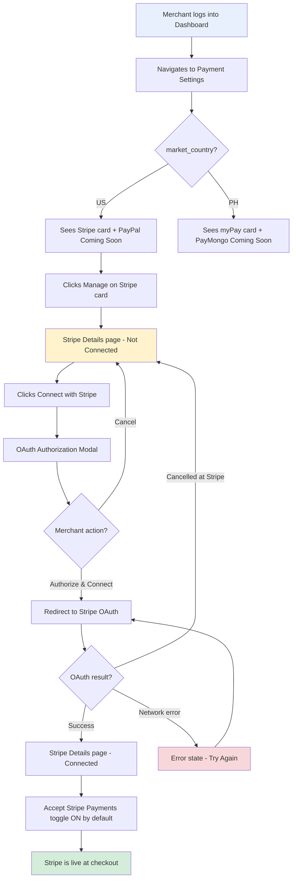
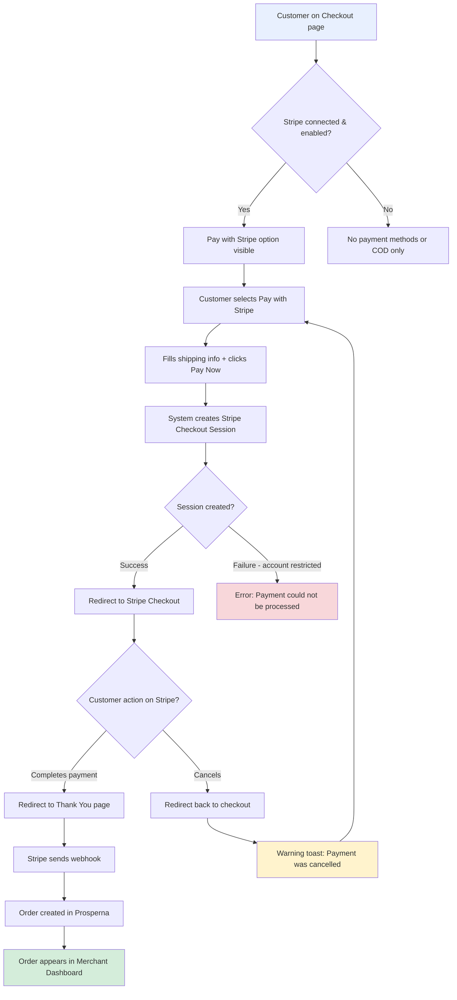
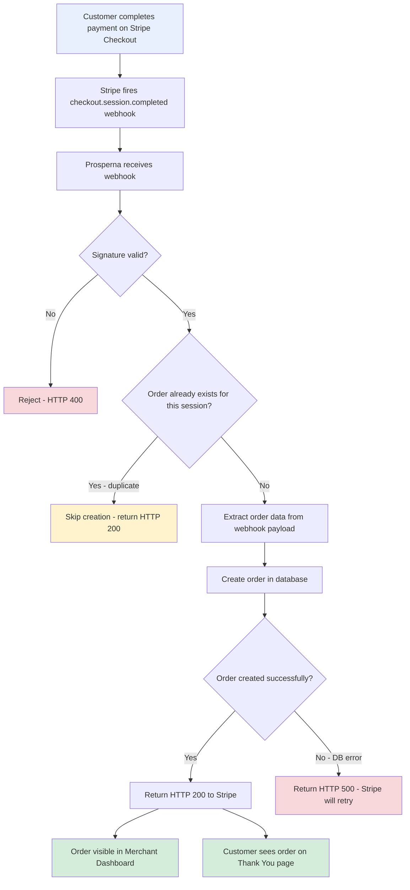
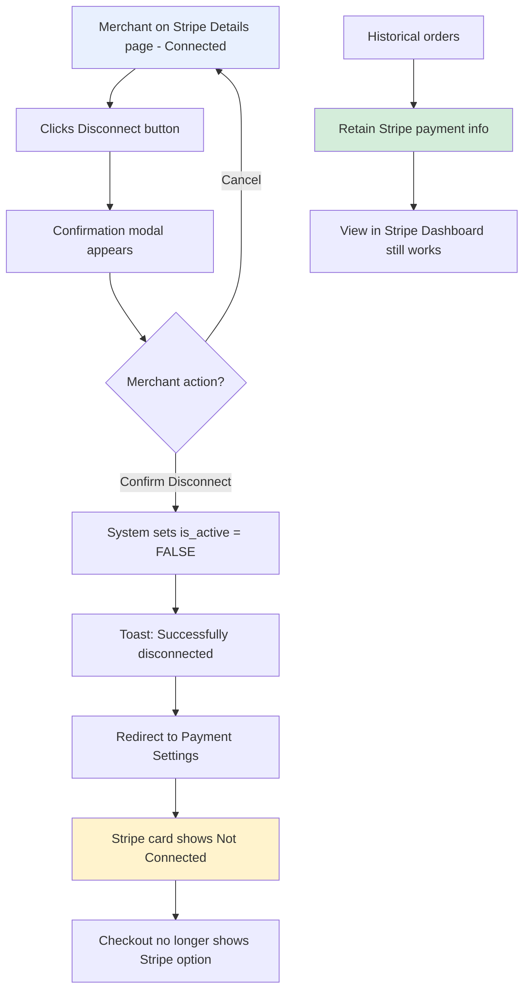
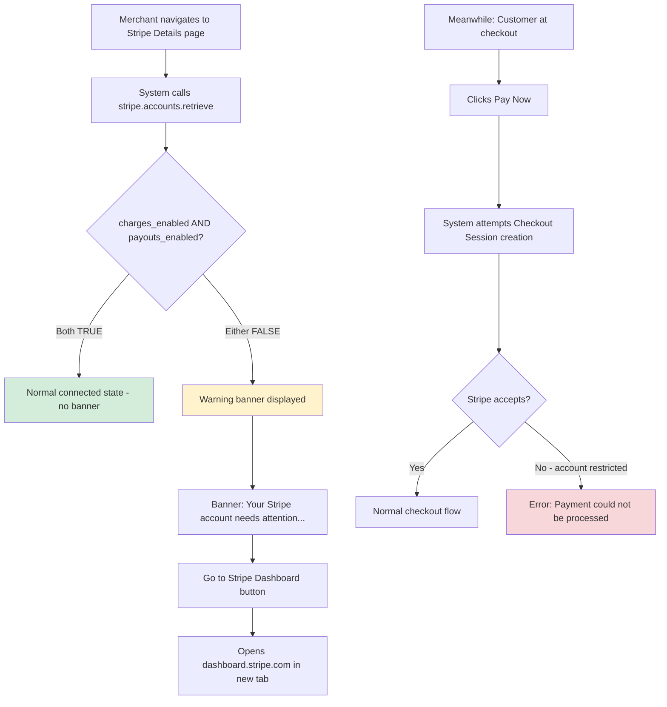
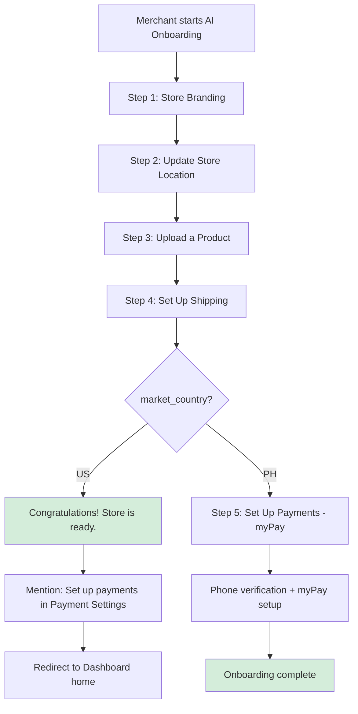
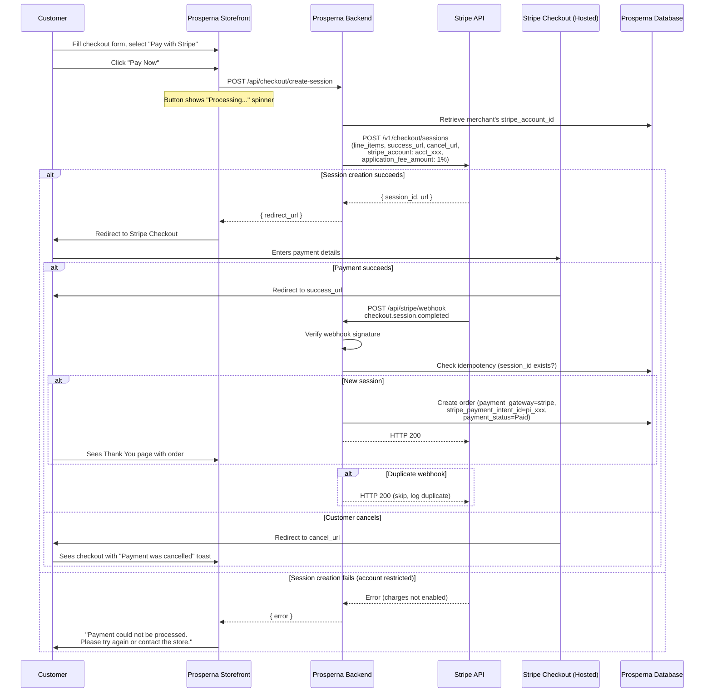
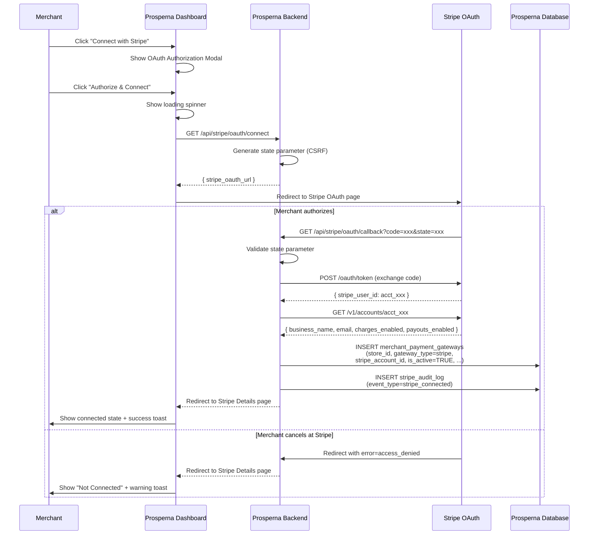
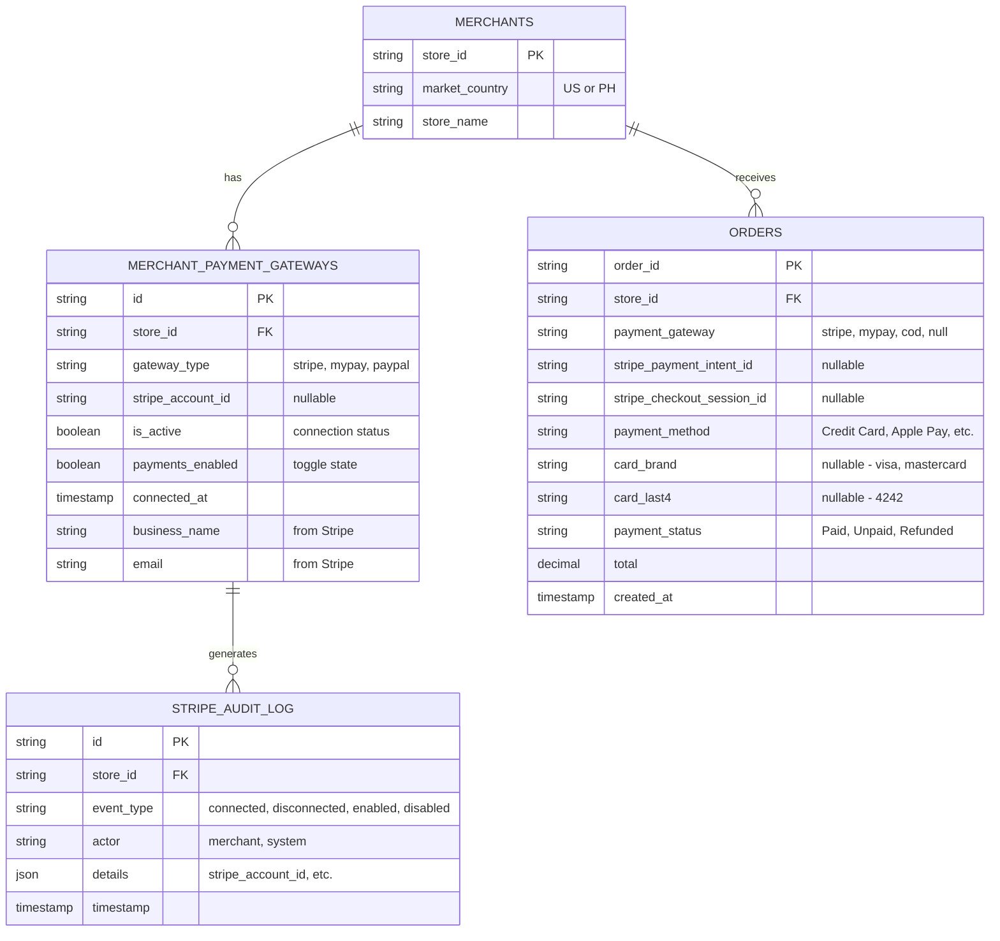

Agile-focused PRD with 89 scenarios documenting the integration of Stripe as a payment gateway for US merchants on Prosperna's platform, enabling merchants to connect their Stripe accounts via OAuth, accept credit card and digital wallet payments through Stripe Checkout, and manage payment configuration from the Merchant Dashboard — as part of the Internationalization Phase 1-B initiative.

**Demo Recording:**

[Stripe Integration Prototype Demo](https://p1-ba-pocs.vercel.app/stripe-integration)

## Document Control

| Item           | Details                                              |
| -------------- | ---------------------------------------------------- |
| Document Title | Stripe Payment Gateway Integration (Phase 1-B)       |
| Version        | 1.0                                                  |
| Date           | February 2, 2026                                     |
| Prepared by    | Business Analyst                                     |
| Reviewed by    | To be assigned                                       |
| Approved by    | To be assigned                                       |
| Status         | For Review                                           |
| Related BRD    | To be created                                        |

---

## Revision History

| Version | Date         | Author           | Change Description                                                  |
| ------- | ------------ | ---------------- | ------------------------------------------------------------------- |
| 1.0     | Feb 02, 2026 | Business Analyst | Initial draft - Stripe Integration Phase 1-B full specification     |

---

## 1. Introduction

### 1.1 Document Purpose

This PRD defines the detailed functional requirements, acceptance criteria (using BDD/Gherkin), and technical specifications for integrating Stripe as the payment gateway for US-market merchants on the Prosperna platform. The feature enables US merchants to connect their own Stripe accounts via OAuth (Stripe Connect Standard), accept credit card, debit card, and digital wallet payments through Stripe Checkout, and manage their payment configuration entirely from the Merchant Dashboard. This integration is the first external payment gateway added to Prosperna and establishes the "Bring Your Own Payment Gateway" (BYOPG) architectural pattern that will be reused for future gateway integrations.

This PRD covers both the Merchant Dashboard experience (connection, configuration, order management) and the Online Store Website experience (customer checkout, payment flow, order creation via webhook).

### 1.2 Feature Vision

US merchants on Prosperna will be able to connect their Stripe account in under two minutes, start accepting credit card payments (Visa, Mastercard, Amex, Discover), digital wallets (Apple Pay, Google Pay), and buy-now-pay-later options (Klarna, Afterpay) — all without Prosperna handling sensitive payment data. Funds flow directly from customers to the merchant's bank account via Stripe, with Prosperna collecting a 1% platform fee. The integration is designed so that Stripe handles PCI compliance, fraud detection, and payout scheduling, while Prosperna owns the storefront experience, order management, and merchant configuration.

### 1.3 Success Criteria

**User Adoption & Usage:**
- 60% of new US merchants connect Stripe within 7 days of store creation
- 80% of US merchants who connect Stripe also enable the payments toggle within the same session
- Less than 5% of merchants who connect Stripe disconnect within 30 days
- 90% of US merchants complete Stripe OAuth flow on first attempt (no retry needed)

**Technical Performance:**
- Stripe OAuth connection completes in less than 10 seconds (Prosperna processing, excluding time on Stripe's hosted page)
- Stripe Checkout Session creation completes in less than 2 seconds after customer clicks "Pay Now"
- Webhook processing (order creation) completes in less than 3 seconds after Stripe delivers the event
- 99.9% webhook delivery success rate (with Stripe retry handling)
- Zero duplicate orders from webhook retry logic (idempotency)

**Business Impact:**
- US merchant GMV processed through Stripe grows 20% month-over-month in first quarter
- 1% platform fee revenue from Stripe transactions meets projected targets
- 50% reduction in "how do I accept payments" support tickets from US merchants
- Average order value for Stripe-enabled stores exceeds $50

### 1.4 Related Documents

- [Phase 1-A Single-Market MVP - Internationalization PRD](https://pkb.prosperna.ph/docs/product/shared-services/phase1a-single-market-mvp)
- [Stripe Integration Prototype](https://p1-ba-pocs.vercel.app/stripe-integration)
- [Stripe Connect Documentation — Standard Accounts](https://docs.stripe.com/connect/standard-accounts)
- [Stripe Checkout Documentation](https://docs.stripe.com/payments/checkout)
- [Stripe Webhooks Documentation](https://docs.stripe.com/webhooks)
- [AI Onboarding PRD](https://pkb.prosperna.ph/docs/product/merchant/onboarding/ai-powered-onboarding-enhancement)

---

## 2. Background & Context

### 2.1 Problem Statement

**Current Pain Point:**

Prosperna's payment infrastructure was built exclusively for the Philippine market. The only integrated payment gateway is myPay, which supports Philippine payment methods (GCash, Maya, GrabPay, bank transfers, over-the-counter payments). As Prosperna expands to the US market through its Internationalization initiative, US merchants have no way to accept online payments through the platform.

The current experience for a US merchant attempting to set up payments:

1. Merchant creates a Prosperna store and selects United States as their market country
2. Merchant navigates to Payment Settings and sees myPay — a Philippines-only gateway
3. myPay registration requires a Philippine phone number, Philippine bank account, and Philippine business registration
4. US merchant cannot complete myPay setup and has no alternative
5. Merchant is left with only Cash on Delivery or Cash on Pickup as payment options
6. Customers cannot pay with credit cards, Apple Pay, or any digital payment method
7. Merchant loses sales from customers who expect online payment options
8. Merchant either abandons Prosperna or operates with severely limited payment capabilities

**Impact of Current Limitations:**

- **Revenue Loss for Merchants:** US merchants cannot accept the payment methods their customers expect (credit cards, Apple Pay, Google Pay), leading to abandoned carts and lost sales
- **Platform Competitiveness:** Every major ecommerce platform serving the US market supports credit card payments; Prosperna's absence of this capability is a critical gap
- **Market Expansion Blocker:** The Internationalization initiative's value proposition for US merchants is severely undermined without a US-compatible payment solution
- **Customer Experience:** Shoppers on US merchant stores encounter a checkout experience that feels incomplete and unprofessional

**Business Context:**

- Phase 1-A of Internationalization shipped market country selection, US address formatting, and state/ZIP validation — establishing the data foundation for market-specific behavior
- US ecommerce payment preferences: 54% credit/debit cards, 12% digital wallets (Apple Pay, Google Pay), with cash-on-delivery virtually nonexistent
- Stripe is the dominant payment processor for US ecommerce, with native support for cards, wallets, and BNPL, plus built-in PCI compliance and fraud detection
- The BYOPG model (merchant owns their Stripe account) eliminates Prosperna's liability for fund custody and payment disputes

### 2.2 Current State

**Current Payment Settings Behavior:**

1. **Merchant Dashboard — Payment Settings:**
   - All merchants (regardless of market country) see the same payment gateway: myPay
   - myPay card displays logo, description, activation status badge, and Manage button
   - No gateway filtering by market country exists
   - No Stripe or other US-compatible gateway is available

2. **Merchant Dashboard — myPay Activation:**
   - Requires Philippine phone number for OTP verification
   - Redirects to myPay portal for KYB (Philippine business registration required)
   - US merchants cannot complete this process
   - No alternative offered when myPay is unavailable

3. **Online Store — Customer Checkout:**
   - Payment options determined by shipping method's payment option checkboxes
   - Available options for Philippine merchants: Bank Transfer, Cash on Delivery, Cash on Pickup, Credit Card, E-Wallets, Over The Counter
   - All digital payment options (Credit Card, E-Wallets, etc.) route through myPay
   - US merchants can only offer Cash on Delivery or Cash on Pickup

4. **Order Management — Payment Information:**
   - Orders show payment type and status
   - myPay orders link to myPay transaction records
   - No concept of external payment gateway reference (e.g., Stripe Payment Intent ID)
   - No "View in Stripe Dashboard" capability

5. **AI Onboarding — Step 5 (Set Up Payments):**
   - All merchants (US and PH) are shown Step 5: Set Up Payments
   - Step 5 triggers phone verification and myPay registration
   - US merchants get stuck at this step
   - No skip mechanism for markets where myPay is unavailable

6. **Balance & Withdrawals:**
   - Balance module visible to all merchants
   - Designed for myPay fund flow (Prosperna holds funds, merchant withdraws)
   - Not applicable to Stripe model (funds go directly to merchant's bank)
   - Causes confusion for US merchants who see an empty/irrelevant Balance section

### 2.3 Desired Future State

**Market-Aware Payment Gateway Integration:**

1. **Payment Settings with Market-Based Gateway Filtering:**
   - Payment Settings automatically shows gateways relevant to the merchant's `market_country`
   - US merchants see: Stripe (active), PayPal (Coming Soon)
   - Philippine merchants see: myPay (active), PayMongo (Coming Soon)
   - No manual switching required — filtering is automatic on page load
   - Each gateway card shows: logo, name, description, connection status badge, Manage button

2. **Stripe Connection via OAuth (BYOPG Model):**
   - "Connect with Stripe" button launches OAuth flow
   - Merchants authorize Prosperna to accept payments on their behalf
   - Merchants can connect existing Stripe accounts or create new ones during OAuth
   - Connection stores Stripe Account ID, business name, email, and connection timestamp
   - Standard Connected Account type — merchant fully owns their Stripe account and funds

3. **Stripe Payment Configuration:**
   - Connected state shows account details (Account ID, Business Name, Email, Connected Since)
   - "Accept Stripe Payments" toggle controls whether Stripe appears at checkout (ON/OFF)
   - Toggle state independent of connection — can be connected but disabled
   - "Stripe Dashboard" button opens Stripe's native dashboard for refunds, disputes, payouts
   - "Disconnect" button removes integration (soft delete, retains audit data)

4. **Customer Checkout with Stripe:**
   - "Pay with Stripe" option appears as radio button when merchant has Stripe connected and enabled
   - Clicking "Pay Now" creates Stripe Checkout Session and redirects customer to Stripe-hosted page
   - Stripe handles PCI-compliant card entry, 3D Secure, fraud checks
   - Customer returns to Thank You page on success; returns to checkout on cancellation
   - Cart line items, shipping, and tax passed to Stripe for consistent display

5. **Webhook-Driven Order Creation:**
   - Orders created ONLY after `checkout.session.completed` webhook from Stripe
   - No pre-payment order creation (prevents phantom orders from abandoned checkouts)
   - Webhook signature verification for security
   - Idempotent handling prevents duplicate orders on Stripe retries
   - Payment method details (card brand, last 4 digits, or wallet type) recorded on order

6. **Order Management with Stripe Payment Info:**
   - Stripe-paid orders show payment type (Credit Card, Apple Pay, etc.) and status (Paid)
   - "View in Stripe Dashboard" button links directly to the Stripe payment record
   - No refund button in Prosperna — refunds processed in Stripe Dashboard
   - Historical orders retain Stripe references even after account disconnect

7. **Platform Adjustments for US Market:**
   - Balance module hidden for US merchants (funds go directly to merchant's Stripe bank account)
   - AI Onboarding skips Step 5 (payment setup) for US merchants — Stripe requires post-onboarding OAuth
   - Dashboard/analytics include Stripe transactions in all sales metrics without distinction
   - Shipping settings filter payment option checkboxes (US sees only COD/COP, not myPay-powered options)

**Benefits After Implementation:**

- **Immediate US Market Viability:** US merchants can accept credit cards, Apple Pay, Google Pay, and BNPL options from day one
- **Zero PCI Burden:** Prosperna never touches sensitive card data — Stripe handles all PCI compliance
- **Direct Payouts:** Funds flow directly to merchant's bank account via Stripe, eliminating Prosperna's fund custody liability
- **Merchant Autonomy:** BYOPG model means merchants own their Stripe accounts, transaction history, and customer relationships
- **Scalable Architecture:** Market-based gateway filtering and the BYOPG pattern extend naturally to PayPal, PayMongo, and future gateways
- **Operational Simplicity:** Stripe handles refunds, disputes, payouts, and compliance — Prosperna focuses on storefront and order management

### 2.4 Target Users

| User Segment                        | Description                                                | Use Case                                                                    | Frequency                  |
| ----------------------------------- | ---------------------------------------------------------- | --------------------------------------------------------------------------- | -------------------------- |
| US Merchants (New)                  | Merchants creating their first Prosperna store in the US   | Connect Stripe during initial store setup, start accepting payments         | One-time setup, daily use  |
| US Merchants (Existing)             | US merchants who created stores before Stripe was available | Connect Stripe to existing store, enable online payments for first time     | One-time setup, daily use  |
| US Merchant Store Customers         | End customers shopping on US merchant storefronts          | Pay for products using credit card, Apple Pay, or Google Pay via Stripe     | Per-purchase               |
| Philippine Merchants                | Existing PH-market merchants                               | No direct interaction — their payment experience (myPay) is unchanged       | N/A                        |
| Prosperna Support Team              | Internal team assisting merchants with payment issues      | Query backend data to troubleshoot Stripe connection or transaction issues  | As needed                  |

### 2.5 Project Constraints & Assumptions

**Technical Constraints:**
- Stripe Connect Standard Accounts only — Express and Custom account types are out of scope
- Single payment gateway active at a time per merchant (no simultaneous Stripe + myPay in Phase 1-B)
- Webhook endpoint must be publicly accessible and handle Stripe's retry logic (exponential backoff)
- Stripe Checkout Sessions expire after 24 hours — no server-side session caching needed beyond this
- No server-side storage of sensitive card data (PCI compliance maintained by never touching card numbers)
- Must work within Prosperna's existing multi-tenant architecture (gateway configuration per `store_id`)

**Business Constraints:**
- 1% platform fee on Stripe transactions is a placeholder value subject to change before launch
- Stripe's own processing fee (2.9% + 30¢) is charged by Stripe directly — Prosperna does not manage or display this in billing
- Refunds, disputes, and chargebacks are handled entirely in Stripe Dashboard — no Prosperna-side refund flow in Phase 1-B
- No payment method breakdown analytics in Phase 1-B (all sales treated equally regardless of gateway)
- No admin UI for Stripe data in Phase 1-B — backend data accessible to developers via direct database queries only

**Key Assumptions:**
- US merchants either have an existing Stripe account or are willing to create one during the OAuth flow
- Stripe's Standard Connected Account onboarding handles identity verification, bank account setup, and compliance for the merchant
- Stripe webhook delivery is reliable with built-in retries (Prosperna handles idempotency on its end)
- The `market_country` field established in Phase 1-A is reliably set on all merchant accounts
- US customers are familiar with Stripe Checkout's hosted payment page experience
- Merchants understand that Stripe Dashboard is where they manage refunds, disputes, and payouts (Prosperna does not replicate these functions)
- The "Pay with Stripe" label and Stripe branding at checkout are sufficient — no custom payment form is needed

**Scope Exclusions (Not in Phase 1-B):**
- PayPal integration (Coming Soon placeholder only)
- PayMongo integration (Coming Soon placeholder only)
- Multiple simultaneous gateways per merchant
- Stripe subscription/recurring billing
- In-app refund processing
- Dispute/chargeback management in Prosperna
- Payment method analytics or breakdown dashboards
- Admin Control Platform UI for viewing Stripe data
- Stripe-powered invoicing
- Multi-currency support (US merchants are USD only)

---

# 3. Functional Requirements & BDD Scenarios

## Feature F-01: Payment Gateway Visibility by Market Country

### 3.1.1 Feature Context

Control the visibility of payment gateways in the Payment Settings section based on the merchant's `market_country`. US merchants see Stripe and PayPal (coming soon), while Philippine merchants see myPay and PayMongo (coming soon). This ensures merchants only see payment options relevant to their market.

### 3.1.2 Business Rules

**BR-01: Payment Gateway Filtering by Market Country**
- Payment gateways are filtered based on the merchant's `market_country` value
- US merchants (`market_country` = 'US') see: Stripe, PayPal (Coming Soon)
- Philippine merchants (`market_country` = 'PH') see: myPay, PayMongo (Coming Soon)
- No toggle or manual switching between gateway sets is available
- Gateway visibility is determined automatically on page load

**BR-02: Payment Settings Section Location**
- Payment Settings is located in the Merchant Dashboard sidebar navigation
- Section displays available payment gateways as cards in a grid layout
- Each gateway card shows: Logo, Name, Description, Connection Status Badge, Manage Button

**BR-03: Gateway Card Display Elements**
- **Logo**: Circular container with gateway logo image
- **Name**: Gateway name as heading (e.g., "Stripe")
- **Description**: Brief description of accepted payment methods
- **Status Badge**: "Connected" (green), "Not Connected" (gray), "Not Activated" (gray for myPay), or "Coming Soon!" (yellow)
- **Manage Button**: Opens gateway-specific configuration page
- Note: Stripe badge is always "Connected" or "Not Connected" — Stripe account health issues (restrictions, suspended accounts) are surfaced only on the Stripe Details page, not on the Payment Settings card

**BR-04: Coming Soon Gateway Behavior**
- Gateways marked "Coming Soon!" have reduced opacity (visual indication)
- "Coming Soon!" badge displayed in yellow with dark text
- Manage button is disabled (grayed out, non-clickable)
- No configuration or connection available for coming soon gateways

### 3.1.3 Scenarios

##### Scenario 1: US merchant views Payment Settings

```gherkin
Given a merchant with `market_country` = "US" is logged into the Merchant Dashboard
When the merchant navigates to Payment Settings
Then the Payment Settings page displays
And the page shows a header "Prosperna Payments"
And a description "Improve your customer experience by offering a wide range of payment options."
And exactly two payment gateway cards are displayed:
  | Gateway | Status Badge   | Manage Button |
  | Stripe  | Not Connected  | Enabled       |
  | PayPal  | Coming Soon!   | Disabled      |
And the Stripe card displays logo, name "Stripe", and description "Accept credit cards, Apple Pay, and Google Pay securely with instant payouts to your bank account."
And the PayPal card has reduced opacity (grayed out appearance)
And myPay and PayMongo cards are NOT displayed
```

##### Scenario 2: Philippine merchant views Payment Settings

```gherkin
Given a merchant with `market_country` = "PH" is logged into the Merchant Dashboard
When the merchant navigates to Payment Settings
Then the Payment Settings page displays
And exactly two payment gateway cards are displayed:
  | Gateway   | Status Badge   | Manage Button |
  | myPay     | Not Activated  | Enabled       |
  | PayMongo  | Coming Soon!   | Disabled      |
And the myPay card displays logo, name "myPay", and description "Accept e-wallets (GCash, Maya, GrabPay), credit/debit cards, and over-the-counter payments from Filipino customers."
And the PayMongo card has reduced opacity (grayed out appearance)
And Stripe and PayPal cards are NOT displayed
```

##### Scenario 3: US merchant clicks Manage on Stripe card

```gherkin
Given a US merchant is on the Payment Settings page
And the Stripe gateway card is displayed with "Not Connected" status
When the merchant clicks the "Manage" button on the Stripe card
Then the merchant is navigated to the Stripe Details page
And the URL reflects the Stripe configuration page
And the Stripe Details page displays connection options
```

##### Scenario 4: US merchant attempts to click Manage on PayPal (Coming Soon)

```gherkin
Given a US merchant is on the Payment Settings page
And the PayPal gateway card displays "Coming Soon!" badge
And the PayPal Manage button is disabled (grayed out)
When the merchant attempts to click the "Manage" button on the PayPal card
Then no action occurs (button is non-interactive)
And the merchant remains on the Payment Settings page
And no navigation or modal appears
```

##### Scenario 5: US merchant with connected Stripe views Payment Settings

```gherkin
Given a US merchant has previously connected their Stripe account
And the Stripe connection is active
When the merchant navigates to Payment Settings
Then the Stripe gateway card displays "Connected" status badge
And the "Connected" badge has green background (#d1f4e0) and green text (#0f5132)
And the "Manage" button remains enabled
And clicking "Manage" opens the Stripe Details page with connected account information
```

---

## Feature F-02: Stripe Connection via OAuth Flow

### 3.2.1 Feature Context

Enable US merchants to connect their existing Stripe accounts (or create new ones) to Prosperna using Stripe Connect OAuth flow. This implements the "Bring Your Own Payment Gateway" (BYOPG) strategy where merchants maintain ownership of their Stripe accounts and funds flow directly to their accounts.

### 3.2.2 Business Rules

**BR-05: Stripe Details Page - Not Connected State**
- Page displays Stripe logo, name, and description
- "Not Connected" badge displayed in gray
- Description explains Stripe features and PCI compliance benefits
- Accepted payment methods section shows supported cards and digital wallets
- "Connect with Stripe" button initiates OAuth flow
- Transaction fee information displayed at bottom: "Stripe charges 2.9% + 30¢ per successful transaction. Funds are deposited directly to your bank account."

**BR-06: Connect with Stripe OAuth Flow**
- Clicking "Connect with Stripe" opens OAuth authorization modal
- Modal displays Prosperna's requested permissions:
  - Accept payments on your behalf
  - View your account information
  - Receive payment notifications
  - Collect a 1% platform fee on transactions
- "Authorize & Connect" button initiates actual Stripe OAuth
- "Cancel" button closes modal without action
- Loading state displays during connection process

**BR-07: Stripe Account Types Supported**
- Standard Connected Accounts only (merchant owns the account)
- Merchants can connect existing Stripe accounts
- New merchants are redirected to Stripe to create accounts if needed
- Express and Custom account types are NOT supported

**BR-08: Successful Connection Data Storage**
- Upon successful OAuth callback, system stores:
  - `stripe_account_id`: Stripe's account identifier (e.g., "acct_1RHKx2QvJ3kN8mPL")
  - `connected_at`: Timestamp of connection
  - `is_active`: Set to TRUE
  - Merchant's Stripe email and business name (for display)
- Gateway record created in `merchant_payment_gateways` table

**BR-09: Stripe Account Health Check on Stripe Details Page**
- System checks `charges_enabled` and `payouts_enabled` from Stripe API on Stripe Details page load
- If either is FALSE, display a warning banner on the Stripe Details page (see F-14 for full specification)
- The warning banner is independent of the "Accept Stripe Payments" toggle — both can be visible simultaneously
- The toggle remains fully functional regardless of account health status
- Stripe also notifies merchants directly via email for Standard Connected Accounts
- No pre-check is performed at customer checkout; account issues surface at Stripe Checkout Session creation time (see F-14)

### 3.2.3 Scenarios

##### Scenario 1: US merchant views Stripe Details page (not connected)

```gherkin
Given a US merchant has NOT connected a Stripe account
When the merchant navigates to the Stripe Details page
Then the page displays:
  | Element                    | Content                                                           |
  | Back link                  | "← Back to Payment Settings"                                      |
  | Logo                       | Stripe logo in circular container                                 |
  | Title                      | "Stripe"                                                          |
  | Subtitle                   | "Accept credit cards, Apple Pay, Google Pay"                      |
  | Status badge               | "Not Connected" (gray background)                                 |
And below the header, a description displays: "Connect your Stripe account to start accepting credit card payments. Stripe handles PCI compliance, fraud detection, and secure payment processing."
And an "Accepted Payment Methods" section shows payment method badges:
  | Payment Method |
  | Visa           |
  | Mastercard     |
  | Amex           |
  | Discover       |
  | Apple Pay      |
  | Google Pay     |
  | Link           |
  | Klarna         |
  | Afterpay       |
And a "Connect with Stripe" button is displayed (purple/Stripe brand color #635BFF)
And a transaction fee note displays at the bottom
```

##### Scenario 2: Merchant clicks Connect with Stripe button

```gherkin
Given a US merchant is on the Stripe Details page (not connected)
When the merchant clicks the "Connect with Stripe" button
Then an OAuth authorization modal appears
And the modal displays:
  | Element          | Content                                      |
  | Header           | Stripe logo + "Connect to Stripe"            |
  | Close button     | "×" in top-right corner                      |
  | Permissions list | List of 4 permission items with checkmarks   |
And the permissions list shows:
  | Permission                                    |
  | Accept payments on your behalf                |
  | View your account information                 |
  | Receive payment notifications                 |
  | Collect a 1% platform fee on transactions     |
And two buttons are displayed: "Cancel" and "Authorize & Connect"
```

##### Scenario 3: Merchant authorizes Stripe connection

```gherkin
Given the OAuth authorization modal is displayed
When the merchant clicks the "Authorize & Connect" button
Then the modal shows a loading state
And a spinner displays with text "Connecting to Stripe..."
And the Cancel and Authorize buttons are hidden during loading
When the OAuth flow completes successfully
Then the modal closes
And a success toast notification appears: "Successfully connected Stripe account."
And the Stripe Details page updates to show "Connected" state
And the merchant's Stripe account information is displayed
```

##### Scenario 4: Merchant cancels OAuth authorization

```gherkin
Given the OAuth authorization modal is displayed
When the merchant clicks the "Cancel" button
Then the modal closes immediately
And no connection attempt is made
And the merchant remains on the Stripe Details page
And the page still shows "Not Connected" state
And no toast notification appears
```

##### Scenario 5: Merchant closes modal by clicking outside

```gherkin
Given the OAuth authorization modal is displayed
And the modal overlay is visible
When the merchant clicks on the overlay area outside the modal content
Then the modal closes
And no connection attempt is made
And the merchant remains on the Stripe Details page in "Not Connected" state
```

##### Scenario 6: OAuth connection fails due to user cancellation in Stripe

```gherkin
Given a merchant has clicked "Authorize & Connect"
And the merchant is redirected to Stripe's OAuth page
When the merchant cancels or closes the Stripe authorization page
Then the merchant is redirected back to Prosperna
And the Stripe Details page shows "Not Connected" state
And a warning toast displays: "Stripe connection was cancelled. You can try again anytime."
And no gateway record is created
```

##### Scenario 7: OAuth connection fails due to network error

```gherkin
Given a merchant has clicked "Authorize & Connect"
And a network error occurs during the OAuth process
When the connection attempt times out or fails
Then the modal displays an error state
And an error message displays: "Failed to connect to Stripe. Please check your internet connection and try again."
And a "Try Again" button is displayed
And the merchant can retry the connection
```

##### Scenario 8: Successful connection stores account data

```gherkin
Given a merchant has successfully completed the Stripe OAuth flow
When the connection is established
Then the system creates a record in `merchant_payment_gateways` table with:
  | Field              | Value                                    |
  | store_id           | Merchant's store ID                      |
  | gateway_type       | "stripe"                                 |
  | stripe_account_id  | Account ID from Stripe (e.g., acct_xxx)  |
  | is_active          | TRUE                                     |
  | connected_at       | Current timestamp                        |
And the system retrieves and stores:
  | Field              | Source                                   |
  | business_name      | Stripe account business name             |
  | email              | Stripe account email                     |
  | charges_enabled    | Stripe account status                    |
  | payouts_enabled    | Stripe account status                    |
```

##### Scenario 9: Connected account with Stripe account health issue

```gherkin
Given a merchant has connected their Stripe account
And the Stripe account has `charges_enabled` = FALSE or `payouts_enabled` = FALSE
When the merchant views the Stripe Details page
Then a warning banner displays below the header section
And the banner has warning styling (yellow/amber background with AlertCircle icon)
And the banner message reads: "Your Stripe account needs attention. Payments may be affected until any outstanding issues are resolved. Please visit your Stripe Dashboard for details."
And a "Go to Stripe Dashboard" button is displayed inside the banner
And the "Accept Stripe Payments" toggle remains visible and functional (not disabled)
And the toggle state is independent of the warning banner
```

---

## Feature F-03: Stripe Connection Management (Connected State)

### 3.3.1 Feature Context

Allow merchants with connected Stripe accounts to view their connection details, enable/disable Stripe payments, access Stripe Dashboard, and disconnect their account when needed.

### 3.3.2 Business Rules

**BR-10: Connected State Display Elements**
- "Connected" badge displayed in green
- Account details section shows:
  - Account ID (with copy button)
  - Business Name
  - Email
  - Connected Since (formatted date)
- "Accept Stripe Payments" toggle to enable/disable
- Action buttons: "Stripe Dashboard" (external link), "Disconnect" (danger)

**BR-11: Accept Stripe Payments Toggle**
- Toggle controls whether Stripe is offered at checkout
- Toggle ON (green): Stripe payment option appears at customer checkout
- Toggle OFF (gray): Stripe payment option hidden from checkout
- Toggle state persists independently of connection status
- Disabled state shows warning: "Stripe payments are disabled. Customers cannot pay with cards at checkout."

**BR-12: Stripe Dashboard External Link**
- Button opens Stripe Dashboard in new tab
- URL: https://dashboard.stripe.com (or test mode URL in development)
- Merchant manages all Stripe operations (refunds, disputes, payouts) in Stripe Dashboard
- Prosperna does not replicate Stripe Dashboard functionality

**BR-13: Account ID Copy Functionality**
- Copy button next to Account ID
- Clicking copy button copies ID to clipboard
- Success toast: "Copied to clipboard!"
- Useful for support and troubleshooting

### 3.3.3 Scenarios

##### Scenario 1: Merchant views Stripe Details page (connected state)

```gherkin
Given a US merchant has connected their Stripe account with:
  | Field           | Value                           |
  | Account ID      | acct_1RHKx2QvJ3kN8mPL           |
  | Business Name   | Demo US Store                   |
  | Email           | merchant@example.com            |
  | Connected Since | January 15, 2026                |
  | Is Active       | TRUE                            |
When the merchant navigates to the Stripe Details page
Then the page displays "Connected" status badge (green)
And the account details section shows:
  | Field           | Display Value                   |
  | Account ID      | acct_1RHKx2QvJ3kN8mPL (+ copy)  |
  | Business Name   | Demo US Store                   |
  | Email           | merchant@example.com            |
  | Connected Since | January 15, 2026                |
And the "Accept Stripe Payments" toggle is displayed and ON (green)
And two action buttons are displayed:
  | Button           | Style                           |
  | Stripe Dashboard | Outline secondary, external link|
  | Disconnect       | Outline danger (red)            |
```

##### Scenario 2: Merchant copies Account ID to clipboard

```gherkin
Given a merchant is viewing the Stripe Details page (connected)
And the Account ID "acct_1RHKx2QvJ3kN8mPL" is displayed with a copy button
When the merchant clicks the copy button next to Account ID
Then the Account ID is copied to the system clipboard
And a success toast notification appears: "Copied to clipboard!"
And the toast auto-dismisses after 4 seconds
```

##### Scenario 3: Merchant disables Stripe payments

```gherkin
Given a merchant is viewing the Stripe Details page (connected)
And the "Accept Stripe Payments" toggle is currently ON (green)
When the merchant clicks the toggle
Then a confirmation modal appears with:
  | Element   | Content                                                |
  | Title     | "Disable Stripe Payments?"                             |
  | Message   | "Customers won't be able to pay with cards at checkout. You can re-enable anytime." |
  | Buttons   | "Cancel" and "Disable"                                 |
```

##### Scenario 4: Merchant confirms disabling Stripe payments

```gherkin
Given the "Disable Stripe Payments?" confirmation modal is displayed
When the merchant clicks the "Disable" button
Then the modal closes
And the toggle switches to OFF state (gray)
And a warning alert appears: "Stripe payments are disabled. Customers cannot pay with cards at checkout."
And a success toast displays: "Successfully disabled Stripe payments."
And the Stripe connection remains intact (not disconnected)
And checkout no longer shows Stripe payment option
```

##### Scenario 5: Merchant cancels disabling Stripe payments

```gherkin
Given the "Disable Stripe Payments?" confirmation modal is displayed
When the merchant clicks the "Cancel" button
Then the modal closes
And the toggle remains ON (green)
And no changes are made
And Stripe payments continue to be available at checkout
```

##### Scenario 6: Merchant re-enables Stripe payments

```gherkin
Given a merchant is viewing the Stripe Details page (connected)
And the "Accept Stripe Payments" toggle is currently OFF (gray)
And a warning alert is displayed about disabled payments
When the merchant clicks the toggle to enable
Then the toggle immediately switches to ON state (green)
And the warning alert disappears
And a success toast displays: "Successfully enabled Stripe payments."
And checkout now shows Stripe payment option
And no confirmation modal is required for enabling
```

##### Scenario 7: Merchant clicks Stripe Dashboard button

```gherkin
Given a merchant is viewing the Stripe Details page (connected)
When the merchant clicks the "Stripe Dashboard" button
Then a new browser tab opens
And the tab navigates to https://dashboard.stripe.com
And the merchant can manage their Stripe account directly
And the Prosperna tab remains open on the Stripe Details page
```

##### Scenario 8: Merchant views disabled Stripe with warning

```gherkin
Given a merchant has connected Stripe but disabled payments
When the merchant navigates to the Stripe Details page
Then the "Connected" badge is still displayed (green)
And the account details are visible
And the "Accept Stripe Payments" toggle is OFF (gray)
And a warning alert displays: "Stripe payments are disabled. Customers cannot pay with cards at checkout."
And the alert has warning styling (yellow/amber background)
And the warning includes an AlertCircle icon
```

---

## Feature F-04: Stripe Account Disconnection

### 3.4.1 Feature Context

Allow merchants to disconnect their Stripe account from Prosperna when they no longer wish to use Stripe for payments. Disconnection removes the integration but does not affect the merchant's actual Stripe account or transaction history.

### 3.4.2 Business Rules

**BR-14: Disconnect Confirmation Required**
- Clicking "Disconnect" button opens confirmation modal
- Modal warns that Stripe payments will be disabled
- Modal reassures that Stripe account and history are unaffected
- Requires explicit confirmation to proceed

**BR-15: Disconnect Process**
- Sets `is_active` = FALSE in database (soft delete)
- Stripe account ID retained for audit purposes
- Removes Stripe from checkout payment options
- Merchant redirected to Payment Settings after disconnect
- Can reconnect the same or different Stripe account later

**BR-16: Post-Disconnection State**
- Stripe card on Payment Settings shows "Not Connected"
- Existing orders with Stripe payments retain their payment info
- "View in Stripe Dashboard" link on historical orders remains functional
- Balance module remains hidden (no change from connected state for US merchants)

### 3.4.3 Scenarios

##### Scenario 1: Merchant initiates Stripe disconnection

```gherkin
Given a merchant is viewing the Stripe Details page (connected)
When the merchant clicks the "Disconnect" button
Then a confirmation modal appears with:
  | Element   | Content                                                |
  | Title     | "Disconnect Stripe?"                                   |
  | Message   | "This will disable Stripe payments. Your Stripe account and transaction history will not be affected." |
  | Buttons   | "Cancel" (secondary) and "Disconnect" (danger/red)     |
```

##### Scenario 2: Merchant confirms Stripe disconnection

```gherkin
Given the "Disconnect Stripe?" confirmation modal is displayed
When the merchant clicks the "Disconnect" button
Then the modal closes
And the system sets the gateway record `is_active` = FALSE
And the system clears the `stripe_account_id` from active use
And a success toast displays: "Successfully disconnected Stripe account."
And the merchant is redirected to the Payment Settings page
And the Stripe card now shows "Not Connected" status
```

##### Scenario 3: Merchant cancels Stripe disconnection

```gherkin
Given the "Disconnect Stripe?" confirmation modal is displayed
When the merchant clicks the "Cancel" button
Then the modal closes
And no changes are made to the Stripe connection
And the merchant remains on the Stripe Details page
And Stripe remains connected and active
```

##### Scenario 4: Disconnected merchant can reconnect Stripe

```gherkin
Given a merchant previously disconnected their Stripe account
And the Stripe card shows "Not Connected" status
When the merchant clicks "Manage" on the Stripe card
And navigates to the Stripe Details page
Then the page shows "Not Connected" state
And the "Connect with Stripe" button is displayed
When the merchant completes the OAuth flow
Then a new connection is established
And the merchant can use the same or different Stripe account
And the Stripe card shows "Connected" status
```

##### Scenario 5: Historical orders retain Stripe payment information after disconnect

```gherkin
Given a merchant had Stripe connected and processed orders #1001, #1002, #1003
And each order has `payment_gateway` = "stripe" and `stripe_payment_intent_id` stored
When the merchant disconnects their Stripe account
Then the orders #1001, #1002, #1003 retain all payment information
And viewing order #1001 details still shows:
  | Field          | Value                    |
  | Payment Type   | Credit Card              |
  | Payment Status | Paid                     |
And the "View in Stripe Dashboard" button remains visible
And clicking the button opens Stripe Dashboard (merchant must be logged into Stripe)
```

---

## Feature F-05: Customer Checkout - Stripe Payment Option

### 3.5.1 Feature Context

Display Stripe as a payment option during customer checkout when the merchant has connected and enabled Stripe. Customers select "Pay with Stripe" and are redirected to Stripe Checkout for secure payment processing.

### 3.5.2 Business Rules

**BR-17: Stripe Payment Option Visibility**
- Stripe payment option appears ONLY when:
  - Merchant has `market_country` = 'US'
  - Merchant has connected Stripe account (`is_active` = TRUE)
  - Merchant has enabled Stripe payments (toggle ON)
- If any condition is FALSE, Stripe option is hidden
- Other enabled payment methods still appear (Store Pickup with COD, etc.)
- No real-time Stripe account health check is performed at checkout page load
- Stripe account issues (e.g., `charges_enabled` = FALSE) are detected only when the Checkout Session is created upon clicking "Pay Now" (see BR-49 in F-14)

**BR-18: Payment Option Display**
- Radio button selection for payment method
- "Pay with Stripe" label with card icons (Visa, MC, Amex)
- Subtitle: "Secure checkout via Stripe"
- Selected state shows highlighted border and background

**BR-19: No Payment Methods Available State**
- If merchant has no payment methods enabled, show warning
- Warning message: "No payment methods available. Please contact the merchant."
- "Pay Now" button disabled when no payment methods available

**BR-20: Order Creation Timing and Checkout Session Creation**
- Stripe Checkout Session is created when the customer clicks "Pay Now" with Stripe selected
- No Stripe API calls are made on checkout page load — session is created on click only
- If session creation succeeds, customer is redirected to Stripe Checkout hosted page
- If session creation fails (e.g., merchant's Stripe account is restricted), customer sees an error message (see BR-49 in F-14)
- Order is NOT created when customer clicks "Pay Now"
- Order is created ONLY after successful payment (webhook confirmation)
- This prevents abandoned checkout from creating unpaid orders

### 3.5.3 Scenarios

##### Scenario 1: Customer views checkout with Stripe enabled

```gherkin
Given a customer is checking out on a US merchant's store
And the merchant has Stripe connected and enabled
And the customer has filled shipping information
When the customer reaches the Payment section
Then a payment method selection area is displayed
And the Stripe option shows:
  | Element         | Content                           |
  | Radio button    | Selected by default               |
  | Label           | "Pay with Stripe"                 |
  | Subtitle        | "Secure checkout via Stripe"      |
  | Card icons      | Visa, Mastercard, Amex logos      |
And the payment option has a highlighted border (Stripe purple tint)
And a "Pay Now" button is displayed and enabled
```

##### Scenario 2: Customer selects Stripe and clicks Pay Now

```gherkin
Given a customer is on the checkout page
And has selected "Pay with Stripe" as payment method
And all required fields are filled (shipping address, contact info)
When the customer clicks the "Pay Now" button
Then the button shows a loading state with spinner
And the button text changes to "Processing..."
And the button becomes disabled to prevent double-clicks
And the system creates a Stripe Checkout Session at this point (not on page load)
And the customer is redirected to Stripe Checkout hosted page
And no order is created in Prosperna yet
```

##### Scenario 3: Customer completes payment on Stripe Checkout

```gherkin
Given a customer has been redirected to Stripe Checkout
And the customer enters valid payment details
And the payment is processed successfully
When Stripe redirects the customer back to Prosperna
Then the customer lands on the Thank You / Order Confirmation page
And the page displays "Thank you for your order!"
And the order has been created with status "Paid"
And the order details show:
  | Field          | Value                              |
  | Payment Type   | Credit Card (or Apple Pay, etc.)   |
  | Payment Status | Paid                               |
```

##### Scenario 4: Customer cancels payment on Stripe Checkout

```gherkin
Given a customer has been redirected to Stripe Checkout
When the customer clicks "Back" or cancels on the Stripe page
Then the customer is redirected back to Prosperna checkout page
And a warning toast displays: "Payment was cancelled. You can try again."
And the checkout form retains all previously entered information
And no order is created
And the customer can attempt payment again
```

##### Scenario 5: Checkout with no payment methods available

```gherkin
Given a customer is checking out on a US merchant's store
And the merchant has Stripe connected but DISABLED (toggle OFF)
And no other payment methods are enabled
When the customer reaches the Payment section
Then a warning alert is displayed
And the alert message reads: "No payment methods available. Please contact the merchant."
And the "Pay Now" button is disabled (grayed out)
And the warning has an AlertCircle icon
```

##### Scenario 6: Customer checkout on Philippine merchant store (no Stripe)

```gherkin
Given a customer is checking out on a Philippine merchant's store
And the merchant has `market_country` = "PH"
When the customer reaches the Payment section
Then Stripe payment option is NOT displayed
And only Philippine payment methods are shown (myPay options if enabled)
And the checkout flow follows existing Philippine payment logic
```

##### Scenario 7: Stripe checkout preserves cart information

```gherkin
Given a customer has the following items in cart:
  | Product                     | Quantity | Price   |
  | Premium Wireless Headphones | 1        | $149.99 |
  | USB-C Charging Cable        | 2        | $19.99  |
And shipping fee is $9.99
And tax (8.25%) is $15.68
And total is $215.64
When the customer proceeds to Stripe Checkout
Then Stripe Checkout displays the same line items:
  | Line Item                   | Amount  |
  | Premium Wireless Headphones | $149.99 |
  | USB-C Charging Cable (x2)   | $39.98  |
  | Shipping                    | $9.99   |
  | Tax (8.25%)                 | $15.68  |
  | Total                       | $215.64 |
And the amounts match exactly between Prosperna and Stripe
```

##### Scenario 8: Guest checkout with Stripe

```gherkin
Given a guest customer (not logged in) is checking out
And the merchant has Stripe enabled
When the customer fills the checkout form:
  | Field          | Value                    |
  | Email          | customer@example.com     |
  | First Name     | John                     |
  | Last Name      | Smith                    |
  | Phone          | +1 (512) 555-1234        |
  | Address        | 123 Main Street          |
  | City           | Austin                   |
  | State          | TX                       |
  | ZIP            | 78701                    |
And selects "Pay with Stripe"
And clicks "Pay Now"
Then the customer is redirected to Stripe Checkout
And Stripe pre-fills the customer email
And upon successful payment, order is created as guest order
And customer receives order confirmation email
```

---

## Feature F-06: Order Creation via Stripe Webhook

### 3.6.1 Feature Context

Create orders in Prosperna's system only after receiving confirmation of successful payment from Stripe via webhook. This ensures data integrity and prevents phantom orders from abandoned checkouts.

### 3.6.2 Business Rules

**BR-21: Webhook-Driven Order Creation**
- Orders are created ONLY after receiving `checkout.session.completed` webhook event
- Webhook must be verified using Stripe signature verification
- Order data extracted from webhook payload and checkout session metadata
- Cart data, customer info, and shipping details passed through Stripe metadata

**BR-22: Order Data from Webhook**
- Store order with:
  - `payment_gateway` = 'stripe'
  - `stripe_payment_intent_id` = Payment Intent ID from session
  - `stripe_checkout_session_id` = Checkout Session ID
  - `payment_status` = 'Paid'
- Extract payment method details (card brand, last 4 digits) from session

**BR-23: Idempotency Handling**
- Webhook handler must be idempotent
- Check if order already exists with same `stripe_checkout_session_id`
- If duplicate webhook received, skip order creation (log and return 200)
- Prevent duplicate orders from Stripe retry logic

**BR-24: Webhook Failure Handling**
- If webhook processing fails, return appropriate HTTP status
- Stripe will retry failed webhooks automatically
- Log all webhook failures for investigation
- Admin notification on repeated failures

**BR-25: Payment Method Recording**
- Extract payment method type from Stripe session
- Record at high level: "Credit Card", "Apple Pay", "Google Pay", etc.
- Do NOT store full card numbers (PCI compliance)
- Card brand and last 4 digits acceptable for display

### 3.6.3 Scenarios

##### Scenario 1: Successful payment creates order via webhook

```gherkin
Given a customer completed payment on Stripe Checkout for merchant "Demo US Store"
And the payment was successful with:
  | Field                  | Value                           |
  | Session ID             | cs_test_abc123                  |
  | Payment Intent ID      | pi_xyz789                       |
  | Payment Method         | Visa ending in 4242             |
  | Amount                 | $215.64                         |
When Stripe sends `checkout.session.completed` webhook
Then Prosperna receives and verifies the webhook signature
And creates a new order with:
  | Field                        | Value                      |
  | order_status                 | Open                       |
  | payment_status               | Paid                       |
  | payment_gateway              | stripe                     |
  | stripe_payment_intent_id     | pi_xyz789                  |
  | stripe_checkout_session_id   | cs_test_abc123             |
  | payment_method               | Credit Card                |
  | total                        | $215.64                    |
And returns HTTP 200 to Stripe
And the order appears in merchant's Order Management
```

##### Scenario 2: Duplicate webhook is handled idempotently

```gherkin
Given an order was already created for session "cs_test_abc123"
When Stripe sends the same `checkout.session.completed` webhook again (retry)
Then Prosperna checks for existing order with session ID "cs_test_abc123"
And finds the existing order
And does NOT create a duplicate order
And returns HTTP 200 to Stripe (success, not error)
And logs: "Duplicate webhook received for session cs_test_abc123, skipping"
```

##### Scenario 3: Webhook with invalid signature is rejected

```gherkin
Given a webhook request is received at /api/stripe/webhook
And the webhook signature does not match Stripe's expected signature
When the system attempts to verify the webhook
Then signature verification fails
And the webhook is rejected with HTTP 400
And no order is created
And an error is logged: "Invalid webhook signature"
And an alert is sent to admin for potential security issue
```

##### Scenario 4: Order creation fails during webhook processing

```gherkin
Given a valid `checkout.session.completed` webhook is received
And webhook signature is verified successfully
When order creation fails due to database error
Then the system returns HTTP 500 to Stripe
And Stripe will retry the webhook later
And the error is logged with full context
And admin is notified of the failure
When Stripe retries and database is available
Then order is created successfully
And HTTP 200 is returned
```

##### Scenario 5: Customer redirected to success page before webhook

```gherkin
Given customer completes payment and is redirected with session_id
And the webhook has not yet been processed (race condition)
When customer lands on the success page
Then the page shows "Processing your order..."
And the page polls or waits for order creation
When the webhook is processed and order is created
Then the success page updates to show order confirmation
And order number and details are displayed
```

##### Scenario 6: Webhook records Apple Pay payment method

```gherkin
Given a customer paid using Apple Pay on Stripe Checkout
When the `checkout.session.completed` webhook is received
And the payment method type is "apple_pay"
Then the order is created with:
  | Field           | Value      |
  | payment_method  | Apple Pay  |
And order details display "Apple Pay" as payment type
And no card details are shown (wallet payment)
```

##### Scenario 7: Webhook records credit card payment details

```gherkin
Given a customer paid using credit card on Stripe Checkout
And the card was Visa ending in 4242
When the `checkout.session.completed` webhook is received
And payment method details include card brand and last4
Then the order is created with:
  | Field           | Value        |
  | payment_method  | Credit Card  |
And the system stores card_brand = "visa" and card_last4 = "4242"
And order details can display "Visa •••• 4242" if needed
```

---

## Feature F-07: Order Details - Stripe Payment Information

### 3.7.1 Feature Context

Display Stripe payment information on the Order Details page in the Merchant Dashboard, including payment status and a link to view the transaction in Stripe Dashboard.

### 3.7.2 Business Rules

**BR-26: Payment Section Display for Stripe Orders**
- Payment section shows:
  - Payment Type: High-level method (e.g., "Credit Card", "Apple Pay")
  - Payment Status: "Paid" (or other status if applicable)
  - "View in Stripe Dashboard" button
- Do NOT display: Card numbers, CVV, or sensitive payment data
- Card brand and last 4 digits can be shown if available

**BR-27: View in Stripe Dashboard Button**
- Button appears ONLY for orders paid via Stripe
- Button opens Stripe Dashboard in new tab
- URL format: https://dashboard.stripe.com/payments/{payment_intent_id}
- Merchant must be logged into Stripe to view details
- Button styled as dark/primary button within Payment section header

**BR-28: Payment Information for Non-Stripe Orders**
- Orders paid via other methods (myPay, COD) do not show Stripe button
- Payment section displays appropriate info for that payment method
- Existing payment display logic unchanged for non-Stripe orders

**BR-29: No Refund Action in Prosperna**
- Refund button is NOT displayed for Stripe orders
- Refunds must be processed through Stripe Dashboard
- This applies to all payment methods in Prosperna (not just Stripe)

### 3.7.3 Scenarios

##### Scenario 1: Merchant views order paid via Stripe

```gherkin
Given an order #68957f66a55926ce42a68753 was paid via Stripe
And the order has:
  | Field                    | Value                  |
  | payment_gateway          | stripe                 |
  | stripe_payment_intent_id | pi_xyz789              |
  | payment_method           | Credit Card            |
  | payment_status           | Paid                   |
When the merchant opens the Order Details page
Then the Payment section displays:
  | Field           | Value                              |
  | Section Header  | "Payment" with "View in Stripe Dashboard" button |
  | Payment Type    | CREDIT CARD                        |
  | Payment Status  | Paid                               |
And the "View in Stripe Dashboard" button is styled as dark button
And no "Refund" button is displayed
```

##### Scenario 2: Merchant clicks View in Stripe Dashboard

```gherkin
Given a merchant is viewing order details for a Stripe-paid order
And the order has `stripe_payment_intent_id` = "pi_xyz789"
When the merchant clicks the "View in Stripe Dashboard" button
Then a new browser tab opens
And the URL is "https://dashboard.stripe.com/payments/pi_xyz789"
And the merchant can view full payment details in Stripe
And the Prosperna tab remains open on Order Details
```

##### Scenario 3: Order displays Apple Pay as payment type

```gherkin
Given an order was paid using Apple Pay through Stripe
And the order has `payment_method` = "Apple Pay"
When the merchant views the Order Details page
Then the Payment section shows:
  | Field           | Value      |
  | Payment Type    | APPLE PAY  |
  | Payment Status  | Paid       |
And "View in Stripe Dashboard" button is displayed
```

##### Scenario 4: Order paid via myPay (Philippine merchant)

```gherkin
Given an order on a Philippine merchant's store was paid via myPay
And the order has `payment_gateway` = "mypay"
When the merchant views the Order Details page
Then the Payment section displays myPay payment info
And "View in Stripe Dashboard" button is NOT displayed
And the existing myPay payment display logic applies
```

##### Scenario 5: Order with Store Pickup and COD (no Stripe)

```gherkin
Given an order was placed with Store Pickup and Cash on Delivery
And the order has `payment_gateway` = NULL or "cod"
When the merchant views the Order Details page
Then the Payment section shows:
  | Field           | Value                  |
  | Payment Type    | Cash on Delivery       |
  | Payment Status  | Unpaid                 |
And "View in Stripe Dashboard" button is NOT displayed
And no Stripe-related information appears
```

---

## Feature F-08: Balance Module Visibility for Stripe Merchants

### 3.8.1 Feature Context

Control the visibility of the Balance/Withdrawals module in the merchant sidebar based on their payment gateway configuration. Stripe merchants do not use Prosperna's balance system as funds flow directly to their Stripe account.

### 3.8.2 Business Rules

**BR-30: Balance Module Visibility Logic**
- Balance module is HIDDEN when:
  - Merchant has Stripe connected AND enabled (`is_active` = TRUE)
  - Merchant's `market_country` = 'US'
- Balance module is VISIBLE when:
  - Merchant is Philippine-based using myPay
  - Merchant has no payment gateway connected
- Balance module controls: Sidebar navigation item, Balance page access

**BR-31: No Balance Accumulation for Stripe**
- Funds from Stripe payments go directly to merchant's bank account
- Prosperna does not hold or manage Stripe funds
- No withdrawal process needed for Stripe merchants
- Stripe handles payout scheduling

**BR-32: Balance Information for US Merchants**
- US merchants should manage earnings in Stripe Dashboard
- No "Available Balance" or "Pending Balance" concepts for Stripe
- Transaction history available in Stripe Dashboard, not Prosperna

### 3.8.3 Scenarios

##### Scenario 1: US merchant with connected Stripe sees no Balance menu

```gherkin
Given a US merchant has connected and enabled Stripe
And the merchant's `market_country` = "US"
When the merchant views the Merchant Dashboard sidebar
Then the sidebar navigation does NOT display "Balance" or "Withdrawals" menu item
And navigating directly to /balance URL redirects to Dashboard home
And funds management is handled entirely in Stripe Dashboard
```

##### Scenario 2: Philippine merchant sees Balance menu

```gherkin
Given a Philippine merchant has activated myPay
And the merchant's `market_country` = "PH"
When the merchant views the Merchant Dashboard sidebar
Then the sidebar navigation displays "Balance" menu item
And clicking "Balance" opens the Balance/Withdrawals page
And the merchant can view and withdraw myPay earnings
```

##### Scenario 3: US merchant disconnects Stripe (Balance still hidden)

```gherkin
Given a US merchant previously had Stripe connected
And the merchant has disconnected their Stripe account
When the merchant views the Merchant Dashboard sidebar
Then the Balance module remains HIDDEN
And US merchants do not use Prosperna's balance system regardless of gateway status
And the merchant would need to connect Stripe again to accept payments
```

##### Scenario 4: US merchant with Stripe disabled (Balance still hidden)

```gherkin
Given a US merchant has Stripe connected but disabled (toggle OFF)
When the merchant views the Merchant Dashboard sidebar
Then the Balance module remains HIDDEN
And the visibility is based on market_country, not gateway status
And even without active payments, Balance is not relevant for US merchants
```

---

## Feature F-09: AI Onboarding - Payment Step for US Merchants

### 3.9.1 Feature Context

Modify the AI-powered onboarding flow to skip the payment setup step (Step 5) for US merchants, as Stripe configuration requires OAuth and should be done post-onboarding in Payment Settings.

### 3.9.2 Business Rules

**BR-33: AI Onboarding Step 5 Skip for US Merchants**
- Current Step 5 flow: Phone verification → OTP → myPay setup
- For US merchants (`market_country` = 'US'): Skip Step 5 entirely
- AI onboarding ends after Step 4 (Set Up Shipping) for US merchants
- US merchants configure Stripe post-onboarding in Payment Settings

**BR-34: AI Onboarding Completion for US Merchants**
- After Step 4 completion, AI shows congratulations message
- Message mentions payment setup can be done in Settings
- Onboarding completion flags set appropriately
- Merchant redirected to Dashboard home

**BR-35: Philippine Merchant Step 5 Unchanged**
- Philippine merchants continue with existing Step 5 flow
- Phone verification → OTP → myPay registration redirect
- No changes to Philippine onboarding experience

### 3.9.3 Scenarios

##### Scenario 1: US merchant completes AI onboarding (Step 5 skipped)

```gherkin
Given a new US merchant is in AI-powered onboarding
And the merchant has completed:
  | Step | Name                  | Status    |
  | 1    | Store Branding        | Completed |
  | 2    | Update Store Location | Completed |
  | 3    | Upload a Product      | Completed |
  | 4    | Set Up Shipping       | Completed |
When the merchant completes Step 4: Set Up Shipping
Then the AI displays a congratulations message
And the message reads: "Congratulations! Your store is ready to go live. You can set up your payment method in Payment Settings whenever you're ready."
And the AI does NOT proceed to Step 5: Set Up Payments
And the onboarding is marked as complete
And the merchant is redirected to the Dashboard home
```

##### Scenario 2: Philippine merchant continues to Step 5

```gherkin
Given a new Philippine merchant is in AI-powered onboarding
And the merchant has completed Steps 1-4
When the merchant completes Step 4: Set Up Shipping
Then the AI proceeds to Step 5: Set Up Payments
And the AI displays: "Great progress! Now let's set up online payments for your store."
And the merchant sees "Yes, set up online payments" and "No, skip for now" options
And selecting "Yes" initiates phone verification flow
And the existing Philippine myPay setup flow continues unchanged
```

##### Scenario 3: US merchant prompted to set up payments in Settings

```gherkin
Given a US merchant has completed AI onboarding
And was shown the message about Payment Settings
When the merchant navigates to Payment Settings
Then the merchant sees the Stripe gateway card
And the card shows "Not Connected" status
And the merchant can proceed to connect Stripe via OAuth
And the Stripe setup flow works as specified in F-02
```

##### Scenario 4: Onboarding progress indicator for US merchants

```gherkin
Given a US merchant is in AI onboarding
When the merchant views the progress indicator
Then the indicator shows "Step X of 4" (not 5)
And the steps displayed are:
  | Step | Name                  |
  | 1    | Store Branding        |
  | 2    | Update Store Location |
  | 3    | Upload a Product      |
  | 4    | Set Up Shipping       |
And Step 5: Set Up Payments is NOT shown in the progress
And the total steps count is 4 for US merchants
```

---

## Feature F-10: Dashboard & Analytics - Stripe Transaction Inclusion

### 3.10.1 Feature Context

Include Stripe payment transactions in the merchant's sales dashboard and analytics, ensuring accurate reporting of all revenue regardless of payment method.

### 3.10.2 Business Rules

**BR-36: Stripe Sales Included in GMV**
- Gross Merchandise Value (GMV) includes all Stripe transactions
- No distinction or filtering by payment gateway in default views
- Sales dashboard shows combined totals from all payment sources

**BR-37: No Payment Method Breakdown Required**
- Phase 1-B does not require payment method breakdown charts
- All sales treated equally regardless of payment gateway
- Future phases may add payment method analytics

**BR-38: Reports Include Stripe Transactions**
- Sales reports include orders paid via Stripe
- Export functionality includes Stripe orders
- No separate "Stripe Report" in this phase

### 3.10.3 Scenarios

##### Scenario 1: Dashboard shows combined sales including Stripe

```gherkin
Given a US merchant has processed the following orders:
  | Order   | Amount   | Payment Gateway |
  | #1001   | $150.00  | stripe          |
  | #1002   | $200.00  | stripe          |
  | #1003   | $75.00   | cod (pickup)    |
When the merchant views the Sales Dashboard
Then the Total Sales displays $425.00
And no breakdown by payment method is shown
And all orders contribute equally to the metrics
```

##### Scenario 2: Sales report includes Stripe orders

```gherkin
Given a US merchant has Stripe and COD orders
When the merchant generates a Sales Report for the date range
Then the report includes all orders regardless of payment gateway
And each order row shows:
  | Column         | Value            |
  | Order ID       | Order number     |
  | Date           | Order date       |
  | Total          | Order amount     |
  | Payment Status | Paid/Unpaid      |
And the report can be exported to CSV/Excel
```

##### Scenario 3: Revenue charts include Stripe transactions

```gherkin
Given a US merchant views the Revenue Chart on the Dashboard
And the chart displays daily/weekly/monthly revenue
When orders paid via Stripe are included
Then the chart values include Stripe transaction amounts
And the revenue trend reflects all payment sources
And no separate "Stripe revenue" line is displayed
```

---

## Feature F-11: Backend Data Persistence for Stripe Operational Support

### 3.11.1 Feature Context

Persist Stripe payment gateway details and connection event logs in the database for operational support and developer troubleshooting. This feature covers backend data storage only — no admin-facing UI is introduced in Phase 1-B. When a merchant reports payment issues or a support investigation is needed, developers can query the database directly to retrieve gateway details, transaction associations, and connection history.

### 3.11.2 Business Rules

**BR-39: Payment Gateway Data Persistence per Merchant**
- The `merchant_payment_gateways` table stores the merchant's Stripe connection details (as created in BR-08)
- Stored fields include: `store_id`, `gateway_type`, `stripe_account_id`, `is_active`, `connected_at`, `business_name`, `email`
- This data is queryable by developers via direct database access for troubleshooting
- No new admin UI page, section, or column is introduced to surface this data
- Developers can identify a merchant's gateway status by querying: `SELECT * FROM merchant_payment_gateways WHERE store_id = ?`

**BR-40: Stripe Transaction Data Association on Orders**
- Each order paid via Stripe stores `payment_gateway`, `stripe_payment_intent_id`, and `stripe_checkout_session_id` (as created in BR-22)
- These fields allow developers to cross-reference Prosperna orders with Stripe Dashboard transactions during investigations
- No new admin-facing transaction detail view or payment gateway column is introduced
- Developers can query order payment data: `SELECT order_id, payment_gateway, stripe_payment_intent_id, payment_status FROM orders WHERE store_id = ? AND payment_gateway = 'stripe'`

**BR-41: Stripe Connection Event Logging**
- The system logs all Stripe connection lifecycle events to a server-side log or audit table:
  - Stripe Connected (OAuth success)
  - Stripe Disconnected
  - Stripe Payments Enabled (toggle ON)
  - Stripe Payments Disabled (toggle OFF)
- Each log entry includes: `timestamp`, `store_id`, `event_type`, `actor` (merchant or system), and `details` (e.g., Stripe account ID)
- Logs are stored for developer/operational access via database queries or server log files
- No admin UI audit log viewer or filter is introduced in Phase 1-B
- Log retention follows existing platform log retention policies

### 3.11.3 Scenarios

##### Scenario 1: Gateway details persisted and queryable after Stripe connection

```gherkin
Given a merchant "Demo US Store" has connected their Stripe account with:
  | Field              | Value                           |
  | stripe_account_id  | acct_1RHKx2QvJ3kN8mPL           |
  | is_active          | TRUE                            |
  | connected_at       | 2026-01-15 10:30:00             |
  | business_name      | Demo US Store                   |
  | email              | merchant@example.com            |
When a developer queries the `merchant_payment_gateways` table for this merchant's store_id
Then the query returns the gateway record with all stored fields
And the developer can determine the merchant's Stripe connection status, account ID, and connection date
And no admin UI page is required to access this information
```

##### Scenario 2: Stripe payment data queryable on orders for troubleshooting

```gherkin
Given merchant "Demo US Store" has processed the following Stripe orders:
  | Order   | payment_gateway | stripe_payment_intent_id | payment_status |
  | #1001   | stripe          | pi_xyz789                | Paid           |
  | #1002   | stripe          | pi_abc456                | Paid           |
When a developer queries the orders table filtered by store_id and payment_gateway = 'stripe'
Then the query returns both orders with their Stripe Payment Intent IDs
And the developer can use these IDs to look up corresponding transactions in Stripe Dashboard
And no admin UI transaction view is required to access this information
```

##### Scenario 3: Connection lifecycle events logged for operational audit

```gherkin
Given a merchant "Demo US Store" performed the following actions:
  | Timestamp              | Action                           |
  | 2026-01-15 10:30:00    | Connected Stripe (acct_1RHKx2QvJ3kN8mPL) |
  | 2026-01-18 14:00:00    | Disabled Stripe Payments (toggle OFF)     |
  | 2026-01-18 14:15:00    | Enabled Stripe Payments (toggle ON)       |
When a developer queries the audit log or server logs for this merchant's store_id
Then the log entries are returned with timestamp, event type, actor (merchant), and details
And the developer can reconstruct the merchant's Stripe connection history
And no admin UI log viewer is required to access this information
```

---

## Feature F-12: Edge Cases and Error Handling

### 3.12.1 Feature Context

Handle various edge cases and error scenarios that may occur during Stripe integration usage, ensuring graceful degradation and clear user communication.

### 3.12.2 Business Rules

**BR-42: Stripe Account Disconnected Mid-Transaction**
- If merchant disconnects Stripe while customer is in checkout: Payment fails
- Customer shown error message to contact merchant
- No order created for failed payment

**BR-43: Stripe Account Issues at Checkout (Session Creation Failure)**
- If merchant's Stripe account is restricted, suspended, or has `charges_enabled` = FALSE
- Checkout Session creation fails when customer clicks "Pay Now" (Stripe API rejects the request)
- Customer sees error message: "Payment could not be processed. Please try again or contact the store for assistance."
- The "Pay with Stripe" option remains visible (no pre-check hiding) — failure occurs at click time
- Merchant is notified by Stripe directly via email (Standard Account notifications)
- Merchant can also see the warning banner on the Stripe Details page (see F-14)

**BR-44: Webhook Endpoint Down**
- If Prosperna webhook endpoint is unavailable: Stripe retries automatically
- Retry schedule follows Stripe's exponential backoff
- Orders created when webhook eventually succeeds
- Admin notification on extended webhook failures

**BR-45: Stripe Checkout Session Expiration**
- Stripe checkout sessions expire after 24 hours
- Expired session cannot be used for payment
- Customer must restart checkout process
- Generate new session on retry

**BR-46: Currency Mismatch Prevention**
- Single market per merchant in Phase 1 prevents mismatch
- US merchants always use USD
- System validates currency matches market before checkout

### 3.12.3 Scenarios

##### Scenario 1: Merchant disables Stripe during customer checkout

```gherkin
Given a customer has clicked "Pay Now" and is on Stripe Checkout
And the merchant disables Stripe payments while customer is paying
When the customer completes payment on Stripe
Then Stripe sends the webhook to Prosperna
And the system checks if Stripe is still enabled
And if disabled, the webhook is still processed (honor the payment)
And the order is created (payment was already collected)
And future checkouts will not show Stripe option
```

##### Scenario 2: Stripe account restricted - checkout session creation fails

```gherkin
Given a merchant's Stripe account has been suspended or restricted by Stripe
And `charges_enabled` = FALSE on the merchant's Stripe account
And a customer is checking out on the merchant's store
And the "Pay with Stripe" option is visible (no pre-check is performed)
And the customer selects "Pay with Stripe" and clicks "Pay Now"
When the system attempts to create a Stripe Checkout Session
Then the Stripe API rejects the session creation
And the "Pay Now" button returns to its normal state (loading state removed)
And an error message displays on the checkout page: "Payment could not be processed. Please try again or contact the store for assistance."
And no redirect to Stripe Checkout occurs
And no order is created
And the customer can retry or contact the merchant
```

##### Scenario 3: Webhook endpoint temporarily unavailable

```gherkin
Given a customer completed payment on Stripe Checkout at 2:00 PM
And Prosperna's webhook endpoint was down from 2:00 PM to 2:15 PM
When Stripe attempts to deliver the webhook at 2:00 PM
Then the webhook fails (HTTP 500 or timeout)
And Stripe automatically retries at ~2:01 PM (fails again)
And Stripe retries with exponential backoff
When webhook endpoint recovers at 2:15 PM
And Stripe retries at ~2:20 PM
Then the webhook succeeds
And the order is created (delayed but successful)
And customer may need to refresh success page
```

##### Scenario 4: Customer uses expired checkout session link

```gherkin
Given a customer received a checkout link 25 hours ago
And Stripe checkout sessions expire after 24 hours
When the customer clicks the old checkout link
Then Stripe displays an expiration error
And the customer cannot complete payment
When the customer returns to the merchant's store
And attempts checkout again
Then a new Stripe checkout session is generated
And the customer can complete payment with the new session
```

##### Scenario 5: Network error during Stripe redirect

```gherkin
Given a customer clicks "Pay Now" on checkout
And a network error occurs during redirect to Stripe
When the redirect fails
Then an error message displays: "Unable to connect to payment provider. Please check your internet connection and try again."
And a "Try Again" button is displayed
And clicking "Try Again" attempts the redirect again
And cart contents are preserved
```

##### Scenario 6: Duplicate payment prevention

```gherkin
Given a customer completes payment on Stripe Checkout
And is redirected back to Prosperna success page
When the customer clicks browser "Back" button
And attempts to pay again using the same session
Then Stripe recognizes the session as already paid
And displays "This checkout session has already been completed"
And no duplicate payment is processed
And no duplicate order is created
```

##### Scenario 7: Merchant reconnects Stripe with different account

```gherkin
Given a merchant previously connected Stripe account "acct_old123"
And then disconnected it
When the merchant connects a different Stripe account "acct_new456"
Then the new account is stored as the active connection
And new payments use "acct_new456"
And historical orders still reference "acct_old123"
And "View in Stripe Dashboard" on old orders links to old account
```

---

## Feature F-13: Invoices and Receipts - Stripe Payment Display

### 3.13.1 Feature Context

Display appropriate payment information on invoices and receipts for orders paid via Stripe, showing payment method at an appropriate level of detail without exposing sensitive data.

### 3.13.2 Business Rules

**BR-47: Invoice Payment Method Display**
- Payment method shows high-level type: "Credit Card", "Apple Pay", etc.
- Do NOT display card numbers on invoices
- Transaction reference shows Stripe Payment Intent ID (optional)
- "Processed by Stripe" notation acceptable but not required

**BR-48: Receipt Payment Information**
- Customer receipts show payment method and status
- Same display rules as invoices (no card numbers)
- Receipt sent via email includes payment confirmation

### 3.13.3 Scenarios

##### Scenario 1: Invoice shows Credit Card payment via Stripe

```gherkin
Given an order was paid via Stripe with credit card
When the merchant or customer views the invoice
Then the Payment section displays:
  | Field              | Value              |
  | Payment Method     | Credit Card        |
  | Payment Status     | Paid               |
And the card number is NOT displayed
And the transaction reference may show Payment Intent ID
```

##### Scenario 2: Invoice shows Apple Pay payment

```gherkin
Given an order was paid via Stripe with Apple Pay
When the invoice is generated
Then the Payment section displays:
  | Field              | Value              |
  | Payment Method     | Apple Pay          |
  | Payment Status     | Paid               |
And no card details are displayed (wallet payment)
```

##### Scenario 3: Order confirmation email shows payment details

```gherkin
Given an order was successfully paid via Stripe
When the order confirmation email is sent to the customer
Then the email includes:
  | Element            | Content                              |
  | Subject            | "Order Confirmation - [Store Name]"  |
  | Payment Method     | Credit Card (or Apple Pay, etc.)     |
  | Payment Status     | Paid                                 |
  | Order Total        | $215.64                              |
And no sensitive payment data (card numbers) is included
```

---

## Feature F-14: Stripe Account Health Monitoring

### 3.14.1 Feature Context

Monitor the health status of the merchant's connected Stripe account and surface issues through a warning banner on the Stripe Details page. Account health issues are detected at two points: (1) on Stripe Details page load via Stripe API check, and (2) at customer checkout when Stripe Checkout Session creation fails. This feature intentionally keeps the approach simple — Prosperna displays a generic warning and delegates issue resolution to Stripe Dashboard, where Stripe provides specific guidance for Standard Connected Accounts.

### 3.14.2 Business Rules

**BR-49: Stripe Account Health Check Trigger**
- Account health is checked by calling `stripe.accounts.retrieve(stripe_account_id)` on Stripe Details page load
- The check reads `charges_enabled` and `payouts_enabled` from the Stripe API response
- No periodic background polling or webhook-based sync is implemented in Phase 1-B
- No health check is performed on the Payment Settings listing page (card always shows "Connected" if `is_active` = TRUE)
- No health check is performed on checkout page load — issues surface only when Checkout Session creation is attempted on "Pay Now" click

**BR-50: Warning Banner Display on Stripe Details Page**
- Warning banner is displayed when `charges_enabled` = FALSE OR `payouts_enabled` = FALSE
- Banner appears below the header section, above the account details and toggle
- Banner uses warning styling: yellow/amber background, AlertCircle icon
- Banner message: "Your Stripe account needs attention. Payments may be affected until any outstanding issues are resolved. Please visit your Stripe Dashboard for details."
- Banner includes a "Go to Stripe Dashboard" button that opens https://dashboard.stripe.com in a new tab
- Banner is informational only — it does not disable, hide, or alter any other page elements

**BR-51: Warning Banner Independence from Toggle**
- The warning banner and the "Accept Stripe Payments" toggle are fully independent
- Both can be visible simultaneously (e.g., toggle ON + warning banner showing)
- The toggle remains functional regardless of account health status
- The merchant's toggle preference (ON/OFF) is preserved — Prosperna does not force-disable it
- Rationale: The toggle represents merchant intent; the banner represents Stripe account health. These are separate concerns.

**BR-52: Checkout Session Creation Failure Handling**
- When a customer clicks "Pay Now" with Stripe selected, the system creates a Stripe Checkout Session
- If the merchant's Stripe account is restricted/suspended (`charges_enabled` = FALSE), Stripe API rejects the session creation
- On session creation failure, the checkout page displays: "Payment could not be processed. Please try again or contact the store for assistance."
- The error message is generic and does not expose details about the merchant's Stripe account status
- The "Pay Now" button returns to its normal (non-loading) state so the customer can retry or choose another method
- The "Pay with Stripe" radio option remains visible — no dynamic hiding occurs

**BR-53: Stripe-Side Merchant Notifications**
- Stripe sends email notifications directly to merchants for Standard Connected Accounts regarding:
  - Verification requirements and deadlines
  - Account restrictions or suspensions
  - Payout holds or delays
- Prosperna does not duplicate these notifications (no email, no dashboard notification, no in-app alert outside the Stripe Details page)
- This is intentional to avoid notification fatigue and leverage Stripe's existing communication

**BR-54: No Impact on Payment Settings Card Badge**
- The Payment Settings page always shows "Connected" (green) for Stripe when `is_active` = TRUE
- Account health issues do NOT change the badge to any other state
- The badge reflects Prosperna's connection status, not Stripe's account health
- Merchants discover account issues either through Stripe's own notifications or by visiting the Stripe Details page

### 3.14.3 Scenarios

##### Scenario 1: Merchant views Stripe Details with charges disabled

```gherkin
Given a US merchant has connected their Stripe account
And the Stripe account has `charges_enabled` = FALSE and `payouts_enabled` = FALSE
When the merchant navigates to the Stripe Details page
Then the system calls Stripe API to check account status
And a warning banner displays below the header section
And the banner has warning styling (yellow/amber background with AlertCircle icon)
And the banner message reads: "Your Stripe account needs attention. Payments may be affected until any outstanding issues are resolved. Please visit your Stripe Dashboard for details."
And a "Go to Stripe Dashboard" button is displayed inside the banner
And the rest of the page displays normally (account details, toggle, action buttons)
```

##### Scenario 2: Merchant views Stripe Details with payouts only disabled

```gherkin
Given a US merchant has connected their Stripe account
And the Stripe account has `charges_enabled` = TRUE and `payouts_enabled` = FALSE
When the merchant navigates to the Stripe Details page
Then the same warning banner is displayed
And the banner message reads: "Your Stripe account needs attention. Payments may be affected until any outstanding issues are resolved. Please visit your Stripe Dashboard for details."
And a "Go to Stripe Dashboard" button is displayed inside the banner
And the toggle remains functional (charges can still be processed even with payouts disabled)
```

##### Scenario 3: Warning banner and toggle displayed simultaneously

```gherkin
Given a merchant's Stripe account has `charges_enabled` = FALSE
And the merchant's "Accept Stripe Payments" toggle is currently ON
When the merchant views the Stripe Details page
Then the warning banner is displayed
And the "Accept Stripe Payments" toggle is displayed and ON (green)
And the toggle is fully functional (merchant can turn it OFF or leave it ON)
And no automatic toggle state change occurs due to the account health issue
```

##### Scenario 4: Warning banner and disabled-payments warning coexist

```gherkin
Given a merchant's Stripe account has `charges_enabled` = FALSE
And the merchant's "Accept Stripe Payments" toggle is currently OFF
When the merchant views the Stripe Details page
Then BOTH alerts are displayed:
  | Alert                  | Type    | Message                                                                                             |
  | Account health banner  | Warning | "Your Stripe account needs attention. Payments may be affected until any outstanding issues are resolved. Please visit your Stripe Dashboard for details." |
  | Toggle disabled alert  | Warning | "Stripe payments are disabled. Customers cannot pay with cards at checkout."                          |
And the account health banner appears first (above the toggle area)
And the toggle disabled alert appears in its usual position near the toggle
```

##### Scenario 5: Merchant clicks Go to Stripe Dashboard from warning banner

```gherkin
Given a merchant is viewing the Stripe Details page
And the account health warning banner is displayed
When the merchant clicks the "Go to Stripe Dashboard" button inside the banner
Then a new browser tab opens
And the tab navigates to https://dashboard.stripe.com
And the Prosperna tab remains open on the Stripe Details page
```

##### Scenario 6: Healthy Stripe account shows no warning banner

```gherkin
Given a US merchant has connected their Stripe account
And the Stripe account has `charges_enabled` = TRUE and `payouts_enabled` = TRUE
When the merchant navigates to the Stripe Details page
Then no warning banner is displayed
And the page shows the normal connected state (account details, toggle, action buttons)
```

##### Scenario 7: Payment Settings card shows Connected despite account health issue

```gherkin
Given a US merchant has connected their Stripe account (`is_active` = TRUE)
And the Stripe account has `charges_enabled` = FALSE (restricted by Stripe)
When the merchant navigates to the Payment Settings page
Then the Stripe gateway card displays "Connected" status badge (green)
And no "Action Required" or warning indicator is shown on the card
And clicking "Manage" navigates to Stripe Details page where the warning banner is visible
```

##### Scenario 8: Customer checkout fails due to restricted merchant Stripe account

```gherkin
Given a merchant's Stripe account has `charges_enabled` = FALSE
And the merchant has "Accept Stripe Payments" toggle ON
And a customer is on the checkout page
And the "Pay with Stripe" option is displayed (no pre-check performed)
When the customer selects "Pay with Stripe" and clicks "Pay Now"
Then the button shows loading state (spinner, "Processing...", disabled)
And the system attempts to create a Stripe Checkout Session
And the Stripe API rejects the request due to account restrictions
Then the button returns to normal state (loading removed, re-enabled)
And an error message displays: "Payment could not be processed. Please try again or contact the store for assistance."
And the customer remains on the checkout page
And no redirect to Stripe Checkout occurs
And no order is created
```

##### Scenario 9: Customer retries after checkout session creation failure

```gherkin
Given a customer saw the error message after a failed Stripe Checkout Session creation
And the customer remains on the checkout page
When the customer clicks "Pay Now" again
Then the system attempts to create a new Stripe Checkout Session
And if the merchant's account is still restricted, the same error message displays again
And the customer's cart and form data are preserved throughout retries
```

##### Scenario 10: Account health resolves and checkout succeeds

```gherkin
Given a merchant's Stripe account was previously restricted (`charges_enabled` = FALSE)
And the merchant resolved the issue in Stripe Dashboard
And `charges_enabled` is now TRUE
When a customer selects "Pay with Stripe" and clicks "Pay Now"
Then the Stripe Checkout Session is created successfully
And the customer is redirected to Stripe Checkout
And the normal payment flow proceeds
And when the merchant visits Stripe Details page, no warning banner is shown
```

---

## Feature F-15: Payment Option Filtering by Market Country on Shipping Settings

### 3.15.1 Feature Context

Filter the available payment option checkboxes on each shipping method's settings page based on the merchant's `market_country`. US merchants see only "Cash on Delivery" or "Cash on Pickup" (depending on shipping type), as all digital payment methods (Bank Transfer, Credit Card, E-Wallets, Over The Counter) are powered by Philippine payment gateways (myPay/PayMongo) and are not applicable to the US market. For US merchants, online card payments are handled separately through Stripe at the checkout level, not through shipping-level payment configuration.

### 3.15.2 Business Rules

**BR-55: Payment Option Filtering for US Merchants**
- When `market_country` = 'US', the Payment Option section on shipping method settings displays only:
  - **Store Pickup**: "Cash on Pickup" checkbox only
  - **Manual Shipping by Merchant**: "Cash on Delivery" checkbox only
  - **Manual Shipping by Customer**: "Cash on Delivery" checkbox only
- The following options are HIDDEN for US merchants: Bank Transfer, Credit Card, E-Wallets, Over The Counter
- These hidden options are specific to Philippine payment gateways (myPay/PayMongo) and do not apply to the US market
- Online card payments for US merchants are handled via Stripe at checkout, not through shipping-level payment settings

**BR-56: Payment Option Display for Philippine Merchants (Unchanged)**
- When `market_country` = 'PH', all 6 payment options remain visible (current behavior):
  - Bank Transfer, Cash on Delivery, Cash on Pickup, Credit Card, E-Wallets, Over The Counter
- Existing mutual exclusivity logic unchanged: Cash on Delivery disabled for Store Pickup, Cash on Pickup disabled for delivery shipping methods
- No changes to Philippine merchant experience

**BR-57: US Merchant Payment Option Default State**
- For US merchants, the single visible payment option (COD or COP) is checked by default
- The checkbox remains editable — merchant can uncheck it if desired
- "Choose at least one" helper text still displays
- If unchecked, standard validation applies (at least one payment option required to save)

**BR-58: Interaction with Stripe Checkout**
- The shipping-level "Cash on Delivery" / "Cash on Pickup" option controls whether COD/COP is offered at checkout alongside Stripe
- If merchant has both Stripe enabled (toggle ON) and COD/COP checked, customers see both payment options at checkout
- If merchant has only Stripe enabled and COD/COP unchecked, customers see only "Pay with Stripe" at checkout
- If merchant has Stripe disabled and COD/COP unchecked, no payment methods are available (BR-19 applies)

### 3.15.3 Scenarios

##### Scenario 1: US merchant views Store Pickup payment options

```gherkin
Given a US merchant with `market_country` = "US"
When the merchant navigates to Store Pickup settings
Then the Payment Option section displays with label "Payment Option" and helper "Choose at least one"
And only ONE checkbox is visible: "Cash on Pickup"
And the "Cash on Pickup" checkbox is checked by default
And the following options are NOT displayed: Bank Transfer, Cash on Delivery, Credit Card, E-Wallets, Over The Counter
```

##### Scenario 2: US merchant views Manual Shipping by Merchant payment options

```gherkin
Given a US merchant with `market_country` = "US"
When the merchant navigates to Manual Shipping by Merchant settings
Then the Payment Option section displays with label "Payment Option" and helper "Choose at least one"
And only ONE checkbox is visible: "Cash on Delivery"
And the "Cash on Delivery" checkbox is checked by default
And the following options are NOT displayed: Bank Transfer, Cash on Pickup, Credit Card, E-Wallets, Over The Counter
```

##### Scenario 3: US merchant views Manual Shipping by Customer payment options

```gherkin
Given a US merchant with `market_country` = "US"
When the merchant navigates to Manual Shipping by Customer settings
Then the Payment Option section displays with label "Payment Option" and helper "Choose at least one"
And only ONE checkbox is visible: "Cash on Delivery"
And the "Cash on Delivery" checkbox is checked by default
And the following options are NOT displayed: Bank Transfer, Cash on Pickup, Credit Card, E-Wallets, Over The Counter
```

##### Scenario 4: Philippine merchant views shipping payment options (unchanged)

```gherkin
Given a Philippine merchant with `market_country` = "PH"
When the merchant navigates to any shipping method settings
Then the Payment Option section displays all 6 payment options:
  | Option           | Store Pickup        | Manual Shipping (Merchant) | Manual Shipping (Customer) |
  | Bank Transfer    | Visible, checkable  | Visible, checkable         | Visible, checkable         |
  | Cash on Delivery | Disabled (grayed)   | Visible, checkable         | Visible, checkable         |
  | Cash on Pickup   | Visible, checkable  | Disabled (grayed)          | Disabled (grayed)          |
  | Credit Card      | Visible, checkable  | Visible, checkable         | Visible, checkable         |
  | E-Wallets        | Visible, checkable  | Visible, checkable         | Visible, checkable         |
  | Over The Counter | Visible, checkable  | Visible, checkable         | Visible, checkable         |
And all existing behavior is preserved
```

##### Scenario 5: US merchant with Stripe and COD both available at checkout

```gherkin
Given a US merchant has Stripe connected and enabled (toggle ON)
And the Manual Shipping by Merchant has "Cash on Delivery" checked
When a customer checks out with Manual Shipping by Merchant selected
Then the payment section shows two options:
  | Option             | Type         |
  | Pay with Stripe    | Radio button |
  | Cash on Delivery   | Radio button |
And the customer can select either payment method
```

##### Scenario 6: US merchant unchecks COD, only Stripe remains at checkout

```gherkin
Given a US merchant has Stripe connected and enabled (toggle ON)
And the Manual Shipping by Merchant has "Cash on Delivery" UNCHECKED
When a customer checks out with Manual Shipping by Merchant selected
Then only "Pay with Stripe" is shown as payment option
And "Cash on Delivery" is NOT displayed
```

##### Scenario 7: US merchant unchecks COP on Store Pickup, only Stripe remains

```gherkin
Given a US merchant has Stripe connected and enabled (toggle ON)
And Store Pickup has "Cash on Pickup" UNCHECKED
When a customer checks out with Store Pickup selected
Then only "Pay with Stripe" is shown as payment option
And "Cash on Pickup" is NOT displayed
```

##### Scenario 8: US merchant with no payment methods (Stripe disabled + COD unchecked)

```gherkin
Given a US merchant has Stripe connected but DISABLED (toggle OFF)
And the shipping method has "Cash on Delivery" UNCHECKED
When a customer checks out on the merchant's store
Then no payment methods are available
And the warning message displays: "No payment methods available. Please contact the merchant."
And the "Pay Now" button is disabled
```

---

## 4. Non-Functional Requirements

### 4.1 Performance

| Requirement                                    | Metric                                                            | Measurement Method                 |
| ---------------------------------------------- | ----------------------------------------------------------------- | ---------------------------------- |
| OAuth callback processing                      | Less than 3 seconds from Stripe redirect to connected state       | End-to-end timing                  |
| Stripe Details page load (with health check)   | Less than 2 seconds (P95) including Stripe API account retrieval  | Page load performance metrics      |
| Payment Settings page load (gateway filtering) | Less than 1.5 seconds (P95)                                      | Page load performance metrics      |
| Stripe Checkout Session creation               | Less than 2 seconds from "Pay Now" click to Stripe redirect       | API response time monitoring       |
| Webhook processing (order creation)            | Less than 3 seconds from webhook receipt to order in database     | Webhook processing time logs       |
| Toggle state persistence                       | Less than 1 second from toggle click to confirmed save            | UI state update timing             |
| Account ID copy to clipboard                   | Less than 200ms from click to clipboard write                     | Frontend event timing              |
| Checkout page load (payment option rendering)  | Less than 2 seconds (P95) including Stripe option display         | Page load performance metrics      |
| Webhook signature verification                 | Less than 100ms per verification                                  | Server-side timing logs            |

### 4.2 Scalability

| Requirement                           | Target                                                     | Validation Method          |
| ------------------------------------- | ---------------------------------------------------------- | -------------------------- |
| Concurrent Stripe Checkout Sessions   | Support 5,000+ simultaneous active checkout sessions       | Load testing               |
| Webhook throughput                    | Process 1,000+ webhook events per minute                   | Stress testing             |
| Connected merchant accounts           | Support 100,000+ merchants with Stripe connected           | Database scalability test  |
| Order creation rate                   | Handle 500+ Stripe-originated orders per minute            | Load testing               |
| Gateway filtering query               | Sub-50ms query time for 100,000+ merchant records          | Database query benchmarks  |

### 4.3 Reliability

| Requirement                           | Target                                               | Monitoring                      |
| ------------------------------------- | ---------------------------------------------------- | ------------------------------- |
| Webhook processing success rate       | 99.9% successful processing on first delivery        | Webhook processing logs         |
| Idempotency enforcement               | Zero duplicate orders from webhook retries            | Duplicate detection monitoring  |
| Order-to-payment integrity            | 100% of completed Stripe payments result in orders   | Reconciliation reports          |
| OAuth flow completion rate            | 95%+ successful connections (excluding user cancels) | OAuth funnel tracking           |
| Gateway data consistency              | 100% match between Prosperna records and Stripe state | Periodic reconciliation         |

### 4.4 Security

| Requirement                              | Implementation                                                         | Validation               |
| ---------------------------------------- | ---------------------------------------------------------------------- | ------------------------ |
| Webhook signature verification           | Validate every webhook using Stripe-Signature header and endpoint secret | Automated security tests |
| OAuth state parameter                    | CSRF protection via state parameter in OAuth flow                       | Security audit           |
| No card data storage                     | Zero PCI scope — Stripe Checkout handles all card entry                 | PCI compliance review    |
| Stripe API key protection                | Secret keys stored in environment variables, never exposed to frontend  | Secret scanning          |
| Account ID access control                | Gateway records accessible only by owning merchant's `store_id`         | Authorization tests      |
| Webhook endpoint authentication          | Endpoint accepts only Stripe-signed requests, rejects unsigned          | Penetration testing      |
| HTTPS enforcement                        | All Stripe communication over TLS 1.2+                                  | SSL/TLS audit            |

### 4.5 Usability

| Requirement                                  | Target                                                     | Measurement            |
| -------------------------------------------- | ---------------------------------------------------------- | ---------------------- |
| Stripe connection completion time            | Under 2 minutes from clicking "Connect" to connected state | Task timing            |
| Toggle comprehension                         | 95% merchants understand enable/disable toggle immediately | Usability testing      |
| Checkout payment selection clarity           | 90% customers select Stripe option on first try            | User testing           |
| Error message comprehension (checkout)       | 90% customers understand checkout failure messages         | User testing           |
| Disconnect confirmation clarity              | 95% merchants understand disconnect consequences           | Usability testing      |
| Warning banner action clarity                | 90% merchants click "Go to Stripe Dashboard" to resolve    | Click-through tracking |

### 4.6 Compatibility

| Requirement             | Standard                                        | Validation              |
| ----------------------- | ----------------------------------------------- | ----------------------- |
| Browser support         | Chrome 90+, Firefox 88+, Safari 14+, Edge 90+   | Cross-browser testing   |
| Mobile responsiveness   | Full functionality on 375px+ width screens       | Responsive testing      |
| Stripe Checkout mobile  | Stripe's hosted page is natively mobile-optimized | Stripe's responsibility |
| OAuth flow mobile       | OAuth redirect works on mobile browsers          | Mobile device testing   |
| Touch device support    | Toggle, buttons, and copy function work on touch | Mobile device testing   |

### 4.7 Maintainability

| Requirement                           | Standard                                                        | Validation            |
| ------------------------------------- | --------------------------------------------------------------- | --------------------- |
| Gateway abstraction layer             | New gateways (PayPal, PayMongo) can be added without checkout refactor | Architecture review |
| Market-gateway mapping configuration  | Gateway-to-market mapping is configuration-driven, not hardcoded | Code review           |
| Webhook handler modularity            | Webhook processing logic isolated for testability and reuse      | Code structure audit  |
| Feature flag readiness                | Stripe feature can be toggled at platform level if needed        | Feature flag testing  |
| Error message centralization          | All user-facing error strings defined in a single config         | Code review           |

---

## 5. User Experience & Design

### 5.1 User Flow Diagrams

**Primary Flow: Merchant Connects Stripe and Enables Payments**



**Customer Checkout Flow: Pay with Stripe**



**Webhook-Driven Order Creation Flow**



**Merchant Disconnects Stripe Flow**



**Stripe Account Health Warning Flow**



**AI Onboarding Flow: US vs PH Merchants**



### 5.2 UI Mockups & Wireframes

- [Stripe Integration Final Design](https://www.figma.com/design/IgtGZxmiLlOmteKiBmhGoJ/Internationalization-%7C-Phase-1-B---Stripe-Integration?node-id=0-1&p=f&t=ssPw31p6z6Q8PHP8-0)
- [Stripe Integration High-Fidelity Prototype](https://www.figma.com/proto/IgtGZxmiLlOmteKiBmhGoJ/Internationalization-%7C-Phase-1-B---Stripe-Integration?page-id=0%3A1&node-id=2-101&p=f&t=ssPw31p6z6Q8PHP8-0&scaling=min-zoom&content-scaling=fixed&starting-point-node-id=2%3A101&show-proto-sidebar=1)
- [Stripe Integration Prototype — Interactive Demo](https://p1-ba-pocs.vercel.app/stripe-integration)

The prototype covers all primary screens:
- Payment Settings list page (US and PH views)
- Stripe Details page (Not Connected state)
- OAuth Authorization modal
- Stripe Details page (Connected state, with toggle ON and OFF states)
- Disable and Disconnect confirmation modals
- Customer Checkout page (with Stripe payment option)
- Order Details page (with "View in Stripe Dashboard" button)

---

## 6. Technical Architecture & System Design

### 6.1 System Architecture Diagram

```
┌─────────────────────────────────────────────────────────────────────────────┐
│                         PROSPERNA FRONTEND                                  │
│                                                                             │
│  ┌────────────────────────────────┐  ┌────────────────────────────────────┐ │
│  │   Payment Settings Page        │  │   Stripe Details Page              │ │
│  │                                │  │                                    │ │
│  │  • Gateway filtering by        │  │  NOT CONNECTED STATE:              │ │
│  │    market_country              │  │  • Description + accepted methods  │ │
│  │  • Gateway cards (logo, name,  │  │  • "Connect with Stripe" button    │ │
│  │    status badge, Manage btn)   │  │  • OAuth authorization modal       │ │
│  │  • Coming Soon disabled state  │  │                                    │ │
│  │                                │  │  CONNECTED STATE:                  │ │
│  │  US → Stripe, PayPal (soon)    │  │  • Account details (ID, name,      │ │
│  │  PH → myPay, PayMongo (soon)   │  │    email, connected since)         │ │
│  │                                │  │  • Accept Stripe Payments toggle   │ │
│  └────────────────────────────────┘  │  • Stripe Dashboard button         │ │
│                                      │  • Disconnect button               │ │
│                                      │  • Account health warning banner   │ │
│                                      └────────────────────────────────────┘ │
│                                                                             │
│  ┌────────────────────────────────┐  ┌────────────────────────────────────┐ │
│  │   Customer Checkout Page       │  │   Order Details Page               │ │
│  │                                │  │                                    │ │
│  │  • Shipping info form          │  │  • Order info (ID, customer,       │ │
│  │  • Payment method selection:   │  │    address, status)                │ │
│  │    - Pay with Stripe (radio)   │  │  • Payment section:                │ │
│  │    - COD/COP (if enabled)      │  │    - Payment Type (Credit Card,    │ │
│  │  • "Pay Now" button            │  │      Apple Pay, etc.)              │ │
│  │  • Creates Checkout Session    │  │    - Payment Status (Paid)         │ │
│  │    on click (not on page load) │  │    - "View in Stripe Dashboard"    │ │
│  │  • Redirect to Stripe Checkout │  │      button (new tab)              │ │
│  │  • Error handling on failure   │  │  • No refund button                │ │
│  └────────────────────────────────┘  └────────────────────────────────────┘ │
│                                                                             │
│  ┌────────────────────────────────┐  ┌────────────────────────────────────┐ │
│  │   AI Onboarding Module         │  │   Shipping Settings Page           │ │
│  │                                │  │                                    │ │
│  │  • US: Steps 1-4 only          │  │  • Payment Option checkboxes       │ │
│  │    (skip Step 5 payments)      │  │    filtered by market_country      │ │
│  │  • PH: Steps 1-5 unchanged     │  │  • US: COD or COP only             │ │
│  │  • Congrats message mentions   │  │  • PH: All 6 options (unchanged)   │ │
│  │    Payment Settings for setup  │  │  • Stripe handled at checkout      │ │
│  └────────────────────────────────┘  │    level, not shipping level       │ │
│                                      └────────────────────────────────────┘ │
└─────────────────────────────────────────────────────────────────────────────┘
                              │
              ┌───────────────┼──────────────────┐
              ▼               ▼                  ▼
┌─────────────────────────────────────────────────────────────────────────────┐
│                    PROSPERNA BACKEND / API LAYER                            │
│                                                                             │
│  ┌──────────────────────┐  ┌──────────────────────┐  ┌──────────────────┐   │
│  │  Gateway Service     │  │  Stripe OAuth        │  │  Webhook Handler │   │
│  │                      │  │  Service             │  │                  │   │
│  │  • Filter gateways   │  │                      │  │  • Receive POST  │   │
│  │    by market_country │  │  • Generate OAuth URL│  │    from Stripe   │   │
│  │  • CRUD gateway      │  │    with state param  │  │  • Verify sig    │   │
│  │    records           │  │  • Handle callback   │  │  • Idempotency   │   │
│  │  • Toggle enable/    │  │  • Exchange code for │  │    check         │   │
│  │    disable           │  │    access token      │  │  • Create order  │   │
│  │  • Account health    │  │  • Store connected   │  │  • Record payment│   │
│  │    check (Stripe API)│  │    account details   │  │    method details│   │
│  └──────────────────────┘  └──────────────────────┘  └──────────────────┘   │
│                                                                             │
│  ┌──────────────────────┐  ┌──────────────────────┐  ┌──────────────────┐   │
│  │  Checkout Session    │  │  Order Service       │  │  Audit Logger    │   │
│  │  Service             │  │                      │  │                  │   │
│  │                      │  │  • Create order from │  │  • Log connect/  │   │
│  │  • Create Stripe     │  │    webhook data      │  │    disconnect    │   │
│  │    Checkout Session  │  │  • Store gateway ref │  │  • Log toggle    │   │
│  │  • Pass line items,  │  │    fields (PI ID,    │  │    enable/disable│   │
│  │    shipping, tax     │  │    session ID)       │  │  • Store_id,     │   │
│  │  • Set success/cancel│  │  • Payment method    │  │    timestamp,    │   │
│  │    redirect URLs     │  │    recording         │  │    actor, details│   │
│  │  • Include metadata  │  │  • Historical data   │  │                  │   │
│  │  • Apply platform fee│  │    preservation      │  │                  │   │
│  └──────────────────────┘  └──────────────────────┘  └──────────────────┘   │
└─────────────────────────────────────────────────────────────────────────────┘
                              │
                              ▼
┌─────────────────────────────────────────────────────────────────────────────┐
│                          DATABASE LAYER                                     │
│                                                                             │
│  ┌────────────────────────────────────────────────────────────────────────┐ │
│  │  merchant_payment_gateways                                             │ │
│  │                                                                        │ │
│  │  • store_id (FK → merchants)                                           │ │
│  │  • gateway_type ('stripe', 'mypay', 'paypal', etc.)                    │ │
│  │  • stripe_account_id (e.g., acct_1RHKx2QvJ3kN8mPL)                     │ │
│  │  • is_active (BOOLEAN — TRUE = connected & usable)                     │ │
│  │  • payments_enabled (BOOLEAN — toggle state)                           │ │
│  │  • connected_at (TIMESTAMP)                                            │ │
│  │  • business_name (VARCHAR)                                             │ │
│  │  • email (VARCHAR)                                                     │ │
│  └────────────────────────────────────────────────────────────────────────┘ │
│                                                                             │
│  ┌────────────────────────────────────────────────────────────────────────┐ │
│  │  orders (existing table — new fields)                                  │ │
│  │                                                                        │ │
│  │  • payment_gateway ('stripe', 'mypay', 'cod', NULL)                    │ │
│  │  • stripe_payment_intent_id (VARCHAR, nullable)                        │ │
│  │  • stripe_checkout_session_id (VARCHAR, nullable)                      │ │
│  │  • payment_method ('Credit Card', 'Apple Pay', 'Google Pay', etc.)     │ │
│  │  • card_brand (VARCHAR, nullable — 'visa', 'mastercard', etc.)         │ │
│  │  • card_last4 (VARCHAR(4), nullable)                                   │ │
│  │  • payment_status ('Paid', 'Unpaid', 'Refunded')                       │ │
│  └────────────────────────────────────────────────────────────────────────┘ │
│                                                                             │
│  ┌────────────────────────────────────────────────────────────────────────┐ │
│  │  stripe_audit_log (new table or server-side log)                       │ │
│  │                                                                        │ │
│  │  • id (PK)                                                             │ │
│  │  • store_id (FK → merchants)                                           │ │
│  │  • event_type ('stripe_connected', 'stripe_disconnected',              │ │
│  │                 'stripe_payments_enabled', 'stripe_payments_disabled') │ │
│  │  • actor ('merchant', 'system')                                        │ │
│  │  • details (JSON — e.g., { stripe_account_id: 'acct_xxx' })            │ │
│  │  • timestamp (TIMESTAMP)                                               │ │
│  └────────────────────────────────────────────────────────────────────────┘ │
└─────────────────────────────────────────────────────────────────────────────┘
                              │
                              ▼
┌─────────────────────────────────────────────────────────────────────────────┐
│                     EXTERNAL SERVICES                                       │
│                                                                             │
│  ┌────────────────────────────────────────────────────────────────────────┐ │
│  │  Stripe API                                                            │ │
│  │                                                                        │ │
│  │  OAUTH ENDPOINTS:                                                      │ │
│  │  • GET  /oauth/authorize — Redirect merchant to Stripe auth page       │ │
│  │  • POST /oauth/token — Exchange auth code for connected account ID     │ │
│  │                                                                        │ │
│  │  ACCOUNT ENDPOINTS:                                                    │ │
│  │  • GET  /v1/accounts/{id} — Retrieve account (health check)            │ │
│  │    → Returns charges_enabled, payouts_enabled                          │ │
│  │                                                                        │ │
│  │  CHECKOUT ENDPOINTS:                                                   │ │
│  │  • POST /v1/checkout/sessions — Create Checkout Session                │ │
│  │    → Params: line_items, success_url, cancel_url, metadata             │ │
│  │    → Returns: session URL for customer redirect                        │ │
│  │    → Applies: application_fee_amount (1% platform fee)                 │ │
│  │                                                                        │ │
│  │  WEBHOOK EVENTS:                                                       │ │
│  │  • checkout.session.completed — Payment succeeded                      │ │
│  │    → Triggers order creation in Prosperna                              │ │
│  │    → Contains: session ID, payment intent ID, payment method details   │ │
│  └────────────────────────────────────────────────────────────────────────┘ │
└─────────────────────────────────────────────────────────────────────────────┘
```

### 6.2 Sequence Diagram: Stripe Checkout Session & Order Creation



### 6.3 Sequence Diagram: Stripe OAuth Connection Flow



### 6.4 Data Model (ER Diagram)



---

## 7. Testing Strategy

### 7.1 Test Types & Coverage

| Test Type               | Coverage Target                                                          | Responsibility  | Tools                              |
| ----------------------- | ------------------------------------------------------------------------ | --------------- | ---------------------------------- |
| Unit Tests              | >90% code coverage for gateway filtering, toggle logic, validation       | Dev Team        | Jest, React Testing Library        |
| Integration Tests       | OAuth flow, webhook processing, Checkout Session creation, order creation | Dev Team        | Jest, Supertest, Postman           |
| BDD Scenario Tests      | All 89 Gherkin scenarios in Features F-01 through F-15 automated         | QA Team         | Cucumber, Playwright, Cypress      |
| API Tests               | Stripe API integration, webhook endpoint, OAuth callback                 | QA Team         | Postman, Newman                    |
| Regression Tests        | Existing PH payment flow, myPay, order management, dashboard unchanged  | QA Team         | Automated regression suite         |
| Security Tests          | Webhook signature verification, OAuth CSRF, no card data storage         | Security Team   | OWASP ZAP, Burp Suite             |
| Performance Tests       | Checkout Session creation speed, webhook throughput, page load times     | QA Team         | JMeter, k6, Lighthouse            |
| Cross-browser Tests     | Stripe Details page, checkout, modals across browsers                    | QA Team         | BrowserStack, Sauce Labs           |
| Mobile Responsiveness   | All Stripe UI on 375px+ screens, OAuth flow on mobile                    | QA Team         | Device lab, BrowserStack           |
| UAT                     | End-to-end merchant Stripe setup + customer payment + order creation     | Product + QA    | Manual testing with Stripe test mode |

### 7.2 BDD Test Automation

**All 89 Gherkin scenarios across F-01 through F-15 must be automated as executable tests.**

**Test Structure:**

```
/tests
  /features
    /gateway-visibility
      /market-filtering.feature
      /coming-soon-behavior.feature
    /stripe-connection
      /oauth-flow.feature
      /connection-management.feature
      /disconnection.feature
    /customer-checkout
      /stripe-payment-option.feature
      /checkout-session-creation.feature
      /payment-cancellation.feature
    /order-creation
      /webhook-processing.feature
      /idempotency.feature
      /payment-method-recording.feature
    /order-details
      /stripe-payment-display.feature
      /stripe-dashboard-link.feature
    /platform-adjustments
      /balance-visibility.feature
      /ai-onboarding-skip.feature
      /dashboard-analytics.feature
      /shipping-payment-options.feature
    /edge-cases
      /session-expiration.feature
      /network-errors.feature
      /duplicate-prevention.feature
    /account-health
      /warning-banner.feature
      /checkout-failure.feature
      /toggle-independence.feature
    /backend-persistence
      /gateway-data-storage.feature
      /audit-logging.feature
  /step-definitions
    /gateway-steps.js
    /oauth-steps.js
    /checkout-steps.js
    /webhook-steps.js
    /order-steps.js
    /health-check-steps.js
  /support
    /hooks.js
    /test-data.js
    /stripe-test-helpers.js
    /webhook-mock-helpers.js
  /fixtures
    /merchants-us-ph.json
    /stripe-accounts.json
    /webhook-payloads.json
    /checkout-sessions.json
```

### 7.3 Critical Test Scenarios

**High Priority (P0 — Blocker):**

1. US merchant sees Stripe card, PH merchant sees myPay card (gateway filtering)
2. OAuth flow completes successfully and stores connection data
3. "Accept Stripe Payments" toggle enables/disables Stripe at checkout
4. Customer sees "Pay with Stripe" option when merchant has Stripe connected and enabled
5. "Pay Now" creates Checkout Session and redirects to Stripe Checkout
6. `checkout.session.completed` webhook creates order with correct payment data
7. Webhook signature verification rejects invalid signatures
8. Duplicate webhook does not create duplicate order (idempotency)
9. Order details show "View in Stripe Dashboard" button for Stripe-paid orders
10. Disconnect flow sets `is_active` = FALSE and removes Stripe from checkout
11. Checkout Session creation failure shows error message (account restricted)
12. Historical orders retain Stripe payment info after disconnect
13. Payment option checkboxes filtered correctly on shipping settings (US vs PH)
14. AI onboarding skips Step 5 for US merchants
15. Balance module hidden for US merchants

**Medium Priority (P1 — Critical):**

16. OAuth cancellation at Stripe page returns merchant to Not Connected state
17. Network error during OAuth shows retry option
18. Toggle OFF shows warning alert about disabled payments
19. Toggle OFF requires confirmation modal; toggle ON does not
20. Account health warning banner displays when `charges_enabled` = FALSE
21. Warning banner and toggle are independent (both visible simultaneously)
22. Stripe Checkout preserves exact line items, shipping, and tax amounts
23. Guest checkout with Stripe creates order correctly
24. Apple Pay and Google Pay payment methods recorded correctly on orders
25. Copy Account ID button copies to clipboard with toast notification
26. Payment Settings card always shows "Connected" regardless of account health
27. "Coming Soon" gateways have disabled Manage button and reduced opacity
28. Dashboard sales metrics include Stripe transactions
29. Connection lifecycle events logged to audit table
30. COD/COP + Stripe coexist at checkout when both enabled

**Lower Priority (P2 — Important):**

31. Stripe Checkout Session expires after 24 hours and customer can retry
32. Merchant disables Stripe during customer checkout — webhook still honored
33. Reconnection with different Stripe account works correctly
34. Invoices/receipts show payment method without sensitive data
35. Duplicate payment prevention via Stripe's session completion check
36. Network error during Stripe redirect shows retry option
37. Mobile responsiveness for Stripe Details page, checkout, and modals
38. Cross-browser compatibility for OAuth flow and toggle interactions
39. Error messages are clear and non-technical for customers
40. Stripe Dashboard button opens correct URL in new tab

---

## 8. Risks & Mitigations

### High-Impact Risks Requiring Attention

| Risk | Probability | Impact | Mitigation | Residual Concern |
| ---- | ----------- | ------ | ---------- | ---------------- |
| Webhook delivery failures cause missing orders | Medium | High | Stripe retries with exponential backoff; idempotent handler; admin notification on repeated failures; periodic reconciliation between Stripe Dashboard and Prosperna orders | During extended outages (>24 hours), merchants may see payment collected but no order — requires manual reconciliation |
| Merchants confused by separation between Prosperna and Stripe Dashboard | High | Medium | Clear in-app messaging that refunds, disputes, and payouts are managed in Stripe Dashboard; "View in Stripe Dashboard" button on every Stripe order; setup guide documentation | Some merchants will still expect to manage everything from one place — support team needs training on Stripe referrals |
| Stripe account restrictions block customer payments without merchant awareness | Medium | High | Warning banner on Stripe Details page when `charges_enabled` = FALSE; Stripe's own email notifications for Standard accounts; clear error message for customers at checkout | Merchant may not visit Stripe Details page regularly — relies on Stripe's email notifications reaching the merchant |
| OAuth flow dropoff — merchants start but don't complete Stripe connection | High | Medium | Simplified authorization modal with clear permissions list; retry option on failure; post-onboarding reminder to set up payments | Stripe's own account creation during OAuth can be lengthy (KYB verification) — outside Prosperna's control |
| Race condition between customer redirect and webhook processing | Medium | Medium | Success page polls/waits for order creation; webhook processing completes within 3 seconds in normal conditions; graceful "Processing your order..." state | Under heavy load, customers may see brief delay on Thank You page before order appears |
| 1% platform fee misconfiguration or disputes | Low | High | Fee percentage is server-side configuration, not hardcoded; thorough testing in Stripe test mode; clear disclosure during OAuth authorization | Fee rate changes require code deployment — consider making it configurable per merchant tier in future |
| Philippine merchants accidentally see or interact with Stripe features | Low | Medium | Gateway filtering is server-side based on `market_country`; no client-side toggle; URL-level access control for Stripe pages returns 404/redirect for PH merchants | Edge case: merchant changes market_country after setup — requires gateway cleanup logic |

---

## 9. Future Enhancements

1. **PayPal Integration** — Second US payment gateway option, following the same BYOPG pattern established by Stripe
2. **PayMongo Integration** — Modern payment gateway for Philippine merchants, replacing or supplementing myPay
3. **Multiple Simultaneous Gateways** — Allow merchants to have both Stripe and PayPal active at the same time, with customer-facing selection at checkout
4. **Payment Method Analytics** — Dashboard breakdown of revenue by payment method (Credit Card vs Apple Pay vs Google Pay vs COD)
5. **In-App Refund Processing** — Initiate Stripe refunds from within Prosperna's Order Details page instead of requiring Stripe Dashboard
6. **Stripe Subscription Billing** — Support recurring payments for subscription-based products using Stripe's subscription APIs
7. **Admin Control Platform — Stripe Visibility** — Admin UI pages to view merchant Stripe connection statuses, transaction volumes, and audit logs (data already persisted in Phase 1-B backend)
8. **Stripe Webhook Event Expansion** — Handle additional events: `charge.refunded`, `charge.dispute.created`, `account.updated` for real-time status sync
9. **Multi-Currency Support** — Allow merchants to accept payments in currencies other than their market default (e.g., EUR, GBP)
10. **Automatic Stripe Account Health Polling** — Background job to periodically check `charges_enabled` / `payouts_enabled` and proactively notify merchants via email or in-app notification
11. **Payment Gateway Priority / Ordering** — Allow merchants to set display order of payment options at checkout when multiple gateways are active

---

## Approval and Sign-off

| Stakeholder       | Role | Status      | Date Signed |
| ----------------- | ---- | ----------- | ----------- |
| Dennis Velasco    | CEO  | ☐ Pending   | ---         |
| Ruel Nopal        | HoE  | ☐ Pending   | ---         |
| Rian Froille Alde | QA   | ☐ Pending   | ---         |
| Backend Lead      | BE   | ☐ Pending   | ---         |
| Frontend Lead     | FE   | ☐ Pending   | ---         |
| Adrianne Berida   | BA   | ☐ Completed | Feb 02, 2026|

## **Approval Date:** YYYY-MM-DD

**Document End**

This PRD provides comprehensive specifications for integrating Stripe as the payment gateway for US merchants on Prosperna's platform, covering OAuth connection, checkout flow, webhook-driven order creation, account health monitoring, and all platform-wide adjustments required to support market-specific payment infrastructure as part of the Internationalization Phase 1-B initiative.
