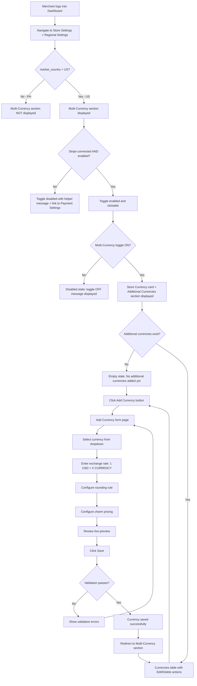
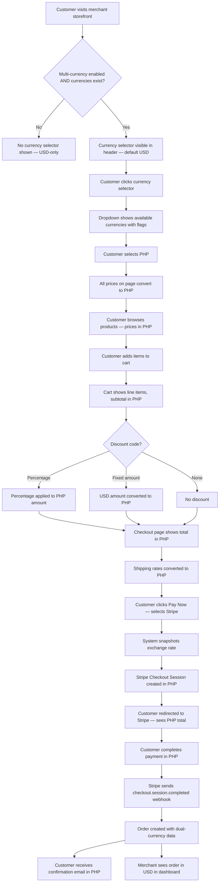
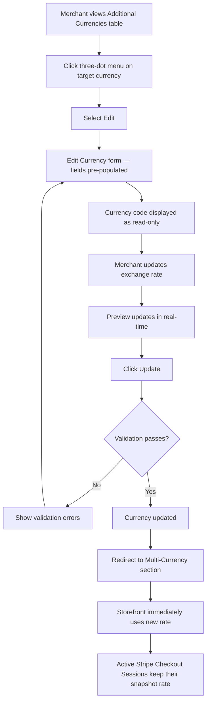
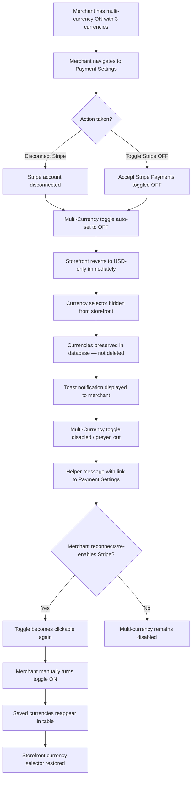
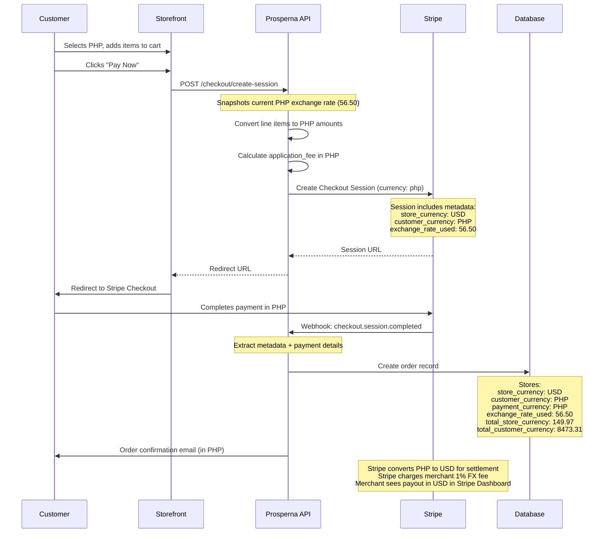
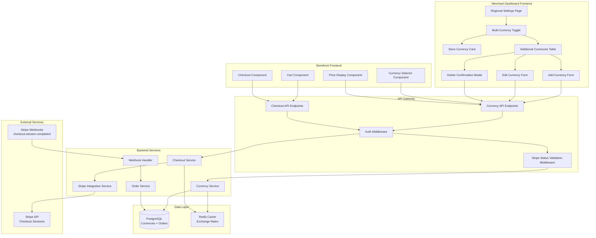
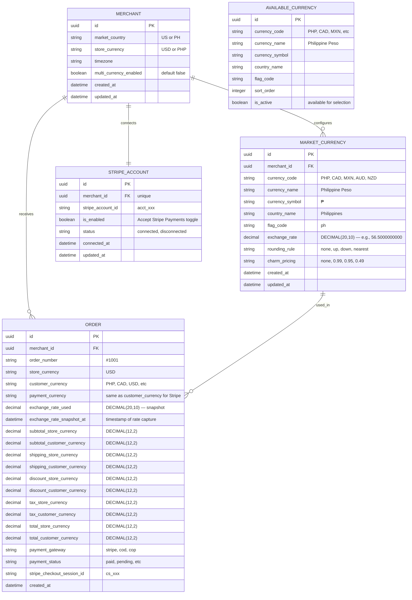

Agile-focused PRD documenting the implementation of the Multi-Currency feature for Prosperna's eCommerce platform, enabling US-based merchants to sell products in multiple currencies with true multi-currency checkout via Stripe, allowing international customers to browse, select, and pay in their preferred currency.

**Demo Recording:**

[Multi-Currency POC](https://p1-ba-pocs.vercel.app/multi-currency)

## Document Control

| Item           | Details                                                          |
| -------------- | ---------------------------------------------------------------- |
| Document Title | Multi-Currency                                                   |
| Version        | 1.0                                                              |
| Date           | February 13, 2026                                                |
| Prepared by    | Business Analyst                                                 |
| Reviewed by    | To be assigned                                                   |
| Approved by    | To be assigned                                                   |
| Status         | For Review                                                       |
| Related BRD    | Phase 1-A Single-Market MVP PRD, Phase 1-B Stripe Integration PRD |

---

## Revision History

| Version | Date       | Author           | Change Description                                  |
| ------- | ---------- | ---------------- | --------------------------------------------------- |
| 1.0     | 2026-02-13 | Business Analyst | Initial draft - Multi-Currency feature specification |

---

## 1. Introduction

### 1.1 Document Purpose

This PRD defines the detailed functional requirements, acceptance criteria (using BDD/Gherkin), and technical specifications for implementing the **Multi-Currency** feature in Prosperna's Merchant Dashboard and Storefront. The feature enables US-based merchants who have connected and enabled Stripe (via Phase 1-B) to add additional selling currencies to their store, allowing international customers to browse product prices, select their preferred currency, and complete checkout with true multi-currency payment processing through Stripe.

This feature builds directly on top of the Phase 1-A Single-Market MVP (country configuration and regional settings) and Phase 1-B Payment Gateways (Stripe Connect Standard integration). It introduces merchant-managed manual exchange rates, storefront currency selection, converted price display with rounding and charm pricing, and dual-currency order recording that follows established Shopify patterns for orders, discounts, shipping, and customer account displays.

### 1.2 Feature Vision

Prosperna will empower US-based merchants to reach international customers by offering a seamless multi-currency shopping experience. Merchants can add selling currencies (PHP, CAD, MXN, AUD, NZD) with manually configured exchange rates, and customers can browse and pay in their selected currency — not just view converted prices, but actually be charged in that currency through Stripe Checkout. This positions Prosperna as a competitive international commerce platform while maintaining simplicity: no platform-level conversion fees, no complex automatic rate management, and full merchant control over pricing.

Phase 1 focuses on manual exchange rate management for US merchants. Future phases will introduce automatic exchange rate feeds, additional currencies, market-specific pricing strategies, and expansion to merchants in other countries.

### 1.3 Success Criteria

**User Adoption & Usage:**

- 40% of US merchants with Stripe connected enable multi-currency within 30 days of feature launch
- Average of 2 additional currencies configured per adopting merchant
- 70% of adopting merchants maintain at least one active additional currency after 60 days
- 15% of storefront customers use a non-USD currency when available

**Technical Performance:**

- Currency conversion calculation and storefront price rendering completes in < 200ms
- Stripe Checkout Session creation with multi-currency metadata completes in < 3 seconds
- Exchange rate update (save operation) completes in < 1 second
- Zero mismatch between storefront displayed price and Stripe Checkout charged amount

**Business Impact:**

- 20% increase in international order volume for merchants using multi-currency
- 10% reduction in checkout abandonment for international visitors (compared to USD-only checkout)
- Feature drives 10% increase in new US merchant signups who cite international selling as a priority
- No increase in payment-related support tickets (clear UX and merchant education)

### 1.4 Related Documents

- [Phase 1-A Single-Market MVP PRD](https://pkb.prosperna.ph/docs/product/shared-services/phase1a-single-market-mvp) — Country configuration, regional settings, address fields
- [Phase 1-B Stripe Integration PRD](https://pkb.prosperna.ph/docs/product/shared-services/phase1b-stripe-integration) — Stripe Connect Standard integration, checkout flow
- [Multi-Currency POC Prototype](https://p1-ba-pocs.vercel.app/multi-currency) — ReactJS wireframe demonstrating merchant and consumer interfaces

---

## 2. Background & Context

### 2.1 Problem Statement

**Current Pain Point:**

Prosperna merchants who sell to international customers are currently limited to displaying and charging prices exclusively in their store currency (USD for US merchants, PHP for PH merchants). When an international customer visits a US merchant's store, they see all prices in USD and must mentally convert to their local currency, creating friction and uncertainty. The customer's issuing bank may apply unpredictable foreign transaction fees (0–3%) at the time of charge, further discouraging purchase completion.

**Current Problematic Workflow:**

1. US merchant lists product at $99.99 USD
2. Customer from the Philippines visits the store
3. Customer sees "$99.99" and must mentally estimate the PHP equivalent
4. Customer is uncertain about final cost due to potential bank FX fees
5. Customer either abandons checkout or proceeds with uncertainty
6. Customer's bank charges the USD amount and applies its own FX conversion with markup
7. Customer sees an unexpected total on their credit card statement (e.g., ₱5,800 instead of the expected ₱5,650)
8. Merchant has no visibility into the customer's experience or the fees they incurred

**Impact of Current Limitations:**

- **Lost Sales:** International customers abandon checkout due to currency uncertainty — studies show presenting prices in local currency can increase conversion by 12–15%
- **Price Opacity:** Customers cannot accurately assess affordability without a currency converter, leading to hesitation
- **Competitive Disadvantage:** Shopify, WooCommerce, and BigCommerce all offer multi-currency capabilities; Prosperna merchants who sell internationally are at a disadvantage
- **Customer Trust Erosion:** Unexpected bank FX fees on the customer's statement reduce trust and increase chargebacks/disputes
- **Market Limitation:** US merchants cannot effectively target specific international markets (Philippines, Canada, Mexico, Australia, New Zealand) without local currency support

**Business Context:**

- Prosperna's internationalization initiative (Phase 1-A, Phase 1-B) has established the foundation for US merchant onboarding and Stripe payment processing
- US merchants represent a growing segment that specifically needs international selling capabilities
- Competitor analysis shows multi-currency is a table-stakes feature for eCommerce platforms targeting international commerce
- Supervisor decision: Multi-currency is scoped to US merchants only — PH merchants will not receive this feature due to the Merchant of Record complexity with myPay/Xendit and the Balances module

### 2.2 Current State

**Current Regional Settings Behavior (Post Phase 1-A):**

1. **Store Country:** Set during onboarding (US or PH), locked and non-editable
2. **Store Currency:** Determined by store country (USD for US, PHP for PH), locked and non-editable
3. **Store Timezone:** Editable dropdown filtered by store country
4. **No Multi-Currency Section:** Regional Settings does not include any currency management beyond the single store currency

**Current Payment Processing (Post Phase 1-B):**

1. **US Merchants — Stripe Connect Standard:** Merchant connects their own Stripe account via OAuth, checkout creates a Stripe Checkout Session in USD, webhook processes order creation
2. **PH Merchants — myPay (Xendit):** Prosperna's pooled Xendit account processes payments in PHP, Prosperna is the Merchant of Record
3. **All transactions are single-currency:** The Stripe Checkout Session is always created in the store's base currency

**Current Storefront Behavior:**

1. All product prices displayed in store currency only
2. No currency selector available to customers
3. No conversion or alternative currency display
4. Cart, checkout, and order confirmation all in store currency

**Current Limitations:**

- No ability to display prices in any currency other than the store currency
- No currency conversion logic exists in the platform
- No exchange rate management capability
- No dual-currency data storage on order records
- Stripe Checkout Sessions are always created in a single currency (USD)

### 2.3 Desired Future State

**Enhanced Regional Settings with Multi-Currency:**

1. **Multi-Currency Section in Regional Settings:**
   - New section below the existing Regional Settings fields (Store Country, Store Currency, Store Timezone)
   - Master toggle to enable/disable multi-currency for the store
   - Conditional availability: requires Stripe connected AND enabled
   - Store currency display card (locked, with "Default" badge)
   - Additional currencies table with CRUD operations

2. **Currency Management Capabilities:**
   - Add up to 5 additional selling currencies (PHP, CAD, MXN, AUD, NZD)
   - Set manual exchange rates in the format "1 USD = X [Currency]"
   - Configure display options per currency: rounding rule and charm pricing
   - Live preview of converted prices before saving
   - Edit exchange rates and display options at any time
   - Delete currencies with confirmation

3. **Storefront Multi-Currency Experience:**
   - Currency selector in storefront header showing available currencies
   - All product prices converted and displayed in customer's selected currency
   - Currency persists across page navigations within a session
   - Cart, shipping, discounts, and totals all displayed in selected currency
   - Stripe Checkout Session created in the customer's selected currency (true multi-currency)

4. **Dual-Currency Order Management:**
   - Orders list displays amounts in store currency (USD) for consistency
   - Order detail payment section reveals customer's currency, amount, and exchange rate used
   - Dashboard and analytics calculate metrics in store currency
   - Customer's order history and confirmation emails show their checkout currency
   - Historical order data preserved even if a currency is later deleted

**Benefits After Implementation:**

- **International Customer Conversion:** Customers see prices in their familiar currency, reducing checkout friction
- **True Multi-Currency Checkout:** Customers are charged in their selected currency (not display-only), eliminating bank FX uncertainty
- **Merchant Control:** Manual exchange rates give merchants full control over pricing and margins
- **No Hidden Fees:** No Prosperna platform conversion fee — only Stripe's standard published rates apply
- **Competitive Parity:** Feature matches or exceeds competitor offerings for the target market
- **Foundation for Growth:** Architecture supports future automatic rate feeds, additional currencies, and market-specific pricing

### 2.4 Target Users

| User Segment | Description | Use Case | Configuration Example |
| ------------ | ----------- | -------- | --------------------- |
| US Merchants Selling to Philippines | US-based Filipino diaspora businesses targeting Philippine customers | Add PHP as selling currency to serve Philippine customer base | PHP at 56.50 rate, round to nearest, .99 charm |
| US Merchants Selling to Canada | US businesses with Canadian customer base | Add CAD for North American cross-border commerce | CAD at 1.35 rate, no rounding, no charm |
| US Merchants Selling to Mexico | US businesses targeting Latin American market | Add MXN for Mexican customer base | MXN at 17.25 rate, round up, .99 charm |
| US Merchants Selling Globally | US merchants with diverse international audience | Add 3–5 currencies covering key markets | Multiple currencies with market-specific settings |
| International Customers | Customers outside the US browsing US merchant stores | Select their local currency to view prices and pay at checkout | Select PHP from currency dropdown, see ₱ prices |
| Returning International Customers | Customers who have previously purchased in a foreign currency | View order history in the currency they paid in | Order history shows ₱ amounts for PHP orders |

### 2.5 Project Constraints & Assumptions

**Technical Constraints:**

- Must integrate with existing Regional Settings page structure (Phase 1-A)
- Must use existing Stripe Connect Standard integration (Phase 1-B) — no new payment gateway integrations
- Stripe Checkout Session API must support the presentment currencies used
- Exchange rate precision stored as DECIMAL(20,10) to avoid floating-point errors
- Database schema changes must be backward compatible with existing USD-only orders
- Must not break existing single-currency checkout flow for merchants who don't enable multi-currency

**Business Constraints:**

- Feature restricted to US merchants only (`market_country = 'US'`) — supervisor decision due to MoR complexity with PH merchants
- Requires Stripe account connected AND "Accept Stripe Payments" toggle ON — feature is disabled without both
- No Prosperna platform conversion fee — only Stripe's standard 1% FX fee applies (merchant-side, deducted from payout)
- Maximum 5 additional currencies in Phase 1 (PHP, CAD, MXN, AUD, NZD)
- Exchange rates are manual only in Phase 1 — no automatic rate feeds
- Refund handling out of scope (Prosperna does not manage refunds in platform — handled in Stripe Dashboard)

**Key Assumptions:**

- US merchants understand they need to keep exchange rates updated manually to reflect market conditions
- Merchants will set exchange rates with an appropriate buffer to account for Stripe's 1% FX fee and market fluctuations
- The initial 5 currencies cover the primary target markets for Prosperna's US merchant base
- Stripe's presentment currency support includes all 5 target currencies (confirmed: PHP, CAD, MXN, AUD, NZD are all supported)
- Customers understand that their issuing bank may charge additional foreign transaction fees (0–3%) that are outside Prosperna's control
- A currency selector in the storefront header is sufficient for Phase 1 (no geo-IP auto-detection)

**Dependency Chain:**

- Phase 1-A must be deployed (store country, store currency, regional settings)
- Phase 1-B must be deployed (Stripe Connect Standard, checkout session flow, webhook order creation)
- Merchant must have completed Phase 1-B Stripe onboarding before multi-currency is available

---

# 3. Functional Requirements & BDD Scenarios

## Feature F-01: Multi-Currency Feature Availability & Prerequisites

### 3.1.1 Feature Context

Multi-currency is exclusively available to US merchants (`market_country = 'US'`) who have connected and enabled their Stripe account via the Phase 1-B integration. If either prerequisite is not met, the multi-currency section is visible but functionally locked, and the storefront does not offer currency selection to customers.

### 3.1.2 Business Rules

**BR-01: Market Country Restriction**
- Multi-currency is ONLY available to merchants with `market_country = 'US'`
- PH merchants (`market_country = 'PH'`) do NOT see the Multi-Currency section in Store Settings > Regional Settings at all
- This restriction is enforced at the backend; the frontend conditionally renders the section based on `market_country`

**BR-02: Stripe Connection Prerequisite**
- The Multi-Currency section is visible to US merchants regardless of Stripe connection status
- If the merchant has NOT connected a Stripe account, the Multi-Currency toggle is disabled (greyed out) and cannot be turned on
- A helper message is displayed: "To enable multi-currency, connect your Stripe account in Payment Settings."
- The message includes a link to Payment Settings for quick navigation

**BR-03: Stripe Enabled Prerequisite**
- If the merchant has connected Stripe but the "Accept Stripe Payments" toggle is OFF (disabled), the Multi-Currency toggle is also disabled (greyed out)
- A helper message is displayed: "To enable multi-currency, enable Stripe payments in Payment Settings."
- The message includes a link to Payment Settings

**BR-04: Multi-Currency Toggle Default State**
- When a US merchant first connects and enables Stripe, the Multi-Currency toggle defaults to OFF
- The merchant must explicitly turn it ON to activate multi-currency for their store
- Turning the toggle ON enables the currency management UI and storefront currency selector
- Turning the toggle OFF hides the storefront currency selector and reverts all prices to USD for customers

**BR-05: Stripe Disconnection Impact**
- If a merchant disconnects their Stripe account (via Payment Settings), the Multi-Currency toggle is automatically set to OFF
- All additional currencies remain saved in the database but become inactive
- The storefront immediately reverts to USD-only pricing
- A toast notification appears: "Multi-currency has been disabled because your Stripe account was disconnected."

**BR-06: Stripe Toggle-Off Impact**
- If a merchant turns OFF the "Accept Stripe Payments" toggle (but does not disconnect), the Multi-Currency toggle is automatically set to OFF
- Behavior is identical to BR-05: currencies preserved, storefront reverts to USD
- A toast notification appears: "Multi-currency has been disabled because Stripe payments were turned off."

### 3.1.3 Scenarios

##### Scenario 1: US merchant with Stripe connected and enabled sees Multi-Currency section

```gherkin
Given a merchant has market_country = 'US'
And the merchant has connected their Stripe account
And the "Accept Stripe Payments" toggle is ON
When the merchant navigates to Store Settings > Regional Settings
Then the Regional Settings section is displayed with Store Country, Store Currency, and Store Timezone
And the Multi-Currency section is displayed below Regional Settings
And the Multi-Currency toggle is enabled (clickable)
And the toggle is in the OFF position by default (if never enabled before)
```

##### Scenario 2: US merchant without Stripe connected sees disabled Multi-Currency toggle

```gherkin
Given a merchant has market_country = 'US'
And the merchant has NOT connected a Stripe account
When the merchant navigates to Store Settings > Regional Settings
Then the Multi-Currency section is displayed
And the Multi-Currency toggle is disabled (greyed out, not clickable)
And a message displays: "To enable multi-currency, connect your Stripe account in Payment Settings."
And the message contains a clickable link to Payment Settings
```

##### Scenario 3: US merchant with Stripe connected but disabled sees disabled Multi-Currency toggle

```gherkin
Given a merchant has market_country = 'US'
And the merchant has connected their Stripe account
And the "Accept Stripe Payments" toggle is OFF
When the merchant navigates to Store Settings > Regional Settings
Then the Multi-Currency section is displayed
And the Multi-Currency toggle is disabled (greyed out, not clickable)
And a message displays: "To enable multi-currency, enable Stripe payments in Payment Settings."
And the message contains a clickable link to Payment Settings
```

##### Scenario 4: PH merchant does not see Multi-Currency section

```gherkin
Given a merchant has market_country = 'PH'
When the merchant navigates to Store Settings > Regional Settings
Then the Regional Settings section is displayed with Store Country, Store Currency, and Store Timezone
And the Multi-Currency section is NOT displayed
And no currency management options are available
```

##### Scenario 5: Merchant disconnects Stripe while multi-currency is enabled

```gherkin
Given a merchant has market_country = 'US'
And the merchant has Stripe connected and enabled
And the Multi-Currency toggle is ON
And the merchant has added 3 additional currencies (PHP, CAD, MXN)
When the merchant disconnects their Stripe account in Payment Settings
Then the Multi-Currency toggle is automatically set to OFF
And the storefront immediately reverts to USD-only pricing
And the currency selector is hidden from the storefront
And the 3 additional currencies are preserved in the database (not deleted)
```

##### Scenario 6: Merchant disables Stripe payments while multi-currency is enabled

```gherkin
Given a merchant has market_country = 'US'
And the merchant has Stripe connected and enabled
And the Multi-Currency toggle is ON
And the merchant has added 2 additional currencies
When the merchant turns OFF the "Accept Stripe Payments" toggle in Payment Settings
Then the Multi-Currency toggle is automatically set to OFF
And the storefront immediately reverts to USD-only pricing
And the currency selector is hidden from the storefront
And the additional currencies are preserved in the database
```

##### Scenario 7: Merchant re-enables Stripe after disconnection restores currencies

```gherkin
Given a merchant previously had multi-currency enabled with 3 additional currencies
And the merchant disconnected Stripe (causing multi-currency to turn off)
And the currencies were preserved in the database
When the merchant reconnects their Stripe account
And enables the "Accept Stripe Payments" toggle
Then the Multi-Currency toggle becomes enabled (clickable) again
And the toggle remains OFF (merchant must manually re-enable)
When the merchant turns the Multi-Currency toggle ON
Then the previously saved 3 currencies are displayed in the Additional Currencies table
And the storefront currency selector becomes available again
```

##### Scenario 8: Merchant enables multi-currency toggle

```gherkin
Given a merchant has market_country = 'US'
And the merchant has Stripe connected and enabled
And the Multi-Currency toggle is OFF
When the merchant clicks the Multi-Currency toggle to turn it ON
Then the toggle switches to ON (green)
And the Store Currency section displays showing "USD - US Dollar" as the locked base currency
And the Additional Currencies section displays with the "Add Currency" button
And the empty state message appears: "No additional currencies added yet"
```

##### Scenario 9: Merchant disables multi-currency toggle

```gherkin
Given a merchant has market_country = 'US'
And the Multi-Currency toggle is ON
And the merchant has added 2 additional currencies (PHP, CAD)
When the merchant clicks the Multi-Currency toggle to turn it OFF
Then the toggle switches to OFF
And the Store Currency and Additional Currencies sections are hidden
And a disabled state message displays: "Multi-currency is disabled. Enable the toggle above to allow customers to browse and pay in their preferred currency."
And the storefront immediately hides the currency selector
And all product prices on the storefront revert to USD
And the 2 additional currencies are preserved in the database
```

---

## Feature F-02: Store Currency Display

### 3.2.1 Feature Context

Display the merchant's store currency (USD for US merchants) as a locked, non-editable base currency within the Multi-Currency section. This currency serves as the reference for all exchange rate calculations and is the currency in which product prices are natively set.

### 3.2.2 Business Rules

**BR-07: Store Currency is Locked**
- The store currency is determined by the merchant's `market_country` set during Phase 1-A onboarding
- For US merchants, store currency is always USD ($)
- The store currency cannot be changed in Phase 1 (locked, non-editable)
- A lock icon is displayed next to the store currency to indicate immutability

**BR-08: Store Currency Display Format**
- The store currency card displays:
  - Country flag (US flag for USD)
  - Currency code in bold ("USD")
  - A "Default" badge (blue)
  - Full currency name ("US Dollar")
  - Lock icon on the right side
- Below the card, a helper text displays: "All product prices are set in this currency. Exchange rates for other currencies are calculated from USD."

**BR-09: Base Currency Rate**
- The base currency (USD) always has an implicit exchange rate of 1.0
- The base currency does NOT appear in the Additional Currencies table
- The base currency cannot be deleted or modified

### 3.2.3 Scenarios

##### Scenario 1: Store currency card displays correctly for US merchant

```gherkin
Given a merchant has market_country = 'US'
And the Multi-Currency toggle is ON
When the merchant views the Multi-Currency section
Then the Store Currency card is displayed
And the card shows the US flag image
And the currency code "USD" is displayed in bold
And a blue "Default" badge is displayed next to the currency code
And the full name "US Dollar" is displayed
And a lock icon is displayed on the right side of the card
And helper text displays: "All product prices are set in this currency. Exchange rates for other currencies are calculated from USD."
```

##### Scenario 2: Store currency is not editable

```gherkin
Given a merchant is viewing the Multi-Currency section
And the Store Currency card shows "USD - US Dollar"
When the merchant attempts to interact with the Store Currency card
Then no edit, delete, or change actions are available
And the card appears in a muted/disabled background style
And the lock icon confirms the field is immutable
```

##### Scenario 3: Store currency does not appear in Additional Currencies table

```gherkin
Given a merchant has added PHP and CAD as additional currencies
When the merchant views the Additional Currencies table
Then the table shows PHP and CAD rows
And USD does NOT appear in the table
And USD is not available in the "Add Currency" dropdown
```

---

## Feature F-03: Add Currency

### 3.3.1 Feature Context

Enable merchants to add additional selling currencies to their store by selecting a currency, setting a manual exchange rate, and optionally configuring display options (rounding rule and charm pricing). The add currency form is a dedicated page view.

### 3.3.2 Business Rules

**BR-10: Add Currency Page Layout**
- Clicking "Add Currency" button navigates to a full-page form view
- Page header shows a back arrow and title "Add Currency"
- Form is organized into two sections: Currency Configuration and Display Options
- A sticky footer contains "Cancel" and "Save" buttons
- The footer remains fixed at the bottom of the viewport

**BR-11: Currency Selection**
- Currency is selected from a dropdown of available currencies
- The dropdown only shows currencies that have NOT already been added to the store
- The store currency (USD) is never shown in the dropdown
- Each option displays: "`{CODE}` - `{Full Name}`" (e.g., "PHP - Philippine Peso")
- Currency selection is required; the form cannot be saved without a selection

**BR-12: Available Currencies List (Phase 1)**
- The initial set of available currencies for Phase 1 includes:
  | Code | Name | Symbol | Country |
  |------|------|--------|---------|
  | PHP | Philippine Peso | ₱ | Philippines |
  | CAD | Canadian Dollar | C$ | Canada |
  | MXN | Mexican Peso | $ | Mexico |
  | AUD | Australian Dollar | A$ | Australia |
  | NZD | New Zealand Dollar | NZ$ | New Zealand |
- Additional currencies may be added in future phases
- Note: The list is defined in a configurable reference table, not hardcoded

**BR-13: Exchange Rate Input**
- Exchange rate is displayed in the format: "1 USD = `{rate}` `{CURRENCY_CODE}`"
- The rate field is a numeric input accepting decimal values
- Minimum value: greater than 0 (cannot be zero or negative)
- Maximum decimal precision: 10 decimal places (stored as DECIMAL(20,10))
- Exchange rate is required; the form cannot be saved without a rate
- A helper note is displayed below the exchange rate section: "Note: Exchange rates are set manually. Update this rate regularly to reflect current market rates."

**BR-14: Rounding Rule Configuration**
- Rounding rule determines how converted prices are rounded
- Available options:
  | Option | Behavior | Example (56.347 → ) |
  |--------|----------|---------------------|
  | No rounding | No modification to converted price | 56.35 (standard 2-decimal) |
  | Round up | Always round up to nearest whole number | 57.00 |
  | Round down | Always round down to nearest whole number | 56.00 |
  | Round to nearest | Round to the nearest whole number | 56.00 |
- Default selection: "No rounding"
- Rounding is applied AFTER the price × rate conversion

**BR-15: Charm Pricing Configuration**
- Charm pricing replaces the decimal portion of the converted price
- Available options:
  | Option | Effect | Example (57.00 → ) |
  |--------|--------|---------------------|
  | None | No charm pricing applied | 57.00 |
  | .99 | Replace cents with .99 | 56.99 |
  | .95 | Replace cents with .95 | 56.95 |
  | .49 | Replace cents with .49 | 56.49 |
- Default selection: "None"
- Charm pricing is applied AFTER rounding (if rounding is enabled)
- When charm pricing is applied, the whole number portion is taken from the rounded value minus 1 (e.g., 57.00 with .99 charm = 56.99)

**BR-16: Live Preview**
- A preview section is displayed below the Display Options
- Preview uses a sample product price of $99.99 USD
- The preview updates in real-time as the merchant changes rate, rounding, and charm pricing
- Preview shows: country flag, converted price with currency symbol and code, currency full name
- Preview calculation order: (1) multiply by rate → (2) apply rounding → (3) apply charm pricing

**BR-17: Successful Currency Addition**
- Upon successful save:
  - Currency record is created and associated with the merchant's store
  - Merchant is redirected to the Multi-Currency section (listing view)
  - New currency appears in the Additional Currencies table
  - Success toast notification displays: "Successfully added currency."
  - The storefront immediately includes the new currency in the currency selector

**BR-18: Duplicate Currency Prevention**
- A currency code can only be added once per store
- If a currency is already added, it does not appear in the dropdown
- Backend validation also prevents duplicate entries (unique constraint on `store_id` + `currency_code`)

### 3.3.3 Scenarios

##### Scenario 1: Merchant initiates adding a new currency

```gherkin
Given a merchant has the Multi-Currency toggle ON
And the merchant is viewing the Additional Currencies section
When the merchant clicks the "Add Currency" button
Then the page navigates to the Add Currency form
And the page header displays a back arrow and title "Add Currency"
And the Currency Configuration section is displayed with:
  - A "Select Currency" dropdown with placeholder "Choose a currency..."
  - An Exchange Rate section (hidden until currency is selected)
And the Display Options section is hidden until a currency is selected
And a sticky footer displays "Cancel" and "Save" buttons
And the "Save" button is disabled until required fields are filled
```

##### Scenario 2: Merchant selects a currency from the dropdown

```gherkin
Given a merchant is on the Add Currency form
And the merchant has not yet added PHP to their store
When the merchant clicks the "Select Currency" dropdown
Then the dropdown displays the available currencies:
  | Option |
  | PHP - Philippine Peso |
  | CAD - Canadian Dollar |
  | MXN - Mexican Peso |
  | AUD - Australian Dollar |
  | NZD - New Zealand Dollar |
And USD is NOT shown in the dropdown (it is the base currency)
When the merchant selects "PHP - Philippine Peso"
Then the dropdown shows "PHP - Philippine Peso" as selected
And the Exchange Rate section appears with the format "1 USD = [input] PHP"
And the Display Options section appears with Rounding Rule and Charm Pricing
```

##### Scenario 3: Already-added currencies are excluded from dropdown

```gherkin
Given a merchant has already added PHP and CAD as additional currencies
When the merchant clicks "Add Currency" and opens the dropdown
Then the dropdown displays:
  | Option |
  | MXN - Mexican Peso |
  | AUD - Australian Dollar |
  | NZD - New Zealand Dollar |
And PHP and CAD are NOT shown in the dropdown
And USD is NOT shown in the dropdown
```

##### Scenario 4: Merchant enters a valid exchange rate

```gherkin
Given a merchant is on the Add Currency form
And has selected "PHP - Philippine Peso"
When the merchant enters "56.50" in the exchange rate field
Then the field displays "56.50"
And the rate format reads: "1 USD = 56.50 PHP"
And no validation error is shown
And the Preview section updates to show the converted price
```

##### Scenario 5: Merchant attempts to enter zero or negative exchange rate

```gherkin
Given a merchant is on the Add Currency form
And has selected a currency
When the merchant enters "0" in the exchange rate field
And clicks outside the field (blur event)
Then a validation error appears: "Exchange rate must be greater than 0"
And the input field border turns red
When the merchant enters "-5" in the exchange rate field
Then the same validation error appears
When the merchant enters "0.01"
Then the validation error disappears
And the input field border returns to normal
```

##### Scenario 6: Merchant configures rounding rule

```gherkin
Given a merchant is on the Add Currency form
And has selected PHP with exchange rate 56.50
And the sample price $99.99 converts to ₱5,649.44 (99.99 × 56.50)
When the merchant selects "Round up" from the Rounding Rule dropdown
Then the Preview updates to show ₱5,650.00
When the merchant selects "Round down"
Then the Preview updates to show ₱5,649.00
When the merchant selects "Round to nearest"
Then the Preview updates to show ₱5,649.00
When the merchant selects "No rounding"
Then the Preview updates to show ₱5,649.44
```

##### Scenario 7: Merchant configures charm pricing

```gherkin
Given a merchant is on the Add Currency form
And has selected PHP with exchange rate 56.50
And rounding is set to "Round up" (converting $99.99 → ₱5,650.00)
When the merchant selects ".99" from the Charm Pricing dropdown
Then the Preview updates to show ₱5,649.99
When the merchant selects ".95"
Then the Preview updates to show ₱5,649.95
When the merchant selects ".49"
Then the Preview updates to show ₱5,649.49
When the merchant selects "None"
Then the Preview updates to show ₱5,650.00
```

##### Scenario 8: Live preview updates in real-time

```gherkin
Given a merchant is on the Add Currency form
And has selected "CAD - Canadian Dollar"
When the merchant enters "1.35" as the exchange rate
Then the Preview section displays:
  - Canadian flag image
  - "C$ 134.99 CAD" (99.99 × 1.35 = 134.9865, displayed as 134.99)
  - "Canadian Dollar"
When the merchant changes the rate to "1.40"
Then the Preview immediately updates to "C$ 139.99 CAD" (99.99 × 1.40 = 139.986)
```

##### Scenario 9: Merchant successfully adds a currency

```gherkin
Given a merchant is on the Add Currency form
And the merchant has entered:
  | Field | Value |
  | Currency | PHP - Philippine Peso |
  | Exchange Rate | 56.50 |
  | Rounding Rule | No rounding |
  | Charm Pricing | None |
When the merchant clicks the "Save" button
Then the currency is saved successfully
And the merchant is redirected to the Multi-Currency section
And PHP appears in the Additional Currencies table with:
  | Currency | Exchange Rate |
  | PHP Philippine Peso | 1 USD = 56.50 PHP |
And a success toast notification displays: "Successfully added currency."
And the storefront currency selector now includes PHP
```

##### Scenario 10: Merchant attempts to save without selecting a currency

```gherkin
Given a merchant is on the Add Currency form
And no currency has been selected from the dropdown
When the merchant clicks the "Save" button
Then the form is not submitted
And the "Save" button remains disabled
And the merchant remains on the Add Currency form
```

##### Scenario 11: Merchant attempts to save without entering an exchange rate

```gherkin
Given a merchant is on the Add Currency form
And has selected "PHP - Philippine Peso"
And the exchange rate field is empty
When the merchant clicks the "Save" button
Then the form is not submitted
And the exchange rate field shows red border with error "Required*"
And the merchant remains on the Add Currency form
```

##### Scenario 12: Merchant cancels adding a currency

```gherkin
Given a merchant is on the Add Currency form
And has selected PHP and entered exchange rate 56.50
When the merchant clicks the "Cancel" button
Then all entered data is discarded
And the merchant is redirected to the Multi-Currency section
And no new currency is added
```

##### Scenario 13: Merchant navigates back using header back arrow

```gherkin
Given a merchant is on the Add Currency form
When the merchant clicks the back arrow in the page header
Then the merchant is redirected to the Multi-Currency section
And all entered data is discarded
And no new currency is added
```

##### Scenario 14: All available currencies have been added

```gherkin
Given a merchant has added all 5 available currencies (PHP, CAD, MXN, AUD, NZD)
When the merchant views the Additional Currencies section
Then the "Add Currency" button is disabled
And a tooltip or helper text indicates: "All available currencies have been added"
```

---

## Feature F-04: Edit Currency

### 3.4.1 Feature Context

Allow merchants to modify the exchange rate, rounding rule, and charm pricing of an existing additional currency. The currency code itself cannot be changed during editing.

### 3.4.2 Business Rules

**BR-19: Edit Currency Page Layout**
- Selecting "Edit" from the actions menu (three-dot/kebab menu) navigates to the Edit Currency form
- Page header displays a back arrow and title "Edit Currency"
- Form layout is identical to the Add Currency form
- All fields are pre-populated with the existing currency configuration
- Footer buttons are "Cancel" and "Update" (instead of "Save")

**BR-20: Currency Code is Locked During Edit**
- The currency code and name are displayed as read-only (not editable)
- The currency is shown with its flag, code, and name in a muted background card
- No dropdown is available; the merchant cannot change which currency this record represents

**BR-21: Pre-population of Currency Data**
- Exchange rate field contains the saved rate value
- Rounding Rule dropdown reflects the saved rounding rule
- Charm Pricing dropdown reflects the saved charm pricing option
- Preview section shows the current converted price with saved settings

**BR-22: Successful Currency Update**
- Upon successful update:
  - Currency record is updated with new configuration
  - Merchant is redirected to the Multi-Currency section
  - Updated currency reflects new exchange rate in the table
  - Success toast notification displays: "Successfully updated currency."
  - The storefront immediately applies the new exchange rate to all prices in that currency

**BR-23: Storefront Price Update Timing**
- When a merchant updates an exchange rate, the new rate takes effect immediately on the storefront
- Customers currently browsing in that currency will see updated prices on their next page load or navigation
- Any active checkout sessions that have not been submitted continue with the rate at the time of session creation (Stripe handles this via the Checkout Session)

### 3.4.3 Scenarios

##### Scenario 1: Merchant opens edit form for existing currency

```gherkin
Given a merchant has PHP configured with:
  | Field | Value |
  | Exchange Rate | 56.50 |
  | Rounding Rule | No rounding |
  | Charm Pricing | None |
When the merchant clicks the three-dot menu for PHP in the Additional Currencies table
And selects "Edit"
Then the Edit Currency form opens
And the page header displays "Edit Currency"
And the currency is displayed as read-only: PHP flag, "PHP", "Philippine Peso"
And the Exchange Rate field shows "56.50" with format "1 USD = 56.50 PHP"
And the Rounding Rule dropdown shows "No rounding"
And the Charm Pricing dropdown shows "None"
And the Preview shows the converted sample price at the current settings
And the footer displays "Cancel" and "Update" buttons
```

##### Scenario 2: Merchant updates exchange rate

```gherkin
Given a merchant is on the Edit Currency form for PHP
And the Exchange Rate field shows "56.50"
When the merchant clears the field and enters "57.25"
Then the field displays "57.25"
And the rate format reads: "1 USD = 57.25 PHP"
And the Preview updates to reflect the new rate
```

##### Scenario 3: Merchant updates rounding and charm pricing

```gherkin
Given a merchant is on the Edit Currency form for CAD
And the current settings are: Rate 1.35, No rounding, None charm pricing
When the merchant changes Rounding Rule to "Round up"
And changes Charm Pricing to ".99"
Then the Preview updates to reflect both changes applied in order:
  - $99.99 × 1.35 = $134.9865 → Round up → $135.00 → Charm .99 → $134.99
And the Preview shows "C$ 134.99 CAD"
```

##### Scenario 4: Merchant successfully updates a currency

```gherkin
Given a merchant is on the Edit Currency form for PHP
And has changed the exchange rate from 56.50 to 57.00
When the merchant clicks the "Update" button
Then the currency is updated successfully
And the merchant is redirected to the Multi-Currency section
And PHP row in the table now shows "1 USD = 57.00 PHP"
And a success toast notification displays: "Successfully updated currency."
And the storefront immediately applies the new rate for PHP prices
```

##### Scenario 5: Merchant attempts to save edit with empty exchange rate

```gherkin
Given a merchant is on the Edit Currency form for PHP
When the merchant clears the Exchange Rate field (leaves it empty)
And clicks the "Update" button
Then the form is not submitted
And the Exchange Rate field shows red border with error "Required*"
And the merchant remains on the Edit Currency form
```

##### Scenario 6: Merchant cancels edit without saving changes

```gherkin
Given a merchant is on the Edit Currency form for PHP
And has changed the exchange rate from 56.50 to 60.00
When the merchant clicks the "Cancel" button
Then the changes are discarded
And the merchant is redirected to the Multi-Currency section
And PHP row still shows "1 USD = 56.50 PHP" (original value)
```

---

## Feature F-05: Delete Currency

### 3.5.1 Feature Context

Allow merchants to remove an additional selling currency from their store. Deletion requires confirmation and immediately removes the currency from the storefront currency selector.

### 3.5.2 Business Rules

**BR-24: Delete Confirmation Modal**
- Clicking "Delete" from the three-dot actions menu opens a confirmation modal
- Modal title: "Remove Currency"
- Modal message: "Are you sure you want to remove `{Currency Name}` from your selling currencies? Customers will no longer be able to browse or pay in `{Currency Name}`. This action cannot be undone."
- Modal has two buttons: "Cancel" and "Remove Currency"
- "Cancel" closes the modal without deleting
- "Remove Currency" confirms deletion

**BR-25: Immediate Storefront Impact**
- Upon deletion, the currency is immediately removed from the storefront currency selector
- Customers currently browsing in the deleted currency are switched to the store currency (USD) on their next page load
- Any customer who had selected the deleted currency and has items in their cart will see cart prices revert to USD

**BR-26: Active Checkout Sessions**
- If a customer is in the middle of a Stripe Checkout Session using the deleted currency, the session remains valid until it expires (24 hours) or is completed
- The webhook will still process the order with the original currency and rate
- This is a Stripe-managed edge case; no special handling is required on Prosperna's side

**BR-27: Historical Order Preservation**
- Deleting a currency does NOT affect historical orders
- Orders placed in the deleted currency retain their `customer_currency`, `exchange_rate_used`, and all dual-currency amounts
- The order detail page continues to show the customer's original currency and amount

**BR-28: Post-Deletion State**
- After deletion, the currency becomes available again in the "Add Currency" dropdown
- If all additional currencies are deleted, the empty state message is displayed: "No additional currencies added yet"

### 3.5.3 Scenarios

##### Scenario 1: Merchant initiates currency deletion

```gherkin
Given a merchant has PHP as an additional currency
When the merchant clicks the three-dot menu for PHP
And selects "Delete"
Then a confirmation modal appears
And the modal title displays "Remove Currency"
And the modal message displays "Are you sure you want to remove Philippine Peso from your selling currencies? Customers will no longer be able to browse or pay in Philippine Peso. This action cannot be undone."
And the modal has "Cancel" and "Remove Currency" buttons
```

##### Scenario 2: Merchant confirms currency deletion

```gherkin
Given the delete confirmation modal is displayed for PHP
When the merchant clicks "Remove Currency"
Then the modal closes
And PHP is removed from the Additional Currencies table
And a success toast notification displays: "Successfully deleted currency."
And the storefront currency selector no longer includes PHP
And PHP becomes available again in the "Add Currency" dropdown
```

##### Scenario 3: Merchant cancels currency deletion

```gherkin
Given the delete confirmation modal is displayed for PHP
When the merchant clicks "Cancel"
Then the modal closes
And PHP remains in the Additional Currencies table
And no changes are made
```

##### Scenario 4: Deleting last additional currency shows empty state

```gherkin
Given a merchant has only one additional currency (PHP)
When the merchant deletes PHP via the confirmation modal
Then the Additional Currencies table is empty
And the empty state is displayed:
  - Dollar sign icon
  - Title: "No additional currencies added yet"
  - Description: "Add currencies to let customers pay in their preferred currency."
```

##### Scenario 5: Historical orders preserved after currency deletion

```gherkin
Given a merchant has PHP as an additional currency
And there are 5 orders placed by customers who paid in PHP
When the merchant deletes PHP
Then the 5 historical orders are NOT affected
And each order still shows customer_currency = "PHP"
And each order still shows the original PHP amounts and exchange rate
And the order detail page displays the PHP amounts in the payment section
```

##### Scenario 6: Customer browsing in deleted currency is reverted to USD

```gherkin
Given a merchant has PHP as an additional currency
And a customer is currently browsing the store with PHP selected
When the merchant deletes PHP
And the customer navigates to a new page or refreshes
Then the customer's currency is automatically switched to USD
And all prices display in USD
And the currency selector no longer shows PHP as an option
```

---

## Feature F-06: Storefront Currency Selector & Price Display

### 3.6.1 Feature Context

Provide customers with a currency selector on the storefront to browse and view prices in their preferred currency. The selector is visible only when multi-currency is enabled and at least one additional currency has been added.

### 3.6.2 Business Rules

**BR-29: Currency Selector Visibility**
- The currency selector is displayed on the storefront ONLY when:
  - Multi-Currency toggle is ON, AND
  - At least one additional currency has been added
- If multi-currency is OFF or no additional currencies exist, the currency selector is hidden
- The store operates in USD-only mode when the selector is hidden

**BR-30: Currency Selector Display Format**
- The selector displays: Country flag + Country Name + "|" + Currency Code + Currency Symbol
- Example: "🇺🇸 United States | USD $"
- The selector shows the currently active currency
- Clicking the selector opens a dropdown showing all other available currencies
- The currently selected currency is NOT repeated in the dropdown options

**BR-31: Currency Selector Placement**
- The currency selector is positioned in the storefront header/navigation area
- Exact placement follows the store theme, but it should be accessible on all pages
- The selector is visible on: product listing, product detail, cart, and checkout pages

**BR-32: Currency Persistence**
- When a customer selects a currency, the selection is stored in a session cookie or local storage
- The selected currency persists across page navigations within the same session
- If the customer revisits the store in a new session, the default currency is USD (store currency)
- If the customer's previously selected currency has been removed by the merchant, the customer is reverted to USD

**BR-33: Price Conversion Display**
- All product prices on the storefront are displayed in the customer's selected currency
- Conversion formula: `product_price_USD × exchange_rate = display_price`
- Rounding and charm pricing rules are applied per the merchant's configuration for that currency
- Prices display with the appropriate currency symbol and formatting (e.g., "₱5,649.99" for PHP, "C$134.99" for CAD)

**BR-34: Prices That Are Converted**
- The following prices are converted and displayed in the customer's selected currency:
  - Product listing prices
  - Product detail page prices (including variant prices)
  - Compare-at / original prices (strikethrough prices for sale items)
  - Cart line item prices
  - Cart subtotal
  - Shipping rates (see F-09)
  - Discount amounts (see F-08)
  - Order total at checkout
- Tax amounts are converted using the same exchange rate

**BR-35: Prices in Store Currency (Not Converted)**
- The following remain in store currency (USD) and are NOT converted:
  - Merchant Dashboard: product prices, order amounts, analytics/reports
  - Any backend or API-level pricing

### 3.6.3 Scenarios

##### Scenario 1: Customer sees currency selector when multi-currency is enabled

```gherkin
Given a merchant has Multi-Currency toggle ON
And has added PHP and CAD as additional currencies
When a customer visits the merchant's storefront
Then the currency selector is visible in the header area
And the selector shows "United States | USD $" as the default (store currency)
And clicking the selector reveals a dropdown with:
  | Option |
  | Philippines | PHP ₱ |
  | Canada | CAD C$ |
```

##### Scenario 2: Customer does not see currency selector when multi-currency is disabled

```gherkin
Given a merchant has Multi-Currency toggle OFF
When a customer visits the merchant's storefront
Then the currency selector is NOT visible
And all prices display in USD
```

##### Scenario 3: Customer does not see currency selector with no additional currencies

```gherkin
Given a merchant has Multi-Currency toggle ON
And has NOT added any additional currencies
When a customer visits the merchant's storefront
Then the currency selector is NOT visible
And all prices display in USD
```

##### Scenario 4: Customer switches currency to PHP

```gherkin
Given a merchant has PHP configured with exchange rate 56.50, no rounding, no charm pricing
And a product "Wireless Headphones" is priced at $89.99 USD
When the customer clicks the currency selector
And selects "Philippines | PHP ₱"
Then the selector updates to show "Philippines | PHP ₱"
And "Wireless Headphones" price changes from "$89.99" to "₱5,084.44"
And all other product prices on the page update to PHP
```

##### Scenario 5: Customer switches currency with rounding and charm pricing applied

```gherkin
Given a merchant has CAD configured with:
  | Exchange Rate | Rounding | Charm Pricing |
  | 1.35 | Round up | .99 |
And a product "Smart Watch" is priced at $249.99 USD
When the customer selects CAD from the currency selector
Then "Smart Watch" price displays as "C$337.99"
  - Calculation: $249.99 × 1.35 = $337.4865 → Round up → $338.00 → Charm .99 → $337.99
```

##### Scenario 6: Currency persists across page navigation

```gherkin
Given a customer has selected PHP as their currency
And is viewing the product listing page with prices in PHP
When the customer clicks on a product to view its detail page
Then the product detail page displays prices in PHP
When the customer adds the product to cart
Then the cart displays prices in PHP
When the customer navigates back to the product listing
Then prices remain in PHP
```

##### Scenario 7: Currency resets to USD on new session

```gherkin
Given a customer previously browsed the store in PHP
And the customer's session has expired
When the customer revisits the store
Then the currency selector defaults to "United States | USD $"
And all prices display in USD
```

##### Scenario 8: Customer's selected currency is removed by merchant

```gherkin
Given a customer has selected PHP as their currency
And the customer has items in their cart with prices in PHP
When the merchant deletes PHP from their additional currencies
And the customer navigates to a new page or refreshes
Then the customer's currency is automatically switched to USD
And the currency selector no longer shows PHP
And all prices including cart prices display in USD
```

##### Scenario 9: Cart displays converted prices and subtotal

```gherkin
Given a customer has selected PHP with exchange rate 56.50
And the customer has the following items in their cart:
  | Product | USD Price | Quantity |
  | Headphones | $89.99 | 1 |
  | Power Bank | $29.99 | 2 |
When the customer views their cart
Then the cart displays:
  | Product | PHP Price | Quantity | Line Total |
  | Headphones | ₱5,084.44 | 1 | ₱5,084.44 |
  | Power Bank | ₱1,694.44 | 2 | ₱3,388.87 |
And the cart subtotal displays: ₱8,473.31
```

##### Scenario 10: Compare-at prices are converted

```gherkin
Given a product has a compare-at price of $129.99 and a sale price of $89.99
And the customer has selected PHP with exchange rate 56.50
When the customer views this product
Then the compare-at price displays as "₱7,344.44" with strikethrough
And the sale price displays as "₱5,084.44"
```

---

## Feature F-07: Checkout & Payment in Customer's Currency (Stripe Integration)

### 3.7.1 Feature Context

When a customer proceeds to checkout, a Stripe Checkout Session is created in the customer's selected currency. The customer is charged the exact amount displayed in their currency — this is true multi-currency, not display-only conversion. The exchange rate is snapshotted at the time the Checkout Session is created.

### 3.7.2 Business Rules

**BR-36: Stripe Checkout Session Currency**
- When the customer clicks "Pay Now" (or equivalent checkout CTA), a Stripe Checkout Session is created
- The session is created with `currency` set to the customer's selected currency code (e.g., "php", "cad")
- All `line_items` amounts in the session are in the customer's currency (already converted)
- The `application_fee_amount` (Prosperna's 1% platform fee) is calculated on the customer currency amount
- This follows the Phase 1-B Stripe integration pattern (checkout.session.completed webhook drives order creation)

**BR-37: Exchange Rate Snapshot**
- At the moment the Stripe Checkout Session is created, the current exchange rate for the customer's currency is captured
- This snapshot rate is stored on the order record as `exchange_rate_used`
- The snapshot timestamp is stored as `exchange_rate_snapshot_at`
- Even if the merchant updates the exchange rate while the customer is on the Stripe Checkout page, the original rate applies to that session

**BR-38: Customer Pays in Selected Currency**
- The Stripe Checkout page displays the total in the customer's currency
- The customer's card is charged in the customer's currency
- If the customer's card currency differs from the checkout currency, the customer's issuing bank handles any conversion (this is outside Prosperna/Stripe's control)

**BR-39: Merchant Receives Settlement in USD**
- Stripe settles funds to the merchant's bank account in their Stripe account's default currency (USD for US merchants)
- Stripe applies its own FX conversion fee (typically 1% for US accounts) when converting the customer's currency to USD for settlement
- This Stripe FX fee is borne by the merchant and is separate from Prosperna's 1% platform fee
- Prosperna does not display or track the Stripe FX fee; it is visible in the merchant's Stripe Dashboard

**BR-40: Checkout Session Metadata**
- The Stripe Checkout Session includes metadata for order creation:
  - `store_currency`: "USD"
  - `customer_currency`: the customer's selected currency code
  - `exchange_rate_used`: the rate at the time of session creation
  - `exchange_rate_snapshot_at`: timestamp of rate capture
  - All existing Phase 1-B metadata fields (`store_id`, cart items, shipping, etc.)

**BR-41: Customer Selects USD at Checkout**
- If the customer's selected currency is USD (the store currency), the checkout behaves identically to the standard Phase 1-B flow
- No exchange rate conversion is applied
- `exchange_rate_used` = 1.0
- `customer_currency` = "USD"

**BR-42: Multi-Currency Checkout Coexists with COD/COP**
- If the merchant has COD (Cash on Delivery) or COP (Cash on Pickup) enabled alongside Stripe:
  - The Stripe payment option shows "Pay with Stripe" in the customer's selected currency
  - COD/COP options display amounts in the customer's selected currency (converted)
  - However, COD/COP orders are recorded with `payment_currency = store_currency (USD)` since physical cash collection is in local currency of the store's country
  - A note displays to the customer: "Cash payments are collected in USD."

### 3.7.3 Scenarios

##### Scenario 1: Customer checks out in PHP

```gherkin
Given a customer has selected PHP with exchange rate 56.50
And the customer's cart total is ₱8,473.31 (PHP)
And the equivalent USD total is $149.97
When the customer clicks "Pay Now" and selects "Pay with Stripe"
Then a Stripe Checkout Session is created with:
  | Parameter | Value |
  | currency | php |
  | total amount | 847331 (in smallest currency unit: centavos) |
  | application_fee_amount | 8473 (1% of 847331) |
  | metadata.store_currency | USD |
  | metadata.customer_currency | PHP |
  | metadata.exchange_rate_used | 56.50 |
And the customer is redirected to Stripe's hosted checkout page
And the Stripe page shows the total as ₱8,473.31
```

##### Scenario 2: Customer checks out in USD (no conversion)

```gherkin
Given a customer has USD selected (the store currency)
And the customer's cart total is $149.97
When the customer clicks "Pay Now" and selects "Pay with Stripe"
Then a Stripe Checkout Session is created with:
  | Parameter | Value |
  | currency | usd |
  | total amount | 14997 (in cents) |
  | metadata.exchange_rate_used | 1.0 |
  | metadata.customer_currency | USD |
And the checkout proceeds identically to the standard Phase 1-B flow
```

##### Scenario 3: Exchange rate changes during customer's checkout session

```gherkin
Given a customer has selected PHP with exchange rate 56.50
And the customer clicks "Pay Now" at 2:00 PM creating a Stripe Checkout Session
And the session captures exchange_rate_used = 56.50
When the merchant updates the PHP exchange rate to 57.00 at 2:05 PM
And the customer completes payment on the Stripe page at 2:10 PM
Then the order is created with exchange_rate_used = 56.50 (the snapshot rate)
And the customer was charged ₱8,473.31 (based on the 56.50 rate)
And the new rate of 57.00 applies only to future checkout sessions
```

##### Scenario 4: Webhook creates order with multi-currency data

```gherkin
Given a customer has completed a Stripe Checkout in PHP
And Stripe sends a checkout.session.completed webhook
When the webhook is processed
Then an order is created with the following currency fields:
  | Field | Value |
  | store_currency | USD |
  | customer_currency | PHP |
  | payment_currency | PHP |
  | exchange_rate_used | 56.50 |
  | exchange_rate_snapshot_at | 2026-02-12T14:00:00Z |
  | total_store_currency | 149.97 |
  | total_customer_currency | 8473.31 |
  | payment_gateway | stripe |
  | payment_status | Paid |
And the order's store currency total is calculated as: customer_total / exchange_rate
```

##### Scenario 5: COD order with multi-currency display

```gherkin
Given a merchant has COD enabled alongside Stripe
And a customer has selected PHP as their currency
And the cart total is ₱8,473.31 (PHP) / $149.97 (USD)
When the customer selects "Cash on Delivery" as their payment method
Then a note displays: "Cash payments are collected in USD."
And the order is created with:
  | Field | Value |
  | customer_currency | PHP |
  | payment_currency | USD |
  | total_customer_currency | 8473.31 |
  | total_store_currency | 149.97 |
  | payment_method_conversion_applied | true |
```

##### Scenario 6: Stripe Checkout Session fails due to unsupported currency

```gherkin
Given a customer has selected a currency
When the customer clicks "Pay Now"
And the Stripe Checkout Session creation fails (e.g., currency not supported by Stripe for this account)
Then an error message displays: "Payment could not be processed. Please try again or contact the store for assistance."
And the customer remains on the checkout page
And no order is created
```

##### Scenario 7: Customer cancels Stripe Checkout and returns to store

```gherkin
Given a customer was redirected to the Stripe Checkout page in PHP
When the customer clicks "Back" or the cancel link on the Stripe page
Then the customer is redirected back to the Prosperna checkout page
And a warning toast displays: "Payment was not completed. You can try again when you're ready."
And the customer's cart and selected currency (PHP) are preserved
And no order is created
```

---

## Feature F-08: Discounts with Multi-Currency

### 3.8.1 Feature Context

Discount codes and promotions work across currencies. Percentage-based discounts apply natively regardless of currency. Fixed-amount discounts are created in the store currency (USD) and converted to the customer's currency using the exchange rate at checkout.

### 3.8.2 Business Rules

**BR-43: Percentage-Based Discounts**
- Percentage-based discounts (e.g., 10% off) apply the same percentage regardless of the customer's selected currency
- The discount is calculated on the converted price in the customer's currency
- Example: 10% off a $100 product → customer in PHP sees ₱5,650 (at 56.50 rate), 10% off = ₱565 discount → total ₱5,085

**BR-44: Fixed-Amount Discounts**
- Fixed-amount discounts are created in the store currency (USD)
- At checkout, the fixed amount is converted to the customer's currency using the current exchange rate
- Example: $5 off discount → customer in PHP sees ₱282.50 off (at 56.50 rate)
- If the merchant uses manual exchange rates, the manual rate is used for conversion
- The converted discount amount may fluctuate if the merchant updates the exchange rate between when the customer adds the discount and when they check out

**BR-45: Discount Code Currency Scope**
- Discount codes are NOT currency-specific; they work across all currencies
- A single discount code applies to customers regardless of which currency they've selected
- Currency-specific discount codes are NOT supported in Phase 1

**BR-46: Discount Display in Customer Currency**
- The discount line item in the cart and checkout displays the discount amount in the customer's selected currency
- For percentage discounts: shows the percentage and calculated amount (e.g., "10% off: -₱565.00")
- For fixed-amount discounts: shows the converted amount (e.g., "Discount: -₱282.50")

### 3.8.3 Scenarios

##### Scenario 1: Percentage discount applied in customer's currency

```gherkin
Given a merchant has created a 10% discount code "SAVE10"
And a customer has selected PHP with exchange rate 56.50
And the customer has a product in cart priced at $100 USD (₱5,650.00 PHP)
When the customer applies discount code "SAVE10"
Then the discount is calculated as 10% of ₱5,650.00 = ₱565.00
And the cart displays: "Discount (SAVE10): -₱565.00"
And the cart subtotal updates to ₱5,085.00
```

##### Scenario 2: Fixed-amount discount converted to customer's currency

```gherkin
Given a merchant has created a $5.00 fixed-amount discount code "5OFF"
And a customer has selected PHP with exchange rate 56.50
And the customer has a product in cart priced at $100 USD (₱5,650.00 PHP)
When the customer applies discount code "5OFF"
Then the discount is converted: $5.00 × 56.50 = ₱282.50
And the cart displays: "Discount (5OFF): -₱282.50"
And the cart subtotal updates to ₱5,367.50
```

##### Scenario 3: Percentage discount works in USD (no conversion)

```gherkin
Given a merchant has created a 15% discount code "WELCOME15"
And a customer is browsing in USD (store currency)
And the customer has a product in cart priced at $89.99
When the customer applies "WELCOME15"
Then the discount is calculated as 15% of $89.99 = $13.50
And the cart displays: "Discount (WELCOME15): -$13.50"
And the cart subtotal updates to $76.49
```

##### Scenario 4: Same discount code used by customers in different currencies

```gherkin
Given a merchant has created a $10.00 fixed-amount discount code "TENOFF"
When Customer A (USD) applies "TENOFF"
Then the discount shows "-$10.00"
When Customer B (PHP, rate 56.50) applies "TENOFF"
Then the discount shows "-₱565.00"
When Customer C (CAD, rate 1.35) applies "TENOFF"
Then the discount shows "-C$13.50"
And all three customers used the same discount code
```

---

## Feature F-09: Shipping Rates with Multi-Currency

### 3.9.1 Feature Context

Shipping rates configured by the merchant are displayed in the customer's selected currency at checkout. Rates are converted from the store currency (USD) using the exchange rate.

### 3.9.2 Business Rules

**BR-47: Shipping Rate Conversion**
- Shipping rates are configured by the merchant in the store currency (USD)
- At checkout, shipping rates are converted to the customer's selected currency using the current exchange rate
- The same rounding and charm pricing rules do NOT apply to shipping — shipping amounts are displayed with standard 2-decimal rounding only

**BR-48: Shipping Rate Display**
- The checkout shipping options display the rate in the customer's currency
- Example: "$9.99 Flat Rate" → "₱564.44 Flat Rate" (at 56.50 rate)
- Free shipping displays as "Free" regardless of currency

**BR-49: Manual Shipping Rate**
- For "Manual Shipping" (where the merchant sets the rate after order placement), the rate is stored in USD
- If the order was placed in a foreign currency, the manual shipping charge is converted to the customer's currency for display on the customer's order confirmation
- The merchant enters the shipping charge in USD; the system converts it for customer-facing displays

### 3.9.3 Scenarios

##### Scenario 1: Flat rate shipping displayed in customer's currency

```gherkin
Given a merchant has a flat rate shipping option of $9.99 USD
And a customer has selected PHP with exchange rate 56.50
When the customer views shipping options at checkout
Then the flat rate shipping displays as "₱564.44"
  - Calculation: $9.99 × 56.50 = ₱564.435 → rounded to ₱564.44
```

##### Scenario 2: Free shipping displays correctly in any currency

```gherkin
Given a merchant has a "Free Shipping" option for orders over $100
And a customer has selected CAD with exchange rate 1.35
And the customer's cart total exceeds the equivalent threshold
When the customer views shipping options at checkout
Then "Free Shipping" displays as "Free" (no currency conversion needed)
```

##### Scenario 3: Multiple shipping options converted to customer currency

```gherkin
Given a merchant has the following shipping options:
  | Option | USD Price |
  | Manual Shipping by Merchant | $5.99 |
  | Store Pickup | $0.00 (Free) |
And a customer has selected MXN with exchange rate 17.25
When the customer views shipping options at checkout
Then the options display as:
  | Option | MXN Price |
  | Manual Shipping by Merchant | $103.33 |
  | Store Pickup | Free |
```

---

## Feature F-10: Order Management with Multi-Currency

### 3.10.1 Feature Context

Orders placed in foreign currencies are recorded with dual-currency data. The merchant dashboard displays orders in the store currency (USD) for consistency, while order details show the customer's currency in the payment section. This follows the Shopify pattern where the orders listing uses store currency but individual order details reveal the customer's presentment currency.

### 3.10.2 Business Rules

**BR-50: Orders Listing Display**
- The Orders listing page in the Merchant Dashboard displays all order amounts in the store currency (USD)
- The listing does NOT switch currencies per order — all amounts are in USD for consistent sorting, filtering, and reporting
- An indicator (e.g., a small currency badge or icon) may optionally appear on orders placed in a foreign currency to alert the merchant

**BR-51: Order Detail — Payment Section**
- When a merchant opens an order placed in a foreign currency, the payment section shows:
  - **Customer Paid:** the amount in the customer's currency (e.g., "₱8,473.31 PHP")
  - **Exchange Rate Used:** the snapshot rate (e.g., "1 USD = 56.50 PHP")
  - **Store Currency Equivalent:** the USD equivalent (e.g., "$149.97 USD")
  - **Payment Method:** as per Phase 1-B (e.g., "Credit Card - Visa ending 4242")
- The "View in Stripe Dashboard" button links to the payment in Stripe, which shows the transaction in the original currency

**BR-52: Order Detail — Line Items**
- Order line items (products, quantities, prices) are displayed in the store currency (USD) in the merchant dashboard
- The customer's currency amounts are secondary/supplementary information visible in the payment section
- This is consistent with the Shopify pattern: admin uses store currency, payment details show customer currency

**BR-53: Dual-Currency Order Storage**
- Each order record stores:
  | Field | Description | Example |
  |-------|-------------|---------|
  | `store_currency` | Merchant's base currency | USD |
  | `customer_currency` | Currency customer browsed/paid in | PHP |
  | `payment_currency` | Currency the payment was processed in | PHP |
  | `exchange_rate_used` | Rate at time of Checkout Session creation | 56.50 |
  | `exchange_rate_snapshot_at` | Timestamp of rate capture | 2026-02-12T14:00:00Z |
  | `subtotal_store_currency` | Subtotal in USD | 149.97 |
  | `subtotal_customer_currency` | Subtotal in customer currency | 8473.31 |
  | `total_store_currency` | Total in USD | 159.96 |
  | `total_customer_currency` | Total in customer currency | 9037.74 |

**BR-54: Dashboard & Analytics**
- Dashboard metrics (GMV, total sales, average order value) are calculated in the store currency (USD)
- Analytics reports use the store currency by default
- Phase 1 does NOT include a currency switcher in reports (future enhancement)
- Multi-currency orders are included in overall USD totals using the `total_store_currency` field

**BR-55: Order Export**
- When exporting orders, both store currency and customer currency amounts are included in the export
- Export columns include: `store_currency`, `customer_currency`, `exchange_rate_used`, `total_store_currency`, `total_customer_currency`

### 3.10.3 Scenarios

##### Scenario 1: Orders listing shows all amounts in USD

```gherkin
Given a merchant has received the following orders:
  | Order | Customer Currency | Customer Total | USD Total |
  | #1001 | USD | $89.99 | $89.99 |
  | #1002 | PHP | ₱8,473.31 | $149.97 |
  | #1003 | CAD | C$134.99 | $99.99 |
When the merchant views the Orders listing page
Then all orders display amounts in USD:
  | Order | Amount Shown |
  | #1001 | $89.99 |
  | #1002 | $149.97 |
  | #1003 | $99.99 |
And the listing does NOT show PHP or CAD amounts
```

##### Scenario 2: Order detail shows customer currency in payment section

```gherkin
Given order #1002 was placed by a customer who paid in PHP
And the exchange rate at checkout was 56.50
When the merchant opens order #1002 details
Then the order line items display in USD (store currency)
And the Payment section shows:
  | Field | Value |
  | Customer Paid | ₱8,473.31 PHP |
  | Exchange Rate | 1 USD = 56.50 PHP |
  | Store Currency Equivalent | $149.97 USD |
  | Payment Method | Credit Card - Visa ****4242 |
And the "View in Stripe Dashboard" button is available
```

##### Scenario 3: Order placed in USD shows no conversion info

```gherkin
Given order #1001 was placed by a customer who paid in USD
When the merchant opens order #1001 details
Then the Payment section shows:
  | Field | Value |
  | Customer Paid | $89.99 USD |
  | Payment Method | Credit Card - Visa ****1234 |
And NO exchange rate information is displayed (since customer_currency = store_currency)
And the "View in Stripe Dashboard" button is available
```

##### Scenario 4: Dashboard metrics calculated in store currency

```gherkin
Given a merchant has the following orders for today:
  | Order | Customer Currency | Total (Store Currency) |
  | #1001 | USD | $89.99 |
  | #1002 | PHP | $149.97 |
  | #1003 | CAD | $99.99 |
When the merchant views the Dashboard
Then the "Today's Sales" metric shows $339.95 (sum of all USD totals)
And the "Orders" count shows 3
And the "Average Order Value" shows $113.32
And all metrics are in USD
```

##### Scenario 5: Historical order preserved after currency deletion

```gherkin
Given order #1002 was placed in PHP with exchange rate 56.50
And the merchant subsequently deletes PHP from additional currencies
When the merchant views order #1002 details
Then the Payment section still shows:
  | Field | Value |
  | Customer Paid | ₱8,473.31 PHP |
  | Exchange Rate | 1 USD = 56.50 PHP |
  | Store Currency Equivalent | $149.97 USD |
And the historical data is fully preserved
```

---

## Feature F-11: Customer Order History (Storefront)

### 3.11.1 Feature Context

When customers view their order history in their storefront account, they see order amounts in the currency they used at checkout (presentment currency), not the store currency. This ensures the customer sees the amount they actually paid.

### 3.11.2 Business Rules

**BR-56: Customer Sees Presentment Currency**
- In the customer's account order history, each order displays amounts in the `customer_currency` (the currency they selected at checkout)
- The customer does NOT see the store's internal USD amounts
- Example: Customer paid ₱8,473.31 PHP → order history shows ₱8,473.31

**BR-57: Order Confirmation Email Currency**
- The order confirmation email sent to the customer displays amounts in the customer's checkout currency
- Line items, subtotal, shipping, discounts, and total are all in the customer's currency
- The email does NOT show USD equivalents

**BR-58: Mixed Currency Order History**
- If a customer has placed orders in different currencies over time (e.g., once in PHP, once in USD), each order shows in its respective currency
- No totalization or aggregation across currencies is performed in the customer's order history

### 3.11.3 Scenarios

##### Scenario 1: Customer views order in their presentment currency

```gherkin
Given a customer placed order #1002 in PHP
And the order total was ₱8,473.31
When the customer logs into their account on the storefront
And views their order history
Then order #1002 displays the total as "₱8,473.31"
And the order detail shows line items, shipping, and total in PHP
And no USD amounts are shown to the customer
```

##### Scenario 2: Customer views order placed in USD

```gherkin
Given a customer placed order #1001 in USD
And the order total was $89.99
When the customer views order #1001 in their account
Then the order displays the total as "$89.99"
And all amounts are in USD
```

##### Scenario 3: Customer has orders in multiple currencies

```gherkin
Given a customer has placed the following orders:
  | Order | Currency | Total |
  | #1001 | USD | $89.99 |
  | #1005 | PHP | ₱5,084.44 |
  | #1008 | CAD | C$134.99 |
When the customer views their order history
Then each order shows its respective currency:
  | Order | Total Shown |
  | #1001 | $89.99 |
  | #1005 | ₱5,084.44 |
  | #1008 | C$134.99 |
And no totals or summaries are aggregated across currencies
```

##### Scenario 4: Order confirmation email in customer's currency

```gherkin
Given a customer completed a purchase in PHP
And the order details are:
  | Item | PHP Amount |
  | Wireless Headphones | ₱5,084.44 |
  | Shipping | ₱564.44 |
  | Discount (SAVE10) | -₱508.44 |
  | Total | ₱5,140.44 |
When the order confirmation email is sent to the customer
Then the email displays all amounts in PHP
And the email does NOT show any USD equivalents
```

---

## Feature F-12: Form Validation & Error Handling (Currency Management)

### 3.12.1 Feature Context

Comprehensive validation rules and error handling for the Add Currency and Edit Currency forms, ensuring data integrity and clear guidance for merchants.

### 3.12.2 Business Rules

**BR-59: Required Fields**
- Add Currency form required fields: Currency selection, Exchange Rate
- Edit Currency form required fields: Exchange Rate
- Empty required fields display "Required*" error text in red with red border on input

**BR-60: Exchange Rate Validation**
- Must be a numeric value greater than 0
- Cannot be zero, negative, or non-numeric
- Maximum precision: 10 decimal places
- Error for zero/negative: "Exchange rate must be greater than 0"
- Error for empty: "Required*"
- Validation occurs on blur and on save/update attempt

**BR-61: Save/Update Button Behavior**
- The "Save" button on Add Currency form is disabled until both currency is selected AND exchange rate is entered
- The "Update" button on Edit Currency form is always enabled (pre-populated data is valid)
- If validation fails on click, the form is not submitted and errors are displayed

**BR-62: Error Clearing**
- Errors clear immediately when valid input is provided
- Border returns to normal when the field becomes valid

### 3.12.3 Scenarios

##### Scenario 1: Save button disabled until required fields are filled (Add Currency)

```gherkin
Given a merchant is on the Add Currency form
And no currency is selected and exchange rate is empty
Then the "Save" button is disabled (greyed out)
When the merchant selects "PHP - Philippine Peso"
Then the "Save" button remains disabled (exchange rate still empty)
When the merchant enters "56.50" as the exchange rate
Then the "Save" button becomes enabled
```

##### Scenario 2: Exchange rate validation on blur

```gherkin
Given a merchant is on the Add Currency form
And has selected a currency
When the merchant enters "0" in the exchange rate field
And clicks outside the field (blur)
Then a validation error appears: "Exchange rate must be greater than 0"
And the input field border turns red
```

##### Scenario 3: Exchange rate error clears when valid input provided

```gherkin
Given the exchange rate field shows error "Exchange rate must be greater than 0"
When the merchant changes the value to "56.50"
Then the error message disappears
And the input field border returns to normal
```

##### Scenario 4: Empty exchange rate validation on save

```gherkin
Given a merchant is on the Edit Currency form
And clears the exchange rate field
When the merchant clicks the "Update" button
Then the form is not submitted
And the exchange rate field shows red border with error "Required*"
```

##### Scenario 5: Non-numeric input rejected

```gherkin
Given a merchant is on the Add Currency form
When the merchant attempts to type "abc" in the exchange rate field
Then the field does not accept non-numeric characters
And the field remains empty or unchanged
```

---

## 4. Non-Functional Requirements

### 4.1 Performance

| Requirement | Metric | Measurement Method |
| ----------- | ------ | ------------------ |
| Currency save/update operation | < 1 second from click to success toast | Frontend timing + API response time |
| Storefront price conversion rendering | < 200ms for full page of converted prices | Frontend performance profiling |
| Stripe Checkout Session creation (multi-currency) | < 3 seconds from click to Stripe redirect | API response timing + Stripe latency |
| Currency selector interaction | < 100ms response to dropdown open/close | Frontend event timing |
| Exchange rate lookup per request | < 50ms database query | Database query monitoring |
| Multi-Currency section page load | < 1.5 seconds for merchants with 5 currencies | Page load performance metrics |
| Cart recalculation on currency switch | < 300ms for cart with up to 50 line items | Frontend performance profiling |

### 4.2 Scalability

| Requirement | Target | Validation Method |
| ----------- | ------ | ----------------- |
| Merchants with multi-currency enabled | Support 10,000+ merchants simultaneously | Database scalability testing |
| Currencies per merchant | Up to 5 additional currencies (6 total including base) | Functional testing |
| Concurrent storefront currency switches | Handle 1,000+ currency switches per minute per merchant | Load testing |
| Product catalog conversion | Convert prices for catalogs with up to 50,000 products | Performance testing |
| Concurrent Stripe Checkout Sessions | Support 500+ simultaneous multi-currency checkout sessions | Stripe API rate limit testing |

### 4.3 Reliability

| Requirement | Target | Monitoring |
| ----------- | ------ | ---------- |
| Exchange rate data consistency | Zero mismatch between saved rate and displayed rate | Database transaction logging |
| Checkout price accuracy | 100% match between storefront price and Stripe charge | End-to-end reconciliation |
| Currency CRUD operation success rate | 99.9% successful operations | API monitoring |
| Stripe Checkout Session creation success | 99.5% success rate (accounts for Stripe uptime) | Webhook monitoring |
| Order dual-currency data integrity | 100% accuracy — all multi-currency orders store both amounts | Automated data validation |
| Graceful degradation on Stripe failure | Fallback to USD-only checkout if Stripe session creation fails | Error handling testing |

### 4.4 Security

| Requirement | Implementation | Validation |
| ----------- | -------------- | ---------- |
| Currency data isolation | Currencies scoped to `merchant_id`, no cross-tenant access | Security audit |
| Exchange rate input validation | Server-side validation: numeric, > 0, max precision | Input validation testing |
| Stripe API key protection | Stripe Connect tokens never exposed to frontend | API security testing |
| Multi-currency toggle authorization | Server-side validation of Stripe connection status before allowing enable | Authorization testing |
| Checkout Session integrity | Exchange rate snapshot stored immutably on order — cannot be retroactively modified | Data integrity audit |
| Rate limiting | Limit currency CRUD operations to prevent abuse | Rate limit testing |

### 4.5 Usability

| Requirement | Target | Measurement |
| ----------- | ------ | ----------- |
| Add currency task success | 95% of merchants complete "add a currency" within 2 minutes | Usability testing |
| Exchange rate comprehension | 90% of merchants understand "1 USD = X PHP" format without help | User testing |
| Currency selector discoverability | 85% of customers find and use the currency selector within 10 seconds | Usability testing |
| Error message comprehension | 95% of merchants understand validation errors | User testing |
| Preview usefulness | 80% of merchants use the preview section before saving | Analytics tracking |
| Mobile currency selector | Full functionality on 375px+ width screens | Responsive testing |

### 4.6 Compatibility

| Requirement | Standard | Validation |
| ----------- | -------- | ---------- |
| Browser support | Chrome 90+, Firefox 88+, Safari 14+, Edge 90+ | Cross-browser testing |
| Mobile responsiveness | Fully functional on tablet and mobile devices | Device testing |
| Stripe API compatibility | Stripe Checkout Sessions API v2023-10-16 or later | API integration testing |
| Currency symbol rendering | UTF-8 currency symbols (₱, C$, A$, NZ$, $) render correctly | Cross-browser + font testing |
| Locale-aware number formatting | Correct decimal separators and thousand separators per currency | Localization testing |
| Existing feature compatibility | Single-currency checkout flow unaffected when multi-currency is disabled | Regression testing |

---

## 5. User Experience & Design

### 5.1 User Flow Diagrams

#### Primary Flow: Merchant Enables Multi-Currency and Adds a Currency



#### Primary Flow: Customer Browses and Checks Out in Foreign Currency



#### Alternative Flow: Merchant Edits an Exchange Rate



#### Error Flow: Stripe Disconnected While Multi-Currency Active



#### Order Data Flow: Multi-Currency Order Creation via Webhook



### 5.2 UI Mockups & Wireframes

**Wireframe Link:** [Multi-Currency POC Prototype](https://p1-ba-pocs.vercel.app/multi-currency)
**Figma Design:** [Multi-Currency Final Design](https://www.figma.com/design/7G22rKrpjVBJg7OOQxWeRd/Multi-Currency?node-id=0-1)
**High-Fidelity Prototype:** [Multi-Currency High-Fidelity Prototype](https://www.figma.com/proto/7G22rKrpjVBJg7OOQxWeRd/Multi-Currency?page-id=0%3A1&node-id=1-2491&viewport=-362%2C-1634%2C0.5&t=LaRUqhQ1ALoDmAh9-9&scaling=min-zoom&content-scaling=fixed&show-proto-sidebar=1&starting-point-node-id=1%3A2491)

#### Key UI Components:

**Regional Settings + Multi-Currency Section (Merchant Dashboard):**

- Location: Store Settings > Regional Settings
- Existing fields: Store Country (locked), Store Currency (locked), Store Timezone (editable)
- Multi-Currency toggle below existing Regional Settings fields
- Conditional states: disabled (no Stripe), disabled (Stripe off), enabled (Stripe connected + on)
- When enabled: Store Currency card + Additional Currencies table

**Store Currency Card:**

- US flag image + "USD" bold + blue "Default" badge + "US Dollar" + lock icon
- Muted background to indicate non-editable
- Helper text: "All product prices are set in this currency. Exchange rates for other currencies are calculated from USD."

**Additional Currencies Table:**

- Columns: Currency (flag + code + name), Exchange Rate ("1 USD = X CODE"), Actions (three-dot menu)
- Three-dot menu options: Edit, Delete
- "Add Currency" button above the table
- Empty state when no currencies: dollar icon + "No additional currencies added yet" + description

**Add/Edit Currency Form Page:**

- Full-page form view (sidebar navigation hidden)
- Header: back arrow + "Add Currency" or "Edit Currency"
- Section 1 — Currency Configuration: currency dropdown (Add) or read-only card (Edit), exchange rate input ("1 USD = [input] CODE"), helper note about manual rates
- Section 2 — Display Options: rounding rule dropdown (No rounding / Round up / Round down / Round to nearest), charm pricing dropdown (None / .99 / .95 / .49)
- Preview section: flag + converted sample price ($99.99 → result) + currency name
- Sticky footer: Cancel + Save/Update buttons

**Storefront Currency Selector:**

- Position: storefront header/navigation area
- Display: flag + country name + "|" + currency code + symbol (e.g., "🇺🇸 United States | USD $")
- Dropdown: shows all other available currencies (excludes currently selected)
- Visible on all pages: product listing, product detail, cart, checkout

**Status Indicators:**

- Multi-Currency toggle ON: green toggle
- Multi-Currency toggle OFF: grey toggle
- Disabled toggle (no Stripe): greyed out, not clickable, helper message below

---

## 6. Technical Architecture & System Design

### 6.1 System Architecture Diagram



### 6.2 Component Overview

```
┌─────────────────────────────────────────────────────────────────────────┐
│                      MERCHANT DASHBOARD                                 │
│  ┌────────────────────────────────────────────────────────────────────┐ │
│  │              Store Settings > Regional Settings                    │ │
│  │  ┌──────────────────────────────────────────────────────────────┐  │ │
│  │  │  Existing Regional Settings                                  │  │ │
│  │  │  • Store Country (locked: US)                                │  │ │
│  │  │  • Store Currency (locked: USD)                              │  │ │
│  │  │  • Store Timezone (editable dropdown)                        │  │ │
│  │  └──────────────────────────────────────────────────────────────┘  │ │
│  │  ┌──────────────────────────────────────────────────────────────┐  │ │
│  │  │  Multi-Currency Section                                      │  │ │
│  │  │  • Enable/Disable toggle (requires Stripe)                   │  │ │
│  │  │  • Store Currency card (USD, locked, Default badge)          │  │ │
│  │  │  • Additional Currencies table (CRUD)                        │  │ │
│  │  │  • Add Currency button                                       │  │ │
│  │  └──────────────────────────────────────────────────────────────┘  │ │
│  └────────────────────────────────────────────────────────────────────┘ │
│  ┌────────────────────────────────────────────────────────────────────┐ │
│  │              Add/Edit Currency Form Page                           │ │
│  │  • Currency Selection (dropdown or read-only)                      │ │
│  │  • Exchange Rate Input (1 USD = X CODE)                            │ │
│  │  • Rounding Rule Dropdown                                          │ │
│  │  • Charm Pricing Dropdown                                          │ │
│  │  • Live Preview Section                                            │ │
│  │  • Sticky Footer (Cancel / Save or Update)                         │ │
│  └────────────────────────────────────────────────────────────────────┘ │
└─────────────────────────────────────────────────────────────────────────┘
                                    │
                                    ▼
┌─────────────────────────────────────────────────────────────────────────┐
│                         STOREFRONT                                      │
│  ┌────────────────────────────────────────────────────────────────────┐ │
│  │  Header / Navigation                                               │ │
│  │  • Currency Selector (flag + country + code + symbol)              │ │
│  │  • Dropdown with available currencies                              │ │
│  └────────────────────────────────────────────────────────────────────┘ │
│  ┌────────────────────────────────────────────────────────────────────┐ │
│  │  Product & Cart Display                                            │ │
│  │  • All prices converted: listing, detail, compare-at, cart         │ │
│  │  • Conversion: price × rate → rounding → charm pricing             │ │
│  │  • Shipping rates converted                                        │ │
│  │  • Discounts: % applied to converted price, fixed $ converted      │ │
│  └────────────────────────────────────────────────────────────────────┘ │
│  ┌────────────────────────────────────────────────────────────────────┐ │
│  │  Checkout                                                          │ │
│  │  • Total in customer's currency                                    │ │
│  │  • Stripe Checkout Session in customer's currency                  │ │
│  │  • Exchange rate snapshot at session creation                      │ │
│  │  • COD/COP note: "Cash payments are collected in USD"              │ │
│  └────────────────────────────────────────────────────────────────────┘ │
└─────────────────────────────────────────────────────────────────────────┘
                                    │
                                    ▼
┌─────────────────────────────────────────────────────────────────────────┐
│                      BACKEND SERVICES                                   │
│  ┌──────────────────────────────────────────────────────────────────┐   │
│  │  Currency Service                                                │   │
│  │  • CRUD for market_currencies table                              │   │
│  │  • Validate Stripe connection before toggle enable               │   │
│  │  • Cache exchange rates in Redis for storefront performance      │   │
│  │  • Auto-disable multi-currency on Stripe disconnect/toggle-off   │   │
│  └──────────────────────────────────────────────────────────────────┘   │
│  ┌──────────────────────────────────────────────────────────────────┐   │
│  │  Checkout Service (Enhanced from Phase 1-B)                      │   │
│  │  • Detect customer's selected currency from session/cookie       │   │
│  │  • Convert line item amounts using stored exchange rate          │   │
│  │  • Calculate application_fee_amount in customer's currency       │   │
│  │  • Snapshot exchange rate + timestamp into session metadata      │   │
│  │  • Create Stripe Checkout Session with currency parameter        │   │
│  └──────────────────────────────────────────────────────────────────┘   │
│  ┌──────────────────────────────────────────────────────────────────┐   │
│  │  Order Service (Enhanced from Phase 1-B)                         │   │
│  │  • Parse webhook with multi-currency metadata                    │   │
│  │  • Store dual-currency amounts on order record                   │   │
│  │  • Calculate store_currency equivalent from customer amounts     │   │
│  │  • Generate order confirmation email in customer's currency      │   │
│  └──────────────────────────────────────────────────────────────────┘   │
└─────────────────────────────────────────────────────────────────────────┘
```

### 6.3 Data Model (ER Diagram)



**Key Data Model Notes:**

- `MARKET_CURRENCY` uses a unique constraint on `(merchant_id, currency_code)` to prevent duplicate currencies per merchant.
- `exchange_rate` is stored as DECIMAL(20,10) to support high-precision rates (e.g., 1 USD = 0.0000012345 BTC in future).
- The `AVAILABLE_CURRENCY` table is a reference/lookup table that defines the set of currencies merchants can choose from. It is system-managed, not merchant-editable.
- `ORDER` stores both `store_currency` and `customer_currency` amounts for every monetary field. This enables consistent USD reporting while preserving the exact amounts the customer saw and paid.
- `exchange_rate_used` and `exchange_rate_snapshot_at` on the ORDER record are immutable snapshots — they cannot be modified after order creation, even if the merchant later updates the rate.
- Base currency rate (USD) is always implicitly 1.0 and is never stored in `MARKET_CURRENCY`.

---

## 7. Testing Strategy

### 7.1 Test Types & Coverage

| Test Type | Coverage Target | Responsibility | Tools |
| --------- | -------------- | -------------- | ----- |
| Unit Tests | >85% code coverage for currency service, conversion logic, validation | Dev Team | Jest, React Testing Library |
| Integration Tests | Currency CRUD API, Stripe session creation with multi-currency, webhook processing | Dev Team | Jest, Supertest |
| BDD Scenario Tests | All 76 Gherkin scenarios automated | QA Team | Cucumber, Playwright |
| API Tests | All currency and checkout endpoints with valid/invalid inputs | QA Team | Postman, Newman |
| Regression Tests | Existing single-currency checkout unaffected, Regional Settings unchanged | QA Team | Automated test suite |
| Performance Tests | Storefront rendering with 5 currencies, large catalogs (10K+ products) | QA Team | k6, Lighthouse |
| Cross-Browser Tests | Currency symbols, number formatting, selector behavior across browsers | QA Team | BrowserStack |
| Stripe Integration Tests | Multi-currency Checkout Session creation, webhook payload parsing | Dev + QA | Stripe Test Mode |
| E2E Multi-Currency Flow | Customer selects currency → browses → adds to cart → checks out → order created with dual amounts | QA Team | Playwright |
| UAT | End-to-end merchant + customer workflows | Product + QA | Manual testing |

### 7.2 BDD Test Automation Structure

```
/tests
  /features
    /currency-management
      /prerequisites.feature         (F-01: 9 scenarios)
      /store-currency.feature        (F-02: 3 scenarios)
      /add-currency.feature          (F-03: 14 scenarios)
      /edit-currency.feature         (F-04: 6 scenarios)
      /delete-currency.feature       (F-05: 6 scenarios)
      /validation.feature            (F-12: 5 scenarios)
    /storefront
      /currency-selector.feature     (F-06: 10 scenarios)
      /checkout.feature              (F-07: 7 scenarios)
      /discounts.feature             (F-08: 4 scenarios)
      /shipping.feature              (F-09: 3 scenarios)
    /order-management
      /orders.feature                (F-10: 5 scenarios)
      /customer-history.feature      (F-11: 4 scenarios)
  /step-definitions
    /currency-management-steps.js
    /storefront-steps.js
    /checkout-steps.js
    /order-steps.js
  /support
    /hooks.js
    /test-data.js
    /stripe-helpers.js
    /currency-fixtures.js
```

### 7.3 Critical Test Scenarios

**High Priority (P0 — Blocker):**

1. US merchant with Stripe enables multi-currency toggle
2. Merchant adds a currency with valid exchange rate and saves successfully
3. Storefront displays currency selector when multi-currency is active
4. Customer switches currency — all prices convert correctly
5. Stripe Checkout Session created in customer's selected currency with correct amounts
6. Webhook creates order with dual-currency data (store + customer amounts)
7. Exchange rate snapshot preserved on order — not affected by later rate changes
8. Multi-currency auto-disabled when Stripe is disconnected
9. PH merchant does not see multi-currency section at all
10. Conversion formula correct: price × rate → rounding → charm pricing

**Medium Priority (P1 — Critical):**

11. Edit currency updates exchange rate and storefront reflects immediately
12. Delete currency removes it from storefront selector, preserves historical orders
13. Cart recalculates correctly on currency switch
14. Percentage discount applies correctly across currencies
15. Fixed-amount discount converts correctly to customer currency
16. Shipping rates convert correctly at checkout
17. Order listing shows USD amounts; order detail shows customer currency in payment section
18. Customer order history shows presentment currency amounts
19. Currency selector hidden when multi-currency disabled or no currencies added
20. All 5 currencies added — Add Currency button disabled

**Lower Priority (P2 — Important):**

21. Rounding rules produce correct results (up, down, nearest, none)
22. Charm pricing applied correctly after rounding
23. Live preview updates in real-time during add/edit
24. Cancel button discards form changes
25. Form validation catches all error cases (empty fields, zero rate, duplicate currency)
26. COD orders with multi-currency show "Cash payments collected in USD" note
27. Returning customer's previously selected (now deleted) currency reverts to USD
28. Currency persistence across page navigation within session
29. Order export includes both currency columns

---

## 8. Risks & Mitigations

| Risk | Impact | Likelihood | Mitigation Strategy |
| ---- | ------ | ---------- | ------------------- |
| Merchant sets stale exchange rate, loses money on FX gap | High | High | UI helper text advising merchants to account for Stripe's 1% FX fee when setting rates; help center documentation; future auto-rate feed |
| Stripe rejects Checkout Session for unsupported currency/amount | High | Low | Validate currency support against Stripe's published list before allowing add; enforce minimum amounts per currency |
| Customer confused by different prices vs. final bank charge (bank's own FX fees) | Medium | Medium | Informational note at checkout: "Your bank may charge additional foreign transaction fees"; clear documentation |
| Exchange rate changes between price display and checkout completion | Medium | Medium | Exchange rate snapshot at Checkout Session creation; Stripe session valid for 24 hours; rate drift during browsing is acceptable |
| Merchant overwhelmed by manual rate management | Medium | Medium | Start with 5 curated currencies; helper text with tips; future auto-rate feed planned |
| Concurrent currency update and checkout create race condition | Medium | Low | Atomic exchange rate snapshot at session creation; database transaction isolation; cached rates for storefront display |
| Stripe Connect Standard account has restricted currencies | Medium | Low | Validate merchant's Stripe account capabilities during onboarding; graceful error if currency not supported |
| Performance degradation with price conversion on large catalogs | Medium | Low | Cache exchange rates in Redis; frontend conversion (not per-API-call); lazy load conversion on scroll |
| Historical orders display incorrect data after currency deletion | Low | Low | Orders store all currency data immutably; currency deletion does not cascade to orders |

---

## 9. Future Enhancements

1. **Automatic Exchange Rate Feeds** — Integrate with a market rate API (e.g., Open Exchange Rates, CurrencyLayer) to auto-update rates on configurable schedules (hourly, daily) with merchant override capability
2. **Additional Currencies** — Expand beyond the initial 5 currencies to support EUR, GBP, JPY, SGD, HKD, and others based on merchant demand
3. **Geo-IP Currency Auto-Detection** — Automatically suggest or switch to the customer's local currency based on their IP address geolocation
4. **Market-Specific Pricing** — Allow merchants to set explicit prices per currency (e.g., $100 USD = €95 EUR) instead of relying on conversion, similar to Shopify's price lists
5. **Price Adjustment Percentage** — Allow merchants to set a percentage markup/markdown per market on top of the converted price, separate from the exchange rate
6. **Analytics Currency Switcher** — Allow merchants to switch report display currency in the analytics dashboard, with historical exchange rates used for conversion
7. **Multi-Currency for PH Merchants** — Extend multi-currency capabilities to PH merchants pending resolution of Balances module complexity and Xendit multi-currency support
8. **Currency-Specific Discount Codes** — Enable merchants to create discount codes that are valid only for specific currencies
9. **Local Currency Shipping Rates** — Allow merchants to set shipping rates directly in a market's local currency instead of converting from USD
10. **Stripe Adaptive Pricing Integration** — Offer merchants the option to use Stripe's Adaptive Pricing (automatic 2–4% customer fee, guaranteed rate) as an alternative to manual rates
11. **Exchange Rate Alert Notifications** — Notify merchants when their manual rate drifts significantly (e.g., >5%) from the current market rate
12. **Multi-Currency Refund Handling** — Support refunds in the customer's original payment currency via Stripe, with exchange rate considerations

---

## Approval and Sign-off

| Stakeholder       | Role | Status      | Date Signed  |
| ----------------- | ---- | ----------- | ------------ |
| Dennis Velasco    | CEO  | ☐ Pending   | ---          |
| Ruel Nopal        | HoE  | ☐ Pending   | ---          |
| Aira Pilor        | QA   | ☐ Pending   | ---          |
| Back-end Lead     | BE   | ☐ Pending   | ---          |
| Front-end Lead    | FE   | ☐ Pending   | ---          |
| Adrianne Berida   | BA   | ☐ Completed | Feb 13, 2026 |

## **Approval Date:** YYYY-MM-DD

**Document End**

This PRD provides comprehensive specifications for implementing the Multi-Currency feature in Prosperna's eCommerce platform, enabling US-based merchants to sell in multiple currencies with true multi-currency checkout via Stripe, manual exchange rate management, dual-currency order recording, and a seamless customer currency selection experience.
